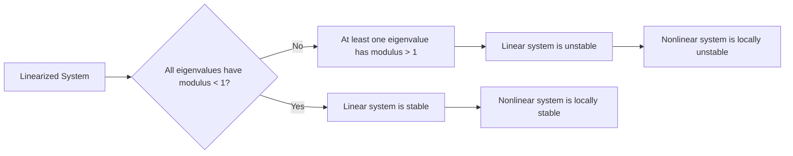

# Analysis of Discrete-Time Dynamical Systems: Linearization and Stability
> **Source:** [Analysis of Discrete-Time Dynamical Systems - Math Modelling - Lecture 19](https://www.youtube.com/watch?v=6It02qpjHQ8) by Math Modelling · 08:14 · Training document generated from the video.
**How to use this document:** read it top to bottom in place of watching the video. Screenshots appear exactly where the video depends on something visual, with links that jump to that moment. Questions at the end of each section confirm you learned the material. The glossary and footnotes add definitions and detail the video assumes you already have.
**Who this is for:** Students and professionals in mathematical modeling who need to understand stability analysis for discrete-time systems without watching the video.
## Learning objectives

After working through this document you can:

1. Define a discrete-time dynamical system using a difference equation of the form $X_{n+1} = G(X_n)$.
2. Identify equilibrium points of a discrete-time system from the conditions $F(X^*) = 0$ or $G(X^*) = X^*$.
3. Linearize a discrete-time system around an equilibrium by computing the Jacobian matrix $DG(X^*)$.
4. Determine local stability of an equilibrium by checking whether every eigenvalue of $DG(X^*)$ has modulus less than 1.
5. Determine local instability of an equilibrium if at least one eigenvalue of $DG(X^*)$ has modulus greater than 1.
6. Compare the stability criterion for discrete-time systems (unit circle in $\mathbb{C}$) with that for continuous-time systems (left half-plane).
7. Apply the stable manifold theorem to conclude that linear stability implies local nonlinear stability.
8. Explain the Hartman-Grobman theorem for discrete-time systems: near a hyperbolic equilibrium, the nonlinear system is topologically conjugate to its linearization.
## Prerequisites

- Basic calculus (derivatives, Taylor expansion)
- Linear algebra (eigenvalues, Jacobian matrix)
- Familiarity with continuous-time dynamical systems is helpful but not required
## Introduction and Discrete-Time Systems

This section introduces discrete-time dynamical systems and shows how they parallel the continuous-time systems studied earlier. Every concept from continuous-time systems has a discrete-time analog.

A **discrete-time dynamical system** is defined by the change in a state variable $\mathbf{x}$ as a function of that state variable. The change is written as

$$
\Delta \mathbf{x} = F(\mathbf{x}).
$$

The change $\Delta \mathbf{x}$ is the difference between the next state and the current state:

$$
\Delta \mathbf{x} = \mathbf{x}_{n+1} - \mathbf{x}_n.
$$

Combining these two equations gives the **difference equation** that describes the evolution of the system:

$$
\mathbf{x}_{n+1} = \mathbf{x}_n + F(\mathbf{x}_n).
$$

This difference equation is the discrete-time analog of a differential equation $\dot{\mathbf{x}} = F(\mathbf{x})$ in continuous time. Here $n$ is an integer time index, $\mathbf{x}_n$ is the state at time step $n$, and $\mathbf{x}_{n+1}$ is the state at the next step.

Common examples of discrete-time dynamical systems include:
- Newton’s method for finding roots of a function
- Gradient descent for optimization
- Models of biological populations, such as yeast cultures


*[01:00](https://www.youtube.com/watch?v=6It02qpjHQ8&t=60s) The whiteboard displays three equations related to numerical methods, including Delta X equals F of X and X of N plus 1 equals X of N plus F of X of N.*


At this frame, the whiteboard shows the three equations written above:

$$
\Delta \mathbf{x} = F(\mathbf{x})
$$
$$
\Delta \mathbf{x} = \mathbf{x}_{n+1} - \mathbf{x}_n
$$
$$
\mathbf{x}_{n+1} = \mathbf{x}_n + F(\mathbf{x}_n)
$$

To apply the same analysis techniques used for continuous systems (like linearization and stability), we define the **map** $G$ as

$$
G(\mathbf{x}) = \mathbf{x} + F(\mathbf{x}),
$$

so that the system becomes

$$
\mathbf{x}_{n+1} = G(\mathbf{x}_n).
$$

This compact form lets us study fixed points, their stability, and the behavior of trajectories near them, just as we did for continuous-time systems.

### Check your understanding

1.  How is a discrete-time dynamical system typically written as a difference equation?

    <details>
    <summary>Answer</summary>
    The system is written as $\mathbf{x}_{n+1} = \mathbf{x}_n + F(\mathbf{x}_n)$, where $\mathbf{x}_n$ is the state at step $n$ and $F$ describes the change.
    </details>

2.  What is the relationship between the map $G$ and the function $F$?

    <details>
    <summary>Answer</summary>
    $G(\mathbf{x}) = \mathbf{x} + F(\mathbf{x})$, so that $\mathbf{x}_{n+1} = G(\mathbf{x}_n)$.
    </details>

3.  Name two examples of discrete-time dynamical systems mentioned in the video.

    <details>
    <summary>Answer</summary>
    Newton’s method and gradient descent. (Yeast population models are also given as an example.)
    </details>
## Equilibrium and Linearization

An equilibrium (also called a fixed point) of a discrete-time dynamical system is a state that does not change under the system’s dynamics.  For a system described by the difference equation

$$
\mathbf{x}_{n+1} = \mathbf{G}(\mathbf{x}_n),
$$

or equivalently by the change equation

$$
\Delta \mathbf{x} = \mathbf{F}(\mathbf{x}_n) \quad \text{where} \quad \Delta \mathbf{x} = \mathbf{x}_{n+1} - \mathbf{x}_n,
$$

an equilibrium $\mathbf{x}^*$ satisfies two equivalent conditions:

- **Condition 1 (no change):** $\mathbf{F}(\mathbf{x}^*) = \mathbf{0}$.  
  Because $\Delta \mathbf{x} = \mathbf{F}(\mathbf{x}_n)$, setting $\mathbf{F}(\mathbf{x}^*) = \mathbf{0}$ means there is zero change from one step to the next.  The next state is identical to the current state.

- **Condition 2 (fixed point of the update map):** $\mathbf{G}(\mathbf{x}^*) = \mathbf{x}^*$.  
  Since $\mathbf{G}(\mathbf{x}) = \mathbf{x} + \mathbf{F}(\mathbf{x})$, the condition $\mathbf{G}(\mathbf{x}^*) = \mathbf{x}^*$ is exactly the same as $\mathbf{F}(\mathbf{x}^*) = \mathbf{0}$.  If you are at the equilibrium, the update rule sends you back to the same point.


*[02:40](https://www.youtube.com/watch?v=6It02qpjHQ8&t=160s) The whiteboard displays equations for delta X, X(n+1), G(x), and the conditions for equilibrium.*
  
The whiteboard shows these relationships:

$$

\Delta \mathbf{x} &= \mathbf{F}(\mathbf{x}) \\
\Delta \mathbf{x} &= \mathbf{x}_{n+1} - \mathbf{x}_n \\
\mathbf{x}_{n+1} &= \mathbf{x}_n + \mathbf{F}(\mathbf{x}_n) \\
\mathbf{G}(\mathbf{x}) &= \mathbf{x} + \mathbf{F}(\mathbf{x}) \\
\text{Suppose } \mathbf{x}^* \text{ equilibrium: } &\mathbf{F}(\mathbf{x}^*) = \mathbf{0} \quad \text{or} \quad \mathbf{G}(\mathbf{x}^*) = \mathbf{x}^*

$$

The second form ($\mathbf{G}(\mathbf{x}^*) = \mathbf{x}^*$) is the more common notation in practice.  Algorithms such as Newton’s method, gradient descent, and Euler’s method (covered in a later video) are all written as update equations of the type $\mathbf{x}_{n+1} = \mathbf{G}(\mathbf{x}_n)$.

### Linearizing Around an Equilibrium

Just as in continuous-time dynamics, we can linearize a discrete-time system near an equilibrium.  Linearization means approximating the nonlinear map $\mathbf{G}$ by its first-order Taylor expansion around $\mathbf{x}^*$.  The key tool is the **Jacobian matrix** of $\mathbf{G}$ evaluated at $\mathbf{x}^*$, denoted $D\mathbf{G}(\mathbf{x}^*)$.


*[03:00](https://www.youtube.com/watch?v=6It02qpjHQ8&t=180s) A whiteboard shows equations for equilibrium and a function G(x), with a person writing 'Lin' at the top right.*
  
The whiteboard now shows the linearization step, with “Lin” written at the top right to indicate the linearization process.

The linearized update equation is

$$
\mathbf{x}_{n+1} - \mathbf{x}^* \approx D\mathbf{G}(\mathbf{x}^*) \, (\mathbf{x}_n - \mathbf{x}^*).
$$

Define the deviation from equilibrium as $\delta_n = \mathbf{x}_n - \mathbf{x}^*$.  Then the linearized system becomes

$$
\delta_{n+1} = D\mathbf{G}(\mathbf{x}^*) \, \delta_n.
$$

This is a completely linear dynamical system.  Its behavior is determined entirely by the eigenvalues of the matrix $D\mathbf{G}(\mathbf{x}^*)$.  The result is analogous to the continuous-time case: the eigenvalues govern stability.

**Stability condition for the discrete-time linearized system:**  
The equilibrium $\mathbf{x}^*$ is **stable** (more precisely, asymptotically stable) if every eigenvalue $\lambda$ of $D\mathbf{G}(\mathbf{x}^*)$ satisfies $|\lambda| < 1$.  If any eigenvalue has magnitude greater than 1, the equilibrium is unstable.  Eigenvalues on the unit circle ($|\lambda| = 1$) correspond to marginal stability (further analysis is needed).

This condition follows from the fact that the solution of the linear system is $\delta_n = [D\mathbf{G}(\mathbf{x}^*)]^n \delta_0$, and powers of the matrix grow or decay according to the spectral radius.

### Check your understanding

1.  What are the two equivalent mathematical conditions for a point $\mathbf{x}^*$ to be an equilibrium of the discrete-time system $\mathbf{x}_{n+1} = \mathbf{G}(\mathbf{x}_n)$?

<details><summary>Answer</summary>
The two conditions are $\mathbf{F}(\mathbf{x}^*) = \mathbf{0}$ (no change from step to step) and $\mathbf{G}(\mathbf{x}^*) = \mathbf{x}^*$ (the update map returns the same point).  They are equivalent because $\mathbf{G}(\mathbf{x}) = \mathbf{x} + \mathbf{F}(\mathbf{x})$.
</details>

2.  Write the linearized update equation for the deviation $\delta_n = \mathbf{x}_n - \mathbf{x}^*$ near an equilibrium $\mathbf{x}^*$.

<details><summary>Answer</summary>
The linearized equation is $\delta_{n+1} = D\mathbf{G}(\mathbf{x}^*) \, \delta_n$, where $D\mathbf{G}(\mathbf{x}^*)$ is the Jacobian matrix of $\mathbf{G}$ evaluated at $\mathbf{x}^*$.
</details>

3.  Under what condition on the eigenvalues of $D\mathbf{G}(\mathbf{x}^*)$ is the equilibrium $\mathbf{x}^*$ asymptotically stable?

<details><summary>Answer</summary>
The equilibrium is asymptotically stable if every eigenvalue $\lambda$ of $D\mathbf{G}(\mathbf{x}^*)$ satisfies $|\lambda| < 1$ (all eigenvalues lie inside the unit circle in the complex plane).
</details>

4.  Why is the form $\mathbf{G}(\mathbf{x}) = \mathbf{x} + \mathbf{F}(\mathbf{x})$ often preferred over the form $\Delta \mathbf{x} = \mathbf{F}(\mathbf{x})$?

<details><summary>Answer</summary>
The update form $\mathbf{x}_{n+1} = \mathbf{G}(\mathbf{x}_n)$ is the standard notation used in many algorithms (Newton’s method, gradient descent, Euler’s method).  Linearization directly yields the Jacobian of $\mathbf{G}$, which is the matrix that governs the local dynamics.
</details>
## Stability Analysis


*[03:40](https://www.youtube.com/watch?v=6It02qpjHQ8&t=220s) Mathematical equations for linearization and equilibrium are written on a whiteboard.*


The analysis begins with the discrete-time dynamical system expressed as a difference equation. Define the state vector $\mathbf{X}_n$ at time step $n$. The change in state from one step to the next is:

$$
\Delta \mathbf{X} = \mathbf{F}(\mathbf{x})
$$

where $\Delta \mathbf{X} = \mathbf{X}_{n+1} - \mathbf{X}_n$. Therefore, the system evolves according to:

$$
\mathbf{X}_{n+1} = \mathbf{X}_n + \mathbf{F}(\mathbf{x}_n)
$$

Define the map $\mathbf{G}(\mathbf{x}) = \mathbf{x} + \mathbf{F}(\mathbf{x})$, so that the dynamics become:

$$
\mathbf{X}_{n+1} = \mathbf{G}(\mathbf{X}_n)
$$

An equilibrium point $\mathbf{X}^*$ satisfies $\mathbf{F}(\mathbf{X}^*) = 0$, which is equivalent to $\mathbf{G}(\mathbf{X}^*) = \mathbf{X}^*$. At such a point, the system remains fixed if started exactly there.

To analyze stability near $\mathbf{X}^*$, linearize the system. The linearization uses the Jacobian matrix of $\mathbf{G}$ evaluated at $\mathbf{X}^*$, denoted $D\mathbf{G}(\mathbf{X}^*)$. The linearized dynamics are:

$$
\mathbf{X}_{n+1} = D\mathbf{G}(\mathbf{X}^*) \mathbf{X}_n
$$


*[04:20](https://www.youtube.com/watch?v=6It02qpjHQ8&t=260s) The whiteboard displays mathematical equations for linearization, including definitions for ΔX, G(x), and conditions for equilibrium, along with the stability criterion involving the modulus of eigenvalues.*


The stability condition for the linearized system is: every eigenvalue $\lambda$ of the Jacobian matrix $D\mathbf{G}(\mathbf{X}^*)$ must satisfy:

$$
|\lambda| < 1
$$

where $|\lambda|$ denotes the modulus (absolute value) of the eigenvalue. For a complex eigenvalue $\lambda = a + bi$, the modulus is:

$$
|\lambda| = \sqrt{a^2 + b^2}
$$

This is the Euclidean norm of the complex number. The condition $|\lambda| < 1$ means that every eigenvalue lies inside the unit circle in the complex plane. Some eigenvalues may appear as complex conjugate pairs; the modulus condition applies to each eigenvalue individually.

**Why does this condition guarantee stability?** When all eigenvalues have modulus less than 1, the Jacobian matrix acts as a **contraction**. A contraction means that at each iteration, the distance from the equilibrium point decreases. Specifically:

$$
|\mathbf{X}_{n+1} - \mathbf{X}^*| < |\mathbf{X}_n - \mathbf{X}^*|
$$

for all $n$ when $\mathbf{X}_n$ is sufficiently close to $\mathbf{X}^*$. After each iteration, the state gets smaller and smaller relative to the equilibrium, converging to zero as $n \to \infty$. This is the discrete-time analog of exponential stability in continuous systems.

**The Stable Manifold Theorem for discrete-time systems** (added context: this theorem is the discrete-time counterpart to the continuous-time stable manifold theorem) states: if the linearized system has a contraction (all eigenvalues with modulus less than 1), then locally, the fully nonlinear system also has a contraction. The "local" qualification comes from the Taylor expansion used in linearization: the linear approximation is valid only in a small neighborhood of the equilibrium point. Therefore, if you start sufficiently close to $\mathbf{X}^*$, the nonlinear dynamics will converge to $\mathbf{X}^*$ when the linearized Jacobian has all eigenvalues with modulus less than 1.

### Summary of Stability Criterion

| Condition | Interpretation | Result |
|-----------|----------------|--------|
| All eigenvalues $\lambda$ of $D\mathbf{G}(\mathbf{X}^*)$ satisfy $ | \lambda | < 1$ |
| Any eigenvalue $\lambda$ satisfies $ | \lambda | > 1$ |
| Any eigenvalue $\lambda$ satisfies $ | \lambda | = 1$ |

| Jacobian is a contraction | Equilibrium is locally asymptotically stable |
| Jacobian has an expansion direction | Equilibrium is unstable |
| Marginal case; requires further analysis |

### Check your understanding

1. What is the stability condition for a discrete-time dynamical system linearized around an equilibrium point?

<details><summary>Answer</summary>
Every eigenvalue $\lambda$ of the Jacobian matrix $D\mathbf{G}(\mathbf{X}^*)$ must have modulus less than 1: $|\lambda| < 1$. This ensures the linearized system is a contraction.
</details>

2. Why does the condition $|\lambda| < 1$ guarantee stability in the nonlinear system?

<details><summary>Answer</summary>
The Stable Manifold Theorem for discrete-time systems states that if the linearized system is a contraction (all eigenvalues with modulus less than 1), then locally, the fully nonlinear system is also a contraction. The Taylor expansion used in linearization ensures this holds in a small neighborhood of the equilibrium point.
</details>

3. How do you compute the modulus of a complex eigenvalue $\lambda = a + bi$?

<details><summary>Answer</summary>
The modulus is $|\lambda| = \sqrt{a^2 + b^2}$, which is the Euclidean norm of the complex number. This represents the distance from the origin in the complex plane.
</details>

4. What happens if one eigenvalue has modulus greater than 1?

<details><summary>Answer</summary>
The Jacobian matrix is no longer a contraction; it has an expansion direction. The equilibrium point is unstable because perturbations along the eigenvector corresponding to that eigenvalue grow with each iteration.
</details>
## Instability and Comparison with Continuous Systems

The stability condition for a discrete-time dynamical system has a natural counterpart: an instability condition. Just as stability requires all eigenvalues to have modulus less than 1, instability occurs when at least one eigenvalue has modulus greater than 1.

### The Instability Condition

For a discrete-time system linearized around an equilibrium point $\mathbf{x}^*$, the linearized dynamics are:

$$
\mathbf{X}_{n+1} = D\mathbf{G}(\mathbf{x}^*) \mathbf{X}_n
$$

where $D\mathbf{G}(\mathbf{x}^*)$ is the Jacobian matrix of the map $\mathbf{G}$ evaluated at the equilibrium point. The equilibrium point $\mathbf{x}^*$ satisfies $\mathbf{F}(\mathbf{x}^*) = 0$ or equivalently $\mathbf{G}(\mathbf{x}^*) = \mathbf{x}^*$.


*[06:20](https://www.youtube.com/watch?v=6It02qpjHQ8&t=380s) The whiteboard shows equations for linearizing a system, defining equilibrium, and conditions for stability and instability based on eigenvalues.*


The instability condition is:

**The equilibrium point $\mathbf{x}^*$ is unstable if there exists at least one eigenvalue of $D\mathbf{G}(\mathbf{x}^*)$ with modulus greater than 1.**

This means that even a single eigenvalue outside the unit circle (the set of complex numbers with modulus less than 1) causes instability. The speaker states: "If there is even 1 eigenvalue inside of the unit circle, then you have instability." (Note: the speaker likely meant "outside" the unit circle, as the context makes clear.)

### Why One Unstable Eigenvalue Causes Instability

When you take successive powers of an eigenvalue $\lambda$ with $|\lambda| > 1$, the magnitude grows: $|\lambda^n| \to \infty$ as $n \to \infty$. This means that in at least one direction of the state space, the dynamics are expanding rather than contracting.

The key concepts are:

| Term | Definition |
|------|------------|
| Contraction | All directions shrink over time (all eigenvalues have modulus less than 1) |
| Unstable direction | At least one direction expands over time (at least one eigenvalue has modulus greater than 1) |
| Unit circle | The set of complex numbers $z$ such that $|z| = 1$; the boundary between stability and instability |

The speaker explains: "You no longer have a contraction, you have an unstable direction here, and that instability from the linear system carries over into an instability for the nonlinear system."

### From Linear to Nonlinear Instability

The relationship between linear and nonlinear instability follows the same logic as for stability:



If you start close to an unstable equilibrium point, the dynamics push you away due to the expanding direction. The speaker states: "If you started close to this thing, then you would expect to be pushed away due to this instability."


*[06:40](https://www.youtube.com/watch?v=6It02qpjHQ8&t=400s) This frame shows mathematical equations for linearizing a system, defining stable and unstable conditions based on the modulus of eigenvalues.*


### Comparison with Continuous-Time Systems

The process for analyzing discrete-time systems is fundamentally the same as for continuous-time systems. In both cases, the analysis reduces to examining the eigenvalues of a matrix:

| Aspect | Continuous-Time | Discrete-Time |
|--------|-----------------|---------------|
| System form | $\dot{\mathbf{x}} = \mathbf{F}(\mathbf{x})$ | $\mathbf{X}_{n+1} = \mathbf{G}(\mathbf{X}_n)$ |
| Linearization matrix | $D\mathbf{F}(\mathbf{x}^*)$ | $D\mathbf{G}(\mathbf{x}^*)$ |
| Stability condition | All eigenvalues have real part less than 0 | All eigenvalues have modulus less than 1 |
| Instability condition | At least one eigenvalue has real part greater than 0 | At least one eigenvalue has modulus greater than 1 |

The Stable Manifold Theorem applies to both cases. The speaker notes: "The stable manifold theorem tells you the same thing. If you have stability for the linear system, then it carries over to stability for the nonlinear system."

### Summary of Conditions

**Equation (1)** Stability condition for discrete-time systems:

$$
\text{Stable: } |\lambda_i| < 1 \text{ for all eigenvalues } \lambda_i \text{ of } D\mathbf{G}(\mathbf{x}^*)
$$

**Equation (2)** Instability condition for discrete-time systems:

$$
\text{Unstable: } \exists \text{ at least one eigenvalue } \lambda_i \text{ of } D\mathbf{G}(\mathbf{x}^*) \text{ with } |\lambda_i| > 1
$$

### Check your understanding

1. What is the instability condition for a discrete-time dynamical system in terms of eigenvalues?

<details><summary>Answer</summary>
The equilibrium point is unstable if there exists at least one eigenvalue of the Jacobian matrix $D\mathbf{G}(\mathbf{x}^*)$ with modulus greater than 1. Even a single eigenvalue outside the unit circle causes instability.
</details>

2. Why does one eigenvalue with modulus greater than 1 cause instability in the nonlinear system?

<details><summary>Answer</summary>
When you take successive powers of an eigenvalue with modulus greater than 1, the magnitude grows without bound ($|\lambda^n| \to \infty$). This creates an expanding direction in the state space. The Stable Manifold Theorem guarantees that this linear instability carries over to the nonlinear system, meaning trajectories starting near the equilibrium point will be pushed away.
</details>

3. How does the stability analysis for discrete-time systems compare to continuous-time systems?

<details><summary>Answer</summary>
Both analyses reduce to examining eigenvalues of a matrix. For continuous-time systems, stability requires all eigenvalues to have real part less than 0, and instability requires at least one eigenvalue with real part greater than 0. For discrete-time systems, stability requires all eigenvalues to have modulus less than 1, and instability requires at least one eigenvalue with modulus greater than 1. The Stable Manifold Theorem applies to both cases.
</details>

4. If a discrete-time system has eigenvalues $\lambda_1 = 0.5$, $\lambda_2 = 1.2$, and $\lambda_3 = -0.8$, is the equilibrium point stable or unstable?

<details><summary>Answer</summary>
The equilibrium point is unstable. While $\lambda_1 = 0.5$ and $\lambda_3 = -0.8$ both have modulus less than 1, $\lambda_2 = 1.2$ has modulus greater than 1. The existence of even one eigenvalue with modulus greater than 1 makes the system unstable.
</details>
## Hartman-Grobman Theorem and Summary

When you analyze the stability of an equilibrium point in a discrete-time dynamical system, the most common mistake is confusing the stability condition with the one used for continuous-time systems. For a discrete-time system, stability requires that **every eigenvalue of the linearized system has a modulus (absolute value) less than 1**. This means all eigenvalues must lie **inside the unit circle** in the complex plane. For a continuous-time system, stability requires that every eigenvalue has a real part less than 0, meaning they lie in the **left half-plane**. If you remember this difference, the rest of the analysis follows the same pattern as the continuous case.

The **Hartman-Grobman theorem** also applies to discrete-time systems. It tells you that if you zoom in closer and closer to an equilibrium point of a nonlinear difference equation, the behavior of the nonlinear system looks more and more like the behavior of its linearized system. The nonlinear system may be bent or deformed slightly, but it has the same basic structure. More precisely, the nonlinear system is **homeomorphic** (topologically equivalent) to the linearized system near the equilibrium. (Added context: The theorem holds provided that the linearization has no eigenvalue with modulus exactly 1; otherwise, the linearization does not determine the local dynamics.)

The whiteboard at timestamp 07:40 shows the key equations and stability conditions for discrete-time systems.


*[07:40](https://www.youtube.com/watch?v=6It02qpjHQ8&t=460s) The whiteboard shows equations for linearizing a system, defining equilibrium, and conditions for stability and instability based on the modulus of eigenvalues.*


```
ΔX = F(x)
ΔX = X(n+1) - X(n)
X(n+1) = X(n) + F(X(n))
G(x) = X + F(x)
Suppose X* equilibrium: F(X*) = 0
or G(X*) = X*
Linearize:
X(n+1) = DG(X*)X(n)
Stable: every eig. of DG(X*)
has modulus < 1
Unstable: at least one eig. of DG(X*)
with modulus > 1
```

Let us walk through each part of this whiteboard.

- The system is written in terms of the change $\Delta X = X_{n+1} - X_n$. The function $F$ gives this change: $\Delta X = F(X_n)$. Equivalently, $X_{n+1} = X_n + F(X_n)$.
- Define $G(x) = x + F(x)$. Then the iteration becomes $X_{n+1} = G(X_n)$.
- An equilibrium point $X^*$ satisfies $F(X^*) = 0$ or, equivalently, $G(X^*) = X^*$.
- To linearize, compute the Jacobian matrix of $G$ evaluated at $X^*$, denoted $DG(X^*)$. The linearized system is $X_{n+1} = DG(X^*) X_n$ (where $X_n$ now represents a small deviation from the equilibrium).
- **Stability condition**: If every eigenvalue of $DG(X^*)$ has modulus less than 1, the equilibrium is stable.
- **Instability condition**: If at least one eigenvalue has modulus greater than 1, the equilibrium is unstable.

The following table summarizes the difference between discrete-time and continuous-time stability criteria.

| System type | Stability condition (all eigenvalues) | Instability condition (at least one eigenvalue) |
|-------------|---------------------------------------|------------------------------------------------|
| Discrete-time | Modulus $< 1$ (inside unit circle) | Modulus $> 1$ (outside unit circle) |
| Continuous-time | Real part $< 0$ (left half-plane) | Real part $> 0$ (right half-plane) |

The Hartman-Grobman theorem for discrete-time systems guarantees that, near a hyperbolic equilibrium (one where no eigenvalue has modulus exactly 1), the nonlinear system $X_{n+1} = G(X_n)$ is topologically conjugate to its linearization $X_{n+1} = DG(X^*) X_n$. This means there exists a homeomorphism (a continuous bijection with a continuous inverse) that maps trajectories of the nonlinear system to trajectories of the linear system, preserving the direction of time. Therefore, the stability type determined by the linearization is valid for the original nonlinear system.

### Check your understanding

1. **Question**: For a discrete-time system, what condition on the eigenvalues of the linearized Jacobian matrix indicates that the equilibrium is stable?  
   <details><summary>Answer</summary> Every eigenvalue must have modulus less than 1 (i.e., all eigenvalues lie inside the unit circle in the complex plane).</details>

2. **Question**: How does the stability condition for a discrete-time system differ from that of a continuous-time system?  
   <details><summary>Answer</summary> For discrete-time systems, eigenvalues must have modulus less than 1 (inside the unit circle). For continuous-time systems, eigenvalues must have real part less than 0 (left half-plane).</details>

3. **Question**: What does the Hartman-Grobman theorem tell us about the relationship between a nonlinear discrete-time system and its linearization near an equilibrium?  
   <details><summary>Answer</summary> It tells us that near a hyperbolic equilibrium (no eigenvalue with modulus exactly 1), the nonlinear system is homeomorphic to its linearization. The local dynamics are topologically equivalent, so the stability determined by the linearization applies to the nonlinear system.</details>

4. **Question**: In the whiteboard notation, what is the function $G(x)$ and how is it related to the original system?  
   <details><summary>Answer</summary> $G(x) = x + F(x)$, where $F(x)$ is the change $\Delta X$. The iteration is $X_{n+1} = G(X_n)$. An equilibrium $X^*$ satisfies $G(X^*) = X^*$.</details>
## Key takeaways

- Discrete-time dynamical systems are defined by difference equations of the form $X_{n+1} = G(X_n)$, where $G(X) = X + F(X)$ gives the next state directly from the current state.
- An equilibrium $X^*$ satisfies $F(X^*) = 0$ or equivalently $G(X^*) = X^*$, meaning the state does not change from one step to the next.
- To analyze local behavior near an equilibrium, we linearize the system by computing the Jacobian matrix $DG(X^*)$ and studying the linear system $X_{n+1} = DG(X^*) X_n$.
- An equilibrium is locally stable if every eigenvalue $\lambda$ of $DG(X^*)$ satisfies $|\lambda| < 1$, meaning all eigenvalues lie inside the unit circle in the complex plane.
- An equilibrium is unstable if at least one eigenvalue of $DG(X^*)$ has modulus $|\lambda| > 1$, because that eigenvalue creates an expanding direction that pushes nearby trajectories away.
- The stability criterion for discrete-time systems (eigenvalues inside the unit circle, $|\lambda| < 1$) differs from the continuous-time criterion (eigenvalues in the left half-plane, $\operatorname{Re}(\lambda) < 0$), which is the most common source of confusion.
- The stable manifold theorem guarantees that if the linearized discrete-time system is a contraction (all eigenvalues have modulus less than 1), then the original nonlinear system is locally contracting as well for initial conditions sufficiently close to the equilibrium.
- The Hartman-Grobman theorem for discrete-time systems states that near a hyperbolic equilibrium (no eigenvalue on the unit circle), the nonlinear system is homeomorphic, or topologically conjugate, to its linearization, meaning the local phase portrait is qualitatively the same though possibly deformed.
- The modulus of a complex eigenvalue $\lambda = a + bi$ is $|\lambda| = \sqrt{a^2 + b^2}$, which measures Euclidean distance from the origin in the complex plane.
## Glossary

| Term | Definition |
|---|---|
| Discrete-time dynamical system | A system where the state evolves at discrete time steps according to a difference equation, typically written as $X_{n+1} = G(X_n)$. |
| Difference equation | An equation that relates the value of a variable at one time step to its value at the next time step, such as $X_{n+1} = G(X_n)$. |
| Update function $G(X)$ | The function that maps the current state to the next state, defined as $G(X) = X + F(X)$ where $F(X)$ gives the change per step. |
| Equilibrium point (fixed point) | A state $X^*$ such that $F(X^*) = 0$ or equivalently $G(X^*) = X^*$, meaning the system does not change from one time step to the next. |
| Jacobian matrix $DG(X^*)$ | The matrix of all first-order partial derivatives of the function $G$ evaluated at the equilibrium $X^*$, used to linearize the system. |
| Linearization | Approximating a nonlinear system near an equilibrium by a linear system using a Taylor expansion, resulting in the system $X_{n+1} = DG(X^*) X_n$. |
| Eigenvalue $\lambda$ | A scalar $\lambda$ such that for a matrix $A$, there exists a nonzero vector $v$ with $Av = \lambda v$; eigenvalues determine the behavior of linear dynamical systems. |
| Modulus (absolute value) of a complex number | For a complex number $\lambda = a + bi$, the modulus is $|\lambda| = \sqrt{a^2 + b^2}$, representing its Euclidean distance from the origin. |
| Unit circle | The set of all complex numbers $\lambda$ such that $|\lambda| = 1$; the boundary of the stability region for discrete-time systems. |
| Contraction | A linear map for which every application reduces distances, occurring when all eigenvalues have modulus less than 1. |
| Stable manifold theorem | A theorem stating that if the linearization of a nonlinear system at an equilibrium is a contraction (all eigenvalues have modulus less than 1), then the nonlinear system is also locally contracting near that equilibrium. |
| Hartman-Grobman theorem (discrete-time) | A theorem stating that near a hyperbolic equilibrium (no eigenvalue on the unit circle), the nonlinear system is topologically conjugate to its linearization, meaning the local dynamics are qualitatively identical. |
| Hyperbolic equilibrium | An equilibrium point of a discrete-time system where no eigenvalue of the Jacobian matrix $DG(X^*)$ lies on the unit circle (i.e., no eigenvalue has modulus exactly 1). |
| Topological conjugacy (homeomorphism) | A continuous, invertible mapping with a continuous inverse that transforms trajectories of one system into trajectories of another, preserving the qualitative structure of the dynamics. |
| Local stability | A property of an equilibrium point such that trajectories starting sufficiently close to it remain close and converge to it over time. |
| Local instability | A property of an equilibrium point such that trajectories starting arbitrarily close to it move away from it over time. |
| Continuous-time dynamical system | A system where the state evolves continuously in time, typically described by differential equations $\dot{X} = F(X)$. |
| Left half-plane | The set of complex numbers $\lambda$ with $\operatorname{Re}(\lambda) < 0$, which is the stability region for continuous-time linear systems. |
| Newton's method | An iterative root-finding algorithm of the form $X_{n+1} = X_n - \frac{f(X_n)}{f'(X_n)}$, which is a discrete-time dynamical system. |
| Gradient descent | An optimization algorithm of the form $X_{n+1} = X_n - \alpha \nabla f(X_n)$, which is a discrete-time dynamical system for minimizing a function. |
## Footnotes and deeper context

1. **Eigenvalue modulus exactly 1.** When an eigenvalue of $DG(X^*)$ has modulus exactly equal to 1, the linearized analysis is inconclusive. The equilibrium is called non-hyperbolic. Higher-order terms from the nonlinearity determine stability in such cases, and the Hartman-Grobman theorem does not apply.
2. **Modulus definition for real eigenvalues.** For a real eigenvalue $\lambda$, the modulus $|\lambda|$ equals the absolute value. A real eigenvalue must satisfy $|\lambda| < 1$ for stability, which corresponds to $-1 < \lambda < 1$.
3. **Stable manifold theorem vs. Hartman-Grobman theorem.** The stable manifold theorem guarantees stability carries over from linear to nonlinear systems. The Hartman-Grobman theorem is stronger: it guarantees the entire local topology of the flow (including unstable and center directions) is preserved, not just stability.
4. **Common confusion: unit circle vs. left half-plane.** Many students mistakenly apply the continuous-time criterion (real part less than zero) to discrete-time systems. The correct discrete-time criterion is that eigenvalues must lie inside the unit circle. This distinction arises because discrete-time iteration involves powers $\lambda^n$, which shrink if $|\lambda|<1$ and grow if $|\lambda|>1$.
5. **Complex conjugate eigenvalues.** If the Jacobian has real entries, complex eigenvalues always occur in conjugate pairs $a \pm bi$. Their moduli are identical: $|a+bi| = |a-bi| = \sqrt{a^2+b^2}$. Stability is determined by whether this common modulus is less than 1.
6. **Multiple eigenvalues and instability.** If at least one eigenvalue has modulus greater than 1, the equilibrium is unstable regardless of how many other eigenvalues satisfy $|\lambda| < 1$. A single unstable direction suffices to push nearby trajectories away.
## Where to go next

- **Chapter 4: Linearization and Stability.** Read Chapter 4 of 'Nonlinear Dynamics and Chaos' by Steven H. Strogatz (2nd edition) for a parallel treatment of continuous and discrete systems, including detailed examples and phase portrait analysis.
- **Discrete-time systems and the Hartman-Grobman theorem.** Consult 'Differential Equations, Dynamical Systems, and an Introduction to Chaos' by Hirsch, Smale, and Devaney (3rd edition), Chapter 14, for a rigorous proof and applications of the Hartman-Grobman theorem for maps.
- **Eigenvalue computation in Python.** Use NumPy's 'numpy.linalg.eig' function to compute eigenvalues of Jacobian matrices. Official documentation: https://numpy.org/doc/stable/reference/generated/numpy.linalg.eig.html
- **Interactive visualization of stability regions.** Try the 'Phase Plane' app by the University of Colorado Boulder or the '3D-XplorMath' software for hands-on exploration of stability regions (unit circle vs. left half-plane) in dynamical systems.
---
*Printed by yt2textbook, an open tool from Zorost AI Lab. Screenshots are frames captured from the source video; each caption links to the exact moment it appears.*
