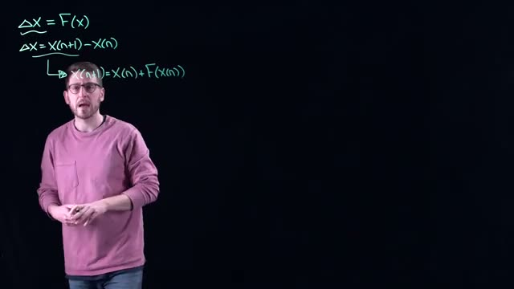
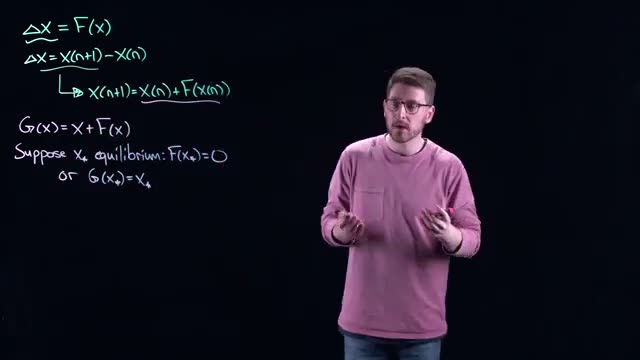
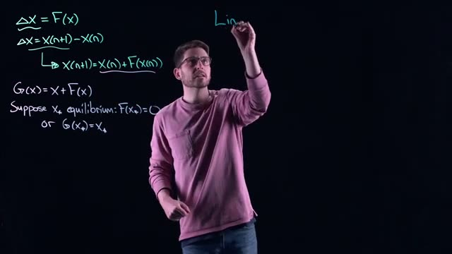
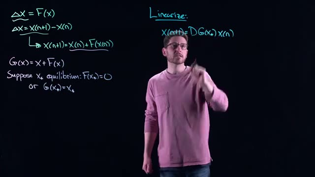
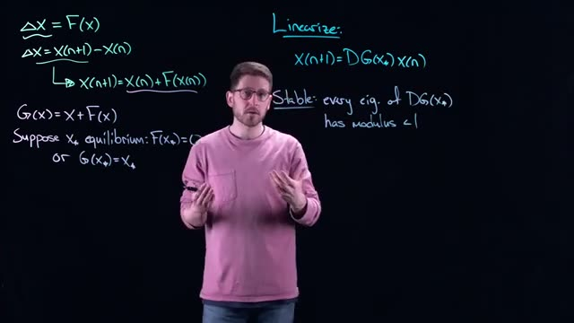
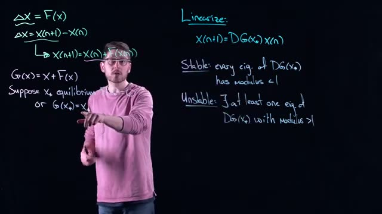
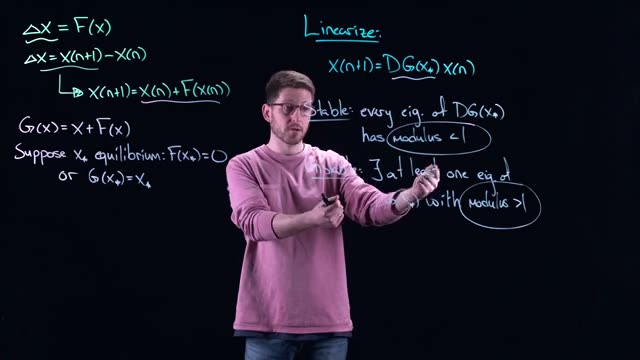

# Discrete-Time Dynamical Systems: Stability and Linearization from Math Modelling Lecture 19
> **Source:** [Analysis of Discrete-Time Dynamical Systems - Math Modelling - Lecture 19](https://www.youtube.com/watch?v=6It02qpjHQ8) by Math Modelling · 08:14 · Training document generated from the video.
**How to use this document:** read it top to bottom in place of watching the video. Screenshots appear exactly where the video depends on something visual, with links that jump to that moment. Questions at the end of each section confirm you learned the material. The glossary and footnotes add definitions and detail the video assumes you already have.
**Who this is for:** This course is for students and researchers in mathematical modeling who have studied continuous dynamical systems and want to learn the discrete-time analog.
## Learning objectives

After working through this document you can:

1. Define a discrete-time dynamical system using the difference equation $X_{n+1} = X_n + F(X_n)$.
2. Identify the equilibrium condition $F(X^*) = 0$ or $G(X^*) = X^*$ for a discrete-time system.
3. Linearize a discrete-time system around an equilibrium by computing the Jacobian matrix $DG(X^*)$.
4. State the stability condition for a linearized discrete-time system: every eigenvalue of $DG(X^*)$ has modulus less than 1.
5. Explain the instability condition: at least one eigenvalue of $DG(X^*)$ has modulus greater than 1.
6. Compare the stability criteria for discrete-time systems (unit circle) with continuous-time systems (left half-plane).
7. Apply the stable manifold theorem to conclude that stability of the linearized system implies local stability of the nonlinear system.
8. Describe the Hartman-Grobman theorem for discrete-time systems, stating that the nonlinear system is locally homeomorphic to its linearization.
## Prerequisites

- Linear algebra: eigenvalues, eigenvectors, and matrix operations.
- Continuous-time dynamical systems: fixed points, linearization, Jacobian matrix, stability criteria (real part of eigenvalues negative).
- Basic calculus: derivatives and Taylor expansion.
## Introduction to Discrete-Time Dynamical Systems and Difference Equations



*[01:00](https://www.youtube.com/watch?v=6It02qpjHQ8&t=60s) The whiteboard shows mathematical equations for delta X and X(n+1).*


This section introduces discrete-time dynamical systems and their representation through difference equations. The video explains how the theory you have learned for continuous-time systems has direct parallels in discrete time.

### From Continuous to Discrete Time

In previous lectures, you studied continuous-time dynamical systems where time changes continuously. The same fundamental concepts apply to discrete-time systems, where time advances in distinct steps. Discrete-time systems appear in many practical applications including Newton's method, gradient descent, and population models such as yeast growth.

### The Discrete-Time Framework

A discrete-time dynamical system describes how a state variable changes from one time step to the next. The change in the state variable is written as:

$$\Delta X = F(x)$$

where $\Delta X$ represents the difference between the next state and the current state. You can expand this difference as:

$$\Delta X = X_{n+1} - X_n$$

Combining these two equations gives the relationship between successive states:

$$X_{n+1} = X_n + F(X_n)$$

This is a **difference equation**. It tells you that if you know the current state $X_n$, you can compute the next state $X_{n+1}$ by adding the function $F(X_n)$ to the current state.

### Defining the Update Function

You can define a new function $G(X)$ that combines the current state and the change:

$$G(X) = X + F(X)$$

This allows you to write the difference equation more compactly as:

$$X_{n+1} = G(X_n)$$

The function $G$ is called the **update function** or **map**. It directly gives the next state from the current state.

### Key Concepts

| Concept | Definition |
|---------|------------|
| Discrete-time dynamical system | A system where time advances in discrete steps rather than continuously |
| Difference equation | An equation that relates the value of a variable at one time step to its value at the next time step |
| Update function $G(X)$ | The function that maps the current state to the next state: $X_{n+1} = G(X_n)$ |
| State variable $X$ | The quantity that evolves over time according to the dynamical system |

### Relationship to Continuous-Time Systems

The discrete-time framework parallels continuous-time systems in the following way:

- **Continuous time**: $\dot{x} = f(x)$ describes the instantaneous rate of change
- **Discrete time**: $\Delta X = F(X)$ describes the change from one step to the next

Both frameworks allow you to analyze stability, find fixed points, and linearize around those fixed points. The techniques you have learned for continuous systems have direct analogs in discrete time.

### Check Your Understanding

1. **Question**: What is the relationship between the function $F(X)$ and the update function $G(X)$ in a discrete-time dynamical system?

<details><summary>Answer</summary>
$G(X) = X + F(X)$. The function $F(X)$ describes the change from one step to the next, while $G(X)$ directly gives the next state from the current state.
</details>

2. **Question**: If you know $X_n = 5$ and $F(X) = 2X$, what is $X_{n+1}$?

<details><summary>Answer</summary>
$X_{n+1} = X_n + F(X_n) = 5 + 2(5) = 5 + 10 = 15$
</details>

3. **Question**: How does a difference equation differ from a differential equation?

<details><summary>Answer</summary>
A difference equation describes change in discrete time steps ($X_{n+1} - X_n = F(X_n)$), while a differential equation describes instantaneous change in continuous time ($\dot{x} = f(x)$). Difference equations are used for systems that update at specific intervals, while differential equations model systems that change continuously.
</details>
## Equilibrium and Linearization

In this section we learn how to linearize a discrete-time dynamical system around an equilibrium point. The key idea is to approximate a nonlinear system with a linear one near the equilibrium, making analysis much simpler. The stability of the original system near that point is then determined by the eigenvalues of the Jacobian matrix of the update function.

### Equilibrium: Two Equivalent Views

An **equilibrium** (also called a **fixed point**) is a state $x^{*}$ where the system does not change from one time step to the next. For a discrete-time system written as  

$$
\Delta X = F(x)
$$

where $\Delta X = X_{n+1} - X_{n}$, the condition for equilibrium is  

$$
F(x^{*}) = 0.
$$

This means $X_{n+1} = X_{n}$: if you are at the equilibrium, you stay there.

Often the system is written as an **update equation** using the function $G(x) = x + F(x)$. Then  

$$
X_{n+1} = G(X_n).
$$

For an equilibrium $x^{*}$, we have  

$$
G(x^{*}) = x^{*}.
$$

Both $F(x^{*}) = 0$ and $G(x^{*}) = x^{*}$ are equivalent statements. The update form $X_{n+1} = G(X_n)$ is common in many algorithms such as Newton’s method, gradient descent, and Euler’s method (which appears in the next video). The whiteboard at 

*[02:40](https://www.youtube.com/watch?v=6It02qpjHQ8&t=160s) The whiteboard shows equations for delta X, X(n+1), G(x), and the conditions for equilibrium.*
 shows these equations:

```
ΔX = F(x)
ΔX = X(n+1) - X(n)
X(n+1) = X(n) + F(X(n))
G(x) = X + F(x)
Suppose X* equilibrium: F(X*) = 0
or G(X*) = X*
```

Notice that the on-screen notation uses parentheses for indices, but in standard mathematics we use subscripts: $X_{n+1} = X_n + F(X_n)$. The meaning is the same.

### Linearization Around the Equilibrium

Just as we linearize continuous-time dynamics by taking the Jacobian of the vector field at the steady state, we can linearize the discrete-time update. For the system $X_{n+1} = G(X_n)$, the **linearized equation** near $x^{*}$ is obtained by computing the **Jacobian matrix** of $G$ evaluated at $x^{*}$.

Let $J = DG(x^{*})$ be the Jacobian matrix of $G$ at $x^{*}$. For a small perturbation $\delta_n = X_n - x^{*}$, the linear approximation is  

$$
\delta_{n+1} = J \, \delta_n.
$$

This is a completely linear dynamical system. The whiteboard at 

*[03:00](https://www.youtube.com/watch?v=6It02qpjHQ8&t=180s) The whiteboard shows equations for equilibrium, including ΔX = F(x) and G(x) = X + F(x), with a person writing 'Lin' at the top right.*
 shows the same equations and adds the word “Lin” to indicate linearization.

### Stability Condition from Eigenvalues

All dynamics of the linearized system are determined by the eigenvalues of $J = DG(x^{*})$. In particular, the equilibrium $x^{*}$ is **stable** (more precisely, asymptotically stable) if every eigenvalue of $J$ has magnitude less than 1. If any eigenvalue has magnitude greater than 1, the equilibrium is unstable. If magnitudes equal 1, the linear analysis is inconclusive (the system may be stable or unstable depending on nonlinear terms).

The transcript ends stating “we have stability if every eigenvalue …”. The complete discrete-time stability condition is:  

> The equilibrium $x^{*}$ is asymptotically stable for the nonlinear system if all eigenvalues $\lambda$ of $DG(x^{*})$ satisfy $|\lambda| < 1$.

This mirrors the continuous-time condition where eigenvalues must have negative real parts, but for discrete time the unit disk is the stability region.

### Relationship Between Continuous and Discrete Linearization

For clarity, the following diagram shows how the two equilibrium conditions connect to the linearization.

```mermaid
flowchart TD
    A[Original system: ΔX = F(X)] --> B[Equilibrium: F(X*) = 0]
    A --> C[Update form: X_{n+1} = G(X_n)]
    C --> D[Equilibrium: G(X*) = X*]
    D --> E[Linearize: Jacobian DG(X*)]
    E --> F[Eigenvalues of DG(X*)]
    F --> G{All |λ| < 1?}
    G -->|Yes| H[Stable equilibrium]
    G -->|No| I[Unstable]
```

### Check Your Understanding

1.  What are the two equivalent conditions for a state $x^{*}$ to be an equilibrium of the discrete-time system $\Delta X = F(X)$?

<details>
<summary>Answer</summary>
$F(x^{*}) = 0$ (no change from step to step) and $G(x^{*}) = x^{*}$ (the update function maps the state to itself), where $G(x) = x + F(x)$.
</details>

2.  How does a linearization around an equilibrium $x^{*}$ work for the discrete-time system $X_{n+1} = G(X_n)$?

<details>
<summary>Answer</summary>
Compute the Jacobian matrix $J = DG(x^{*})$ of $G$ at $x^{*}$. Then the linearized dynamics for a small perturbation $\delta_n$ are $\delta_{n+1} = J \delta_n$.
</details>

3.  What is the stability condition for a discrete-time equilibrium based on the eigenvalues of the Jacobian of $G$?

<details>
<summary>Answer</summary>
The equilibrium is asymptotically stable if every eigenvalue $\lambda$ of $DG(x^{*})$ has magnitude less than 1 ($|\lambda| < 1$). If any eigenvalue has magnitude greater than 1, the equilibrium is unstable.
</details>
## Stability Condition for Linearized Discrete-Time Systems

We now examine the stability of an equilibrium point of a discrete-time dynamical system by analyzing its linearization. The linearization reduces the local dynamics to a matrix equation, and the eigenvalues of that matrix determine whether the equilibrium is stable or unstable.



*[03:40](https://www.youtube.com/watch?v=6It02qpjHQ8&t=220s) Mathematical equations for linearization, including definitions for ΔX, G(x), equilibrium conditions, and the linearized form of X(n+1).*
  
The video first reviews the linearization process. Consider a discrete-time system defined by the difference equation

$$
\Delta \mathbf{X} = \mathbf{F}(\mathbf{x})
$$

where $\Delta \mathbf{X} = \mathbf{x}_{n+1} - \mathbf{x}_n$. Rearranging gives

$$
\mathbf{x}_{n+1} = \mathbf{x}_n + \mathbf{F}(\mathbf{x}_n).
$$

Define the function $\mathbf{G}(\mathbf{x}) = \mathbf{x} + \mathbf{F}(\mathbf{x})$, so that the system is

$$
\mathbf{x}_{n+1} = \mathbf{G}(\mathbf{x}_n).
$$

An equilibrium $\mathbf{x}_*$ satisfies $\mathbf{F}(\mathbf{x}_*) = \mathbf{0}$ or equivalently $\mathbf{G}(\mathbf{x}_*) = \mathbf{x}_*$. Linearizing $\mathbf{G}$ around $\mathbf{x}_*$ (a first‑order Taylor expansion) yields the linearized system

$$
\mathbf{x}_{n+1} = D\mathbf{G}(\mathbf{x}_*) \mathbf{x}_n,
$$

where $D\mathbf{G}(\mathbf{x}_*)$ is the Jacobian matrix of $\mathbf{G}$ evaluated at $\mathbf{x}_*$.



*[04:20](https://www.youtube.com/watch?v=6It02qpjHQ8&t=260s) A whiteboard shows mathematical equations for linearization, including definitions for $\Delta X$, $G(x)$, and conditions for equilibrium and stability.*
  
The stability condition for this linearized system appears on the whiteboard: **Stable: every eigenvalue of $D\mathbf{G}(\mathbf{x}_*)$ has modulus $<1$**.

### The Stability Condition

The eigenvalues of the Jacobian matrix $D\mathbf{G}(\mathbf{x}_*)$ can be real or complex numbers. For a complex eigenvalue $\lambda = a + bi$, its **modulus** (also called absolute value or magnitude) is

$$
|\lambda| = \sqrt{a^2 + b^2},
$$

which is the Euclidean norm of the complex number. The condition $|\lambda| < 1$ means that the eigenvalue lies strictly inside the **unit circle** in the complex plane (the circle of radius 1 centered at the origin). Complex eigenvalues occur in conjugate pairs; both must have modulus less than 1 for stability.

If **every** eigenvalue of $D\mathbf{G}(\mathbf{x}_*)$ satisfies $|\lambda| < 1$, then the linearized system is a **contraction**. In each iteration, the state vector is multiplied by the Jacobian, and because all eigenvalues are smaller than 1 in magnitude, the norm of the state shrinks at every step:

$$
\mathbf{x}_{n+1} = D\mathbf{G}(\mathbf{x}_*) \mathbf{x}_n \quad \Rightarrow \quad \|\mathbf{x}_{n+1}\| < \|\mathbf{x}_n\|,
$$

and as $n \to \infty$, $\mathbf{x}_n \to \mathbf{0}$. This contraction property is the reason the equilibrium is stable.

The **stable manifold theorem** for discrete-time systems states that if the linearized system is a contraction (all eigenvalues inside the unit circle), then the original nonlinear system is also locally contracting near the equilibrium. Because the Taylor expansion used in linearization is valid only in a small neighborhood, the stability conclusion is **local**: starting sufficiently close to $\mathbf{x}_*$, the nonlinear system will converge to $\mathbf{x}_*$.

The following flowchart summarizes the logic:

```mermaid
flowchart TD
    A[Full nonlinear system] --> B[Linearize around equilibrium x*]
    B --> C[Linearized system: x_{n+1} = DG(x*) x_n]
    C --> D{Check eigenvalues of DG(x*)}
    D --> E[All |λ| < 1]
    D --> F[At least one |λ| > 1]
    E --> G[Linear system is a contraction]
    G --> H[Stable manifold theorem: local contraction for nonlinear system]
    H --> I[Equilibrium is locally stable]
    F --> J[Linear system has expanding direction]
    J --> K[Equilibrium is unstable]
```

### Instability Condition

If **at least one** eigenvalue of $D\mathbf{G}(\mathbf{x}_*)$ has modulus greater than 1, the equilibrium is unstable. That eigenvalue lies outside the unit circle. When you take successive powers of that eigenvalue (as happens when iterating the linear map), its magnitude grows without bound:

$$
|\lambda^n| = |\lambda|^n \to \infty \quad \text{as } n \to \infty \text{ for } |\lambda| > 1.
$$

This means that in the direction of the corresponding eigenvector, the system expands, moving the state away from the equilibrium. Even a single expanding direction is enough to cause instability.

**Key point:** Modulus less than 1 means inside the unit circle (stable); modulus greater than 1 means outside the unit circle (unstable). Eigenvalues exactly on the unit circle ($|\lambda| = 1$) are a borderline case not covered by this simple condition.

### Check your understanding

1. **What is the precise stability condition for a linearized discrete-time system $\mathbf{x}_{n+1} = A\mathbf{x}_n$?**  
   <details><summary>Answer</summary>  
   The system is stable if every eigenvalue of the matrix $A$ has modulus less than 1 ($|\lambda| < 1$).  
   </details>

2. **Why does the condition $|\lambda| < 1$ for all eigenvalues guarantee that the linearized system is a contraction?**  
   <details><summary>Answer</summary>  
   When all eigenvalues have modulus less than 1, repeated multiplication by $A$ reduces the norm of the state vector in every iteration. The system contracts, and the state converges to zero.  
   </details>

3. **What happens if a single eigenvalue has modulus greater than 1?**  
   <details><summary>Answer</summary>  
   The equilibrium is unstable. The component of the state along the corresponding eigenvector expands with each iteration, moving the state away from the equilibrium.  
   </details>

4. **How does the stable manifold theorem connect the linearized system to the original nonlinear system?**  
   <details><summary>Answer</summary>  
   The theorem asserts that if the linearized system is a contraction (all eigenvalues with modulus $<1$), then the original nonlinear system is also locally contracting near the equilibrium. Starting close enough to the equilibrium, the nonlinear system will converge to it.  
   </details>
## Instability and Comparison to Continuous-Time Stability

When you linearize a nonlinear discrete-time dynamical system around an equilibrium point $X^*$, you obtain a linear system governed by the Jacobian matrix $DG(X^*)$. The eigenvalues of this matrix determine the local stability of the nonlinear system. If every eigenvalue has modulus less than 1, the linear system is a contraction and the equilibrium is stable. If at least one eigenvalue has modulus greater than 1, the linear system has an unstable direction, and that instability carries over to the nonlinear system. Starting close to such an equilibrium, you would expect to be pushed away due to this instability.

The process of analyzing stability by examining eigenvalues is the same as in continuous-time dynamical systems. In both cases, it all comes down to analyzing the eigenvalues of a matrix. The Stable Manifold Theorem guarantees that if the linearized system is stable (all eigenvalues inside the unit circle), then the nonlinear system is locally stable. Similarly, if the linearized system is unstable (at least one eigenvalue outside the unit circle), the nonlinear system is locally unstable.

The only difference you must be very careful about is the meaning of stability in the complex plane. For discrete-time systems, stability requires eigenvalues to lie inside the unit circle (modulus less than 1). For continuous-time systems, stability requires eigenvalues to have negative real parts, i.e., to lie in the left half of the complex plane (real part less than 0). This distinction is the most common source of confusion. If you remember this piece, everything else is the same.

The Hartman-Grobman Theorem also applies to discrete-time systems. It tells you that if you zoom in closer and closer to the equilibrium value for the nonlinear difference equation, the system looks more and more like the linearized system. Near the equilibrium, the nonlinear system is topologically conjugate to its linearization, meaning the local dynamics are essentially the same.


*[06:20](https://www.youtube.com/watch?v=6It02qpjHQ8&t=380s) The whiteboard shows equations for linearizing a system, defining equilibrium, and conditions for stability.*

The whiteboard shows the equations for linearizing a system, defining equilibrium, and the condition for stability.

```
ΔX = F(X)
ΔX = X(n+1) - X(n)
↳ X(n+1) = X(n) + F(X(n))
G(x) = X + F(x)
Suppose X* equilibrium: F(X*) = 0
or G(X*) = X*
Linearize:
X(n+1) = DG(X*)X(n)
Stable: every eig. of DG(X*)
has modulus < 1
```



*[06:40](https://www.youtube.com/watch?v=6It02qpjHQ8&t=400s) This frame shows mathematical equations for linearizing a system, defining stable and unstable conditions based on the modulus of eigenvalues.*

The whiteboard adds the condition for instability.

```
ΔX = F(x)
ΔX = X(n+1) - X(n)
X(n+1) = X(n) + F(x(n))
G(x) = X + F(x)
Suppose X* equilibrium
or G(X*) = X*
Linearize:
X(n+1) = DG(X*) X(n)
Stable: every eig. of DG(X*)
has modulus < 1
Unstable: ∃ at least one eig. of
DG(X*) with modulus > 1
```

### Comparison of Stability Conditions

| System type | Stability condition in complex plane | Mathematical condition |
|-------------|--------------------------------------|------------------------|
| Discrete-time | Inside the unit circle | $\vert \lambda \vert < 1$ for all eigenvalues $\lambda$ |
| Continuous-time | Left half-plane | $\operatorname{Re}(\lambda) < 0$ for all eigenvalues $\lambda$ |

### Key Theorems

- **Stable Manifold Theorem**: If the linearized system is stable (all eigenvalues inside the unit circle), then the nonlinear system is locally stable. If the linearized system is unstable (at least one eigenvalue outside the unit circle), the nonlinear system is locally unstable.
- **Hartman-Grobman Theorem**: Near the equilibrium, the nonlinear system is topologically conjugate to its linearization. The local dynamics of the nonlinear system look more and more like those of the linearized system as you zoom in on the equilibrium.

### Check your understanding

1. What is the condition for a discrete-time linear system to be stable? How does it differ from the continuous-time condition?

<details><summary>Answer</summary>
A discrete-time linear system is stable if every eigenvalue of the Jacobian matrix has modulus less than 1 (inside the unit circle). For continuous-time systems, stability requires every eigenvalue to have a negative real part (left half-plane). The key difference is the region in the complex plane: unit circle versus left half-plane.
</details>

2. According to the Stable Manifold Theorem, what can you conclude about the nonlinear system if the linearized system has at least one eigenvalue with modulus greater than 1?

<details><summary>Answer</summary>
If the linearized system has at least one eigenvalue with modulus greater than 1, the linear system is unstable, and that instability carries over to the nonlinear system. The nonlinear system will be locally unstable near the equilibrium.
</details>

3. What does the Hartman-Grobman Theorem tell us about the relationship between a nonlinear discrete-time system and its linearization near an equilibrium?

<details><summary>Answer</summary>
The Hartman-Grobman Theorem states that near the equilibrium, the nonlinear system is topologically conjugate to its linearization. This means that as you zoom in on the equilibrium, the nonlinear system looks more and more like the linearized system, and the local dynamics are essentially the same.
</details>

4. Why is it important to remember the difference between the unit circle and the left half-plane when analyzing stability?

<details><summary>Answer</summary>
The condition for stability is different for discrete-time and continuous-time systems. Using the wrong condition (e.g., checking real parts for a discrete-time system) would lead to incorrect conclusions about stability. This is the most common source of confusion when transitioning between the two types of systems.
</details>
## Hartman-Grobman Theorem and Summary

This section explains how the stability of a nonlinear discrete-time system can be determined from its linearization, and introduces the Hartman-Grobman theorem which justifies this approach for hyperbolic equilibria.

### Linearization and Stability Conditions

Consider a discrete-time dynamical system written in the form

$$
\Delta \mathbf{x} = \mathbf{F}(\mathbf{x}), \qquad \Delta \mathbf{x} = \mathbf{x}_{n+1} - \mathbf{x}_n,
$$

or equivalently as a map

$$
\mathbf{x}_{n+1} = \mathbf{x}_n + \mathbf{F}(\mathbf{x}_n) = G(\mathbf{x}_n),
$$

where $G(\mathbf{x}) = \mathbf{x} + \mathbf{F}(\mathbf{x})$. An **equilibrium point** $\mathbf{x}^*$ satisfies $\mathbf{F}(\mathbf{x}^*) = \mathbf{0}$, which also means $G(\mathbf{x}^*) = \mathbf{x}^*$ (a fixed point of the map).

To analyze the local behavior near $\mathbf{x}^*$, we **linearize** the map. The linear approximation is given by the Jacobian matrix of $G$ evaluated at $\mathbf{x}^*$, denoted $DG(\mathbf{x}^*)$. The linearized system is

$$
\mathbf{x}_{n+1} = DG(\mathbf{x}^*) \, \mathbf{x}_n.
$$

The stability of the equilibrium in the linearized system (and, under the Hartman-Grobman theorem, also in the nonlinear system) depends on the eigenvalues of $DG(\mathbf{x}^*)$. Let $\lambda$ be an eigenvalue. The **modulus** (absolute value) $|\lambda|$ determines stability:

- If **every** eigenvalue has modulus **less than 1**, the equilibrium is **stable** (locally attracting).
- If **at least one** eigenvalue has modulus **greater than 1**, the equilibrium is **unstable**.

The following on-screen text from the video summarizes these definitions and conditions.



*[07:40](https://www.youtube.com/watch?v=6It02qpjHQ8&t=460s) The whiteboard displays equations for linearizing a system, defining equilibrium, and conditions for stability and instability based on the modulus of eigenvalues.*


```
ΔX = F(x)
ΔX = X(n+1) - X(n)
X(n+1) = X(n) + F(X(n))
G(x) = X + F(x)
Suppose X* equilibrium: F(X*) = 0
or G(X*) = X*
Linearize:
X(n+1) = DG(X*)X(n)
Stable: every eig. of DG(X*)
has modulus < 1
Unstable: at least one eig. of
DG(X*) with modulus > 1
```

### Hyperbolic Equilibria and the Hartman-Grobman Theorem

An equilibrium is called **hyperbolic** if **none** of the eigenvalues of $DG(\mathbf{x}^*)$ lie on the unit circle (i.e., $|\lambda| \neq 1$ for all eigenvalues). For hyperbolic equilibria, the **Hartman-Grobman theorem** guarantees that the nonlinear system is **topologically conjugate** to its linearization in a neighborhood of the equilibrium.

**Topological conjugacy** means there exists a **homeomorphism** (a continuous bijection with a continuous inverse) that maps orbits of the nonlinear system to orbits of the linear system, preserving the direction of time. In practical terms, the phase portrait of the nonlinear system near $\mathbf{x}^*$ is a continuous deformation of the linearized phase portrait. As the speaker explains:

> “It might be just bent or deformed a little bit, but it has the same basic structure. It is homeomorphic to what you get with the discrete time system.”

Because of this homeomorphism, the local stability properties determined from the linearization (stable if all $|\lambda|<1$, unstable if any $|\lambda|>1$) are valid for the original nonlinear system, provided the equilibrium is hyperbolic.

### Summary of Stability Analysis

The following table summarizes the relationship between eigenvalues and stability for a hyperbolic equilibrium.

| Condition on eigenvalues of $DG(\mathbf{x}^*)$ | Stability of $\mathbf{x}^*$ |
|-----------------------------------------------|-----------------------------|
| All eigenvalues have modulus $< 1$            | Stable                      |
| At least one eigenvalue has modulus $> 1$     | Unstable                    |
| Some eigenvalues have modulus $= 1$ (none $>1$) | Non-hyperbolic; Hartman-Grobman does not apply |

The flow of the analysis is shown in the diagram below.

```mermaid
graph TD
    A[Nonlinear system: x_{n+1} = G(x_n)] --> B[Linearize at equilibrium x*: x_{n+1} = DG(x*) x_n]
    B --> C[Compute eigenvalues of DG(x*)]
    C --> D{All |lambda| < 1?}
    D -->|Yes| E[Stable equilibrium]
    D -->|No| F{Any |lambda| > 1?}
    F -->|Yes| G[Unstable equilibrium]
    F -->|No| H[Non-hyperbolic: need further analysis]
    B -.-> I[Hartman-Grobman theorem: local topological conjugacy]
    I -.-> E
    I -.-> G
```

### Check your understanding

1. **What is a hyperbolic equilibrium?**  
   <details><summary>Answer</summary>An equilibrium $\mathbf{x}^*$ is hyperbolic if none of the eigenvalues of the linearized Jacobian $DG(\mathbf{x}^*)$ have modulus equal to 1. All eigenvalues satisfy $|\lambda| \neq 1$.</details>

2. **State the Hartman-Grobman theorem for discrete-time systems.**  
   <details><summary>Answer</summary>For a hyperbolic equilibrium $\mathbf{x}^*$ of the nonlinear map $\mathbf{x}_{n+1} = G(\mathbf{x}_n)$, there exists a homeomorphism defined in a neighborhood of $\mathbf{x}^*$ that maps orbits of the nonlinear system to orbits of the linearized system $\mathbf{x}_{n+1} = DG(\mathbf{x}^*) \mathbf{x}_n$, preserving the direction of time. Thus the local phase portraits are topologically conjugate.</details>

3. **If the linearization at an equilibrium has eigenvalues $0.5$, $0.9$, and $1.2$, what can you conclude about the stability of the nonlinear equilibrium?**  
   <details><summary>Answer</summary>The eigenvalue $1.2$ has modulus $>1$, so the equilibrium is unstable. Because the equilibrium is hyperbolic (no eigenvalue on the unit circle), the Hartman-Grobman theorem applies, and the instability carries over to the nonlinear system.</details>

4. **Why can’t the Hartman-Grobman theorem be used when an eigenvalue has modulus exactly 1?**  
   <details><summary>Answer</summary>When an eigenvalue lies on the unit circle ($|\lambda|=1$), the equilibrium is non-hyperbolic. The linearization does not capture the full dynamics; higher-order terms can change stability. The theorem requires hyperbolicity to guarantee a homeomorphism between the nonlinear and linear flows.</details>
## Key takeaways

- A discrete-time dynamical system is defined by the difference equation $X_{n+1} = X_n + F(X_n)$, where $F(X_n)$ represents the change in the state variable.
- An equilibrium (fixed point) $X^*$ satisfies $F(X^*) = 0$, which is equivalent to $G(X^*) = X^*$ where $G(X) = X + F(X)$.
- Linearization around an equilibrium $X^*$ involves computing the Jacobian matrix $DG(X^*)$ of the update function $G$.
- The linearized system is stable if every eigenvalue of $DG(X^*)$ has modulus less than 1, meaning all eigenvalues lie inside the unit circle in the complex plane.
- The linearized system is unstable if at least one eigenvalue of $DG(X^*)$ has modulus greater than 1, indicating an expanding direction.
- The stable manifold theorem guarantees that stability of the linearized discrete-time system implies local stability of the original nonlinear system.
- The Hartman-Grobman theorem for discrete-time systems states that near an equilibrium, the nonlinear system is homeomorphic (topologically equivalent) to its linearization.
- The key difference from continuous-time systems is the stability region: discrete-time requires eigenvalues inside the unit circle, while continuous-time requires eigenvalues in the left half-plane (real part less than 0).
- Examples of discrete-time systems include Newton's method, gradient descent, and population models like yeast growth.
- The analysis process for discrete-time systems mirrors that of continuous-time systems, with the only difference being the stability criterion in the complex plane.
## Glossary

| Term | Definition |
|---|---|
| Discrete-time dynamical system | A system where the state variable evolves at discrete time steps, typically described by a difference equation $X_{n+1} = G(X_n)$. |
| Difference equation | An equation that relates the value of a variable at one time step to its value at the next time step, such as $X_{n+1} = X_n + F(X_n)$. |
| Equilibrium (fixed point) | A point $X^*$ in state space where the system does not change over time, satisfying $F(X^*) = 0$ or $G(X^*) = X^*$. |
| Linearization | The process of approximating a nonlinear system near an equilibrium by a linear system using the Jacobian matrix. |
| Jacobian matrix | A matrix of all first-order partial derivatives of a vector-valued function, denoted $DG(X^*)$, used to linearize the system around an equilibrium. |
| Eigenvalue | A scalar $\lambda$ such that for a matrix $A$, $A v = \lambda v$ for some nonzero vector $v$; eigenvalues determine the behavior of linear systems. |
| Modulus | The absolute value (magnitude) of a complex number, computed as $|a + bi| = \sqrt{a^2 + b^2}$. |
| Unit circle | The set of all complex numbers with modulus equal to 1; eigenvalues inside this circle have modulus less than 1. |
| Contraction | A mapping that brings points closer together with each iteration, causing convergence to a fixed point. |
| Stable manifold theorem | A theorem stating that if the linearized system is stable (a contraction), then the nonlinear system is locally stable near the equilibrium. |
| Hartman-Grobman theorem | A theorem stating that near a hyperbolic equilibrium, the nonlinear system is topologically equivalent (homeomorphic) to its linearization. |
| Homeomorphic | A continuous, invertible mapping with a continuous inverse that preserves topological structure but may distort distances. |
| Left half-plane | The region of the complex plane where the real part of a complex number is less than 0; the stability region for continuous-time systems. |
| Newton's method | An iterative root-finding algorithm that can be expressed as a discrete-time dynamical system $X_{n+1} = X_n - f(X_n)/f'(X_n)$. |
| Gradient descent | An optimization algorithm that iteratively moves in the direction of the negative gradient, expressed as $X_{n+1} = X_n - \alpha \nabla f(X_n)$. |
| Euler's method | A numerical method for approximating solutions to ordinary differential equations by discretizing time, producing a discrete-time system. |
| Taylor expansion | A representation of a function as an infinite sum of terms calculated from its derivatives at a single point, used in linearization. |
| Complex conjugate | For a complex number $a + bi$, its conjugate is $a - bi$; eigenvalues of real matrices often occur in conjugate pairs. |
| Hyperbolic equilibrium | An equilibrium where the Jacobian matrix has no eigenvalues with modulus exactly 1, ensuring the Hartman-Grobman theorem applies. |
| Local stability | A property where trajectories starting sufficiently close to an equilibrium remain close and converge to it over time. |
## Footnotes and deeper context

1. **Eigenvalue modulus exactly 1.** If any eigenvalue of $DG(X^*)$ has modulus exactly 1, the linearized analysis is inconclusive. The Hartman-Grobman theorem does not apply, and higher-order terms determine stability. This is called a non-hyperbolic equilibrium.
2. **Stable manifold theorem scope.** The stable manifold theorem for discrete-time systems guarantees that if the linearization is a contraction (all eigenvalues inside the unit circle), then there exists a local stable manifold of the same dimension as the linear stable subspace. This is a standard result in dynamical systems theory.
3. **Hartman-Grobman theorem requirement.** The Hartman-Grobman theorem for discrete-time systems requires that the equilibrium be hyperbolic, meaning no eigenvalue of $DG(X^*)$ lies on the unit circle. This is a widely accepted condition found in textbooks such as Strogatz's 'Nonlinear Dynamics and Chaos'.
4. **Common confusion: unit circle vs. left half-plane.** The most frequent mistake when transitioning from continuous to discrete systems is applying the continuous stability condition (real part less than 0) to discrete systems. For discrete systems, the condition is modulus less than 1, which corresponds to the interior of the unit circle.
5. **Complex eigenvalues and oscillations.** Complex eigenvalues with modulus less than 1 produce spiral-like convergence to the equilibrium in discrete systems, analogous to damped oscillations in continuous systems. The imaginary part determines the oscillation frequency.
6. **Application to numerical methods.** Euler's method for approximating ODEs produces a discrete-time system. The stability of the numerical method depends on the step size, which can push eigenvalues outside the unit circle even if the continuous system is stable. This is a key consideration in numerical analysis.
## Where to go next

- **Strogatz, 'Nonlinear Dynamics and Chaos' (Chapter 10 on Discrete-Time Systems).** This canonical textbook provides a thorough introduction to discrete-time dynamical systems, including stability analysis, bifurcations, and the logistic map. It is the standard reference for the material covered in this lecture.
- **Hirsch, Smale, and Devaney, 'Differential Equations, Dynamical Systems, and an Introduction to Chaos' (Chapters 14-15).** This book offers a rigorous treatment of discrete dynamical systems, including the stable manifold theorem and Hartman-Grobman theorem for maps. It is ideal for students seeking deeper mathematical foundations.
- **MATLAB or Python (NumPy/SciPy) for eigenvalue computation.** To practice stability analysis, use `eig()` in MATLAB or `numpy.linalg.eig()` in Python to compute eigenvalues of the Jacobian matrix. Official documentation for these functions is available at mathworks.com and numpy.org.
- **Online interactive tool: 'Discrete Dynamical Systems Explorer'.** Several university websites offer interactive applets (e.g., from the University of Colorado or MIT Mathlets) that allow you to visualize the behavior of discrete maps and their linearizations. Search for 'discrete dynamical systems applet' to find these resources.
---
*Printed by yt2textbook, an open tool from Zorost AI Lab. Screenshots are frames captured from the source video; each caption links to the exact moment it appears.*
