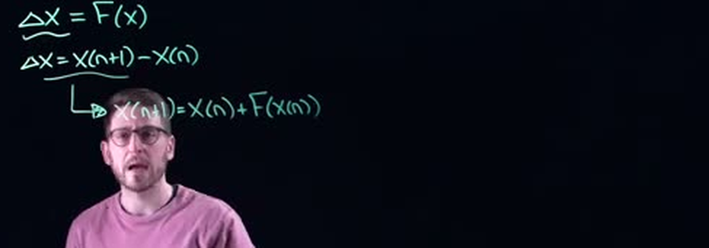
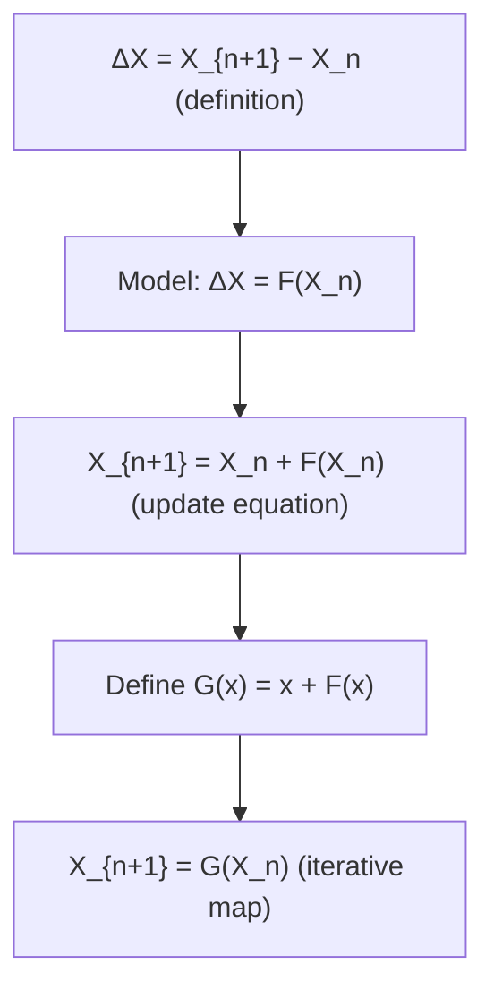
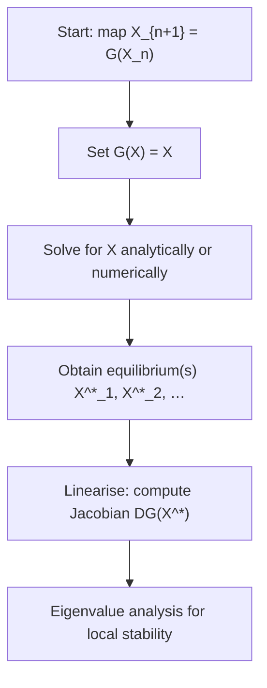
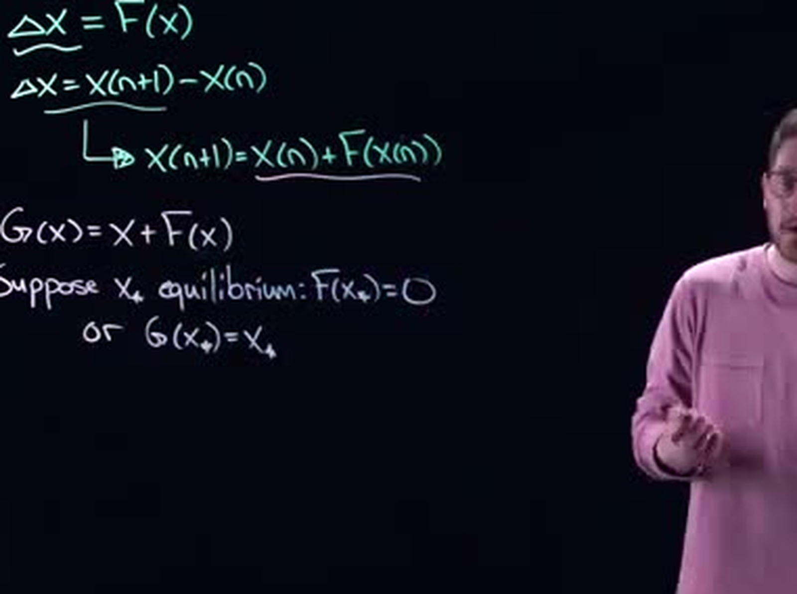
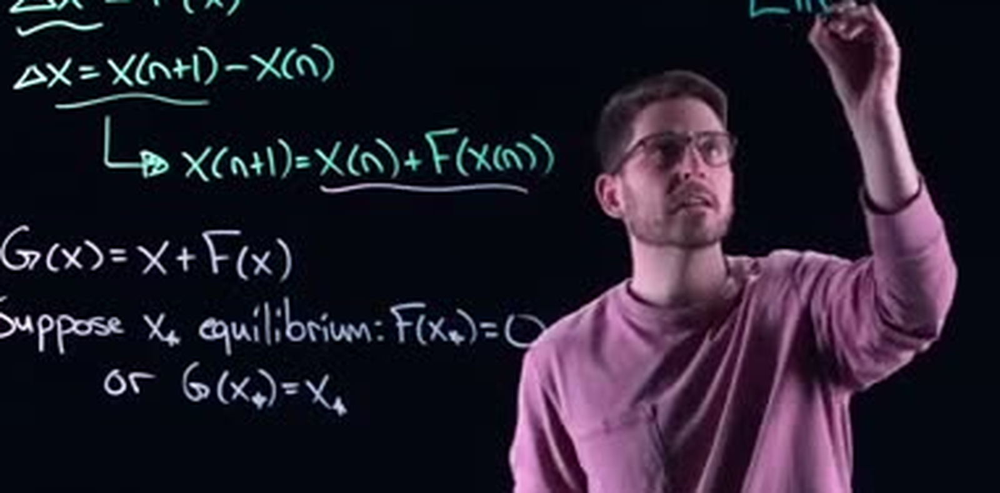
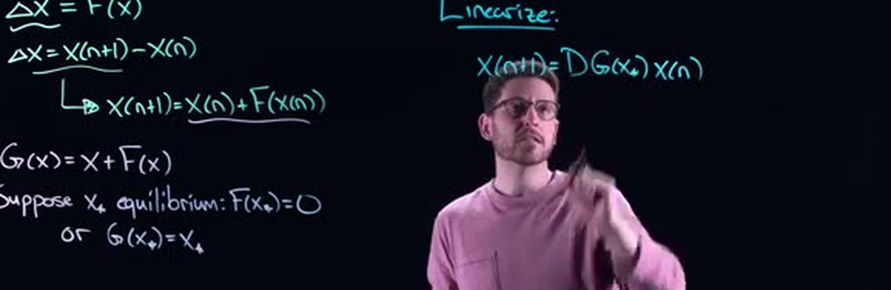
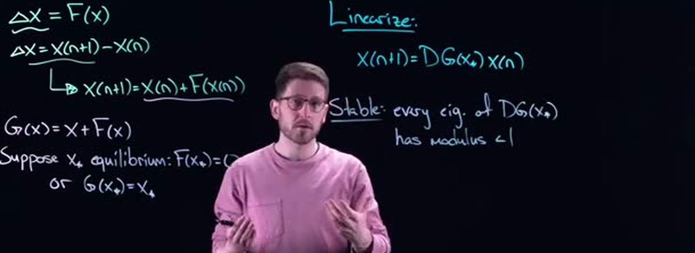
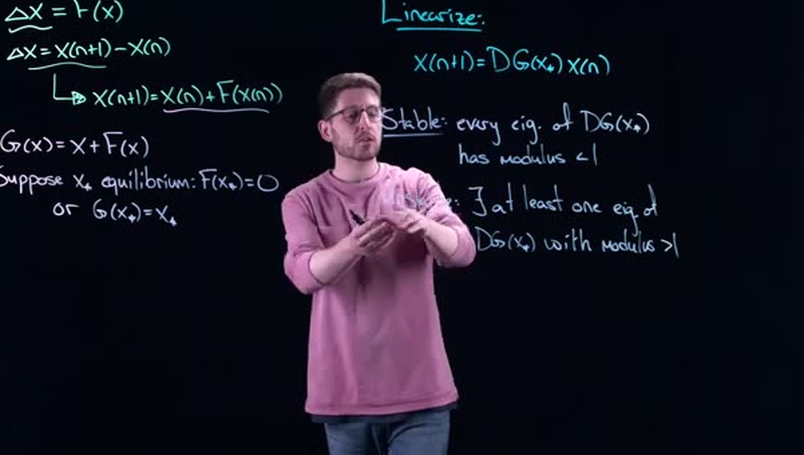
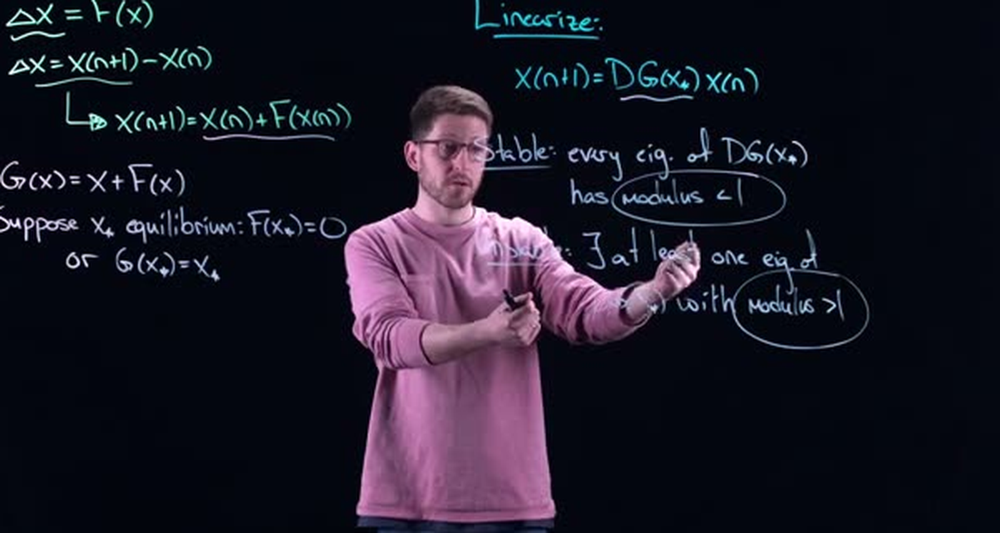

# Discrete-Time Dynamical Systems: Linearization, Stability, and Eigenvalue Analysis
> **Source:** [Analysis of Discrete-Time Dynamical Systems - Math Modelling - Lecture 19](https://www.youtube.com/watch?v=6It02qpjHQ8) by Math Modelling · 08:14 · Training document generated from the video.
**How to use this document:** read it top to bottom in place of watching the video. Screenshots appear exactly where the video depends on something visual, with links that jump to that moment. Questions at the end of each section confirm you learned the material. The glossary and footnotes add definitions and detail the video assumes you already have.
**Who this is for:** Undergraduate or graduate students in applied mathematics, engineering, or physics who have studied continuous-time dynamical systems and need to extend those concepts to discrete-time systems.
## Learning objectives

After working through this document you can:

1. Define discrete-time dynamical systems using difference equations $\Delta \mathbf{x} = \mathbf{F}(\mathbf{x})$.
2. Convert the difference equation into an update form $\mathbf{x}_{n+1} = \mathbf{x}_n + \mathbf{F}(\mathbf{x}_n)$ and define the combined function $\mathbf{G}(\mathbf{x}) = \mathbf{x} + \mathbf{F}(\mathbf{x})$.
3. Identify equilibrium points $\mathbf{x}^*$ satisfying $\mathbf{F}(\mathbf{x}^*) = \mathbf{0}$ or $\mathbf{G}(\mathbf{x}^*) = \mathbf{x}^*$.
4. Linearize a discrete-time system around an equilibrium by computing the Jacobian matrix $D\mathbf{G}(\mathbf{x}^*)$ to obtain the linearized update $\mathbf{x}_{n+1} \approx D\mathbf{G}(\mathbf{x}^*)\, \mathbf{x}_n$.
5. Determine stability and instability conditions using eigenvalues: stable if all eigenvalues have modulus $|\lambda| < 1$, unstable if at least one eigenvalue has $|\lambda| > 1$.
6. Contrast the discrete-time stability condition (eigenvalues inside the unit circle) with continuous-time (eigenvalues in the left half‑plane).
7. Explain how the Stable Manifold Theorem guarantees that local stability of the linearized system implies local stability of the original nonlinear system.
## Prerequisites

- Understanding of continuous-time dynamical systems (equilibria, linearization, Jacobian)
- Linear algebra (eigenvalues, eigenvectors, matrix multiplication)
- Multivariable calculus (partial derivatives, Jacobian matrices)
- Basic complex numbers (modulus, unit circle, complex plane)
## Introduction to Discrete-Time Systems

In the preceding units we built a working theory for continuous-time dynamical systems, using differential equations of the form $\dot{\mathbf{x}} = \mathbf{f}(\mathbf{x})$. Every core idea, equilibria, linearization, stability, carries over to discrete time. The goal of this section is to make that bridge explicit, to recall the notation that governs systems that change in discrete steps, and to set the stage for eigenvalue analysis of iterated maps.

**Define** (Discrete-Time Dynamical System)

> A discrete-time dynamical system describes the evolution of a state vector $\mathbf{x}_n \in \mathbb{R}^d$ across the discrete index $n \in \mathbb{N}$ (usually thought of as a time step). The system is given by a **difference equation**
> 
> $$\Delta \mathbf{x}_n = \mathbf{x}_{n+1} - \mathbf{x}_n = \mathbf{f}(\mathbf{x}_n),$$
> 
> where $\mathbf{f}: \mathbb{R}^d \to \mathbb{R}^d$ is a known vector field. This form emphasises the *change* at each step. Equivalently, we may “open up” the difference and write an **iterative map**
> 
> $$\mathbf{x}_{n+1} = \mathbf{g}(\mathbf{x}_n),$$
> 
> with $\mathbf{g}(\mathbf{x}) = \mathbf{x} + \mathbf{f}(\mathbf{x})$. Both viewpoints are used interchangeably, though the map $\mathbf{g}$ is often more convenient when computing trajectories or studying stability.

The speaker notes that much of what was developed for continuous-time systems has an exact analogue here, a fact that the video will unpack.

### A First Numerical Example

Consider the linear scalar system

$$\Delta x_n = -0.2\,x_n.$$

Expanding the left-hand side gives

$$x_{n+1} - x_n = -0.2\,x_n \quad\Longrightarrow\quad x_{n+1} = x_n - 0.2\,x_n = 0.8\,x_n.$$

Thus the iterated map is $x_{n+1} = 0.8\,x_n$. This is a simple geometric progression: each step multiplies the state by $0.8$.

Start with $x_0 = 100$. Then:

- $x_1 = 0.8 \times 100 = 80$,
- $x_2 = 0.8 \times 80 = 64$,
- $x_3 = 0.8 \times 64 = 51.2$, and so on.

A table of the first few values makes the behaviour clear:

| $n$ | $x_n$ (exact) | Rounded |
|-----|----------------|---------|
| 0   | 100            | 100     |
| 1   | 80             | 80      |
| 2   | 64             | 64      |
| 3   | 51.2           | 51.2    |
| 4   | 40.96          | 40.96   |
| 5   | 32.768         | 32.77   |

The sequence converges monotonically to $0$, a stable equilibrium. In continuous time, exponential decay is described by $\dot{x} = -\alpha x$; here the discrete analogue is $x_{n+1} = \lambda x_n$ with $|\lambda| < 1$. This parallel will be central when we examine linearization and eigenvalues later.

### Checking Your Understanding

**### Check your understanding**

1. A system is governed by $\Delta x_n = -\alpha\,x_n$ with $\alpha > 0$. Write its iterative map form.  
   <details><summary>Answer</summary>
   $x_{n+1} = x_n - \alpha\,x_n = (1-\alpha)\,x_n$.
   </details>

2. An iterated map is given as $x_{n+1} = 1.5\,x_n$. What is the corresponding difference equation $\Delta x_n = f(x_n)$?  
   <details><summary>Answer</summary>
   $\Delta x_n = x_{n+1} - x_n = 1.5\,x_n - x_n = 0.5\,x_n$, so $f(x_n) = 0.5\,x_n$.
   </details>

3. Starting with $x_0 = 4$, compute $x_2$ for the map $x_{n+1} = 0.5\,x_n$.  
   <details><summary>Answer</summary>
   $x_1 = 0.5 \times 4 = 2$, $x_2 = 0.5 \times 2 = 1$.
   </details>

4. (Conceptual) Why does the speaker say “we like to actually open this up a little bit”?  
   <details><summary>Answer</summary>
   Because the standard iterative map $x_{n+1} = g(x_n)$ is obtained by expanding $\Delta x_n = x_{n+1} - x_n$ and solving for $x_{n+1}$. This explicit form is often easier to analyse and to simulate.
   </details>
## The Update Equation and the G Function

When we observe a system only at discrete instants, generation to generation, iteration to iteration, the state advances by jumps according to a deterministic rule. This section turns that rule into a precise mathematical object called an *update equation*. We define the change function $F$, build the difference equation $X_{n+1}=X_n+F(X_n)$, and then fold the right‑hand side into a single map $G$, preparing the ground for linearization and eigenvalue analysis that mirrors what we do for continuous dynamical systems.


**Figure · Difference Equation Derivation**  

*[01:00](https://www.youtube.com/watch?v=6It02qpjHQ8&t=60s) · This visualization shows the derivation of a difference equation, which is fundamental for understanding discrete dynamical systems.*
<details><summary>Show full frame for context</summary>


</details>
  
The whiteboard displays the three expressions that link the step‑to‑step change, the current state, and the unknown model $F$:

```
ΔX = F(x)
ΔX = X(n+1) - X(n)
X(n+1) = X(n) + F(X(n))
```

Rewritten with standard subscript notation and proper typesetting, these become the foundational equations of the section:

**Equation (1)**  
$$ \Delta X = F(x) $$

**Equation (2)**  
$$ \Delta X = X_{n+1} - X_n $$

**Equation (3)**  
$$ X_{n+1} = X_n + F(X_n) $$

Here $\Delta X$ is the *change* that carries us from what we are currently doing to what we will do next. Equation (2) simply defines that change; Equation (3) is a **difference equation** (also called an update equation) because it expresses $X_{n+1}$ explicitly in terms of $X_n$. If we know the function $F$ and a starting value $X_0$, repeated application of (3) generates the whole orbit $\{X_0, X_1, X_2, \dots\}$.

Many classical algorithms and biological models fit this framework:

- **Newton’s method:** solving $f(x)=0$ uses $x_{n+1} = x_n - \frac{f(x_n)}{f'(x_n)}$, so $F(x)=-\frac{f(x)}{f'(x)}$.
- **Gradient descent:** for a cost $J$, the step $x_{n+1} = x_n - \eta \nabla J(x_n)$ gives $F(x)=-\eta \nabla J(x)$.
- **Yeast population (discrete logistic model):** a nondimensionalized form is $N_{n+1} = r N_n (1 - N_n)$; then $F(N)=r N(1-N)-N$.

Every one of these examples has exactly the structure $X_{n+1} = X_n + F(X_n)$.

### The $G$ Function

To focus entirely on the transformation from one state to the next, we bundle $X_n$ and $F(X_n)$ into a single function.

> **Define** (Iteration function $G$). For a system with change function $F$, let  
> $$ G(x) = x + F(x). $$  
> The evolution is then governed by the compact iterative map  
> $$ X_{n+1} = G(X_n). $$

This $G$ is the engine of the discrete dynamics. In a continuous system $\dot{x}=f(x)$, linearization works with the Jacobian of $f$; in the discrete case, stability analysis will work with the derivative (or Jacobian) of $G$. That is the “similar process” we will carry over from continuous dynamical systems.

**Proposition (Equivalent forms).** Every first‑order autonomous difference equation can be written as $X_{n+1}=G(X_n)$ by setting $G(x)=x+F(x)$. Conversely, given $G$, the change function is recovered by $F(x)=G(x)-x$.

The flow that connects these ideas is:



### Fully Worked Numerical Example

Take the discrete logistic map often used for yeast populations, with growth parameter $r=2$:

$$ N_{n+1} = 2 N_n (1 - N_n). $$

**Step 1: find $F$.**  
Write the right‑hand side as $N_n + F(N_n)$:

$$ N_{n+1} = 2N_n - 2N_n^2 = N_n + (N_n - 2N_n^2). $$

Hence the change function is $F(N) = N - 2N^2 = N(1-2N)$.

**Step 2: form $G$.**  

$$ G(N) = N + F(N) = N + (N - 2N^2) = 2N - 2N^2 = 2N(1-N). $$

**Step 3: iterate.**  
Start from $N_0 = 0.2$ (20% of the carrying capacity):

$$

N_1 &= G(0.2) = 2(0.2)(0.8) = 0.32,\\
N_2 &= G(0.32) = 2(0.32)(0.68) = 0.4352,\\
N_3 &= G(0.4352) = 2(0.4352)(0.5648) \approx 0.4916,\\
N_4 &\approx 0.4999,\\
N_5 &\approx 0.5000.

$$

The sequence settles on $N^* = 0.5$. This is a **fixed point** of $G$ because $G(0.5)=0.5$, which is equivalent to $F(0.5)=0$. Fixed points correspond to equilibria where the system stops changing.

The same reasoning applies to Newton’s method: there $G(x)=x-\frac{f(x)}{f'(x)}$, and any fixed point satisfies $f(x)=0$. The next sections will use the derivative $G'(x^*)$ (or the eigenvalues of the Jacobian for vector states) to decide whether a fixed point is stable or unstable.

### Check your understanding

1. For Newton’s method $x_{n+1} = x_n - \frac{f(x_n)}{f'(x_n)}$, identify the functional forms of $F(x)$ and $G(x)$.
<details><summary>Answer</summary>
$F(x) = -\frac{f(x)}{f'(x)}$, $\qquad G(x) = x - \frac{f(x)}{f'(x)}$.
</details>

2. A system follows $X_{n+1} = 0.8 X_n + 2$. Write $F(x)$ and $G(x)$. Then compute $X_1, X_2, X_3$ starting from $X_0 = 0$.
<details><summary>Answer</summary>
$G(x) = 0.8x + 2$. Therefore $F(x) = G(x) - x = -0.2x + 2$.  
$X_1 = 0.8(0)+2 = 2$, $X_2 = 0.8(2)+2 = 3.6$, $X_3 = 0.8(3.6)+2 = 4.88$.
</details>

3. The change function of a system is $F(x) = \sin(x) - x$. Give $G(x)$ and find all fixed points in the interval $[0, \pi]$. (Hint: fixed points satisfy $F(x)=0$.)
<details><summary>Answer</summary>
$G(x) = x + (\sin(x)-x) = \sin(x)$. Fixed points solve $\sin(x)=x$. In $[0,\pi]$ the only real solution is $x=0$, because $\sin(x) < x$ for all $x>0$.
</details>
## Equilibrium Points

In discrete-time dynamical systems expressed as an update rule  
$\mathbf{x}_{n+1} = \mathbf{G}(\mathbf{x}_n)$, the simplest possible behaviour is to stay exactly where you are. Such stationary states are called equilibria or fixed points, and they form the foundation for local analysis: once we know where the system can rest, we linearise around those points to understand nearby trajectories. This section defines equilibria, unpacks their two equivalent mathematical formulations, and shows you how to compute them for a variety of maps, including those arising from numerical methods.

### Definition and the two equivalent views

> **Define (Equilibrium / Fixed Point).**  
> Let $\mathbf{G} : \mathbb{R}^n \to \mathbb{R}^n$ define a discrete-time system  
> $$\mathbf{x}_{n+1} = \mathbf{G}(\mathbf{x}_n).$$  
> A point $\mathbf{x}^* \in \mathbb{R}^n$ is called an *equilibrium* (or *fixed point*) if  
> $$\mathbf{G}(\mathbf{x}^*) = \mathbf{x}^*.$$  
> Equivalently, if we write the system as a difference equation  
> $$\mathbf{x}_{n+1} - \mathbf{x}_n = \mathbf{F}(\mathbf{x}_n) \quad\text{with}\quad \mathbf{F}(\mathbf{x}) = \mathbf{G}(\mathbf{x}) - \mathbf{x},$$  
> then the condition becomes $\mathbf{F}(\mathbf{x}^*) = \mathbf{0}$.

The two formulations describe exactly the same object, but they offer complementary insights.

* $\mathbf{F}(\mathbf{x}^*) = \mathbf{0}$ says that the net change from one time step to the next is zero. Therefore $\mathbf{x}_{n+1} = \mathbf{x}_n$, and the state does not move.
* $\mathbf{G}(\mathbf{x}^*) = \mathbf{x}^*$ says that if you happen to be at $\mathbf{x}^*$ right now, you will remain there for all future iterations. It is a fixed point of the map $\mathbf{G}$.

This second viewpoint is the more standard notation you will encounter in practice, because many important algorithms, Newton’s method, gradient descent, the Euler method for differential equations, are naturally written as update rules of the form $\mathbf{x}_{n+1} = \mathbf{G}(\mathbf{x}_n)$.

**Proposition (Equilibria of common iterative schemes).**  
Consider the following discrete-time maps and their associated equilibrium conditions.

| Method | Update rule $\mathbf{G}(\mathbf{x})$ | Equilibrium condition simplifies to |
|--------|-------------------------------------|-------------------------------------|
| Newton’s method for $\mathbf{f}(\mathbf{x}) = \mathbf{0}$ | $\mathbf{x} - [\mathbf{J}_{\!\mathbf{f}}(\mathbf{x})]^{-1}\mathbf{f}(\mathbf{x})$ | $\mathbf{f}(\mathbf{x}) = \mathbf{0}$ (roots of $\mathbf{f}$) |
| Gradient descent, step $\alpha$, on $J(\mathbf{x})$ | $\mathbf{x} - \alpha\nabla J(\mathbf{x})$ | $\nabla J(\mathbf{x}) = \mathbf{0}$ (critical points of $J$) |
| Forward Euler of $\dot{\mathbf{x}} = \mathbf{f}(\mathbf{x})$, time step $\Delta t$ | $\mathbf{x} + \Delta t\,\mathbf{f}(\mathbf{x})$ | $\mathbf{f}(\mathbf{x}) = \mathbf{0}$ (steady states of the ODE), provided $\Delta t \neq 0$ |

In each case, solving $\mathbf{G}(\mathbf{x}) = \mathbf{x}$ reduces to a simpler problem, root-finding, critical-point search, or steady-state calculation, which is precisely the goal the algorithm was designed to achieve.

### The workflow: find equilibria, then linearise

The process for local analysis of a discrete map always follows the same sequence.



Just as we did in continuous-time dynamics, once the equilibria are known we will linearise around each one by taking the Jacobian matrix of $\mathbf{G}$ (or of $\mathbf{F}$) and studying its eigenvalues. The next section shows how.

### Worked example: a two-dimensional nonlinear map

Consider the discrete system

$$
\begin{cases}
x_{n+1} = x_n^{\,2} + y_n,\$$2pt]
y_{n+1} = x_n - y_n .
\end{cases}
$$

**Step 1: Write the map and the equilibrium equations.**  
Let $\mathbf{G}(x,y) = \begin{pmatrix} x^{2} + y \\ x - y \end{pmatrix}$.  
Setting $\mathbf{G}(x,y) = (x,y)$ gives

$$
\begin{pmatrix} x^{2} + y \\ x - y \end{pmatrix} = \begin{pmatrix} x \\ y \end{pmatrix},
$$

which yields the algebraic system

$$

x &= x^{2} + y, \\
y &= x - y .

$$

*(Note: the aligned environment is used here only for exposition; the underlying equations are the two displayed scalar equalities.)*

**Step 2: Solve the second equation for one variable.**  
$$
y = x - y \;\Longrightarrow\; 2y = x \;\Longrightarrow\; y = \frac{x}{2}.
$$

**Step 3: Substitute into the first equation.**  
$$
x = x^{2} + \frac{x}{2}
\;\Longrightarrow\; x^{2} + \frac{x}{2} - x = 0
\;\Longrightarrow\; x^{2} - \frac{x}{2} = 0 .
$$

Factor:
$$
x\left(x - \frac{1}{2}\right) = 0.
$$

**Step 4: Determine the equilibria.**  
- If $x = 0$, then $y = 0/2 = 0$.  
- If $x = \frac{1}{2}$, then $y = \frac{1}{2}/2 = \frac{1}{4}$.

Thus the map has two equilibrium points:

$$
\mathbf{x}_1^* = (0, 0), \qquad
\mathbf{x}_2^* = \left(\frac{1}{2},\,\frac{1}{4}\right).
$$

**Step 5: Verify with the difference form.**  
Define $\mathbf{F}(x,y) = \mathbf{G}(x,y) - (x,y) = \bigl(x^{2} + y - x,\; x - 2y\bigr)$.  
Setting $\mathbf{F}=0$ gives the same two equations we solved, confirming the result.

Once the equilibria are in hand, the next task is to linearise, computing the Jacobian matrix

$$
D\mathbf{G}(x,y) = \begin{pmatrix}
\dfrac{\partial}{\partial x}(x^{2}+y) & \dfrac{\partial}{\partial y}(x^{2}+y) \$$6pt]
\dfrac{\partial}{\partial x}(x - y)   & \dfrac{\partial}{\partial y}(x - y)
\end{pmatrix}
= \begin{pmatrix}
2x & 1 \\
1  & -1
\end{pmatrix},
$$

evaluating it at each $\mathbf{x}^*$, and examining its eigenvalues to decide whether nearby trajectories are attracted or repelled. This is the “same thing” the speaker refers to: the discrete analogue of the continuous Jacobian linearisation.

### Check your understanding

1. **Linear map with a parameter.**  
   For the system $x_{n+1} = a x_n + b$, find all equilibrium points. Under what condition on $a$ does a unique equilibrium exist?

   <details><summary>Answer</summary>
   Set $x = a x + b$, giving $(1-a)x = b$.
   - If $a \neq 1$, there is a unique equilibrium $x^* = \dfrac{b}{1-a}$.
   - If $a = 1$ and $b = 0$, every real number is an equilibrium.
   - If $a = 1$ and $b \neq 0$, the equation $0 = b$ has no solution; no equilibrium exists.
   </details>

2. **Logistic map.**  
   The logistic map is $x_{n+1} = r x_n (1 - x_n)$, with $r > 0$. Show that the equilibria are $x = 0$ and $x = 1 - \frac{1}{r}$ (for $r \neq 0$).

   <details><summary>Answer</summary>
   Solve $x = r x (1-x)$.
   Rewrite: $x - r x (1-x) = 0 \;\Longrightarrow\; x[1 - r(1-x)] = 0$.
   - $x = 0$ is always an equilibrium.
   - $1 - r(1-x) = 0 \;\Longrightarrow\; 1 = r(1-x) \;\Longrightarrow\; 1-x = \frac{1}{r} \;\Longrightarrow\; x = 1 - \frac{1}{r}$.
   So the fixed points are $0$ and $1 - 1/r$, which exists as a real number distinct from $0$ when $r \neq 1$.
   </details>

3. **A two-dimensional map with no equilibrium.**  
   Determine the equilibria of  
   $$x_{n+1} = y_n, \qquad y_{n+1} = -x_n + 2y_n + 1.$$

   <details><summary>Answer</summary>
   Set $(x,y) = (y, -x + 2y + 1)$:
   $$
   x = y, \qquad y = -x + 2y + 1.
   $$
   Substitute $x = y$ into the second equation:
   $$
   y = -y + 2y + 1 \;\Longrightarrow\; y = y + 1 \;\Longrightarrow\; 0 = 1,
   $$
   a contradiction. Therefore the system has no equilibrium points.
   </details>

4. **Conceptual.**  
   Explain, in your own words, why an equilibrium of the difference equation $\mathbf{x}_{n+1} - \mathbf{x}_n = \mathbf{F}(\mathbf{x}_n)$ is a point where the state does not change from one time step to the next.

   <details><summary>Answer</summary>
   At an equilibrium $\mathbf{x}^*$, we have $\mathbf{F}(\mathbf{x}^*) = \mathbf{0}$. The difference equation then reads $\mathbf{x}_{n+1} - \mathbf{x}_n = \mathbf{0}$, i.e. $\mathbf{x}_{n+1} = \mathbf{x}_n$. Therefore, if the system is ever at $\mathbf{x}^*$, the next state is identical to the current state, and by induction all future states remain the same.
   </details>
## Linearization Around an Equilibrium

To understand the behavior of a nonlinear discrete-time system near a steady state, we replace the original map with its best linear approximation. This process, called linearization, reduces local dynamics to a linear system whose stability is completely determined by the eigenvalues of a single matrix: the Jacobian evaluated at the equilibrium. The procedure mirrors the continuous-time case, but the stability condition changes from “negative real parts” to “absolute values less than one.” This section derives the linearized equation, states the eigenvalue criterion, and works through concrete numerical examples.

### From difference equations to the iteration map

A discrete-time dynamical system is often first written as a difference equation  
$\Delta\mathbf{x} = \mathbf{F}(\mathbf{x})$, where $\Delta\mathbf{x} = \mathbf{x}_{n+1} - \mathbf{x}_n$ and $\mathbf{x}_n \in \mathbb{R}^m$. The whiteboard captures this starting point.


**Figure · Equations for discrete dynamical systems and equilibrium**  

*[02:40](https://www.youtube.com/watch?v=6It02qpjHQ8&t=160s) · This block of equations defines the relationship between the change in a variable (ΔX), its next state (X(n+1)), and a function F(x), and then introduces the concept of equilibrium where F(x*) = 0 or G(x*) = x*.*
<details><summary>Show full frame for context</summary>


</details>

The screen at 02:40 shows:
```
ΔX = F(x)
ΔX = X(n+1) - X(n)
X(n+1) = X(n) + F(x(n))
G(x) = X + F(x)
Suppose x* equilibrium: F(x*) = 0
or G(x*) = x*
```
(The video uses capital letters and parentheses for indices; we adopt the cleaner notation $\mathbf{x}_{n+1}$ and $\mathbf{x}_n$.)

Solving for the next state gives an explicit iteration rule:

$$
\mathbf{x}_{n+1} = \mathbf{x}_n + \mathbf{F}(\mathbf{x}_n).
$$

Define a new function $\mathbf{G} : \mathbb{R}^m \to \mathbb{R}^m$ by

$$
\mathbf{G}(\mathbf{x}) = \mathbf{x} + \mathbf{F}(\mathbf{x}).
$$

Then the system simply reads

$$
\mathbf{x}_{n+1} = \mathbf{G}(\mathbf{x}_n). 
$$

**Define** (Equilibrium / Fixed Point): A point $\mathbf{x}^*$ is an equilibrium of (1) if, once the state equals $\mathbf{x}^*$, it remains there for all future steps: $\mathbf{x}_{n+1} = \mathbf{x}_n = \mathbf{x}^*$. Equivalently, $\mathbf{F}(\mathbf{x}^*) = \mathbf{0}$, or

$$
\mathbf{G}(\mathbf{x}^*) = \mathbf{x}^*.
$$


**Figure · Equations for Discrete Dynamical Systems and Equilibrium**  

*[03:00](https://www.youtube.com/watch?v=6It02qpjHQ8&t=180s) · This block of equations defines the change in a discrete dynamical system, introduces a function G(x), and states the conditions for an equilibrium point.*
<details><summary>Show full frame for context</summary>


</details>

The whiteboard at 03:00 reinforces the same facts, using uppercase X for the equilibrium point:
```
ΔX = F(x)
ΔX = X(n+1) - X(n)
↳ X(n+1) = X(n) + F(X(n))
G(x) = X + F(x)
Suppose X* equilibrium: F(X*) = 0
or G(X*) = X*
```

### The linearization step

We want to know what happens when the state is slightly perturbed away from $\mathbf{x}^*$. Introduce the perturbation vector $\mathbf{y}_n = \mathbf{x}_n - \mathbf{x}^*$. Then

$$
\mathbf{y}_{n+1} = \mathbf{x}_{n+1} - \mathbf{x}^*
               = \mathbf{G}(\mathbf{x}_n) - \mathbf{G}(\mathbf{x}^*).
$$

Since $\mathbf{x}_n = \mathbf{x}^* + \mathbf{y}_n$, we can expand $\mathbf{G}$ in a Taylor series around $\mathbf{x}^*$, keeping only the first-order term:

$$
\mathbf{G}(\mathbf{x}^* + \mathbf{y}_n) = \mathbf{G}(\mathbf{x}^*) + D\mathbf{G}(\mathbf{x}^*)\,\mathbf{y}_n + \mathcal{O}\bigl(\|\mathbf{y}_n\|^2\bigr),
$$

where $D\mathbf{G}(\mathbf{x}^*)$ is the **Jacobian matrix** of $\mathbf{G}$ evaluated at the equilibrium:

$$
\bigl(D\mathbf{G}(\mathbf{x})\bigr)_{ij} = \frac{\partial G_i}{\partial x_j}.
$$

Because $\mathbf{G}(\mathbf{x}^*) = \mathbf{x}^*$, the constant term cancels and we obtain the linearized dynamics

$$
\boxed{\;\mathbf{y}_{n+1} \approx \mathbf{J}\,\mathbf{y}_n,\qquad \mathbf{J} = D\mathbf{G}(\mathbf{x}^*)\;}.
$$

**Define** (Linearization): For the system $\mathbf{x}_{n+1} = \mathbf{G}(\mathbf{x}_n)$ with equilibrium $\mathbf{x}^*$, the **linearized system** is the linear update $\mathbf{y}_{n+1} = \mathbf{J}\,\mathbf{y}_n$, where $\mathbf{J}$ is the Jacobian of $\mathbf{G}$ at $\mathbf{x}^*$ and $\mathbf{y}_n = \mathbf{x}_n - \mathbf{x}^*$. In the words of the lecture, “linearized means compute the Jacobian.”

### Eigenvalues determine stability

The linearized equation $\mathbf{y}_{n+1} = \mathbf{J}\,\mathbf{y}_n$ is a completely linear discrete-time dynamical system. All local dynamics of the original nonlinear system are captured, to first order, by the properties of the matrix $\mathbf{J}$. In particular, the behavior is governed by the eigenvalues of $\mathbf{J}$, exactly as in the continuous-time case but with a modified stability criterion.

**Proposition (Stability via eigenvalues of the Jacobian)**: Let $\mathbf{x}^*$ be an equilibrium of $\mathbf{x}_{n+1} = \mathbf{G}(\mathbf{x}_n)$ with $\mathbf{G}$ continuously differentiable. Let $\mathbf{J} = D\mathbf{G}(\mathbf{x}^*)$ and denote its eigenvalues by $\lambda_1, \lambda_2, \dots, \lambda_m$ (possibly complex).

* If **all** eigenvalues satisfy $|\lambda_i| < 1$, then $\mathbf{x}^*$ is **locally asymptotically stable**: for sufficiently small perturbations, $\mathbf{y}_n \to \mathbf{0}$ as $n \to \infty$.
* If **any** eigenvalue satisfies $|\lambda_i| > 1$, then $\mathbf{x}^*$ is **unstable**: most small perturbations will grow.
* If all eigenvalues satisfy $|\lambda_i| \le 1$ and at least one eigenvalue lies exactly on the unit circle ($|\lambda|=1$), linearization alone is **inconclusive**; higher-order terms decide stability.

This proposition echoes the lecture statement: “all of the dynamics of this thing are determined by the eigenvalues of the matrix $d\gamma$” (i.e., $D\mathbf{G}$) and “we have stability if every eigenvalue …” (of $D\mathbf{G}(\mathbf{x}^*)$) has magnitude less than one.

The overall procedure can be visualized as a pipeline:

```mermaid
flowchart TD
    A[Start: Δx = F(x)] --> B[Rewrite as x_{n+1} = x_n + F(x_n)]
    B --> C[Define map G(x) = x + F(x)]
    C --> D[Find equilibrium x*: G(x*) = x*]
    D --> E[Compute Jacobian J = DG(x*)]
    E --> F[Linearized system: y_{n+1} = J y_n]
    F --> G[Find eigenvalues λ of J]
    G --> H{All |λ| < 1?}
    H -- Yes --> I[Locally asymptotically stable]
    H -- No, some |λ| > 1 --> J[Unstable]
    H -- No, some |λ| = 1 (others ≤ 1) --> K[Inconclusive by linearization]
```

### Worked Example 1: a one‑dimensional quadratic map

Consider the scalar map

$$
x_{n+1} = x_n^{\,2}, \qquad \bigl(G(x) = x^2\bigr).
$$

**Step 1: equilibria.** Solve $x = x^2$:
$$
x^2 - x = x(x-1) = 0 \quad\Longrightarrow\quad x^* = 0,\; x^* = 1.
$$

**Step 2: Jacobian (derivative).** In one dimension the Jacobian is simply the derivative:
$$
J = G'(x^*) = 2x^*.
$$

**Step 3: evaluate Jacobian and eigenvalues.**

- At $x^* = 0$: $J = 0$. The only eigenvalue is $\lambda = 0$. Since $|0| < 1$, the equilibrium is **locally asymptotically stable**. In fact, for any $|x_0|<1$ the iterates converge to 0 (super‑stable because the linear part vanishes).
- At $x^* = 1$: $J = 2$. Eigenvalue $\lambda = 2 > 1$; this equilibrium is **unstable**. Small deviations $y_n$ evolve approximately as $y_{n+1} \approx 2 y_n$, so they double each step and grow away from 1.

This simple example illustrates that linearization reduces stability analysis to evaluating the derivative at each equilibrium.

### Worked Example 2: a two‑dimensional system expressed as a difference equation

Starting from the difference form

$$
\begin{cases}
\Delta x_{1,n} = -0.2\,x_{1,n} + 0.1\,x_{2,n},\$$2pt]
\Delta x_{2,n} =  \;0.1\,x_{1,n} - 0.2\,x_{2,n},
\end{cases}
$$

where $\Delta x_{i,n} = x_{i,n+1}-x_{i,n}$. Write $\mathbf{x}_n = \begin{pmatrix} x_{1,n} \\ x_{2,n} \end{pmatrix}$ and $\mathbf{F}(\mathbf{x}) = A\mathbf{x}$ with

$$
A = \begin{pmatrix}
-0.2 & 0.1 \\
0.1 & -0.2
\end{pmatrix}.
$$

**Step 1: map $\mathbf{G}$.**
$$
\mathbf{x}_{n+1} = \mathbf{x}_n + A\mathbf{x}_n = (I + A)\,\mathbf{x}_n,
$$
so $\mathbf{G}(\mathbf{x}) = \begin{pmatrix} 0.8 & 0.1 \\ 0.1 & 0.8 \end{pmatrix} \mathbf{x}$.

**Step 2: equilibrium.** Solve $\mathbf{x}^* = (I+A)\mathbf{x}^* \,\Longrightarrow\, A\mathbf{x}^* = \mathbf{0}$. Since $A$ is invertible, $\mathbf{x}^* = \begin{pmatrix} 0 \\ 0 \end{pmatrix}$ is the unique equilibrium.

**Step 3: Jacobian.** $\mathbf{G}$ is linear, so the Jacobian is constant; evaluating at the equilibrium simply gives

$$
J = D\mathbf{G}(\mathbf{x}^*) = I + A =
\begin{pmatrix}
0.8 & 0.1 \$$2pt]
0.1 & 0.8
\end{pmatrix}.
$$

**Step 4: eigenvalues.** Solve $\det(J - \lambda I) = 0$:

$$
\det\begin{pmatrix}
0.8-\lambda & 0.1 \\
0.1        & 0.8-\lambda
\end{pmatrix}
= (0.8-\lambda)^2 - 0.01
= \lambda^2 - 1.6\lambda + 0.63 = 0.
$$

$$
\lambda = \frac{1.6 \pm \sqrt{1.6^2 - 4\cdot 0.63}}{2}
        = \frac{1.6 \pm \sqrt{2.56 - 2.52}}{2}
        = \frac{1.6 \pm 0.2}{2}.
$$

Thus $\lambda_1 = 0.9$, $\lambda_2 = 0.7$. Both satisfy $|\lambda| < 1$. By the Proposition, the equilibrium $\mathbf{x}^* = \mathbf{0}$ is **locally asymptotically stable**. Any small perturbation decays to zero; the linearized dynamics $\mathbf{y}_{n+1}=J\mathbf{y}_n$ give exact predictions because the map is already linear.

### Check your understanding

1. **Equilibrium and stability for a 1D affine map**  
   Consider the system $x_{n+1} = 0.5\,x_n + 0.3$.  
   (a) Find the equilibrium $x^*$.  
   (b) Compute the linearization (derivative) at $x^*$.  
   (c) Is the equilibrium stable? Why or why not?  
   <details><summary>Answer</summary>
   (a) Equilibrium: $x^* = 0.5x^* + 0.3 \;\Rightarrow\; 0.5x^* = 0.3 \;\Rightarrow\; x^* = 0.6$.  
   (b) $G(x) = 0.5x + 0.3$, so $J = G'(x^*) = 0.5$.  
   (c) The eigenvalue is $0.5$; its absolute value is less than 1, so the equilibrium is locally asymptotically stable. In this linear system the stability is global.
   </details>

2. **Determining stability of a 2D linear map**  
   Let $\mathbf{x}_{n+1} = \begin{pmatrix} 0.9 & 0.1 \\ 0.2 & 0.8 \end{pmatrix} \mathbf{x}_n$. The origin is clearly an equilibrium. Find the eigenvalues of the coefficient matrix and decide the stability.  
   <details><summary>Answer</summary>
   Matrix: $J = \begin{pmatrix} 0.9 & 0.1 \\ 0.2 & 0.8 \end{pmatrix}$.  
   Characteristic polynomial: $(0.9-\lambda)(0.8-\lambda) - 0.02 = \lambda^2 - 1.7\lambda + 0.72 - 0.02 = \lambda^2 - 1.7\lambda + 0.70$.  
   Roots: $\lambda = \frac{1.7 \pm \sqrt{2.89 - 2.80}}{2} = \frac{1.7 \pm 0.3}{2}$, giving $\lambda_1 = 1.0$, $\lambda_2 = 0.7$.  
   One eigenvalue has $|\lambda|=1$ (and the other $<1$), so linearization is **inconclusive**. We cannot declare asymptotic stability or instability solely from the linearized system.
   </details>

3. **What does it mean to “linearize” a discrete-time system around an equilibrium?**  
   <details><summary>Answer</summary>
   To linearize means to replace the nonlinear map $\mathbf{G}$ by its first‑order Taylor expansion about the equilibrium, giving a linear system $\mathbf{y}_{n+1} = D\mathbf{G}(\mathbf{x}^*)\,\mathbf{y}_n$. In practice, you compute the Jacobian matrix of $\mathbf{G}$ at the equilibrium and study the resulting linear update.
   </details>

4. **True or false:** If any eigenvalue of the Jacobian at an equilibrium has absolute value less than 1, the equilibrium is stable.  
   <details><summary>Answer</summary>
   False. Stability requires that **all** eigenvalues have absolute value less than 1. If one eigenvalue is less than 1 but another is, say, > 1, the equilibrium is unstable because the corresponding direction will blow up.
   </details>
## Stability Condition: Eigenvalues in the Unit Circle

We now connect the linearization of a discrete-time dynamical system to a clean, algebraic criterion for local stability. The central idea is that near a fixed point the nonlinear map behaves like its Jacobian matrix. If the Jacobian shrinks distances at every iteration, if it acts as a contraction, then small perturbations decay to zero. The spectral condition that guarantees this contraction is simply that every eigenvalue of the Jacobian lies **inside the unit circle** in the complex plane. This section formalizes that condition, explains why it implies contraction, and works a full numerical example.


**Figure · Equations for Linearization and Equilibrium**  

*[03:40](https://www.youtube.com/watch?v=6It02qpjHQ8&t=220s) · This visualization presents a series of equations defining the change in X, an iterative update rule, a function G(x), and the conditions for equilibrium, which are fundamental concepts in dynamical systems.*
<details><summary>Show full frame for context</summary>


</details>


### Linearization Recapitulation

Start with a discrete system written in difference form  

$$

\Delta \mathbf{x} &= F(\mathbf{x}), \\
\Delta \mathbf{x} &= \mathbf{x}_{n+1} - \mathbf{x}_n .

$$

Rearranging gives the iteration map  

$$
\mathbf{x}_{n+1} = \mathbf{x}_n + F(\mathbf{x}_n) \equiv G(\mathbf{x}_n).
$$

An **equilibrium** (or fixed point) $\mathbf{x}^*$ satisfies $F(\mathbf{x}^*) = \mathbf{0}$, which is equivalent to  

$$
G(\mathbf{x}^*) = \mathbf{x}^* .
$$

Linearizing the map $G$ around $\mathbf{x}^*$ means keeping only the first-order term of its Taylor expansion. Let $\Delta \mathbf{x}_n = \mathbf{x}_n - \mathbf{x}^*$ be a small deviation. Then  

$$
\mathbf{x}_{n+1} \approx \mathbf{x}^* + DG(\mathbf{x}^*)\,(\mathbf{x}_n - \mathbf{x}^*),
$$

or in deviation variables  

$$
\Delta \mathbf{x}_{n+1} = DG(\mathbf{x}^*)\, \Delta \mathbf{x}_n .

$$

The matrix $DG(\mathbf{x}^*)$ is the **Jacobian** of $G$ evaluated at the equilibrium. Its entries are the partial derivatives of the components of $G$ with respect to the components of $\mathbf{x}$, all evaluated at $\mathbf{x}^*$.


**Figure · Linearization and Stability Conditions**  

*[04:20](https://www.youtube.com/watch?v=6It02qpjHQ8&t=260s) · This visualization presents the mathematical steps for linearizing a system and the condition for stability based on the eigenvalues of the linearized system's Jacobian matrix.*
<details><summary>Show full frame for context</summary>


</details>


### The Modulus Condition and the Unit Circle

> **Define** (Modulus of a complex number). For a complex number $\lambda = a + i b$ with real part $a$ and imaginary part $b$, the modulus (absolute value) is  
> $$|\lambda| = \sqrt{a^2 + b^2}.$$  
> Geometrically, $|\lambda|$ is the Euclidean distance from the origin to the point $(a,b)$ in the complex plane.

The equation $|\lambda| = 1$ defines the **unit circle**. The condition $|\lambda| < 1$ means that $\lambda$ lies **strictly inside** the unit circle. Because eigenvalues of a real matrix can appear as complex-conjugate pairs, the modulus handles both real and complex eigenvalues uniformly.

**Theorem (Local asymptotic stability via eigenvalues)**  
Consider the discrete dynamical system $\mathbf{x}_{n+1} = G(\mathbf{x}_n)$ with equilibrium $\mathbf{x}^*$ and Jacobian $A = DG(\mathbf{x}^*)$. Let $\lambda_1, \lambda_2, \dots, \lambda_m$ be the eigenvalues of $A$ (counted with algebraic multiplicity).  

* If $|\lambda_j| < 1$ for every eigenvalue, then $\mathbf{x}^*$ is **locally asymptotically stable**: all sufficiently small perturbations decay to zero as $n \to \infty$.  
* If there exists an eigenvalue with $|\lambda_j| > 1$, then $\mathbf{x}^*$ is **unstable**: some arbitrarily small perturbations grow without bound.  
* If some eigenvalues satisfy $|\lambda| = 1$ while the rest satisfy $|\lambda| < 1$, then linearization alone cannot decide stability; higher-order terms determine the outcome (added context).

In the video’s language: “Stable: every eig. of $DG(\mathbf{x}^*)$ has modulus $< 1$.”

### Why the Condition Means Contraction

Equation (1) is a linear recurrence $\Delta \mathbf{x}_{n+1} = A \Delta \mathbf{x}_n$. If all eigenvalues of $A$ have modulus strictly smaller than 1, the **spectral radius**  

$$
\rho(A) = \max_j |\lambda_j|
$$

is less than 1. For diagonalizable matrices, this implies that in a suitable basis each coordinate shrinks by a factor at most $\rho(A)$ every step, so after $k$ steps  

$$
\|\Delta \mathbf{x}_k\| \leq C \, \rho(A)^k \|\Delta \mathbf{x}_0\|
$$

for some constant $C$. More generally, for any matrix with $\rho(A) < 1$, the iterates $A^k \Delta \mathbf{x}_0$ converge to zero geometrically; the map is a **contraction** in some norm. Consequently, a nonlinear system whose linearization is a contraction inherits that contractive behaviour locally, after each iterate, the state is pulled closer to the equilibrium. The video phrases it as: “after every iteration, so after each $n$, you are contracting.”

```mermaid
graph LR
    A[Compute Jacobian <br/> A = DG&#40x*&#41] --> B[Find eigenvalues λ]
    B --> C{All &#124λ&#124 &#60 1?}
    C -- Yes --> D[Stable<br/>contraction]
    C -- No, some &#124λ&#124 > 1 --> E[Unstable]
    C -- Some &#124λ&#124 = 1, rest &#60 1 --> F[Inconclusive<br/>(center manifold)]
```

### Worked Numerical Example

Consider the nonlinear system  

$$

x_{n+1} &= 0.4\,x_n - 0.5\,y_n + 0.1\,x_n^2 y_n, \\
y_{n+1} &= 0.5\,x_n + 0.4\,y_n + 0.1\,x_n y_n^2 .

$$

**Step 1: Find an equilibrium**  
Set $x_{n+1} = x_n,\; y_{n+1} = y_n$. The origin $(0,0)$ clearly satisfies the equations because all terms containing $x_n$ or $y_n$ vanish. Hence $\mathbf{x}^* = (0,0)$.

**Step 2: Compute the Jacobian**  
Define $G_1(x,y) = 0.4 x - 0.5 y + 0.1 x^2 y$ and $G_2(x,y) = 0.5 x + 0.4 y + 0.1 x y^2$. The Jacobian matrix is  

$$
DG(x,y) =
\begin{pmatrix}
\frac{\partial G_1}{\partial x} & \frac{\partial G_1}{\partial y} \$$4pt]
\frac{\partial G_2}{\partial x} & \frac{\partial G_2}{\partial y}
\end{pmatrix}
=
\begin{pmatrix}
0.4 + 0.2 x y & -0.5 + 0.1 x^2 \\
0.5 + 0.1 y^2 & 0.4 + 0.2 x y
\end{pmatrix}.
$$

Evaluate at the equilibrium $\mathbf{x}^*$:  

$$
A = DG(0,0) =
\begin{pmatrix}
0.4 & -0.5 \\
0.5 & 0.4
\end{pmatrix}.
$$

**Step 3: Find the eigenvalues**  
Solve $\det(A - \lambda I) = 0$:  

$$
\begin{vmatrix}
0.4 - \lambda & -0.5 \\
0.5 & 0.4 - \lambda
\end{vmatrix}
= (0.4 - \lambda)^2 + (0.5)^2 = 0 .
$$

Thus  

$$
(0.4 - \lambda)^2 = -0.25 \quad\Longrightarrow\quad \lambda = 0.4 \pm 0.5 i .
$$

The eigenvalues are the complex-conjugate pair $\lambda_1 = 0.4 + 0.5 i$ and $\lambda_2 = 0.4 - 0.5 i$.

**Step 4: Compute the moduli**  

$$
|\lambda_1| = \sqrt{(0.4)^2 + (0.5)^2} = \sqrt{0.16 + 0.25} = \sqrt{0.41} \approx 0.6403,
$$
$$
|\lambda_2| = \sqrt{(0.4)^2 + (-0.5)^2} = \sqrt{0.41} \approx 0.6403.
$$

Both moduli are strictly less than 1.

**Step 5: Conclusion**  
Because every eigenvalue of $DG(0,0)$ lies inside the unit circle, the equilibrium $(0,0)$ is **locally asymptotically stable**. Small deviations will shrink towards zero roughly by a factor of $0.64$ per iteration, demonstrating the contraction property.

### Check your understanding

1. What geometric condition on the eigenvalues of the Jacobian guarantees local asymptotic stability of a discrete-time equilibrium?  
<details><summary>Answer</summary>
All eigenvalues must have modulus strictly less than 1, i.e., they must lie strictly inside the unit circle in the complex plane.
</details>

2. The linearized system near an equilibrium is $\Delta \mathbf{x}_{n+1} = A \Delta \mathbf{x}_n$. If $A$ has eigenvalues $0.9$ and $-1.2$, is the equilibrium stable? Why?  
<details><summary>Answer</summary>
No, it is unstable. The eigenvalue $-1.2$ has modulus $1.2 > 1$; any small component along the corresponding eigendirection will grow without bound.
</details>

3. For the matrix $A = \begin{pmatrix} 0.5 & 0.8 \\ -0.8 & 0.5 \end{pmatrix}$, compute its eigenvalues and decide whether the associated linear system is a contraction.  
<details><summary>Answer</summary>
Eigenvalues: $\lambda = 0.5 \pm 0.8 i$. Modulus: $|\lambda| = \sqrt{0.5^2 + 0.8^2} = \sqrt{0.25 + 0.64} = \sqrt{0.89} \approx 0.943 < 1$. The linear system is a contraction; iterates shrink to zero.
</details>

4. Why does the phrase “unit circle” appear in the stability condition?  
<details><summary>Answer</summary>
The condition $|\lambda| < 1$ describes points whose distance from the origin is less than 1. In the complex plane, the set of points with modulus exactly 1 is the unit circle. Therefore, requiring all eigenvalues to have modulus less than 1 is equivalent to saying every eigenvalue lies strictly inside the unit circle.
</details>
## The Stable Manifold Theorem for Discrete Systems

In this section we extend the concept of stability from linear discrete-time systems to fully nonlinear discrete-time systems. The central result is the Stable Manifold Theorem for discrete dynamics, which tells us that if the linearization of a nonlinear system at a fixed point is contracting, then the nonlinear system is locally contracting as well. This means trajectories starting sufficiently close to the fixed point will converge to it as the iteration index $n \to \infty$. The theorem is the discrete-time analog of the stable manifold theorem for continuous-time systems, and it rests on the same idea: a Taylor expansion around the equilibrium captures the dominant local behavior.


**Figure · Linearization and Stability Conditions**  

*[04:20](https://www.youtube.com/watch?v=6It02qpjHQ8&t=260s) · This visualization presents the mathematical steps for linearizing a system and the condition for stability based on the eigenvalues of the linearized system's Jacobian matrix.*
<details><summary>Show full frame for context</summary>


</details>


### From Linear Contraction to Nonlinear Contraction

Consider a nonlinear discrete-time dynamical system of the form

$$
\mathbf{x}_{n+1} = \mathbf{f}(\mathbf{x}_n),
$$

where $\mathbf{f}: \mathbb{R}^m \to \mathbb{R}^m$ is a smooth (continuously differentiable) map. Let $\bar{\mathbf{x}}$ be a fixed point, meaning

$$
\bar{\mathbf{x}} = \mathbf{f}(\bar{\mathbf{x}}).
$$

We want to understand the behavior of trajectories that start near $\bar{\mathbf{x}}$. The standard approach is to linearize the system around the fixed point. Write a small perturbation $\mathbf{z}_n = \mathbf{x}_n - \bar{\mathbf{x}}$. Then

$$
\mathbf{x}_{n+1} = \mathbf{f}(\bar{\mathbf{x}} + \mathbf{z}_n).
$$

Expand $\mathbf{f}$ in a Taylor series about $\bar{\mathbf{x}}$:

$$
\mathbf{f}(\bar{\mathbf{x}} + \mathbf{z}_n) = \mathbf{f}(\bar{\mathbf{x}}) + D\mathbf{f}(\bar{\mathbf{x}})\, \mathbf{z}_n + \mathcal{O}(\|\mathbf{z}_n\|^2),
$$

where $D\mathbf{f}(\bar{\mathbf{x}})$ is the Jacobian matrix of $\mathbf{f}$ evaluated at $\bar{\mathbf{x}}$. Since $\bar{\mathbf{x}}$ is a fixed point, $\mathbf{f}(\bar{\mathbf{x}}) = \bar{\mathbf{x}}$, and we obtain

$$
\mathbf{z}_{n+1} = D\mathbf{f}(\bar{\mathbf{x}})\, \mathbf{z}_n + \mathcal{O}(\|\mathbf{z}_n\|^2).
$$

The linearized system is obtained by dropping the higher-order terms:

$$
\mathbf{z}_{n+1} = D\mathbf{f}(\bar{\mathbf{x}})\, \mathbf{z}_n.
$$

This is a linear discrete-time system. Its stability is
## Instability Condition

In the previous sections we established that the local stability of a discrete‑time dynamical system around an equilibrium point can be decided by the eigenvalues of the Jacobian matrix evaluated at that equilibrium. When **every** eigenvalue has modulus strictly less than 1, the equilibrium is locally asymptotically stable. Now we examine the reverse situation: what guarantees that the equilibrium is **unstable**? The answer is surprisingly mild: a single eigenvalue with modulus greater than 1 is enough to force instability.


**Figure · Linearization and Stability Conditions**  

*[06:20](https://www.youtube.com/watch?v=6It02qpjHQ8&t=380s) · This visualization presents the linearization of a discrete dynamical system and the conditions for stability and instability based on the eigenvalues of the linearized system's Jacobian matrix.*
<details><summary>Show full frame for context</summary>


</details>


The on‑screen whiteboard at this moment records the chain of ideas that leads to both the stability and the instability criteria. We reproduce the essential equations exactly as they appear (minor typographic artefacts preserved):

```text
Δx = F(x)
Δx = x(n+1) - X(n)
→ x(n+1) = x(n) + F(x(n))
G(x) = x + F(x)
Suppose x₄ equilibrium: F(x∗)=0
  or G(x₄) = x₄
Linearize.
x(n+1) = DG(x₄) x(n)
Stable: every eig. of DG(x)
has modulus <1
Jat least one eig eig od
DGs(x) with modulus >1
```

The last line on the board (despite the typographical shortcuts) asserts the instability condition we will now formalise.

### The Instability Criterion

Consider a system defined by the iteration

$$
\mathbf{x}_{n+1} = \mathbf{G}(\mathbf{x}_n), \qquad \mathbf{G} : \mathbb{R}^m \to \mathbb{R}^m,
$$

and let $\mathbf{x}_*$ be an equilibrium, i.e. $\mathbf{G}(\mathbf{x}_*) = \mathbf{x}_*$.  By applying a first‑order Taylor expansion around the equilibrium and introducing the deviation $\boldsymbol{\delta}_n = \mathbf{x}_n - \mathbf{x}_*$, we obtain the linearised system

$$
\boldsymbol{\delta}_{n+1} = A\,\boldsymbol{\delta}_n, \qquad 
A = D\mathbf{G}(\mathbf{x}_*),
$$

where $A$ is the $m \times m$ Jacobian matrix of $\mathbf{G}$ at the equilibrium.  The exact nonlinear system behaves locally like this linearisation provided the derivative is well‑defined and the initial point is close enough.

For a linear system $\boldsymbol{\delta}_{n+1} = A \boldsymbol{\delta}_n$ the solution is

$$
\boldsymbol{\delta}_n = A^n \boldsymbol{\delta}_0.
$$

If $A$ is diagonalisable, we can decompose the initial perturbation in the eigenbasis.  Then any component aligned with an eigenvector $\mathbf{v}$ whose associated eigenvalue $\lambda$ satisfies $|\lambda| > 1$ will be multiplied by $\lambda^n$, which grows without bound as $n \to \infty$.  The perturbation cannot stay small, so the equilibrium is unstable.

We summarise this in a formal statement.

> **Proposition (Instability condition for discrete‑time systems)**
>
> Let $\mathbf{x}_{n+1} = \mathbf{G}(\mathbf{x}_n)$ be a discrete dynamical system and let $\mathbf{x}_*$ be an equilibrium.  Let $A = D\mathbf{G}(\mathbf{x}_*)$ be the Jacobian matrix at the equilibrium.  If **there exists at least one eigenvalue** of $A$ whose modulus is strictly greater than $1$, then the equilibrium $\mathbf{x}_*$ is **unstable**.

**Why one eigenvalue is enough.**  The phrase “at least one” is crucial.  The linearised dynamics contain a direction (the eigenvector of that eigenvalue) along which the map expands distances by a factor $|\lambda| > 1$ at each step.  After $n$ iterations the expansion factor is $|\lambda|^n$, which diverges exponentially.  Consequently, for almost every initial point arbitrarily close to $\mathbf{x}_*$, the trajectory will eventually leave any small neighbourhood of the equilibrium.  (The rare exceptions are initial points that lie exactly in the stable subspace spanned by the eigenvectors of eigenvalues with modulus less than 1; these form a set of measure zero.)

**Modulus of a complex eigenvalue.**  For a real eigenvalue $\lambda$ the modulus is the absolute value $|\lambda|$.  For a complex eigenvalue $\lambda = a + ib$ the modulus is $\sqrt{a^2 + b^2}$.  Geometrically, a modulus greater than 1 places the eigenvalue **outside** the unit circle in the complex plane, which corresponds to an expanding motion (spiralling outward, if complex).

> **Remark (relation to stability criterion).**  The stability condition “all eigenvalues have modulus $< 1$” and the instability condition “at least one eigenvalue has modulus $> 1$” are complementary but not exhaustive.  When some eigenvalues have modulus exactly $1$ (the “critical” case) the linearised analysis cannot decide stability; higher‑order terms matter.

### Fully Worked Numerical Example

Consider the planar system

$$
\begin{pmatrix} x_{n+1} \\ y_{n+1} \end{pmatrix}
= \begin{pmatrix}
0.5 x_n + y_n \$$2pt]
2 y_n
\end{pmatrix}.
$$

This is already linear, so $\mathbf{G}(\mathbf{x}) = \mathbf{x}$ at the origin $\mathbf{x}_* = (0,0)$, which is an equilibrium.  The Jacobian is constant:

$$
A = \begin{pmatrix}
0.5 & 1 \$$2pt]
0   & 2
\end{pmatrix}.
$$

#### Step 1: find the eigenvalues
The eigenvalues are the solutions of $\det(A - \lambda I) = 0$:

$$
\det \begin{pmatrix}
0.5 - \lambda & 1 \\
0             & 2 - \lambda
\end{pmatrix}
= (0.5 - \lambda)(2 - \lambda) = 0.
$$

Hence $\lambda_1 = 0.5$ and $\lambda_2 = 2$.

#### Step 2: compute moduli
$|\lambda_1| = 0.5 < 1$ and $|\lambda_2| = 2 > 1$.

#### Step 3: apply the instability criterion
The matrix $A$ possesses the eigenvalue $\lambda_2 = 2$ with modulus greater than 1.  By the proposition above, the equilibrium $(0,0)$ is unstable.

#### Step 4: visualise the dynamics to confirm
Let’s write the general solution.  The matrix is upper‑triangular, so we can iterate directly.

From the second equation, $y_{n+1} = 2 y_n$ gives $y_n = 2^n y_0$.  
From the first, $x_{n+1} = 0.5 x_n + y_n = 0.5 x_n + 2^n y_0$.  Solving this linear recurrence (e.g. by variation of parameters) yields

$$
x_n = \left(\frac{1}{2}\right)^n x_0 + \frac{2}{3}\left(2^n - \left(\frac{1}{2}\right)^n\right) y_0.
$$

For any initial condition with $y_0 \neq 0$, the term $2^n$ appears and makes both $y_n$ and $x_n$ grow without bound as $n$ increases.  Only the special initial condition $y_0 = 0$ stays on the stable manifold (the $x$-axis), and then the trajectory decays to zero because the dynamics are governed entirely by $\lambda_1 = 0.5$.  In every other case: an open set of arbitrarily small perturbations: the trajectory diverges, confirming instability.

Thus, a single eigenvalue with modulus $>1$ indeed drives the whole system away from the equilibrium.

### Check your understanding

1. For the system $\mathbf{x}_{n+1} = A\mathbf{x}_n$ with  
   $A = \begin{pmatrix} 0.2 & 0 \\ 0 & 3 \end{pmatrix}$, does the origin satisfy the instability condition?  
   <details>
   <summary>Answer</summary>
   The eigenvalues are $0.2$ and $3$.  $|3| = 3 > 1$, so yes, the origin is unstable according to the condition.
   </details>

2. A linearised system has Jacobian eigenvalues $\lambda_1 = -1.1$ and $\lambda_2 = 0.9$.  Is the equilibrium stable, unstable, or can we not decide from the linearisation?  
   <details>
   <summary>Answer</summary>
   $\lambda_1 = -1.1$ has modulus $1.1 > 1$.  The presence of at least one eigenvalue with modulus greater than 1 implies instability.  So the equilibrium is unstable.
   </details>

3. Why must we use the modulus of an eigenvalue and not simply compare the eigenvalue itself to 1?  
   <details>
   <summary>Answer</summary>
   Eigenvalues can be complex numbers.  The magnitude (modulus) measures the “size” of the complex number.  For growth of the powers $\lambda^n$ we need $|\lambda| > 1$; a complex number like $0.5 + 0.8i$ has modulus $\sqrt{0.25+0.64}= \sqrt{0.89}<1$ and would produce decay, even though the real part is less than 1.  The modulus captures the correct geometric expansion or contraction.
   </details>

4. Suppose $A$ has eigenvalues $1.0$ and $0.5$.  Does the instability criterion force the conclusion that the equilibrium is unstable?  
   <details>
   <summary>Answer</summary>
   No.  The instability condition requires an eigenvalue with modulus **greater** than 1.  Eigenvalue $1.0$ has modulus exactly 1, which falls into the critical (undecided) case.  Linearisation alone cannot guarantee stability or instability; higher‑order terms of the original system must be examined.
   </details>
## Comparing Discrete and Continuous Stability Criteria

The analysis of stability near an equilibrium for a discrete-time dynamical system follows the same fundamental workflow as for continuous-time systems: find an equilibrium, linearize the system about that equilibrium, examine the eigenvalues of the Jacobian matrix, and then apply theorems that lift conclusions from the linear approximation to the genuine nonlinear system. The only piece you must handle with extra care is the **stability boundary** itself. For continuous time it is the imaginary axis of the complex plane; for discrete time it is the unit circle. This section draws that contrast explicitly, states the relevant topological theorems, and works a numerical example to fix the ideas.

### 1. Linearization of a Discrete-Time System

Consider a first‑order autonomous difference equation  
$$
\mathbf{X}_{n+1} = G(\mathbf{X}_n), \qquad \mathbf{X}_n \in \mathbb{R}^m,
$$
where $G: \mathbb{R}^m \to \mathbb{R}^m$ is a smooth map. An **equilibrium** (fixed point) $\mathbf{X}^*$ satisfies $G(\mathbf{X}^*) = \mathbf{X}^*$.  
To study behaviour near $\mathbf{X}^*$, write $\mathbf{X}_n = \mathbf{X}^* + \mathbf{y}_n$ with $\mathbf{y}_n$ a small deviation. Expanding $G$ to first order,
$$
\mathbf{y}_{n+1} \approx DG(\mathbf{X}^*) \, \mathbf{y}_n,
$$
where $DG(\mathbf{X}^*)$ is the $m \times m$ **Jacobian matrix** of $G$ evaluated at the equilibrium.


**Figure · Linearization and Stability Conditions**  

*[06:40](https://www.youtube.com/watch?v=6It02qpjHQ8&t=400s) · This visualization presents the linearization of a discrete dynamical system and defines the conditions for stable and unstable equilibrium points based on the eigenvalues of the linearized system's Jacobian matrix.*
<details><summary>Show full frame for context</summary>


</details>


The whiteboard derivation shows this process starting from the “delta” formulation used in the video (ΔX = F(x)). The verbatim steps are given below for reference.

```
ΔX = F(x)
ΔX = X(n+1) - X(n)
X(n+1) = X(n) + F(x)
G(x) = X + F(x)
Suppose X* equilibrium
or G(X*) = X*
Linearize:
X(n+1) = DG(X*) X(n)
Stable: every eig. of DG(X*)
has modulus < 1
Unstable: ∃ at least one eig. of
DG(X*) with modulus > 1
```

In the last line the variable $X(n)$ should be interpreted as the deviation $\mathbf{y}_n$; the linearised dynamics read $\mathbf{y}_{n+1} = DG(\mathbf{X}^*)\,\mathbf{y}_n$. This is the discrete counterpart of $\dot{\mathbf{y}} = A\mathbf{y}$ in continuous time, where $A$ is the Jacobian of the vector field.

**Define** (Linearised system). The *linearisation* of the map $G$ about an equilibrium $\mathbf{X}^*$ is the linear difference equation  
$$
\mathbf{y}_{n+1} = J \, \mathbf{y}_n, \qquad J := DG(\mathbf{X}^*).
$$

### 2. Stability Through the Lens of Eigenvalues

Let the eigenvalues of the Jacobian $J$ be $\lambda_1, \lambda_2, \dots, \lambda_m \in \mathbb{C}$.  

**Define** (Stability for the linear system).  
- The equilibrium $\mathbf{0}$ of $\mathbf{y}_{n+1} = J \mathbf{y}_n$ is **stable** (asymptotically) if  
  $$
  |\lambda_k| < 1 \quad \text{for every } k = 1, \dots, m.
  $$  
- It is **unstable** if there exists at least one eigenvalue with $|\lambda_k| > 1$.

The condition $|\lambda| < 1$ means every eigenvalue lies strictly inside the **unit circle** in the complex plane. If some eigenvalue has modulus exactly $1$, the linear system is **non‑hyperbolic**; its stability cannot be decided from linearisation alone.

### 3. From Linear to Nonlinear: The Stable Manifold Theorem and Hartman‑Grobman

Two fundamental theorems assert that, for **hyperbolic** equilibria (no eigenvalue on the unit circle), the local dynamics of the nonlinear system are qualitatively identical to those of the linearisation.

**Theorem (Stable Manifold Theorem, discrete time).**  
Let $\mathbf{X}^*$ be a hyperbolic equilibrium of $\mathbf{X}_{n+1} = G(\mathbf{X}_n)$. Then there exist local *stable* and *unstable* invariant manifolds $W^s_{\text{loc}}$ and $W^u_{\text{loc}}$ tangent to the generalised eigenspaces of $DG(\mathbf{X}^*)$ corresponding to eigenvalues with $|\lambda| < 1$ and $|\lambda| > 1$, respectively. If all eigenvalues satisfy $|\lambda| < 1$, the equilibrium is locally asymptotically stable; if any eigenvalue has modulus greater than $1$, it is unstable.  

**Theorem (Hartman‑Grobman, discrete time).**  
For a hyperbolic equilibrium, there exists a neighbourhood in which the nonlinear map $G$ is **topologically conjugate** to its linearisation $\mathbf{y} \mapsto DG(\mathbf{X}^*)\,\mathbf{y}$. Informally, *“if you zoom in closer and closer to the equilibrium, the nonlinear difference equation looks more and more like the linearised system”* (transcript [07:17]). Conjugacy preserves orbits, stability type, and the number of stable/unstable directions.

These two theorems carry over the eigenvalue‐based stability criteria **without alteration** to the nonlinear setting, exactly as in continuous‑time.

### 4. The Critical Difference: Unit Circle vs. Left Half‑Plane

The only concept you must guard against confusing is the location of the stability boundary.

| Stability type | Continuous time ($\dot{\mathbf{x}} = A\mathbf{x}$) | Discrete time ($\mathbf{x}_{n+1} = A\mathbf{x}_n$) |
|----------------|-------------------------------------------------------|-----------------------------------------------------|
| **Stable** | All eigenvalues satisfy $\Re(\lambda) < 0$ (strictly left half‑plane) | All eigenvalues satisfy $|\lambda| < 1$ (strictly inside the unit circle) |
| **Unstable** | At least one eigenvalue with $\Re(\lambda) > 0$ | At least one eigenvalue with $|\lambda| > 1$ |
| **Boundary (non‑hyperbolic)** | Some $\Re(\lambda) = 0$ and none $>0$ | Some $|\lambda| = 1$ and none $>1$ |
| **Topological equivalence** | Homeomorphism near hyperbolic equilibrium (Hartman‑Grobman) | Same statement holds |

**Remark.** In discrete time the eigenvalues are **not required to have negative real part**; they can be negative and still indicate stability as long as their modulus is smaller than one. This is the single most frequent pitfall.  

> **Example contrast.** Suppose a linearisation yields eigenvalues $\lambda_1 = 0.5$ and $\lambda_2 = -0.8$.  
> - For the *discrete* system, $|0.5|=0.5<1$ and $|-0.8|=0.8<1$ ⇒ equilibrium is **stable**.  
> - If these same numbers were eigenvalues of the continuous‑time Jacobian $A$, we would have $\Re(0.5)=0.5>0$ and $\Re(-0.8)=-0.8<0$ ⇒ the equilibrium would be **unstable** (a saddle).  

This discrepancy arises because a negative eigenvalue in a discrete system simply causes sign alternation without growth if its magnitude is below unity.

### 5. Worked Numerical Example

Consider the nonlinear planar map  
$$
\begin{pmatrix} x_{n+1} \\ y_{n+1} \end{pmatrix}
=
\begin{pmatrix}
0.5\,x_n \\
1.2\,y_n + x_n^2
\end{pmatrix}.
$$

**Step 1: Equilibrium.**  
Set $x_{n+1}=x_n$, $y_{n+1}=y_n$.  
From $x = 0.5x$ we obtain $x=0$.  
Substituting $x=0$ into $y = 1.2y$ gives $y=0$.  
Thus the unique equilibrium is $\mathbf{X}^* = (0,0)$.

**Step 2: Jacobian matrix.**  
$$
G(x,y) = \begin{pmatrix} 0.5x \\ 1.2y + x^2 \end{pmatrix},
\qquad
DG(x,y) = \begin{pmatrix}
0.5 & 0 \\
2x  & 1.2
\end{pmatrix}.
$$
Evaluating at the origin,
$$
J = DG(0,0) = \begin{pmatrix}
0.5 & 0 \\
0   & 1.2
\end{pmatrix}.
$$

**Step 3: Eigenvalues.**  
The matrix is diagonal: $\lambda_1 = 0.5$, $\lambda_2 = 1.2$.  
Their moduli are $|0.5| = 0.5 < 1$ and $|1.2| = 1.2 > 1$.  

**Step 4: Stability conclusion.**  
Because one eigenvalue lies outside the unit circle, the linearised system is unstable. By the Stable Manifold Theorem, there exists a one‑dimensional stable manifold (tangent to the $x$‑axis) and a one‑dimensional unstable manifold (tangent to the $y$‑axis). The Hartman‑Grobman theorem guarantees that the nonlinear system near $(0,0)$ is topologically a saddle: trajectories on the stable manifold approach the origin, while those off it are repelled along the unstable direction.  

If we had mistakenly applied the continuous‑time criterion ($\Re(\lambda)<0$), we would wrongly declare $\lambda_2=1.2>0$ as unstable (correct) and $\lambda_1=0.5>0$ as also unstable, missing the stable subspace. The correct discrete‑time criterion uses moduli and recovers the full saddle structure.

### Check your understanding

1. **Question:** A discrete‑time system linearised about its equilibrium has eigenvalues $0.9 + 0.1i$ and $-0.7$. Is the equilibrium stable?  
   <details><summary>Answer</summary>
   Yes. Compute moduli: $|0.9+0.1i| = \sqrt{0.9^2+0.1^2} = \sqrt{0.82} \approx 0.9055 < 1$; $|-0.7| = 0.7 < 1$. Every eigenvalue lies inside the unit circle, so the linearised system is stable, and by the Stable Manifold Theorem the nonlinear equilibrium is locally asymptotically stable.
   </details>

2. **Question:** State the stability condition for a continuous‑time linear system $\dot{\mathbf{x}} = A\mathbf{x}$ and explain how it differs from the discrete‑time condition.  
   <details><summary>Answer</summary>
   For continuous time the condition is $\Re(\lambda) < 0$ for every eigenvalue of $A$, all eigenvalues must lie in the open left half‑plane. In discrete time the condition is $|\lambda| < 1$ for every eigenvalue of the Jacobian, all eigenvalues must lie strictly inside the unit circle. The boundaries are the imaginary axis and the unit circle, respectively; the sign of the real part is irrelevant in the discrete case.
   </details>

3. **Question:** What does the Hartman‑Grobman theorem guarantee for a hyperbolic equilibrium of a nonlinear map?  
   <details><summary>Answer</summary>
   The theorem guarantees that near a hyperbolic equilibrium the nonlinear map is topologically conjugate to its linearisation. This means the local phase portraits are homeomorphic; the qualitative behaviour (number of stable/unstable directions, stability type) is identical, and sufficiently small-scale dynamics of the nonlinear system “look like” those of the linearised system.
   </details>
## Hartman-Grobman Theorem and Final Remarks

In the preceding sections we learned how to linearize a discrete-time dynamical system around an equilibrium and deduce stability from the eigenvalues of the Jacobian.  That analysis is purely local, it approximates the true nonlinear map by its linear part.  The Hartman-Grobman theorem provides the bridge between the linear approximation and the true nonlinear behaviour: near a **hyperbolic** equilibrium the nonlinear system is topologically equivalent to its linearisation.  In plainer language, the phase portrait of the nonlinear map may be “bent or deformed a little bit, but it has the same basic structure.”

This final section states the theorem precisely, walks through a fully worked numerical example, and summarizes when the linearisation actually tells the whole story.

---

### 1.  Recap: Linearisation and Stability from the Whiteboard


**Figure · Linearization and Stability Conditions**  

*[07:40](https://www.youtube.com/watch?v=6It02qpjHQ8&t=460s) · This visualization presents the linearization of a discrete dynamical system and the conditions for stability and instability based on the modulus of eigenvalues.*
<details><summary>Show full frame for context</summary>


</details>


The whiteboard shows the essential steps for linearising a discrete-time system.  We reproduce them here with proper notation.

A discrete-time dynamical system can be written in the form  

$$
\mathbf{X}_{n+1} = \mathbf{X}_n + F(\mathbf{X}_n),
$$

so that the difference (Δ) between successive states is  

$$
\Delta\mathbf{X} = \mathbf{X}_{n+1} - \mathbf{X}_n = F(\mathbf{X}_n).
$$

Define the map  

$$
G(\mathbf{x}) = \mathbf{x} + F(\mathbf{x}),
$$

which gives the equivalent formulation  

$$
\mathbf{X}_{n+1} = G(\mathbf{X}_n).
$$

---
**Define** (Equilibrium / Fixed Point)  
A point $\mathbf{X}^*$ is an **equilibrium** (or **fixed point**) of the system if  

$$
F(\mathbf{X}^*) = \mathbf{0},
\qquad\text{equivalently}\qquad
G(\mathbf{X}^*) = \mathbf{X}^*.
$$

---

To study local behaviour near $\mathbf{X}^*$ we write $\mathbf{X}_n = \mathbf{X}^* + \mathbf{x}_n$ and expand $G$ in a Taylor series, keeping only the linear term:

$$
\mathbf{x}_{n+1} = D G(\mathbf{X}^*) \, \mathbf{x}_n,
$$

where $D G(\mathbf{X}^*)$ is the Jacobian matrix of $G$ evaluated at the fixed point.

The stability of the equilibrium is then determined (under a mild hyperbolicity condition) by the **modulus** (absolute value) of the eigenvalues of $D G(\mathbf{X}^*)$:

| Condition on eigenvalues $\lambda$ of $D G(\mathbf{X}^*)$ | Stability conclusion |
|--------------------------------------------------------------|----------------------|
| Every eigenvalue satisfies $|\lambda| < 1$                | Asymptotically stable |
| At least one eigenvalue satisfies $|\lambda| > 1$        | Unstable              |
| No eigenvalue $|\lambda| > 1$, but some $|\lambda| = 1$ | Inconclusive (non‑hyperbolic) |

The first two cases are “hyperbolic” and the Hartman-Grobman theorem guarantees that the nonlinear system behaves qualitatively like its linearisation.

---

### 2.  The Hartman-Grobman Theorem (Discrete Time)

The intuition is exactly the sentence spoken at [08:04]: the true dynamics “might be just bent or deformed a little bit, but it has the same basic structure. It is homeomorphic to what you get with the discrete time system.”

---
**Theorem (Hartman-Grobman for maps)**

Let $G : \mathbb{R}^n \to \mathbb{R}^n$ be a smooth ($\mathcal{C}^1$) map and let $\mathbf{X}^*$ be a **hyperbolic** fixed point, i.e., no eigenvalue of the Jacobian $D G(\mathbf{X}^*)$ lies on the unit circle $|\lambda| = 1$.  
Then there exists a neighbourhood $U$ of $\mathbf{X}^*$ and a **homeomorphism** $h : U \to \mathbb{R}^n$ such that $h(\mathbf{X}^*) = \mathbf{0}$ and the following diagram commutes:

$$
\begin{array}{ccc}
U & \xrightarrow{\;G\;} & G(U) \$$4pt]
\Big\downarrow h & & \Big\downarrow h \$$4pt]
h(U) & \xrightarrow{\;D G(\mathbf{X}^*)\;} & h(G(U))
\end{array}
$$

In compact form:

$$
h \circ G = (D G(\mathbf{X}^*)) \circ h \qquad \text{on } U.
$$

This is called **topological conjugacy**: the nonlinear map $G$ and its linear part $D G(\mathbf{X}^*)$ have the same dynamics up to a continuous change of coordinates.

---

A **homeomorphism** is a continuous bijection whose inverse is also continuous.  It may stretch, bend, or compress trajectories, but it never cuts or glues them; therefore qualitative features such as the number of expanding/contracting directions and the stability type are preserved.  This is what justifies the eigenvalue‑based stability classification for hyperbolic equilibria.

> *“It might be just bent or deformed a little bit, but it has the same basic structure.”*

The theorem does **not** apply when an eigenvalue satisfies $|\lambda| = 1$; those marginal (non‑hyperbolic) cases require more refined tools such as centre manifold theory.

---

### 3.  Worked Numerical Example

Consider the two‑dimensional nonlinear map

$$
\begin{cases}
x_{n+1} = 0.5\,x_n + 0.01\,y_n^{2},\$$4pt]
y_{n+1} = 0.3\,y_n + 0.02\,x_n^{2}.
\end{cases}
$$

We want to analyse the stability of the fixed point at the origin.

**Step 1: Find the fixed points.**  
Setting $x_{n+1}=x_n = x$ and $y_{n+1}=y_n = y$ gives

$$

x &= 0.5\,x + 0.01\,y^{2} \quad\Longrightarrow\quad -0.5\,x + 0.01\,y^{2} = 0,\\
y &= 0.3\,y + 0.02\,x^{2} \quad\Longrightarrow\quad -0.7\,y + 0.02\,x^{2} = 0.

$$

The point $(x,y) = (0,0)$ satisfies both equations.  (Other non‑trivial solutions may exist; we focus on the origin.)

**Step 2: Write the map in the form $G(\mathbf{x})$.**  

$$
G(x,y) = \begin{pmatrix}
0.5\,x + 0.01\,y^{2} \$$2pt]
0.3\,y + 0.02\,x^{2}
\end{pmatrix}.
$$

**Step 3: Compute the Jacobian $D G(x,y)$.**  

$$
D G(x,y) = \begin{pmatrix}
\dfrac{\partial G_1}{\partial x} & \dfrac{\partial G_1}{\partial y} \$$8pt]
\dfrac{\partial G_2}{\partial x} & \dfrac{\partial G_2}{\partial y}
\end{pmatrix}
= \begin{pmatrix}
0.5 & 0.02\,y \$$4pt]
0.04\,x & 0.3
\end{pmatrix}.
$$

**Step 4: Evaluate at the fixed point $(0,0)$.**  

$$
D G(0,0) = \begin{pmatrix}
0.5 & 0 \\
0   & 0.3
\end{pmatrix}.
$$

**Step 5: Find the eigenvalues.**  
The matrix is diagonal; the eigenvalues are $\lambda_1 = 0.5$ and $\lambda_2 = 0.3$.

**Step 6: Check hyperbolicity and apply Hartman-Grobman.**  
$|\lambda_1| = 0.5 < 1$, $|\lambda_2| = 0.3 < 1$, and neither eigenvalue equals $1$ in modulus.  The fixed point is hyperbolic, so the Hartman-Grobman theorem applies.  The origin of the nonlinear map is topologically conjugate to the linear system

$$
\begin{pmatrix} x_{n+1} \\ y_{n+1} \end{pmatrix}
= \begin{pmatrix} 0.5 & 0 \\ 0 & 0.3 \end{pmatrix}
\begin{pmatrix} x_n \\ y_n \end{pmatrix}.
$$

**Stability conclusion:**  Since all eigenvalues have modulus strictly less than $1$, the equilibrium is **asymptotically stable**.  The small quadratic terms ($0.01y^{2}$ and $0.02x^{2}$) only “bend” the trajectories slightly without changing the qualitative picture, exactly the deformation the theorem allows.

---

### 4.  The Process at a Glance

```mermaid
graph TD
    A[Nonlinear map G] --> B[Find fixed point X* where G(X*)=X*]
    B --> C[Compute Jacobian DG(X*)]
    C --> D[Compute eigenvalues λ]
    D --> E{All |λ| < 1?}
    E -->|Yes| F[Asymptotically Stable (hyperbolic)   Hartman-Grobman applies]
    E -->|No| G{Any |λ| > 1?}
    G -->|Yes| H[Unstable (hyperbolic)   Hartman-Grobman applies]
    G -->|No| I[Marginal: some |λ| = 1, none > 1   Hartman-Grobman does NOT apply]
```

The flowchart summarises the decision logic that a practitioner follows after linearisation.

---

### 5.  Final Remarks

The Hartman-Grobman theorem is a cornerstone of the local theory of nonlinear dynamical systems.  It gives rigorous justification for the common practice of linearising and then inspecting eigenvalues.  As long as the equilibrium is hyperbolic, the stability deduced from the linearisation is definitive.

Nevertheless, the theorem only guarantees **topological** equivalence, the homeomorphism $h$ is not necessarily differentiable, so detailed geometric properties (angles, curvatures) are not preserved.  Also, if any eigenvalue lies exactly on the unit circle, the linearisation is insufficient; one must account for higher‑order terms, leading to the rich world of bifurcation theory.

In summary, whenever you face a discrete‑time nonlinear map:

1. find the fixed point,
2. compute the Jacobian,
3. calculate its eigenvalues,
4. decide stability **if** the fixed point is hyperbolic, remembering that the Hartman-Grobman theorem assures you that the linear picture is qualitatively correct.

---

### Check your understanding

**Question 1**  
For the map  

$$
\begin{cases}
x_{n+1} = -0.9\,x_n + 0.1\,y_n^{3},\\
y_{n+1} = 0.4\,y_n + 0.2\,x_n,
\end{cases}
$$

determine the stability of the origin using linearisation and state whether the Hartman-Grobman theorem applies.

<details>
<summary>Answer</summary>
Fixed point $(0,0)$ clearly satisfies the equations.  
The map $G(x,y) = (-0.9x + 0.1y^3,\; 0.4y + 0.2x)$.  
Jacobian: $DG(x,y) = \begin{pmatrix} -0.9 & 0.3y^2 \\ 0.2 & 0.4 \end{pmatrix}$.  
At $(0,0)$: $DG(0,0) = \begin{pmatrix} -0.9 & 0 \\ 0.2 & 0.4 \end{pmatrix}$.  
Eigenvalues are $\lambda_1 = -0.9$, $\lambda_2 = 0.4$; both have modulus $0.9 < 1$ and $0.4 < 1$.  Neither equals $1$ in modulus, so the fixed point is hyperbolic.  
Hartman-Grobman applies, and the equilibrium is **asymptotically stable**.
</details>

**Question 2**  
Consider  

$$
x_{n+1} = x_n + y_n^{2},\qquad
y_{n+1} = 0.5\,y_n + x_n^{2}.
$$

Check whether the origin is hyperbolic.  What does Hartman-Grobman say about this case?

<details>
<summary>Answer</summary>
The map is $G(x,y) = (x + y^2,\; 0.5y + x^2)$.  
Jacobian: $DG(x,y) = \begin{pmatrix} 1 & 2y \\ 2x & 0.5 \end{pmatrix}$.  
At $(0,0)$: $DG(0,0) = \begin{pmatrix} 1 & 0 \\ 0 & 0.5 \end{pmatrix}$.  
Eigenvalues: $\lambda_1 = 1$, $\lambda_2 = 0.5$.  
Because one eigenvalue has modulus exactly $1$, the origin is **non‑hyperbolic**.  The Hartman-Grobman theorem does **not** apply; linearisation alone cannot determine the stability.
</details>

**Question 3**  
Explain in your own words why the Hartman-Grobman theorem uses a homeomorphism rather than a more rigid transformation such as a diffeomorphism.

<details>
<summary>Answer</summary>
A homeomorphism (continuous bijection with continuous inverse) is flexible enough to bend, stretch, or compress the phase portrait while preserving the way trajectories connect.  This is sufficient to guarantee qualitative equivalence, e.g., stable directions map to stable directions.  Requiring a smooth (differentiable) transformation would often be impossible because the nonlinear terms can introduce small kinks that cannot be ironed out by a differentiable change of coordinates.  The theorem therefore gives the strongest possible result that still captures the “same basic structure” mentioned in the video.
</details>
## Key takeaways

- Discrete-time dynamical systems describe the step-by-step change of a state vector $\mathbf{x}$ using a difference equation $\Delta \mathbf{x} = \mathbf{F}(\mathbf{x})$.
- The difference equation can be rewritten as an update rule $\mathbf{x}_{n+1} = \mathbf{G}(\mathbf{x}_n)$, where $\mathbf{G}(\mathbf{x}) = \mathbf{x} + \mathbf{F}(\mathbf{x})$.
- An equilibrium point $\mathbf{x}^*$ satisfies $\mathbf{F}(\mathbf{x}^*) = \mathbf{0}$, which is equivalent to $\mathbf{G}(\mathbf{x}^*) = \mathbf{x}^*$.
- Linearizing around an equilibrium yields the system $\mathbf{x}_{n+1} \approx D\mathbf{G}(\mathbf{x}^*)\, \mathbf{x}_n$, where $D\mathbf{G}$ is the Jacobian matrix of partial derivatives.
- Stability of the linearized system is determined by the eigenvalues of $D\mathbf{G}(\mathbf{x}^*)$: if all eigenvalues $\lambda$ satisfy $|\lambda| < 1$, the equilibrium is asymptotically stable.
- If at least one eigenvalue has modulus $|\lambda| > 1$, the equilibrium is unstable; the linearized system possesses an expanding direction.
- The Stable Manifold Theorem guarantees that local stability of the linearized system implies local stability of the full nonlinear system near a hyperbolic equilibrium.
- The Hartman-Grobman theorem states that near a hyperbolic equilibrium, the phase portrait of the nonlinear system is topologically conjugate to that of its linearization.
- The discrete-time stability condition ($|\lambda| < 1$, eigenvalues inside the unit circle) differs from the continuous-time condition ($\mathrm{Re}(\lambda) < 0$, eigenvalues in the left half-plane).
- The overall methodology, equilibrium finding, Jacobian computation, eigenvalue analysis, is identical in discrete and continuous time, making the framework widely applicable.
## Glossary

| Term | Definition |
|---|---|
| Discrete-time dynamical system | A mathematical model where the state $\mathbf{x}$ evolves in discrete steps $n$ according to a rule $\mathbf{x}_{n+1} = \mathbf{G}(\mathbf{x}_n)$ or a difference equation $\Delta \mathbf{x} = \mathbf{F}(\mathbf{x})$. |
| Difference equation | An equation expressing the change $\Delta \mathbf{x} = \mathbf{x}_{n+1} - \mathbf{x}_n$ as a function of the current state, $\Delta \mathbf{x} = \mathbf{F}(\mathbf{x})$. |
| Update equation | The explicit form $\mathbf{x}_{n+1} = \mathbf{x}_n + \mathbf{F}(\mathbf{x}_n)$ that specifies how to compute the next state from the current state. |
| State vector $\mathbf{x}$ | A vector of variables that completely describes the system at a given time step $n$. |
| $\mathbf{G}$ function | The combined function $\mathbf{G}(\mathbf{x}) = \mathbf{x} + \mathbf{F}(\mathbf{x})$ that maps the current state directly to the next state: $\mathbf{x}_{n+1} = \mathbf{G}(\mathbf{x}_n)$. |
| Equilibrium point (fixed point) | A state $\mathbf{x}^*$ such that $\mathbf{F}(\mathbf{x}^*) = \mathbf{0}$, or equivalently $\mathbf{G}(\mathbf{x}^*) = \mathbf{x}^*$, meaning the system stays at that state forever. |
| Jacobian matrix | The matrix of first-order partial derivatives of a vector-valued function, denoted $D\mathbf{G}(\mathbf{x}^*)$, evaluated at an equilibrium point for linearization. |
| Linearization | The process of approximating a nonlinear system near an equilibrium by its first-order Taylor expansion, yielding a linear system $\mathbf{x}_{n+1} \approx D\mathbf{G}(\mathbf{x}^*)\, \mathbf{x}_n$ (after shifting coordinates to the equilibrium). |
| Eigenvalue | A scalar $\lambda$ such that $D\mathbf{G}(\mathbf{x}^*)\mathbf{v} = \lambda \mathbf{v}$ for some nonzero vector $\mathbf{v}$; the eigenvalues determine the growth or decay of perturbations. |
| Modulus of a complex eigenvalue | For a complex number $\lambda = a + i b$, the modulus is $|\lambda| = \sqrt{a^2 + b^2}$, the Euclidean distance from the origin in the complex plane. |
| Unit circle | The set of complex numbers with modulus $|\lambda| = 1$; in discrete-time stability, all eigenvalues must lie strictly inside the unit circle for asymptotic stability. |
| Contraction | A linear map whose eigenvalues all have modulus strictly less than $1$, causing repeated application to shrink vectors toward zero. |
| Stable manifold theorem | A theorem ensuring that if the linearization is a contraction, then locally the nonlinear system also contracts into the equilibrium; the stable manifold is tangent to the stable eigenspace. |
| Hartman-Grobman theorem | A theorem stating that near a hyperbolic equilibrium, the nonlinear discrete system is topologically conjugate (homeomorphic) to its linearization, preserving qualitative dynamics. |
| Hyperbolic equilibrium | An equilibrium where the Jacobian has no eigenvalues with modulus exactly equal to $1$ (for discrete systems) or real part zero (for continuous systems). |
| Homeomorphism | A continuous bijection with a continuous inverse; topological equivalence means the phase portraits can be continuously deformed into each other. |
| Asymptotic stability | The property that trajectories starting sufficiently close to an equilibrium converge to it as $n \to \infty$. |
| Instability (discrete) | An equilibrium is unstable if at least one eigenvalue of $D\mathbf{G}(\mathbf{x}^*)$ has modulus $|\lambda| > 1$, causing trajectories to be repelled along an expanding direction. |
| Continuous-time stability condition | In continuous-time systems $\dot{\mathbf{x}} = \mathbf{f}(\mathbf{x})$, stability requires all eigenvalues of the Jacobian to have negative real parts, $\mathrm{Re}(\lambda) < 0$. |
| Newton's method | An iterative root-finding algorithm $x_{n+1} = x_n - \frac{f(x_n)}{f'(x_n)}$, an example of a discrete-time dynamical system in update form. |
## Footnotes and deeper context

1. **Hyperbolicity requirement.** The Stable Manifold and Hartman-Grobman theorems require the equilibrium to be hyperbolic, meaning no eigenvalue of $D\mathbf{G}(\mathbf{x}^*)$ has modulus exactly $1$. If an eigenvalue lies on the unit circle, the linearization is inconclusive and nonlinear terms dictate stability.
2. **Connection between Jacobians.** Since $\mathbf{G}(\mathbf{x}) = \mathbf{x} + \mathbf{F}(\mathbf{x})$, the Jacobian is $D\mathbf{G}(\mathbf{x}^*) = I + D\mathbf{F}(\mathbf{x}^*)$. The eigenvalue condition $|\lambda|<1$ for $D\mathbf{G}$ translates to $|\mu+1|<1$ for eigenvalues $\mu$ of $D\mathbf{F}$, which maps the unit disk to a circle of radius 1 centered at -1.
3. **Modulus calculation.** For a complex eigenvalue $\lambda = a + i b$, the modulus is $|\lambda| = \sqrt{a^2 + b^2}$. It is the distance from the origin in the complex plane, not the real part alone.
4. **Poincaré maps.** Discrete-time systems often arise as Poincaré return maps of continuous-time flows, reducing the stability analysis of periodic orbits to the discrete-time criteria.
5. **Numerical computation.** In practice, the Jacobian eigenvalues are computed numerically using standard linear algebra libraries (e.g., LAPACK, NumPy, MATLAB). The condition $|\lambda|<1$ is checked with a tolerance to account for floating-point errors.
6. **Center manifold borderline.** If some eigenvalues have modulus exactly $1$ and others are inside the unit circle, the center manifold theory is needed to assess stability, as the linearization does not determine the outcome.
## Where to go next

- **Strogatz, "Nonlinear Dynamics and Chaos".** Provides a thorough introduction to discrete maps, linear stability analysis, bifurcations, and the stable manifold theorem with many worked examples.
- **Hirsch, Smale, and Devaney, "Differential Equations, Dynamical Systems, and an Introduction to Chaos".** Covers both continuous and discrete dynamical systems, linearization, Hartman-Grobman, and stable manifold theorems in a rigorous but accessible way.
- **MATLAB Control System Toolbox Documentation.** Offers practical tools for analyzing discrete-time linear systems, computing eigenvalues, and checking stability criteria for engineering applications.
- **Python's `scipy.linalg.eig` and `numpy.linalg.eig`.** Can compute eigenvalues of Jacobian matrices to test stability conditions numerically; useful for custom simulations of discrete-time models.
## Full transcript

> The complete timestamped transcript of the source video, in collapsible form so you can skim, search, or verify a claim against exactly what was said.

<details>
<summary>Expand the full transcript (11 lines)</summary>

[00:00] Hello everyone and welcome back. Now for the previous few videos, I've focused a lot on continuous time dynamical systems. And that's not because the theory is just applicable to continuous time systems. In fact, everything that we've talked about so far has an analog with the screen time systems. And that's the purpose of this short lecture video, it's just to catch us up with some of the things we might have overlooked while we were walking through the theory of dynamical systems. Now remember that discrete time dynamical systems we write as the change in some state variable X is equal to a function of that state variable. Now typically we like to actually open this up a little bit.
[00:47] Remember that the change here, this is what you're doing next versus what you're currently doing. And so this typically gets opened up into a difference equation where we say if we know what we're currently doing, then we know what will happen next. Things like Newton's method or gradient descent. These are examples of these kinds of difference equations. But of course we've seen over and over throughout this class that we can model things like yeast populations through these types of models. Now if we call this whole piece right here G of X, so if we say G of X is equal to X plus F of X, we can do a similar process to what we've been doing with continuous dynamical
[01:40] systems. That is we can linearize around a fixed point or an equilibrium for this thing. So let's suppose X star is an equilibrium. Now remember this means that F of X star is equal to zero which is equivalent to saying G of X star is equal to X. Now it's two different interpretations of exactly the same thing. In the case where F of X star is equal to zero, that tells you that there's no change from step to step. That means that what you're doing next is the same as what you're doing now.
[02:25] Now putting it in this interpretation of a difference equation where you're going based on what you have, that means that if you currently are at the equilibrium, you're going to stay at the equilibrium, right? So these are two equivalent viewers of the same thing. But as I said, this is typically the more standard notation that you'll encounter because things like Newton's method or gradient descent, even Euler's method that we'll explain in the next video, they all get put into this update type equation. Now what we did with the continuous dynamics is we linearize, we took a Jacobian matrix about this steady state. We can do the same thing.
[03:09] So we have a linearized equation. So we say linearized, this means compute the Jacobian. And we would get an updating scheme that is the Jacobian matrix of my function g. So this is why I want to work with this g function here at the equilibrium, okay? So this is a completely linear dynamical system. And we have similar results to what we had in continuous time. So in particular, all of the dynamics of this thing are determined by the eigenvalues of the matrix dg. In particular, we have stability if every eigenvalue, so every eigenvalue of dg of x star
[04:09] is modulus, so modulus less than 1. Now the modulus here denotes the fact that it belongs to the unit circle in the complex plane. Remember, some of these eigenvalues could be complex conjugates of each other. The fact is, if you take the absolute value of a complex number, so they're real part squared plus the imaginary part squared all under the square root, the Euclidean norm. If every one of those eigenvalues is smaller than 1, then you have stability of your original equilibrium point. Why? Because we know that this Jacobian matrix actually becomes with called a contraction. It says that after every iteration, so after each n, you are contracting.
[04:57] You are getting smaller and smaller and smaller and smaller until you disappear down to zero as n goes to infinity. Now the stable manifold theorem that we learned for continuous dynamics is the same thing for these discrete time dynamics. If you have a contraction for your linearized discrete system, then you find that locally you have a contraction for your fully nonlinear system. Remember, the local part comes in the fact that you are doing a Taylor expansion here? And this tells you that if you start close to this equilibrium, you are going to converge into it when the linearized matrix that Jacobian has all eigenvalues with modulus less than
[05:48] 1. And you can actually look at this the other way around as well. You can say that it is unstable if there exists at least 1, so at least 1 eigenvalue of this matrix dg of x star, with modulus greater than 1. So if there is even 1 eigenvalue inside of the unit circle, then you have instability. Why that eigenvalue when you take successive powers of it is going to get bigger? And that means that you, one dimension at least of this thing, is expanding.
[06:33] You no longer have a contraction, you have an unstable direction here, and that instability from the linear system carries over into an instability for the nonlinear system. That actually tells you that if you started close to this thing, then you would expect to be pushed away due to this instability. But what I really want you to notice here, it is the same basic process that we saw with continuous time-dynamical systems. In particular, it all comes down to just analyzing the eigenvalues of a matrix. The stable manifold theorem tells you the same thing. If you have stability for the linear system, then it carries over to stability for the nonlinear system.
[07:17] The only thing you have to be very, very careful of here is the meaning of stability is slightly different. For discrete time systems, you have to be in the unit circle in the complex plane. Remember, for continuous time systems, you have to be in the left half of the complex plane. That's when you have a real part less than zero. This is typically the thing that messes people up the most. But if you can remember that piece of it, everything else is the same. In particular, we also have the Hartman-Grobeman theorem here as well. It tells you that if you zoom in closer and closer to this equilibrium value for the nonlinear difference equation, it looks more and more like the linearized system.
[08:04] It might be just bent or deformed a little bit, but it has the same basic structure. It is homeomorphic to what you get with the discrete time system.
</details>
---
*Printed by yt2textbook, an open tool from Zorost AI Lab. Screenshots are frames captured from the source video; each caption links to the exact moment it appears.*
