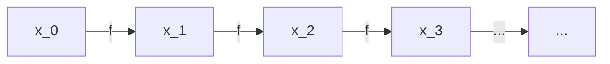
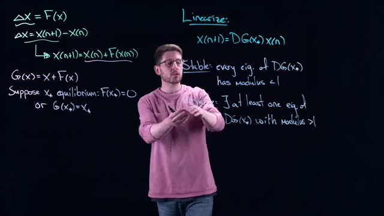
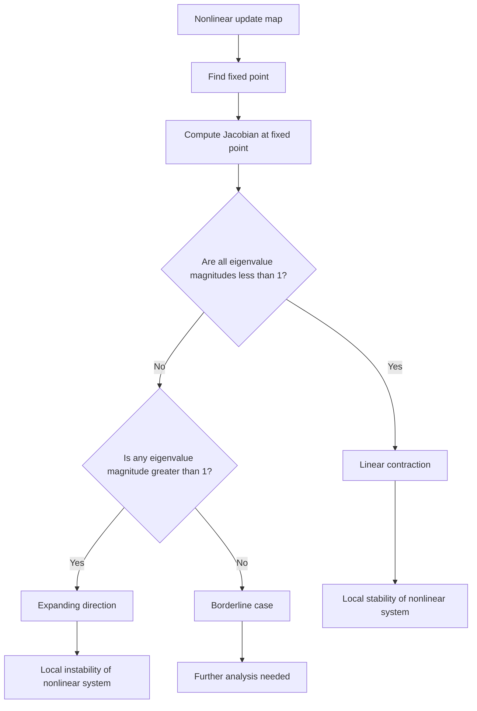

# Analysis of Discrete-Time Dynamical Systems: Stability via Linearization
> **Source:** [Analysis of Discrete-Time Dynamical Systems - Math Modelling - Lecture 19](https://www.youtube.com/watch?v=6It02qpjHQ8) by Math Modelling · 08:14 · Training document generated from the video.
**How to use this document:** read it top to bottom in place of watching the video. Screenshots appear exactly where the video depends on something visual, with links that jump to that moment. Questions at the end of each section confirm you learned the material. The glossary and footnotes add definitions and detail the video assumes you already have.
**Who this is for:** This course is for undergraduate or graduate students in mathematical modeling, applied mathematics, or engineering who need to understand stability analysis of discrete-time dynamical systems.
## Learning objectives

After working through this document you can:

1. Define a discrete-time dynamical system using a difference equation $X_{n+1} = G(X_n)$.
2. Identify equilibrium points of a discrete-time system from the conditions $F(X^*) = 0$ or $G(X^*) = X^*$.
3. Linearize a discrete-time system around an equilibrium by computing the Jacobian matrix $DG(X^*)$.
4. State the stability condition for a linearized discrete system: all eigenvalues of $DG(X^*)$ have modulus less than 1.
5. State the instability condition: at least one eigenvalue has modulus greater than 1.
6. Explain why the stable manifold theorem guarantees that local stability of the linearized system implies local stability of the nonlinear system.
7. Contrast the stability region for discrete-time systems (unit circle in the complex plane) with that for continuous-time systems (left half-plane).
8. Describe the Hartman-Grobman theorem for discrete systems: near an equilibrium, the nonlinear system is homeomorphic to its linearization.
## Prerequisites

- Basic calculus: differentiation, Taylor series expansion.
- Linear algebra: eigenvalues, eigenvectors, Jacobian matrix.
- Familiarity with continuous-time dynamical systems and their stability criteria (optional but helpful).
## Introduction and Definition of Discrete-Time Dynamical Systems

In the previous lessons, we focused on continuous-time dynamical systems, where time flows continuously and the state evolves according to differential equations. That emphasis was not because the theory applies only to continuous-time systems. In fact, every concept we have discussed, including stability, equilibria, and linearization, has a direct analog in discrete-time systems. This section introduces the discrete-time framework and establishes the notation we will use throughout the rest of the course.

### What Is a Discrete-Time Dynamical System?

A discrete-time dynamical system describes how a state variable changes in distinct, separate time steps, rather than continuously. The time variable takes integer values, such as $n = 0, 1, 2, \dots$, and the state at step $n$ is denoted by $\mathbf{x}_n$.

The general form of a discrete-time dynamical system is:

$$
\mathbf{x}_{n+1} = f(\mathbf{x}_n) \tag{1}
$$

Here:
- $\mathbf{x}_n$ is the state vector at time step $n$.
- $\mathbf{x}_{n+1}$ is the state vector at the next time step.
- $f$ is a function that maps the current state to the next state.

This equation is often called a **difference equation** or a **map**. It tells us that the next state depends only on the current state, not on the entire history. This property is called the **Markov property** (added context: this is a standard assumption in discrete-time dynamical systems, and it means the system is memoryless in the sense that all relevant information is contained in the current state).

### Expanding the Notation

The compact form in equation (1) is useful, but in practice we often expand it to make the dependence on the current state explicit. We write:

$$
\mathbf{x}_{n+1} = f(\mathbf{x}_n), \quad n = 0, 1, 2, \dots \tag{2}
$$

This makes it clear that we start from an initial condition $\mathbf{x}_0$ and then iterate the map forward. For example, if we know $\mathbf{x}_0$, we compute $\mathbf{x}_1 = f(\mathbf{x}_0)$, then $\mathbf{x}_2 = f(\mathbf{x}_1)$, and so on.

If the state is a scalar (a single number), we write $x_n$ instead of $\mathbf{x}_n$, and the system becomes:

$$
x_{n+1} = f(x_n) \tag{3}
$$

If the state is a vector in $\mathbb{R}^m$, then $f$ maps $\mathbb{R}^m$ to $\mathbb{R}^m$, and we write:

$$
\mathbf{x}_{n+1} = f(\mathbf{x}_n), \quad \mathbf{x}_n \in \mathbb{R}^m \tag{4}
$$

### Why This Matters

The purpose of this short lecture is to catch up on the discrete-time analog of everything we have already studied for continuous-time systems. In continuous time, we wrote $\dot{\mathbf{x}} = f(\mathbf{x})$, where $\dot{\mathbf{x}} = \frac{d\mathbf{x}}{dt}$. In discrete time, the derivative is replaced by a difference, and the differential equation is replaced by a difference equation. The same questions apply: where are the equilibria, are they stable, and how does the system behave near them?

### Relationship Between Continuous and Discrete Time

The table below summarizes the correspondence between the two frameworks:

| Continuous time | Discrete time |
|-----------------|---------------|
| Time variable $t \in \mathbb{R}$ | Time index $n \in \mathbb{N}$ |
| State $\mathbf{x}(t)$ | State $\mathbf{x}_n$ |
| Differential equation $\dot{\mathbf{x}} = f(\mathbf{x})$ | Difference equation $\mathbf{x}_{n+1} = f(\mathbf{x}_n)$ |
| Derivative $\frac{d\mathbf{x}}{dt}$ | Difference $\mathbf{x}_{n+1} - \mathbf{x}_n$ |
| Solution is a trajectory $\mathbf{x}(t)$ | Solution is a sequence $\{\mathbf{x}_0, \mathbf{x}_1, \mathbf{x}_2, \dots\}$ |

### Flow of the System

The evolution of a discrete-time system can be visualized as a sequence of states connected by the map $f$. The following diagram shows the flow for a scalar system:



Each arrow represents one application of the function $f$. The sequence $\mathbf{x}_0, \mathbf{x}_1, \mathbf{x}_2, \dots$ is called the **orbit** or **trajectory** of the system starting from $\mathbf{x}_0$.

### Key Terminology

- **State variable**: the quantity that describes the system at a given time step, denoted $\mathbf{x}_n$.
- **Map**: the function $f$ that defines the transition from one state to the next.
- **Difference equation**: an equation of the form $\mathbf{x}_{n+1} = f(\mathbf{x}_n)$.
- **Orbit**: the sequence of states generated by iterating the map from an initial condition.
- **Initial condition**: the state at time step $n = 0$, denoted $\mathbf{x}_0$.

### Check your understanding

1. What is the general form of a discrete-time dynamical system, and what does each symbol represent?

<details><summary>Answer</summary>
The general form is $\mathbf{x}_{n+1} = f(\mathbf{x}_n)$, where $\mathbf{x}_n$ is the state at time step $n$, $\mathbf{x}_{n+1}$ is the state at the next time step, and $f$ is the map that defines the transition.
</details>

2. How does a discrete-time system differ from a continuous-time system in terms of the time variable and the type of equation used?

<details><summary>Answer</summary>
In continuous time, the time variable $t$ is real-valued and the system is described by a differential equation $\dot{\mathbf{x}} = f(\mathbf{x})$. In discrete time, the time index $n$ is an integer and the system is described by a difference equation $\mathbf{x}_{n+1} = f(\mathbf{x}_n)$.
</details>

3. If $\mathbf{x}_0 = 1$ and $f(x) = 2x$, what is $\mathbf{x}_2$?

<details><summary>Answer</summary>
$\mathbf{x}_1 = f(1) = 2$, then $\mathbf{x}_2 = f(2) = 4$. So $\mathbf{x}_2 = 4$.
</details>

4. What is the orbit of a discrete-time system?

<details><summary>Answer</summary>
The orbit is the sequence of states $\{\mathbf{x}_0, \mathbf{x}_1, \mathbf{x}_2, \dots\}$ generated by repeatedly applying the map $f$ starting from the initial condition $\mathbf{x}_0$.
</details>
## Examples and the Update Function G

In this section, you will learn how discrete-time dynamical systems are expressed through an update function, and how to identify fixed points in this framework.

### From Change to the Update Function

Recall that the change in a discrete-time system is defined as the difference between the next state and the current state. This change is written as $\Delta X$ and is given by the function $F(X)$.


*[01:00](https://www.youtube.com/watch?v=6It02qpjHQ8&t=60s) The whiteboard shows mathematical equations for delta X and X(n+1).*


The whiteboard shows the fundamental relationship:

$$
\Delta X = F(x)
$$

But $\Delta X$ is also defined as the difference between successive states:

$$
\Delta X = X_{n+1} - X_n
$$

Setting these two expressions equal gives the difference equation:

$$
X_{n+1} = X_n + F(X_n) \tag{1}
$$

This equation means: if you know the current state $X_n$, you can compute the next state $X_{n+1}$ by adding the change $F(X_n)$.

### Examples of Discrete-Time Systems

The transcript mentions several real-world examples that follow this pattern:

1. **Newton's method**: An iterative root-finding algorithm where each step updates an approximation.
2. **Gradient descent**: An optimization algorithm that moves parameters in the direction of steepest descent.
3. **Yeast population models**: Biological systems where population size at one time step determines the population at the next time step.

All of these are discrete-time dynamical systems because they use the rule "what you do next depends on what you are doing now."

### Defining the Update Function G

The function $G$ is defined as the entire right-hand side of equation (1):

$$
G(X) = X + F(X) \tag{2}
$$

This is called the **update function** (added context: it maps the current state directly to the next state). Using $G$, the system can be written compactly as:

$$
X_{n+1} = G(X_n)
$$

### Fixed Points and Equilibrium

A **fixed point** (also called an equilibrium) is a state $X^*$ that does not change from one step to the next. For a fixed point, two equivalent conditions hold:

1. **No change condition**: $F(X^*) = 0$
   - This means there is zero change from step to step.
   - The current state and the next state are identical.

2. **Update function condition**: $G(X^*) = X^*$
   - This means applying the update function to the fixed point returns the same value.
   - This is the discrete-time analog of an equilibrium in continuous systems.

These two conditions are equivalent because if $F(X^*) = 0$, then:

$$
G(X^*) = X^* + F(X^*) = X^* + 0 = X^*
$$

### Linearization Around Fixed Points

Just as with continuous dynamical systems, you can analyze stability by linearizing around a fixed point. The process involves:

1. Finding $X^*$ such that $F(X^*) = 0$ (or equivalently $G(X^*) = X^*$).
2. Computing the derivative of $G$ at $X^*$, denoted $G'(X^*)$.
3. Examining the magnitude of $G'(X^*)$ to determine stability.

The relationship between $G$ and $F$ means that linearizing $G$ is analogous to linearizing $F$ in continuous systems, but with different stability criteria (added context: in discrete systems, stability depends on $|G'(X^*)| < 1$, while in continuous systems it depends on the sign of the real part of eigenvalues).

### Check your understanding

1. **Question**: If $F(X) = 2X - 4$, what is the update function $G(X)$? Find the fixed point $X^*$.

<details><summary>Answer</summary>
$G(X) = X + F(X) = X + (2X - 4) = 3X - 4$.

To find the fixed point, set $F(X^*) = 0$: $2X^* - 4 = 0$, so $X^* = 2$.

Alternatively, set $G(X^*) = X^*$: $3X^* - 4 = X^*$, so $2X^* = 4$, giving $X^* = 2$.
</details>

2. **Question**: Explain why $F(X^*) = 0$ and $G(X^*) = X^*$ are equivalent conditions for a fixed point.

<details><summary>Answer</summary>
If $F(X^*) = 0$, then $G(X^*) = X^* + F(X^*) = X^* + 0 = X^*$. Conversely, if $G(X^*) = X^*$, then $X^* + F(X^*) = X^*$, which implies $F(X^*) = 0$. Both conditions describe the same situation: the state does not change from one step to the next.
</details>

3. **Question**: In the context of a yeast population model, what does $F(X) = 0$ mean biologically?

<details><summary>Answer</summary>
$F(X) = 0$ means there is no change in the population size from one time step to the next. This occurs when the population has reached a stable size where births and deaths (or other factors) balance exactly, so the population remains constant over time.
</details>
## Equilibrium Conditions and Linearization

In discrete-time dynamical systems, the state evolves step by step. Two equivalent forms are used to describe this evolution. The first uses the change in state:

$$
\Delta \mathbf{x} = \mathbf{F}(\mathbf{x})
$$

where $\Delta \mathbf{x} = \mathbf{x}_{n+1} - \mathbf{x}_n$. The second is an update equation:

$$
\mathbf{x}_{n+1} = \mathbf{G}(\mathbf{x}_n)
$$

These two forms are linked by the relation $\mathbf{G}(\mathbf{x}) = \mathbf{x} + \mathbf{F}(\mathbf{x})$. The update form $\mathbf{x}_{n+1} = \mathbf{G}(\mathbf{x}_n)$ is more common in practice because it appears in algorithms such as Newton’s method, gradient descent, and Euler’s method (which is covered in a later video).


*[02:40](https://www.youtube.com/watch?v=6It02qpjHQ8&t=160s) The whiteboard displays equations for delta X, X(n+1), G(x), and conditions for equilibrium.*

```
ΔX = F(x)
ΔX = X(n+1) - X(n)
X(n+1) = X(n) + F(X(n))
G(x) = X + F(x)
Suppose X* equilibrium: F(X*)=0
or G(X*)=X*
```

### Equilibrium Conditions

An **equilibrium point** $\mathbf{x}^*$ is a state that does not change under the dynamics. For the discrete system, this means the state remains at $\mathbf{x}^*$ once it is reached. There are two equivalent conditions:

1. **From the change equation:**  
   $$
   \mathbf{F}(\mathbf{x}^*) = 0
   $$
   because the change $\Delta \mathbf{x}$ must be zero at equilibrium.

2. **From the update equation:**  
   $$
   \mathbf{G}(\mathbf{x}^*) = \mathbf{x}^*
   $$
   because applying the update to $\mathbf{x}^*$ must return the same state.

Both conditions describe the same property. The condition $\mathbf{G}(\mathbf{x}^*) = \mathbf{x}^*$ is often the starting point for linearization because the Jacobian of $\mathbf{G}$ directly appears in the linearized dynamics.

### Linearization

Linearization approximates the nonlinear system near an equilibrium point using a first-order Taylor expansion. For the update equation $\mathbf{x}_{n+1} = \mathbf{G}(\mathbf{x}_n)$, we expand around $\mathbf{x}^*$:

$$
\mathbf{x}_{n+1} \approx \mathbf{G}(\mathbf{x}^*) + D\mathbf{G}(\mathbf{x}^*) (\mathbf{x}_n - \mathbf{x}^*)
$$

Since $\mathbf{G}(\mathbf{x}^*) = \mathbf{x}^*$, the constant term is exactly $\mathbf{x}^*$. Let $\mathbf{y}_n = \mathbf{x}_n - \mathbf{x}^*$ be the deviation from equilibrium. The linearized dynamics become:

$$
\mathbf{y}_{n+1} = D\mathbf{G}(\mathbf{x}^*) \, \mathbf{y}_n
$$

Here, $D\mathbf{G}(\mathbf{x}^*)$ is the **Jacobian matrix** of $\mathbf{G}$ evaluated at $\mathbf{x}^*$. The Jacobian is a matrix of first partial derivatives:

$$
\left[ D\mathbf{G}(\mathbf{x}^*) \right]_{ij} = \frac{\partial G_i}{\partial x_j}(\mathbf{x}^*)
$$


*[03:40](https://www.youtube.com/watch?v=6It02qpjHQ8&t=220s) Mathematical equations for linearization and equilibrium are written on a whiteboard, including ΔX = F(x) and X(n+1) = DG(x₀)x(n).*

```
ΔX = F(x)
ΔX = X(n+1) - X(n)
X(n+1) = X(n) + F(X(n))
G(x) = X + F(x)
Suppose X* equilibrium: F(x*) = 0
or G(x*) = X*
Linearize:
X(n+1) = DG(x₀) X(n)
```

Note: The linearization uses the Jacobian of $\mathbf{G}$, not of $\mathbf{F}$. This is because the update equation $\mathbf{x}_{n+1} = \mathbf{G}(\mathbf{x}_n)$ is the natural form for describing the discrete evolution. The linearized system is a linear dynamical system whose behavior is completely determined by the eigenvalues of $D\mathbf{G}(\mathbf{x}^*)$.

### Stability Criterion

The stability of the original nonlinear equilibrium $\mathbf{x}^*$ is determined by the eigenvalues of the Jacobian matrix $D\mathbf{G}(\mathbf{x}^*)$. The condition for stability is:

**Every eigenvalue $\lambda$ of $D\mathbf{G}(\mathbf{x}^*)$ must have modulus less than 1.**

$$
\text{Stable: } |\lambda| < 1 \quad \text{for all eigenvalues } \lambda
$$


*[04:20](https://www.youtube.com/watch?v=6It02qpjHQ8&t=260s) The whiteboard displays mathematical equations for linearization, including definitions for ΔX, G(x), and conditions for equilibrium, along with the stability criterion for DG(x*).*

```
ΔX = F(x)
ΔX = X(n+1) - X(n)
X(n+1) = X(n) + F(x(n))
G(x) = X + F(x)
Suppose X* equilibrium: F(x*) = 0
or G(x*) = X*
Linearize:
X(n+1) = DG(x*) X(n)
Stable: every eig. of DG(x*)
has modulus < 1
```

The **modulus** (or absolute value) of a complex eigenvalue $\lambda = a + bi$ is:

$$
|\lambda| = \sqrt{a^2 + b^2}
$$

This is the Euclidean norm of the complex number. Because eigenvalues can be complex (they may appear as complex conjugate pairs), the modulus determines whether the eigenvalue lies inside the unit circle in the complex plane. The unit circle is the set of all complex numbers whose modulus is 1. The condition $|\lambda| < 1$ means all eigenvalues lie strictly inside the unit circle.

**Why this works:** The Jacobian matrix $D\mathbf{G}(\mathbf{x}^*)$ acts as a **contraction** when all its eigenvalues have modulus less than 1. In the linearized system, each iteration multiplies the state by this matrix, so the norm of the state shrinks with each step. Formally, for any initial deviation $\mathbf{y}_0$,

$$
\|\mathbf{y}_n\| \to 0 \quad \text{as } n \to \infty
$$

because the linear map is a contraction. This contraction property is inherited by the full nonlinear system near the equilibrium point, thanks to the **stable manifold theorem** (also known as the Hartman-Grobman theorem for discrete maps). The theorem states that if the linearization is a contraction (i.e., all eigenvalues modulus < 1), then the nonlinear system behaves like a contraction in a neighborhood of the equilibrium. The key is that the Taylor expansion used in linearization is valid locally: the higher-order terms are small when the state is close to $\mathbf{x}^*$, so the linear dynamics dominate.

### Summary of Key Concepts

| Concept | Definition |
|---------|------------|
| Equilibrium point | State $\mathbf{x}^*$ such that $\mathbf{G}(\mathbf{x}^*) = \mathbf{x}^*$ (or $\mathbf{F}(\mathbf{x}^*) = 0$). |
| Jacobian matrix $D\mathbf{G}(\mathbf{x}^*)$ | Matrix of first partial derivatives of $\mathbf{G}$ evaluated at $\mathbf{x}^*$. |
| Modulus of eigenvalue | For $\lambda = a+bi$, $|\lambda| = \sqrt{a^2 + b^2}$. |
| Contraction | A map that reduces the distance between points; here, the linear map $\mathbf{y} \mapsto D\mathbf{G}(\mathbf{x}^*)\mathbf{y}$ contracts if all eigenvalues have modulus < 1. |
| Stable manifold theorem | For a discrete dynamical system, if the linearization at an equilibrium is a contraction, then locally the nonlinear system is also a contraction. |

### Check Your Understanding

1. **Question:** A discrete system is given by $\mathbf{x}_{n+1} = \mathbf{G}(\mathbf{x}_n)$. You compute the Jacobian at an equilibrium and find eigenvalues $0.5$ and $1.2$. Is the equilibrium stable?  
   <details><summary>Answer</summary>  
   No. The eigenvalue $1.2$ has modulus $1.2 > 1$, so the linearized system is not a contraction. The equilibrium is unstable.
   </details>

2. **Question:** Why is the modulus used for complex eigenvalues instead of just the real part?  
   <details><summary>Answer</summary>  
   Eigenvalues can be complex numbers. The modulus (absolute value) captures the overall magnitude of the eigenvalue, which determines whether the iterates grow or shrink. The real part alone does not give the correct scaling; for example, an eigenvalue $0 + 0.9i$ has modulus $0.9$ (contraction) but real part $0$ (which would incorrectly suggest no growth).
   </details>

3. **Question:** In the linearization step, why do we compute the Jacobian of $\mathbf{G}$ rather than of $\mathbf{F}$?  
   <details><summary>Answer</summary>  
   The discrete dynamics are naturally expressed as $\mathbf{x}_{n+1} = \mathbf{G}(\mathbf{x}_n)$. The linearization of this update equation around an equilibrium gives $\mathbf{y}_{n+1} = D\mathbf{G}(\mathbf{x}^*)\mathbf{y}_n$. The Jacobian of $\mathbf{F}$ would appear if we linearized the change equation $\Delta \mathbf{x} = \mathbf{F}(\mathbf{x})$, but that would lead to a different form (continuous-time style). In the discrete setting, using $\mathbf{G}$ is more direct and matches the standard analysis for Newton’s method, gradient descent, etc.
   </details>

4. **Question:** What does the stable manifold theorem guarantee for a discrete system with a linearization that is a contraction?  
   <details><summary>Answer</summary>  
   It guarantees that locally, near the equilibrium, the fully nonlinear system behaves like a contraction. That is, if you start sufficiently close to the equilibrium, the nonlinear dynamics will converge to it, just as the linearized system converges to zero.
   </details>
## Stability Criterion for Discrete-Time Systems

This section teaches you how to determine the stability of an equilibrium in a discrete‑time dynamical system by linearizing the system and checking the eigenvalues of the Jacobian matrix. The procedure is nearly identical to the continuous‑time case, with one critical difference: the region of stable eigenvalues.

### Linearization of a Discrete‑Time System

Consider a discrete‑time dynamical system written either as a difference equation or a map:

$$
\Delta x = F(x) \qquad \text{where} \qquad \Delta x = x_{n+1} - x_n
$$

or equivalently

$$
x_{n+1} = G(x_n) \qquad \text{with} \qquad G(x) = x + F(x).
$$

An **equilibrium** $x^*$ satisfies $F(x^*) = 0$ or, for the map form, $G(x^*) = x^*$.

To study the behavior near $x^*$, linearize the map $G$ around $x^*$. Let $\delta_n = x_n - x^*$ be a small perturbation. Then, to first order,

$$
\delta_{n+1} = DG(x^*) \,\delta_n,
$$

where $DG(x^*)$ is the Jacobian matrix of $G$ evaluated at $x^*$. This linear system approximates the original nonlinear dynamics when the perturbation is small.



*[06:20](https://www.youtube.com/watch?v=6It02qpjHQ8&t=380s) The whiteboard shows equations for linearizing a system, defining equilibrium, and conditions for stability and instability based on eigenvalues.*


The whiteboard shows the definitions above and introduces the matrix $DG(x^*)$.

### Stability Criterion Based on Eigenvalues

The stability of the linearized system (and, under appropriate conditions, of the nonlinear system near the equilibrium) is determined by the **modulus** (absolute value) of the eigenvalues of $DG(x^*)$.

- **Stable equilibrium:** every eigenvalue $\lambda$ of $DG(x^*)$ satisfies $|\lambda| < 1$.
- **Unstable equilibrium:** there exists at least one eigenvalue $\lambda$ with $|\lambda| > 1$.

If every eigenvalue lies strictly inside the unit circle in the complex plane, the linearized system is a **contraction**: successive powers of the matrix shrink any initial deviation, and the equilibrium is stable. If one or more eigenvalues lie outside the unit circle, the corresponding direction is **expanding**; perturbations in that direction grow, making the equilibrium unstable.


*[06:40](https://www.youtube.com/watch?v=6It02qpjHQ8&t=400s) This frame shows mathematical equations for linearizing a system, defining stable and unstable conditions based on the modulus of eigenvalues.*


The whiteboard repeats the stability condition and explicitly states the unstable condition: “Unstable: ∃ at least one eig. of DG(x*) with modulus > 1.”

The reasoning is as follows. For a single eigenvalue $\lambda$, the evolution of an eigenvector component is multiplied by $\lambda^n$. If $|\lambda| > 1$, $|\lambda|^n \to \infty$ as $n \to \infty$; that dimension expands. The speaker emphasizes: “If you started close to this thing, then you would expect to be pushed away due to this instability.”

### Comparison with Continuous‑Time Systems

The entire approach mirrors the analysis of continuous‑time systems. The **Stable Manifold Theorem** applies here as well: if the linearized system is stable (all eigenvalues inside unit circle), then the nonlinear system is also stable near the equilibrium. Similarly, if the linearized system is unstable, the nonlinear system is unstable.

The crucial difference is **where the eigenvalues must lie**:

| System type          | Stability region in the complex plane                     |
|----------------------|-----------------------------------------------------------|
| Continuous‑time      | Left half‑plane: $\operatorname{Re}(\lambda) < 0$         |
| Discrete‑time        | Inside the unit circle: $|\lambda| < 1$                   |

The speaker warns: “This is typically the thing that messes people up the most. But if you can remember that piece of it, everything else is the same.”


*[07:40](https://www.youtube.com/watch?v=6It02qpjHQ8&t=460s) The whiteboard displays equations for linearizing a system, defining equilibrium, and conditions for stability and instability based on the modulus of eigenvalues.*


The whiteboard again shows the same linearization equations and stability conditions, reinforcing the key point.

### Hartman‑Grobman Theorem for Discrete‑Time Systems

The **Hartman‑Grobman theorem** guarantees that, near a hyperbolic equilibrium (where no eigenvalue lies exactly on the unit circle), the nonlinear discrete‑time system is **topologically conjugate** to its linearization. That is, there exists a homeomorphism (a continuous, one‑to‑one, onto map with a continuous inverse) that takes orbits of the nonlinear system to orbits of the linear system. The speaker says: “It might be just bent or deformed a little bit, but it has the same basic structure.”

This theorem ensures that stability conclusions drawn from the linearized system are valid for the original nonlinear system in a neighborhood of the equilibrium.

### Summary of the Workflow

```mermaid
graph TD
    A[Find equilibrium x*] --> B[Compute Jacobian DG(x*)]
    B --> C[Calculate eigenvalues of DG(x*)]
    C --> D{All |λ| < 1?}
    D -->|Yes| E[Stable equilibrium]
    D -->|No| F{At least one |λ| > 1?}
    F -->|Yes| G[Unstable equilibrium]
    F -->|No| H[Non‑hyperbolic: linearization inconclusive]
```

In this course we focus on the stable and unstable cases; non‑hyperbolic equilibria require further analysis.

### Check Your Understanding

1.  **State the condition for a discrete‑time linearized system to be stable.**  
    <details><summary>Answer</summary>  
    All eigenvalues $\lambda$ of the Jacobian matrix $DG(x^*)$ must satisfy $|\lambda| < 1$ (strictly inside the unit circle).  
    </details>

2.  **How does the stability condition for discrete‑time systems differ from that for continuous‑time systems?**  
    <details><summary>Answer</summary>  
    For continuous‑time systems, every eigenvalue must have a negative real part (left half‑plane: $\operatorname{Re}(\lambda) < 0$). For discrete‑time systems, every eigenvalue must satisfy $|\lambda| < 1$ (inside the unit circle).  
    </details>

3.  **Given the Jacobian matrix $DG(x^*) = \begin{pmatrix} 0.5 & 0 \\ 0 & 1.2 \end{pmatrix}$, classify the equilibrium.**  
    <details><summary>Answer</summary>  
    Eigenvalues: $\lambda_1 = 0.5$ ( $|0.5| < 1$ ) and $\lambda_2 = 1.2$ ( $|1.2| > 1$ ). Since at least one eigenvalue has modulus greater than 1, the equilibrium is **unstable**.  
    </details>

4.  **What does the Hartman‑Grobman theorem guarantee for a discrete‑time system near a hyperbolic equilibrium?**  
    <details><summary>Answer</summary>  
    It guarantees that the nonlinear system is topologically conjugate (homeomorphic) to its linearization. In particular, the stability or instability of the linearized system is preserved in the nonlinear system near the equilibrium.  
    </details>
## Instability and Comparison with Continuous-Time Systems

This section extends the stability analysis you have learned for continuous-time dynamical systems to discrete-time systems. The core ideas are the same: linearize around an equilibrium and examine eigenvalues. The critical difference is the region of the complex plane that corresponds to stability.

### Discrete-Time Dynamical Systems

A discrete-time dynamical system describes how a state variable $\mathbf{x}$ changes from one time step to the next. The general form is

$$
\mathbf{x}_{n+1} = G(\mathbf{x}_n),
$$

where $G$ is a (possibly nonlinear) function. This is called a **difference equation** or an **update equation**. Common examples include Newton’s method for root finding, gradient descent in optimization, and population models such as the logistic map.

The change in the state from step $n$ to step $n+1$ is often written as

$$
\Delta \mathbf{x}_n = \mathbf{x}_{n+1} - \mathbf{x}_n = F(\mathbf{x}_n),
$$

so that $G(\mathbf{x}) = \mathbf{x} + F(\mathbf{x})$. Both representations are equivalent.

### Equilibria (Fixed Points)

An **equilibrium** (or **fixed point**) $\mathbf{x}^*$ satisfies

$$
\mathbf{x}_{n+1} = \mathbf{x}_n = \mathbf{x}^*.
$$

In terms of $F$, this means $F(\mathbf{x}^*) = \mathbf{0}$ (no change). In terms of $G$, it means $G(\mathbf{x}^*) = \mathbf{x}^*$ (the update leaves the state unchanged). Both conditions are equivalent.

### Linearization Around an Equilibrium

To analyze the local behavior near $\mathbf{x}^*$, we linearize the update equation. Compute the **Jacobian matrix** of $G$ evaluated at $\mathbf{x}^*$:

$$
DG(\mathbf{x}^*) = \left. \frac{\partial G}{\partial \mathbf{x}} \right|_{\mathbf{x} = \mathbf{x}^*}.
$$

The linearized system is

$$
\mathbf{y}_{n+1} = DG(\mathbf{x}^*) \, \mathbf{y}_n,
$$

where $\mathbf{y}_n = \mathbf{x}_n - \mathbf{x}^*$ is the deviation from equilibrium. This is a linear discrete-time dynamical system.

### Stability Condition for Discrete-Time Systems

The dynamics of the linearized system are determined by the eigenvalues of $DG(\mathbf{x}^*)$. Let $\lambda$ be an eigenvalue.

- **Stability**: The equilibrium $\mathbf{x}^*$ is **locally asymptotically stable** if **every** eigenvalue $\lambda$ satisfies

  $$
  |\lambda| < 1.
  $$

  Here $|\lambda|$ denotes the modulus (absolute value) of a complex number: $|\lambda| = \sqrt{(\Re \lambda)^2 + (\Im \lambda)^2}$. This condition means all eigenvalues lie strictly inside the **unit circle** in the complex plane.

  Why? Because the linear system contracts: each iteration multiplies the deviation by $\lambda$, so $|\lambda| < 1$ causes the deviation to shrink to zero as $n \to \infty$. The Jacobian matrix acts as a **contraction**.

- **Instability**: The equilibrium is **unstable** if **at least one** eigenvalue satisfies

  $$
  |\lambda| > 1.
  $$

  That eigenvalue, when raised to successive powers, grows in magnitude. The corresponding direction in state space is **expanding**, so small deviations are amplified and the system moves away from the equilibrium.

If all eigenvalues satisfy $|\lambda| = 1$ (the borderline case), the linearization does not determine stability; higher-order terms matter.

### Comparison with Continuous-Time Systems

In continuous-time systems, the linearization is $\dot{\mathbf{y}} = A \mathbf{y}$ where $A = DF(\mathbf{x}^*)$. Stability requires all eigenvalues of $A$ to have **negative real parts** (i.e., lie in the **left half-plane**). The table below summarizes the key differences.

| Property | Continuous-Time | Discrete-Time |
|----------|----------------|---------------|
| System form | $\dot{\mathbf{x}} = F(\mathbf{x})$ | $\mathbf{x}_{n+1} = G(\mathbf{x}_n)$ |
| Linearization matrix | $A = DF(\mathbf{x}^*)$ | $DG(\mathbf{x}^*)$ |
| Stability region in complex plane | Left half-plane: $\Re(\lambda) < 0$ | Unit disk: $|\lambda| < 1$ |
| Instability condition | At least one $\Re(\lambda) > 0$ | At least one $|\lambda| > 1$ |
| Borderline case | $\Re(\lambda) = 0$ (center manifold) | $|\lambda| = 1$ (Neutral) |

The underlying logic is identical: linearize, compute eigenvalues, and check the appropriate region. The only difference is the region itself.

### The Stable Manifold Theorem and Hartman-Grobman Theorem for Discrete-Time

The same theorems that justify linearization in continuous time apply to discrete-time systems.

- **Stable Manifold Theorem**: If the linearized system is a contraction (all eigenvalues with $|\lambda| < 1$), then the nonlinear system is locally contracting near the equilibrium. That is, there exists a neighborhood of $\mathbf{x}^*$ such that any trajectory starting in that neighborhood converges to $\mathbf{x}^*$. Conversely, if the linearized system has an expanding direction (an eigenvalue with $|\lambda| > 1$), then the nonlinear system has an unstable manifold: trajectories starting near $\mathbf{x}^*$ are pushed away along that direction.

- **Hartman-Grobman Theorem**: Near a hyperbolic equilibrium (one where no eigenvalue lies on the unit circle), the nonlinear system is **topologically conjugate** to its linearization. This means there exists a continuous, invertible transformation (a homeomorphism) that maps trajectories of the nonlinear system to those of the linear system. The local phase portrait is qualitatively the same, though it may be bent or deformed.

### Summary of the Procedure

1. Write the discrete-time system as $\mathbf{x}_{n+1} = G(\mathbf{x}_n)$.
2. Find equilibria by solving $G(\mathbf{x}^*) = \mathbf{x}^*$ (or $F(\mathbf{x}^*) = \mathbf{0}$).
3. Compute the Jacobian matrix $DG(\mathbf{x}^*)$.
4. Calculate the eigenvalues of $DG(\mathbf{x}^*)$.
5. Apply the stability condition:
   - All $|\lambda| < 1$ → locally asymptotically stable.
   - At least one $|\lambda| > 1$ → unstable.
   - All $|\lambda| = 1$ (or some on the unit circle) → linearization inconclusive.

The following diagram illustrates the flow of the analysis.

```mermaid
flowchart TD
    A[Discrete-time system: x_{n+1} = G(x_n)] --> B[Find equilibrium x*: G(x*) = x*]
    B --> C[Compute Jacobian DG(x*)]
    C --> D[Compute eigenvalues λ of DG(x*)]
    D --> E{All |λ| < 1?}
    E -->|Yes| F[Locally asymptotically stable]
    E -->|No| G{Any |λ| > 1?}
    G -->|Yes| H[Unstable]
    G -->|No| I[Borderline: linearization inconclusive]
```

### Check Your Understanding

1. **Question**: For a discrete-time system, the equilibrium is stable if all eigenvalues of the linearized Jacobian satisfy $|\lambda| < 1$. How does this condition differ from the continuous-time stability condition?

<details><summary>Answer</summary>
In continuous-time systems, stability requires all eigenvalues to have negative real parts ($\Re(\lambda) < 0$), which corresponds to the left half-plane. In discrete-time, the condition is that all eigenvalues lie inside the unit circle ($|\lambda| < 1$). The underlying logic of linearization is the same, but the region of stability in the complex plane is different.
</details>

2. **Question**: Suppose you linearize a discrete-time system around an equilibrium and find eigenvalues $\lambda_1 = 0.5$, $\lambda_2 = -0.8$, and $\lambda_3 = 1.2$. Is the equilibrium stable, unstable, or borderline?

<details><summary>Answer</summary>
Unstable. Although $\lambda_1$ and $\lambda_2$ have modulus less than 1, $\lambda_3$ has modulus $1.2 > 1$. The presence of at least one eigenvalue with modulus greater than 1 makes the equilibrium unstable.
</details>

3. **Question**: Explain in your own words why the Hartman-Grobman theorem justifies using linearization to determine local stability for discrete-time systems.

<details><summary>Answer</summary>
The Hartman-Grobman theorem states that near a hyperbolic equilibrium (one with no eigenvalues on the unit circle), the nonlinear system is topologically equivalent to its linearization. This means the local phase portrait (including stability properties) is the same up to a continuous deformation. Therefore, if the linearized system is stable (all eigenvalues inside the unit circle), the nonlinear system is also locally stable.
</details>

4. **Question**: A discrete-time system is given by $x_{n+1} = x_n^2$. Find the equilibria and determine their stability using linearization.

<details><summary>Answer</summary>
Equilibria satisfy $x^* = (x^*)^2$, so $x^* = 0$ or $x^* = 1$. The update function is $G(x) = x^2$, so $G'(x) = 2x$. At $x^* = 0$, $G'(0) = 0$, eigenvalue $0$ (modulus $0 < 1$) → stable. At $x^* = 1$, $G'(1) = 2$, eigenvalue $2$ (modulus $2 > 1$) → unstable. (Note: $x^*=1$ is a fixed point because $1^2 = 1$.)
</details>
## Hartman-Grobman Theorem and Summary

This section transfers the stability theory you already know from continuous-time dynamical systems to discrete-time dynamical systems. The main conclusion is that the same linearization process works, but the stability condition changes from the left half-plane to the unit circle.

### From continuous-time systems to difference equations

A continuous-time dynamical system is often written as

$$
\dot{\mathbf{x}} = \mathbf{f}(\mathbf{x}).
$$

For discrete time, the natural analogue is written in terms of the change in the state vector from one step to the next:

$$
\Delta \mathbf{x}_n = \mathbf{x}_{n+1} - \mathbf{x}_n = \mathbf{f}(\mathbf{x}_n).
$$

This means that if you know the current state, you know the next state. Opening up the change gives a difference equation:

$$
\mathbf{x}_{n+1} = \mathbf{x}_n + \mathbf{f}(\mathbf{x}_n).
$$

It is standard to call the whole right-hand side the update map. Define

$$
\mathbf{g}(\mathbf{x}) = \mathbf{x} + \mathbf{f}(\mathbf{x}).
$$

Then the discrete-time system becomes

$$
\mathbf{x}_{n+1} = \mathbf{g}(\mathbf{x}_n). \tag{1}
$$

Examples include Newton's method, gradient descent, Euler's method, and discrete population models such as yeast populations.

### Fixed points and equilibria

Let $\mathbf{x}^*$ be an equilibrium, also called a fixed point. For the original formulation, an equilibrium satisfies

$$
\mathbf{f}(\mathbf{x}^*) = \mathbf{0}.
$$

This means there is no change from step to step. Equivalently, in the update-map formulation,

$$
\mathbf{g}(\mathbf{x}^*) = \mathbf{x}^*.
$$

This says that if the current state is $\mathbf{x}^*$, then the next state remains $\mathbf{x}^*$. Both statements are two interpretations of the same condition.

The update map $\mathbf{g}$ is the standard object to work with because most numerical algorithms, including Newton's method, gradient descent, and Euler's method, are written in the form $\mathbf{x}_{n+1} = \mathbf{g}(\mathbf{x}_n)$.

### Linearization around a fixed point

In continuous time, you linearize by computing the Jacobian matrix of $\mathbf{f}$ at the equilibrium. For discrete time, do the same thing for the update map $\mathbf{g}$.

Let

$$
D\mathbf{g}(\mathbf{x}^*) = \left. \frac{\partial \mathbf{g}}{\partial \mathbf{x}} \right|_{\mathbf{x}^*}
$$

denote the Jacobian matrix of $\mathbf{g}$ evaluated at $\mathbf{x}^*$. If you define the perturbation from the equilibrium as

$$
\mathbf{y}_n = \mathbf{x}_n - \mathbf{x}^*,
$$

then the linearized system is

$$
\mathbf{y}_{n+1} = D\mathbf{g}(\mathbf{x}^*) \mathbf{y}_n. \tag{2}
$$

This is a completely linear dynamical system.

### Stability condition for discrete-time systems

All dynamics of the linearized discrete system are determined by the eigenvalues of the Jacobian matrix $D\mathbf{g}(\mathbf{x}^*)$.

Let $\lambda$ be an eigenvalue of $D\mathbf{g}(\mathbf{x}^*)$. The modulus of a complex number is its Euclidean norm:

$$
|\lambda| = \sqrt{(\operatorname{Re}\lambda)^2 + (\operatorname{Im}\lambda)^2}.
$$

Some eigenvalues may be complex conjugates of each other, so the modulus is the correct quantity to measure.

The stability conditions are:

- The equilibrium is stable if every eigenvalue of $D\mathbf{g}(\mathbf{x}^*)$ has modulus less than 1:

$$
|\lambda| < 1 \quad \text{for every eigenvalue } \lambda. \tag{3}
$$

- The equilibrium is unstable if at least one eigenvalue has modulus greater than 1:

$$
|\lambda| > 1 \quad \text{for at least one eigenvalue } \lambda. \tag{4}
$$

Why does this work? When $|\lambda| < 1$, taking successive powers sends the contribution of that eigenvalue to zero:

$$
|\lambda|^n \to 0 \quad \text{as } n \to \infty.
$$

So the linear system contracts after every iteration. When $|\lambda| > 1$, taking successive powers grows without bound:

$$
|\lambda|^n \to \infty \quad \text{as } n \to \infty.
$$

That eigenvalue creates an expanding direction. The linear system is then no longer a contraction.

(added context) If some eigenvalue has modulus exactly 1, and no eigenvalue has modulus greater than 1, the linearized test is inconclusive. The borderline case $|\lambda| = 1$ requires further analysis.

### Local stability for the nonlinear system

The stable manifold theorem for continuous-time systems also has a discrete-time version. If the linearized discrete system is a contraction, then the fully nonlinear system is locally a contraction near the equilibrium.

The word local is important. The linearization is the first-order Taylor expansion of $\mathbf{g}$ around $\mathbf{x}^*$. Close to the equilibrium, the higher-order terms are small, so the linear behavior dominates. If you start close enough to $\mathbf{x}^*$, and all eigenvalues of $D\mathbf{g}(\mathbf{x}^*)$ have modulus less than 1, then the nonlinear iteration converges to $\mathbf{x}^*$.

Similarly, if at least one eigenvalue has modulus greater than 1, then the nonlinear system has an unstable direction. Starting close to the equilibrium may result in being pushed away along that direction.

### Hartman-Grobman theorem for discrete-time systems

The Hartman-Grobman theorem also holds for discrete-time systems. Near the equilibrium, the nonlinear update map

$$
\mathbf{x}_{n+1} = \mathbf{g}(\mathbf{x}_n)
$$

has the same basic structure as its linearization

$$
\mathbf{y}_{n+1} = D\mathbf{g}(\mathbf{x}^*) \mathbf{y}_n.
$$

When you zoom in closer and closer to the equilibrium, the nonlinear system looks more and more like the linearized system. The phase portrait may be bent or deformed, but it is homeomorphic to the linearized portrait. Homeomorphic means there is a continuous deformation from one picture to the other with a continuous inverse, so the topological structure is preserved.

(added context) The theorem requires that no eigenvalue of $D\mathbf{g}(\mathbf{x}^*)$ has modulus exactly 1. In that case, the fixed point is called hyperbolic. The same idea appears in continuous time as the requirement that no eigenvalue has real part exactly 0.

### Summary: continuous versus discrete stability

| Concept | Continuous time | Discrete time |
| --- | --- | --- |
| Evolution law | $\dot{\mathbf{x}} = \mathbf{f}(\mathbf{x})$ | $\mathbf{x}_{n+1} = \mathbf{g}(\mathbf{x}_n)$ |
| Equilibrium condition | $\mathbf{f}(\mathbf{x}^*) = \mathbf{0}$ | $\mathbf{g}(\mathbf{x}^*) = \mathbf{x}^*$ |
| Linearized matrix | $D\mathbf{f}(\mathbf{x}^*)$ | $D\mathbf{g}(\mathbf{x}^*)$ |
| Stable region in complex plane | Left half-plane: $\operatorname{Re}\lambda < 0$ | Inside the unit circle: $|\lambda| < 1$ |
| Unstable condition | At least one eigenvalue with $\operatorname{Re}\lambda > 0$ | At least one eigenvalue with $|\lambda| > 1$ |
| Hartman-Grobman condition | No eigenvalue on the imaginary axis | No eigenvalue on the unit circle |

The most common mistake is mixing these two stability regions. For continuous time, check the real parts of the eigenvalues. For discrete time, check the moduli of the eigenvalues. Everything else in the linearization process is essentially the same.



The main message is that discrete-time linearization works exactly like continuous-time linearization. The only difference is the region of the complex plane that determines stability.

### Check your understanding

1. For a discrete-time system $\mathbf{x}_{n+1} = \mathbf{g}(\mathbf{x}_n)$, what condition on the eigenvalues of $D\mathbf{g}(\mathbf{x}^*)$ guarantees local asymptotic stability of the fixed point?

<details>
<summary>Answer</summary>

Every eigenvalue $\lambda$ of $D\mathbf{g}(\mathbf{x}^*)$ must satisfy $|\lambda| < 1$. Equivalently, all eigenvalues must lie inside the unit circle in the complex plane.
</details>

2. Why do we linearize the update map $\mathbf{g}$ instead of the change function $\mathbf{f}$?

<details>
<summary>Answer</summary>

Because the discrete-time iteration is $\mathbf{x}_{n+1} = \mathbf{g}(\mathbf{x}_n)$. The Jacobian $D\mathbf{g}(\mathbf{x}^*)$ directly gives the linear update rule $\mathbf{y}_{n+1} = D\mathbf{g}(\mathbf{x}^*) \mathbf{y}_n$. Since $\mathbf{g}(\mathbf{x}) = \mathbf{x} + \mathbf{f}(\mathbf{x})$, the Jacobian of $\mathbf{g}$ is the correct linearized transition matrix for the next step.
</details>

3. Suppose $D\mathbf{g}(\mathbf{x}^*)$ has eigenvalues $\lambda_1 = 0.5$ and $\lambda_2 = 2$. Is the equilibrium stable or unstable?

<details>
<summary>Answer</summary>

Unstable. The eigenvalue $\lambda_2 = 2$ has modulus greater than 1, so the linearized system has an expanding direction, and the nonlinear system is locally unstable.
</details>

4. What does the Hartman-Grobman theorem say for a discrete-time system?

<details>
<summary>Answer</summary>

Near a hyperbolic fixed point, the nonlinear update map is homeomorphic to its linearization. The nonlinear phase portrait may be deformed, but it has the same topological structure as the linearized system.
</details>
---
*Printed by yt2textbook, an open tool from Zorost AI Lab. Screenshots are frames captured from the source video; each caption links to the exact moment it appears.*
