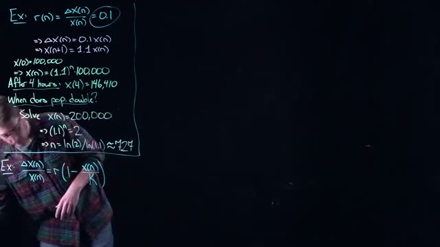
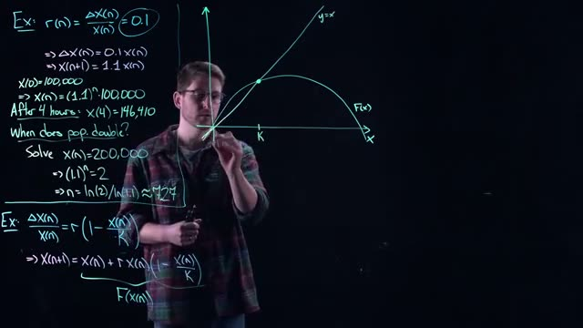
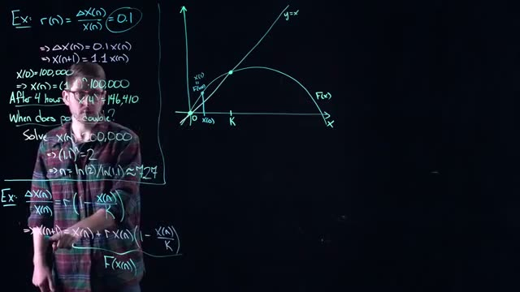
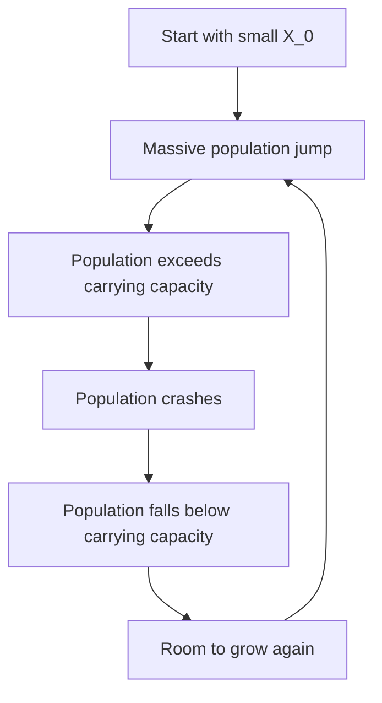

# Cobweb Diagrams for One Dimensional Discrete Dynamical Systems
> **Source:** [Cobweb Diagrams - Math Modelling - Lecture 14](https://www.youtube.com/watch?v=1hCX5Gbeo0E) by Math Modelling · 31:04 · Training document generated from the video.
**How to use this document:** read it top to bottom in place of watching the video. Screenshots appear exactly where the video depends on something visual, with links that jump to that moment. Questions at the end of each section confirm you learned the material. The glossary and footnotes add definitions and detail the video assumes you already have.
**Who this is for:** Students in an undergraduate mathematical modelling course who have been introduced to discrete time dynamical systems.
## Learning objectives

After working through this document you can:

1. Define the relative growth rate for a discrete time dynamical system.
2. Derive the explicit solution for exponential (unbounded) population growth.
3. Calculate the doubling time for an exponentially growing population using logarithms.
4. Formulate the logistic difference equation to model population growth with a carrying capacity.
5. Construct a cobweb diagram by iterating a one dimensional map graphically.
6. Identify equilibrium points as intersections of the map $F(x)$ and the line $y=x$ on a cobweb diagram.
7. Classify the long term behavior of a logistic map (monotonic convergence, oscillatory convergence, chaos) based on the growth rate parameter $r$.
8. Apply cobweb analysis to a real world yeast population model using Carlson's data.
## Prerequisites

- Familiarity with discrete time dynamical systems and difference equations.
- Basic algebra and logarithms.
- Understanding of equilibrium points and stability in continuous time systems (phase lines).
## The Logistic Model: Introducing a Carrying Capacity

The simple exponential growth model $X_{n+1} = 1.1 X_n$ assumes unlimited resources. In reality, populations face constraints. This section introduces the logistic map, which adds a carrying capacity to model resource competition.

### The Problem with Constant Growth

*[08:20](https://www.youtube.com/watch?v=1hCX5Gbeo0E&t=500s) A whiteboard shows an example problem calculating population growth and doubling time using the formula x(n) = (1.1)^n * 100,000.*

The exponential model assumes a constant growth rate of 10% per time step. The growth rate equation is:

$$r = \frac{\Delta X_n}{X_n} = 0.1$$

where $\Delta X_n = X_{n+1} - X_n$ is the change in population from step $n$ to step $n+1$. This gives:

$$\Delta X_n = 0.1 X_n$$

$$X_{n+1} = 1.1 X_n$$

For an initial population $X_0 = 100,000$, the population after $n$ hours is:

$$X_n = (1.1)^n \cdot 100,000$$

After 4 hours: $X_4 = 146,410$

To find when the population doubles (reaches 200,000):

$$(1.1)^n = 2$$

$$n = \frac{\ln(2)}{\ln(1.1)} \approx 7.27 \text{ hours}$$

This model ignores internal competition for resources and space. As the speaker notes, "just like our whales that we looked at earlier with continuous time systems, there is an internal competition for resources in space that is not being modeled."

### Introducing Density-Dependent Growth

*[09:20](https://www.youtube.com/watch?v=1hCX5Gbeo0E&t=560s) A whiteboard shows an example problem calculating population growth and doubling time using the formula r(n) = ΔX(n)/X(n) = 0.1.*

The key insight is that the growth rate should decrease as the population increases. When a yeast population grows in a petri dish, finite resources create crowding. The speaker explains: "The more yeast you have, it's starting to get very crowded in there and they don't really want to reproduce that much anymore."

*[10:00](https://www.youtube.com/watch?v=1hCX5Gbeo0E&t=600s) A whiteboard shows an example calculation for population growth and doubling time, with the formula r(n) = ΔX(n)/X(n) = 0.1.*

When overcrowding becomes extreme, the speaker notes: "People are on top of each other, nobody can move, then nobody's reproducing anymore and in fact you're sort of dying out, you're competing for resources so much that there's just not enough for everybody."

The solution is to make the growth rate depend on the current population:

$$\frac{\Delta X_n}{X_n} = r \left(1 - \frac{X_n}{K}\right)$$

where:
- $r$ is the constant intrinsic growth rate (the maximum growth rate when population is very small)
- $K$ is the **carrying capacity**: the maximum population that the environment can support (added context: this is the same concept seen in continuous-time logistic models for whale and tree populations)

### How the Carrying Capacity Term Works

The factor $\left(1 - \frac{X_n}{K}\right)$ adjusts the growth rate based on current population:

| Condition | $1 - \frac{X_n}{K}$ | Effect on Growth Rate |
|-----------|---------------------|----------------------|
| $X_n < K$ (below carrying capacity) | Positive | Growth rate is positive; population increases |
| $X_n = K$ (at carrying capacity) | Zero | Growth rate is zero; population stays constant |
| $X_n > K$ (above carrying capacity) | Negative | Growth rate is negative; population decreases |

The speaker summarizes: "I will continue to grow at some rate so long as I am below the carrying capacity. If the yeast are below carrying capacity, then they have a positive growth rate and they still want to grow up. But if I go beyond my carrying capacity, if $X_n$ is bigger than $K$, this becomes negative and my yeast population wants to contract."

### The Logistic Map Equation

*[10:40](https://www.youtube.com/watch?v=1hCX5Gbeo0E&t=640s) A whiteboard shows an example calculation for population growth and doubling time using a discrete model.*

Starting from the growth rate equation:

$$\frac{\Delta X_n}{X_n} = r \left(1 - \frac{X_n}{K}\right)$$

Substitute $\Delta X_n = X_{n+1} - X_n$:

$$\frac{X_{n+1} - X_n}{X_n} = r \left(1 - \frac{X_n}{K}\right)$$

Multiply both sides by $X_n$:

$$X_{n+1} - X_n = r X_n \left(1 - \frac{X_n}{K}\right)$$

*[11:40](https://www.youtube.com/watch?v=1hCX5Gbeo0E&t=700s) A whiteboard shows an example of population growth calculation, including solving for when the population doubles.*

Add $X_n$ to both sides to get the final form:

$$X_{n+1} = X_n + r X_n \left(1 - \frac{X_n}{K}\right)$$

This is the **logistic map** for discrete population dynamics. The speaker notes: "Now we've got a quadratic function, right? This is quadratic in the nonlinearity."

### Key Properties of the Logistic Map

The logistic map is a **nonlinear** discrete dynamical system because it contains the term $X_n^2$ (from multiplying $r X_n$ by $-\frac{X_n}{K}$). This nonlinearity allows for much richer behavior than the linear exponential model, including:

- **Stable equilibrium** at $X = K$ (for appropriate values of $r$)
- **Oscillations** around the carrying capacity
- **Chaotic behavior** for large values of $r$ (added context: this will be explored in later sections)

### Check Your Understanding

1. What is the carrying capacity $K$ in the logistic map, and what happens to the population when $X_n > K$?

Answer

The carrying capacity $K$ is the maximum population the environment can support. When $X_n > K$, the term $(1 - X_n/K)$ becomes negative, making the growth rate negative. This causes the population to decrease in the next time step, modeling the effects of overcrowding and resource competition.

2. Starting from $\frac{\Delta X_n}{X_n} = r(1 - \frac{X_n}{K})$, derive the logistic map equation $X_{n+1} = X_n + r X_n(1 - \frac{X_n}{K})$.

Answer

Step 1: Write $\Delta X_n = X_{n+1} - X_n$, giving $\frac{X_{n+1} - X_n}{X_n} = r(1 - \frac{X_n}{K})$.
Step 2: Multiply both sides by $X_n$: $X_{n+1} - X_n = r X_n(1 - \frac{X_n}{K})$.
Step 3: Add $X_n$ to both sides: $X_{n+1} = X_n + r X_n(1 - \frac{X_n}{K})$.

3. How does the logistic map differ from the exponential growth model $X_{n+1} = 1.1 X_n$ in terms of what it models?

Answer

The exponential model assumes a constant growth rate regardless of population size, modeling unlimited growth. The logistic map makes the growth rate depend on population size relative to carrying capacity, modeling resource competition and environmental limits. When population is small, growth is nearly exponential; when population approaches carrying capacity, growth slows; when population exceeds carrying capacity, growth becomes negative.

4. If $r = 0.5$ and $K = 1000$, what is the growth rate $\frac{\Delta X_n}{X_n}$ when $X_n = 200$? When $X_n = 1200$?

Answer

For $X_n = 200$: $\frac{\Delta X_n}{X_n} = 0.5(1 - 200/1000) = 0.5(0.8) = 0.40$ (40% growth rate, positive because below carrying capacity).
For $X_n = 1200$: $\frac{\Delta X_n}{X_n} = 0.5(1 - 1200/1000) = 0.5(-0.2) = -0.10$ (10% decline rate, negative because above carrying capacity).

## Constructing Cobweb Diagrams: Graphical Iteration and Equilibrium Points

In this section, you will learn how to analyze a one-dimensional discrete dynamical system when you cannot solve it exactly. The key tool is a graphical method called a cobweb diagram, which lets you visualize the sequence of iterates and identify equilibrium points without algebraic formulas.

### When Exact Solutions Fail

Consider a population model where the growth rate depends on the current population. The transcript introduces the logistic-type model:

$$X_{n+1} = X_n + r X_n \left(1 - \frac{X_n}{K}\right)$$

Here $r$ is a positive growth rate and $K$ is the carrying capacity (the maximum sustainable population). Unlike the simple exponential model $X_{n+1} = 1.1 X_n$, you cannot write a closed-form solution like $X_n = (1.1)^n \cdot 100,000$. The exact values of $r$ and $K$ do not matter for the graphical method; what matters is the shape of the function.

*[14:00](https://www.youtube.com/watch?v=1hCX5Gbeo0E&t=840s) A whiteboard shows mathematical equations for population growth and a graph of F(x) versus x, with a line y=x.*

The whiteboard shows both models side by side. The exponential model appears on the left:

$$X_{n+1} = 1.1 X_n, \quad X_0 = 100,000 \implies X_n = (1.1)^n \cdot 100,000$$

After 4 hours: $X_4 = 146,410$. To find when the population doubles, solve $X_n = 200,000$:

$$(1.1)^n = 2 \implies n = \frac{\ln(2)}{\ln(1.1)} \approx 7.27$$

The logistic model appears on the right:

$$X_{n+1} = X_n + r X_n \left(1 - \frac{X_n}{K}\right)$$

Define $F(x)$ as the right-hand side: $F(x) = x + r x \left(1 - \frac{x}{K}\right)$. This function maps the current population $X_n$ to the next population $X_{n+1}$.

### Setting Up the Graphical Framework

To construct a cobweb diagram, you need two curves on the same set of axes:

1. **The function curve**: Plot $y = F(x)$ for $x \geq 0$. For small $r$, this curve rises from the origin, reaches a maximum, then decreases toward zero as $x$ approaches $K$ and beyond.

2. **The diagonal line**: Plot $y = x$. This is the line where the output equals the input.

*[15:20](https://www.youtube.com/watch?v=1hCX5Gbeo0E&t=920s) A whiteboard shows an example calculation for when a value doubles, and a graph illustrating a function F(x) and the line y=x.*

The whiteboard shows both curves drawn on the same graph. The $x$-axis represents the current population $X_n$, and the $y$-axis represents the next population $X_{n+1}$.

### Identifying Equilibrium Points

Equilibrium points occur where there is no change in the system: $X_{n+1} = X_n$. This condition is equivalent to finding where the two curves intersect, because at an intersection point:

$$F(x) = x$$

The transcript identifies two equilibrium points for this model:

- **Zero population** at $x = 0$: If the population is zero, reproduction is impossible, so the system stays at zero forever.
- **Carrying capacity** at $x = K$: If the population equals the carrying capacity, the growth rate is zero, so the population neither increases nor decreases.

The equilibrium at $x = K$ is called the **unique positive equilibrium point**. The transcript emphasizes that these intersections immediately reveal the steady states of the system, which is a key advantage of the graphical method.

### Graphical Iteration: The Cobweb Construction

Graphical iteration is the process of using the graph to compute successive population values without algebra. Follow these steps:

**Step 1: Start with an initial condition.** Choose a starting population $X_0$ on the $x$-axis. The transcript uses an example starting below the carrying capacity.

**Step 2: Find the first iterate.** From $X_0$ on the $x$-axis, draw a vertical line upward until it hits the curve $y = F(x)$. The $y$-coordinate of this intersection point is $X_1 = F(X_0)$.

**Step 3: Transfer to the $x$-axis.** From the intersection point on the curve, draw a horizontal line to the right until it hits the diagonal line $y = x$. This point has coordinates $(X_1, X_1)$. Then draw a vertical line downward from this point to the $x$-axis. You have now located $X_1$ on the $x$-axis.

**Step 4: Repeat the process.** From $X_1$ on the $x$-axis, draw a vertical line up to the curve to find $X_2 = F(X_1)$. Then draw a horizontal line to the diagonal, then a vertical line down to the $x$-axis to locate $X_2$. Continue this pattern.

The transcript describes this as creating a "little tic-tac-toe" pattern. Each complete cycle of vertical-up, horizontal-right, vertical-down produces one iteration.

### Interpreting the Cobweb Diagram

The cobweb diagram reveals the long-term behavior of the system:

- **Convergence to equilibrium**: When starting below the carrying capacity, the cobweb path "wedges itself" into the equilibrium point at $x = K$. The sequence $X_n$ approaches $K$ as $n$ increases.

- **Starting above equilibrium**: If you start with a population above the carrying capacity, the model predicts negative growth (the population decreases). The transcript shows this by tracing from a high initial value: vertical up to the curve, horizontal to the diagonal, vertical down to the $x$-axis. The same wedging behavior occurs, and the population converges to $K$ from above.

The transcript notes that this graphical method works like a **phase line diagram** from differential equations: it gives qualitative information about the dynamics without requiring exact solutions.

### Summary of Key Concepts

| Concept | Definition | Role in Cobweb Diagram |
|---------|------------|----------------------|
| Function $F(x)$ | Maps current state to next state: $X_{n+1} = F(X_n)$ | The curve plotted on the graph |
| Diagonal $y=x$ | Represents no-change condition | Used to transfer $y$-coordinates back to $x$-axis |
| Equilibrium point | Point where $F(x) = x$ | Intersection of curve and diagonal |
| Graphical iteration | Visual method to compute $X_1, X_2, X_3, \dots$ | Vertical and horizontal lines on the graph |
| Convergence | Sequence approaches a fixed value | Cobweb path spirals into equilibrium |

### Check Your Understanding

1. Why can't you solve the logistic model $X_{n+1} = X_n + r X_n (1 - X_n/K)$ exactly, unlike the exponential model $X_{n+1} = 1.1 X_n$?

Answer

The logistic model has a nonlinear term $- (r/K) X_n^2$ that depends on the square of the current population. This makes the recurrence relation nonlinear, and there is no simple closed-form formula like $X_n = (1.1)^n \cdot 100,000$ for the exponential case.

2. What are the two equilibrium points for the logistic model, and what do they represent physically?

Answer

The two equilibrium points are $x = 0$ (zero population) and $x = K$ (carrying capacity). The zero population equilibrium represents extinction: with no individuals, reproduction cannot occur. The carrying capacity equilibrium represents the population size where births exactly balance deaths, so the population remains constant.

3. In the cobweb diagram, why do you draw a horizontal line to the diagonal $y = x$ after finding $F(X_n)$ on the curve?

Answer

The diagonal line $y = x$ allows you to transfer the $y$-coordinate (which equals $X_{n+1}$) back to the $x$-axis. When you hit the diagonal, the point has coordinates $(X_{n+1}, X_{n+1})$. Dropping vertically from this point places $X_{n+1}$ on the $x$-axis, ready for the next iteration.

4. What does it mean if the cobweb path "wedges itself" into the equilibrium point?

Answer

It means the sequence of iterates $X_n$ converges to the equilibrium value. Each successive iterate gets closer to the equilibrium, and the cobweb path becomes trapped in a smaller and smaller region around the intersection point. This indicates that the equilibrium is stable: nearby starting points lead to the equilibrium over time.

## Oscillatory Convergence and Overshooting the Carrying Capacity

In the previous section, you saw a population that converged smoothly to its carrying capacity $K$ from below. The population always stayed below $K$ as it approached. This section shows that this smooth convergence is not guaranteed. When the growth rate $r$ is larger, the population can overshoot $K$ and then oscillate as it converges.

### The Role of the Growth Rate $r$

The logistic map is given by:

$$X_{n+1} = X_n + r X_n \left(1 - \frac{X_n}{K}\right) = F(X_n) \tag{1}$$

where $F(X_n)$ is the function that maps the current population to the next population. The parameter $r$ controls the initial slope of $F$ and determines how far the hump of the logistic curve rises. A larger $r$ means a steeper initial slope and a higher peak.

The carrying capacity $K$ is the nonzero equilibrium point where $F(K) = K$. This equilibrium persists regardless of the value of $r$. The question is not whether $K$ exists, but how the population approaches it.

### Building the Cobweb Diagram for a Larger $r$

*[19:20](https://www.youtube.com/watch?v=1hCX5Gbeo0E&t=1160s) A whiteboard shows mathematical equations for population growth and a graph illustrating the logistic map.*

To see the effect of a larger $r$, follow these steps to construct a cobweb diagram:

1.  **Draw the axes and curves.** On a graph, plot the function $F(x)$ from equation (1) and the diagonal line $y = x$. The intersection of $F(x)$ and $y = x$ at $x = K$ is the equilibrium point.

2.  **Start with a small initial population.** Choose $X_0$ as a small positive number (a "little bit of yeast").

3.  **Trace the first step.**
    *   From $(X_0, 0)$, draw a vertical line upward to meet the curve $F(x)$. The y-coordinate of this intersection is $X_1 = F(X_0)$.
    *   From that point on the curve, draw a horizontal line to the right until it meets the diagonal $y = x$. The x-coordinate of this intersection is $X_1$.

4.  **Repeat the process.** From the point on the diagonal, draw a vertical line up to the curve to find $X_2 = F(X_1)$. Then draw a horizontal line to the diagonal. Continue this "vertical, horizontal, vertical, horizontal" pattern.

*[20:00](https://www.youtube.com/watch?v=1hCX5Gbeo0E&t=1200s) This frame shows mathematical equations for population growth and a graphical representation of a function F(x) and y=x.*

For a small $r$, each step stays below $K$ and the cobweb lines creep up the curve from below. For a larger $r$, the pattern changes dramatically.

### The Overshoot Phenomenon

With a larger $r$, the population takes "way bigger steps from point to point." The high growth rate causes the population to explode so much between time steps that it overshoots the carrying capacity.

Consider the sequence of steps:

*   **Hour 3:** The population is below $K$. The growth rate is high, so the next jump is large.
*   **Hour 4:** The population overshoots $K$ and is now above it. The population is too large.
*   **Hour 5:** Because the population is above $K$, the growth term $r X_n (1 - X_n/K)$ becomes negative. The population contracts (decreases).
*   **Hour 6:** The population contracts so much that it drops below $K$ again. "Way too many of us, bring that population down."

This creates a cycle: overshoot above $K$, contract below $K$, overshoot above $K$ again, and so on.

### Oscillatory Convergence

*[22:40](https://www.youtube.com/watch?v=1hCX5Gbeo0E&t=1360s) This frame displays mathematical equations for population growth and two graphs illustrating the behavior of X(n) approaching K.*

The result is a cobweb diagram that "spirals into" the carrying capacity $K$. The population does not approach $K$ from one side. Instead, it flips back and forth across $K$ with each time step.

This oscillatory behavior is analogous to a discrete linear system where the eigenvalue $\lambda$ is between -1 and 0. In that case, each multiplication by $\lambda$ flips the sign, producing alternating positive and negative values that shrink toward zero. Here, the nonlinear logistic map produces a similar alternating pattern around $K$.

The process continues:
1.  "Way too many of us, bring that population down."
2.  "Okay, we got room to grow."
3.  "Oh man, we overshot. There's way too many. Go back down."
4.  "Okay, we got room to grow. Too many. Room to grow. Too many."

Each oscillation is smaller than the last, and the population gradually homes in on $K$. The population still converges to $K$, but it does so by oscillating around the equilibrium rather than approaching it monotonically.

### Summary of Convergence Types

| Growth Rate $r$ | Behavior | Cobweb Pattern |
|-----------------|----------|----------------|
| Small $r$ | Monotonic convergence from below | Steps creep up the curve, always below $K$ |
| Larger $r$ | Oscillatory convergence | Steps overshoot $K$, then spiral inward |

The exact threshold where the behavior changes depends on the slope of $F(x)$ at $x = K$. When the slope at $K$ is between 0 and 1, convergence is monotonic. When the slope is between -1 and 0, convergence is oscillatory.

### Check your understanding

1.  Why does a larger growth rate $r$ cause the population to overshoot the carrying capacity $K$?

Answer

A larger $r$ means the population grows more rapidly between time steps. When the population is below $K$, the growth term $r X_n (1 - X_n/K)$ is positive and large. This causes the next population $X_{n+1}$ to jump past $K$ instead of approaching it gradually.

2.  In the oscillatory convergence case, what happens to the population when it is above $K$?

Answer

When the population is above $K$, the term $(1 - X_n/K)$ becomes negative. This makes the growth term $r X_n (1 - X_n/K)$ negative, so the population decreases (contracts) in the next time step.

3.  How does the cobweb diagram for oscillatory convergence differ visually from the diagram for monotonic convergence?

Answer

For monotonic convergence, the cobweb steps all stay on one side of the diagonal intersection point at $K$. For oscillatory convergence, the steps cross back and forth over the diagonal at $K$, creating a spiral pattern that tightens as it approaches $K$.

4.  Does the carrying capacity $K$ change when $r$ is increased?

Answer

No. The carrying capacity $K$ is an equilibrium point of the logistic map regardless of the value of $r$. Changing $r$ affects how the population approaches $K$, not the value of $K$ itself.

## Chaotic Dynamics for Large Growth Rates

As you increase the growth rate $R$ further, the behavior of the discrete dynamical system changes dramatically. The cobweb diagram transforms from a neat spiral into what looks like a tangled web, which is exactly why this visualization is called a cobweb diagram. The lines crisscross back and forth, creating a pattern that resembles a spider's web.

### The Transition to Chaos

When the growth rate $R$ becomes very large, the system no longer settles into a stable equilibrium. Instead, the population values hop around unpredictably from one step to the next. This is the hallmark of a chaotic dynamical system.

The logistic map equation that governs this behavior is:

$$X_{n+1} = X_n + rX_n\left(1 - \frac{X_n}{K}\right) = F(X_n) \tag{1}$$

where:
- $X_n$ is the population at step $n$
- $r$ is the growth rate
- $K$ is the carrying capacity
- $F(X_n)$ is the function that maps the current population to the next population

*[24:40](https://www.youtube.com/watch?v=1hCX5Gbeo0E&t=1480s) This frame shows mathematical equations and graphs related to population growth models, including an example calculation for population doubling time and two graphical representations of logistic growth.*

### What Happens with a Huge Growth Rate

When $R$ is extremely large, the system exhibits the following behavior:

1. **Massive jumps**: Starting from a small initial population $X_0$, the population grows enormously in a single step because the growth rate is so high.

2. **Overshooting**: The population becomes far too large, exceeding the carrying capacity $K$.

3. **Crash**: The population then drops dramatically, falling well below the carrying capacity.

4. **Overshooting downward**: The population drops so much that there is now plenty of room to grow again.

5. **Repeat**: The cycle continues with the population shooting up and crashing down repeatedly.

This creates a pattern where the population constantly overshoots and then corrects, but never settles into a stable value. The cobweb diagram for this case shows lines that keep bouncing between very high and very low population values.

*[26:20](https://www.youtube.com/watch?v=1hCX5Gbeo0E&t=1580s) This frame shows mathematical equations for population growth and two cobweb diagrams illustrating the behavior of functions.*

### Why Chaos Occurs

The chaos emerges because the growth rate is so large that the population makes enormous jumps from step to step. Each correction overshoots in the opposite direction, leading to a seemingly random sequence of population values.

For the logistic map with $K = 1$, you can observe this chaotic behavior with values of $R$ around 4 or possibly 6, depending on your specific parameter choices. The system never settles into a stable equilibrium point.

### Key Differences from Previous Cases

| Behavior | Small $R$ | Medium $R$ | Large $R$ (Chaotic) |
|----------|-----------|------------|---------------------|
| Population trajectory | Monotone convergence | Oscillating convergence | Never settles |
| Cobweb pattern | Spirals inward | Localized oscillations | Fills the diagram |
| Equilibrium points | Attract all trajectories | Attract all trajectories | No longer attract |
| Predictability | Fully predictable | Predictable | Seemingly random |

### The Filling Effect

If you continue drawing the cobweb diagram for a chaotic system, it will eventually fill in completely. The lines become so numerous that you cannot read the diagram anymore. This is fundamentally different from the previous cases where:

- For small $R$: Everything gets localized and spirals into the carrying capacity
- For medium $R$: Everything falls into the carrying capacity through damped oscillations
- For large $R$: The equilibrium points no longer absorb any trajectories

In the chaotic case, the system wanders freely, flipping back and forth between large populations above the carrying capacity and small populations below it.

### Interactive Exploration

To see this behavior yourself, use the interactive cobweb diagram tool linked in the video description. Here is the systematic exploration procedure:

1. **Fix $K = 1$** as your carrying capacity
2. **Start with small values of $R$** (for example, $R = 0.5$ or $R = 1.0$)
3. **Observe monotone convergence**: The population smoothly approaches the carrying capacity
4. **Increase $R$ gradually** and watch for the tipping point
5. **Find the transition**: At some critical $R$ value, you will see the population start jumping between values before settling
6. **Continue increasing $R$** until you reach values around 4 or higher
7. **Observe chaos**: The population never settles, and the cobweb diagram becomes increasingly complex

*[27:20](https://www.youtube.com/watch?v=1hCX5Gbeo0E&t=1640s) This frame shows mathematical equations and graphs related to population growth models, including examples of exponential growth and logistic growth, with a person explaining them.*

### The Mathematical Structure

The chaotic behavior can be understood through the function $F(X_n)$ in equation (1). When $R$ is large, the function becomes highly nonlinear, creating multiple intersections with the diagonal line $X_{n+1} = X_n$. These intersections represent potential equilibrium points, but in the chaotic regime, the system never stays near any of them.

The system's trajectory through the cobweb diagram follows this pattern:

This cycle repeats indefinitely, with the population values never repeating in a predictable pattern.

### The Role of the Growth Rate

The growth rate $R$ is the key parameter that determines whether the system exhibits:
- Stable equilibrium (small $R$)
- Periodic oscillations (medium $R$)
- Chaos (large $R$)

The transition from periodic to chaotic behavior is not gradual. At certain critical values of $R$, the system suddenly becomes chaotic, and small changes in the initial population can lead to completely different trajectories.

### Practical Implications

For the yeast population example from earlier in the course, this means that if the growth rate is too high, the population will never reach a stable equilibrium. Instead, it will fluctuate wildly between very large and very small values. This has important implications for population management and prediction.

The seemingly random behavior is actually deterministic, meaning it follows precise mathematical rules. However, the extreme sensitivity to initial conditions makes long-term prediction impossible in practice.

*[28:00](https://www.youtube.com/watch?v=1hCX5Gbeo0E&t=1680s) This frame shows a whiteboard with mathematical equations and diagrams related to population growth and logistic maps.*

### Summary of Key Concepts

1. **Chaotic dynamical system**: A system where trajectories never settle into a stable pattern
2. **Overshooting**: When the population exceeds the carrying capacity and then crashes below it
3. **Seemingly random behavior**: The population values appear random but are actually determined by the logistic map equation
4. **Filling effect**: The cobweb diagram becomes completely filled with lines in the chaotic regime
5. **Equilibrium points lose their attraction**: In chaos, the equilibrium points no longer pull trajectories toward them

The transition from orderly to chaotic behavior is one of the most fascinating aspects of discrete dynamical systems. By systematically increasing $R$ and observing the cobweb diagrams, you can witness this transition firsthand and develop an intuition for when chaos will occur.

### Check your understanding

1. **What is the key difference between the cobweb diagram for a stable system and a chaotic system?**

Answer

In a stable system, the cobweb diagram spirals inward or oscillates around the equilibrium point, eventually settling into a fixed value. In a chaotic system, the cobweb diagram never settles; it keeps bouncing between high and low population values, eventually filling the entire diagram with lines.

2. **Why does the population overshoot in the chaotic regime?**

Answer

The growth rate $R$ is so large that the population makes enormous jumps from step to step. When the population grows, it exceeds the carrying capacity dramatically. When it crashes, it falls far below the carrying capacity. Each correction overshoots in the opposite direction because the growth rate is too high to allow a gradual approach to equilibrium.

3. **What happens to the equilibrium points in a chaotic system?**

Answer

The equilibrium points no longer attract any trajectories. In stable systems, the equilibrium points absorb all trajectories. In chaotic systems, the population wanders freely, flipping back and forth between values above and below the carrying capacity, never settling near any equilibrium point.

4. **How would you systematically explore the transition to chaos using the interactive tool?**

Answer

Fix $K = 1$, start with small values of $R$ (like 0.5 or 1.0) and observe monotone convergence. Gradually increase $R$ and watch for the tipping point where the population starts jumping before settling. Continue increasing $R$ until you reach values around 4 or higher, where the population never settles and the cobweb diagram becomes increasingly complex.

## Real World Application: Carlson's Yeast Data

In this section, you will apply the logistic map model to real historical data collected by German researcher Carlson in 1913. You will learn how his observations led to the exponential growth model introduced earlier in the course, and you will derive specific parameter values for a logistic map that models yeast population growth.

### Historical Context and Model Origins

*[28:40](https://www.youtube.com/watch?v=1hCX5Gbeo0E&t=1720s) This frame shows a whiteboard with mathematical equations for population growth and related graphs, including a logistic map diagram.*

Carlson collected data on yeast populations in 1913. His original observations provided the foundation for the simple exponential growth model you saw earlier in the course. The 10% growth rate per time step (or per hour) came directly from Carlson's data.

The exponential growth model shown on the whiteboard uses the following form:

$$X_{n+1} = 1.1 X_n$$

where $X_n$ represents the yeast population at time step $n$, and the growth rate is 10% per hour. With an initial population $X_0 = 100,000$, the population after $n$ hours follows:

$$X_n = (1.1)^n \cdot 100,000$$

For example, after 4 hours:

$$X_4 = (1.1)^4 \cdot 100,000 = 146,410$$

To find when the population doubles, solve $X_n = 200,000$:

$$(1.1)^n = 2$$
$$n = \frac{\ln(2)}{\ln(1.1)} \approx 7.27 \text{ hours}$$

### Fitting Carlson's Data to the Logistic Model

*[30:00](https://www.youtube.com/watch?v=1hCX5Gbeo0E&t=1800s) This frame shows a whiteboard with mathematical equations and graphs related to population growth models, including an example calculation and a logistic growth model, with a person writing an equation X(n+1) = 1.56x(n) - 0.00086.*

When you fit Carlson's actual data to a model of the form shown on the whiteboard, you obtain a specific iteration scheme for the yeast population. The fitted model is:

$$X_{n+1} = 1.56 X_n - 0.00086 X_n^2$$

This equation represents a logistic map. The general form of the logistic map for population growth is:

$$X_{n+1} = X_n + r X_n \left(1 - \frac{X_n}{K}\right)$$

where:
- $r$ is the intrinsic growth rate (added context: the maximum per capita growth rate when resources are unlimited)
- $K$ is the carrying capacity (added context: the maximum population size the environment can sustain)

### Extracting Parameter Values

From the fitted equation $X_{n+1} = 1.56 X_n - 0.00086 X_n^2$, you can extract the parameters $r$ and $K$.

First, rewrite the general logistic map:

$$X_{n+1} = X_n + r X_n \left(1 - \frac{X_n}{K}\right)$$
$$X_{n+1} = X_n + r X_n - \frac{r}{K} X_n^2$$
$$X_{n+1} = (1 + r) X_n - \frac{r}{K} X_n^2$$

Now compare this with the fitted equation:

$$X_{n+1} = 1.56 X_n - 0.00086 X_n^2$$

From the coefficient of $X_n$:

$$1 + r = 1.56$$
$$r = 0.56$$

From the coefficient of $X_n^2$:

$$\frac{r}{K} = 0.00086$$
$$\frac{0.56}{K} = 0.00086$$
$$K = \frac{0.56}{0.00086} \approx 650.4$$

Therefore:
- $r = 0.56$ (the intrinsic growth rate)
- $K \approx 650.4$ (the carrying capacity)

### Constructing the Cobweb Diagram

To analyze what Carlson would have observed in 1913, you can construct a cobweb diagram using these parameter values. The iteration function is:

$$f(x) = 1.56x - 0.00086x^2$$

To create the cobweb diagram:

1. Plot the function $y = f(x)$ on a coordinate plane where both axes represent population size
2. Plot the diagonal line $y = x$
3. Start at the initial population $X_0$ on the x-axis
4. Draw a vertical line to the function curve to find $X_1 = f(X_0)$
5. Draw a horizontal line to the diagonal to bring the output back to the x-axis
6. Repeat steps 4 and 5 for each subsequent iteration

The cobweb diagram will show you the long-term behavior of the yeast population under this model. You can determine whether the population:
- Approaches a stable fixed point
- Oscillates between values
- Exhibits more complex behavior

### Check Your Understanding

1. What are the values of $r$ and $K$ derived from Carlson's data, and what do they represent in the context of yeast population growth?

Answer

$r = 0.56$, which represents the intrinsic growth rate (the maximum per capita growth rate when resources are unlimited). $K \approx 650.4$, which represents the carrying capacity (the maximum population size the environment can sustain).

2. Starting from the general logistic map $X_{n+1} = X_n + r X_n (1 - X_n/K)$, show the algebraic steps to derive the form $X_{n+1} = (1+r)X_n - (r/K)X_n^2$.

Answer

$$X_{n+1} = X_n + r X_n \left(1 - \frac{X_n}{K}\right)$$
$$X_{n+1} = X_n + r X_n - \frac{r}{K} X_n^2$$
$$X_{n+1} = (1+r)X_n - \frac{r}{K} X_n^2$$

3. If you construct a cobweb diagram for the iteration $X_{n+1} = 1.56 X_n - 0.00086 X_n^2$ with $X_0 = 100$, what would you expect to observe about the long-term behavior of the population?

Answer

The population should approach the carrying capacity $K \approx 650.4$. Since $r = 0.56$ is less than 2, the logistic map should converge monotonically to the stable fixed point at $x = K$ without oscillations.

4. Why is the exponential growth model $X_{n+1} = 1.1 X_n$ insufficient for long-term predictions of yeast populations, and how does the logistic model improve upon it?

Answer

The exponential growth model predicts unbounded growth, which is unrealistic for any population in a finite environment. The logistic model improves upon this by including a carrying capacity term $(1 - X_n/K)$ that reduces the growth rate as the population approaches the maximum sustainable size. This produces more realistic predictions where the population stabilizes at the carrying capacity rather than growing indefinitely.

## Key takeaways

- The relative growth rate for a discrete time dynamical system is defined as the change in population divided by the current population, $r_n = \frac{\Delta X_n}{X_n}$.
- The exponential growth model $X_{n+1} = 1.1 X_n$ with $X_0 = 100,000$ has an explicit solution $X_n = (1.1)^n \cdot 100,000$.
- Doubling time for an exponentially growing population is found by solving $(1.1)^n = 2$, giving $n = \frac{\ln(2)}{\ln(1.1)} \approx 7.27$, which rounds to 8 discrete time steps.
- The logistic difference equation $X_{n+1} = X_n + r X_n \left(1 - \frac{X_n}{K}\right)$ introduces a carrying capacity $K$ and is a quadratic map that cannot be solved explicitly.
- A cobweb diagram is constructed by plotting the map $F(x)$ and the line $y=x$, then iterating graphically: start at $X_0$, go vertically to $F(X_0)$, horizontally to $y=x$, vertically to $F(X_1)$, and repeat.
- Equilibrium points are identified as intersections of $F(x)$ and $y=x$; for the logistic map these are $X=0$ and $X=K$.
- For small growth rate $r$, the cobweb shows monotonic convergence to $K$; for larger $r$, the population overshoots $K$ and exhibits oscillatory convergence.
- For very large $r$, the cobweb diagram shows large jumps that never settle, producing chaotic dynamics where the population oscillates seemingly randomly.
- Carlson's 1913 yeast data yields the fitted model $X_{n+1} = 1.56 X_n - 0.000861 X_n^2$, corresponding to $r = 0.56$ and $K \approx 650.4$.
## Glossary

| Term | Definition |
|---|---|
| relative growth rate | The change in a population over a time step divided by the current population, often denoted $r_n = \frac{\Delta X_n}{X_n}$. |
| discrete time dynamical system | A system where the state evolves at discrete time steps according to a rule, such as $X_{n+1} = F(X_n)$. |
| one dimensional difference equation | A difference equation where the state variable is a single number, e.g., $X_{n+1} = f(X_n)$. |
| carrying capacity | The maximum population size that the environment can sustain indefinitely, denoted $K$. |
| logistic difference equation | A nonlinear map $X_{n+1} = X_n + r X_n \left(1 - \frac{X_n}{K}\right)$ that models population growth with a carrying capacity. |
| cobweb diagram | A graphical method for iterating a one dimensional map by alternately moving vertically to the curve $F(x)$ and horizontally to the line $y=x$. |
| equilibrium point | A point $X^*$ such that $F(X^*) = X^*$, meaning the system does not change when at that state. |
| monotonic convergence | A sequence that approaches an equilibrium from one side without crossing it, steadily increasing or decreasing. |
| oscillatory convergence | A sequence that approaches an equilibrium by alternating above and below it, gradually reducing the amplitude. |
| chaos | Aperiodic, seemingly random behavior in a deterministic dynamical system, sensitive to initial conditions. |
| doubling time | The time required for a population to double in size, computed as $\frac{\ln(2)}{\ln(1+r)}$ for exponential growth. |
| explicit solution | A closed-form formula for $X_n$ as a function of $n$, e.g., $X_n = (1+r)^n X_0$ for linear maps. |
| iteration | Repeated application of a function: $X_{n+1} = F(X_n)$. |
| map | A function $F: \mathbb{R} \to \mathbb{R}$ that defines the next state in a discrete dynamical system. |
| state space | The set of all possible values of the state variable; for one dimensional systems it is a subset of $\mathbb{R}$. |
| phase line | A graphical tool for continuous time one dimensional systems showing direction of flow; analogous to cobweb diagrams for discrete time. |
| quadratic map | A map of the form $F(x) = ax^2 + bx + c$; the logistic difference equation is quadratic. |
| nonlinear | A system or equation that is not linear; nonlinear maps often produce complex dynamics like chaos. |
| initial condition | The starting value $X_0$ of the state variable at time $n=0$. |
| parameter $r$ | The intrinsic growth rate in the logistic model, controlling how fast the population grows when far below carrying capacity. |
| parameter $K$ | The carrying capacity in the logistic model, the stable equilibrium population size. |
## Footnotes and deeper context

1. **Logistic map forms.** The logistic difference equation in this course is $X_{n+1} = X_n + r X_n (1 - X_n/K)$, an additive form. The more common logistic map in chaos theory is $X_{n+1} = r X_n (1 - X_n)$ (with $K=1$ and $r$ as a growth factor). The two forms are related but have different parameter ranges for chaos. In the additive form, chaos typically occurs for $r > 2$ (depending on $K$), while in the multiplicative form chaos starts at $r \approx 3.57$.
2. **Doubling time formula.** 
3. **Cobweb diagram naming.** Cobweb diagrams are also called staircase diagrams when the iteration steps form a staircase pattern (monotonic convergence). The name 'cobweb' comes from the spider-web-like pattern that appears when the dynamics oscillate.
4. **Carlson's original data.** The yeast data was collected by the German researcher T. Carlson in 1913. The fitted parameters $r=0.56$ and $K\approx 650.4$ are approximate; the original paper is: Carlson, T. (1913). 'Über die Geschwindigkeit des Wachstums der Hefe.' Biochemische Zeitschrift, 57, 313-334.
5. **Chaos sensitivity.** Chaotic systems are extremely sensitive to initial conditions: tiny changes in $X_0$ lead to wildly different future trajectories. This is known as the butterfly effect.
6. **Equilibrium stability.** The stability of an equilibrium $X^*$ for a map $F$ is determined by the derivative $F'(X^*)$. If $|F'(X^*)| < 1$, the equilibrium is stable; if $|F'(X^*)| > 1$, it is unstable. For the logistic map, $F'(K) = 1 - r$, so stability changes when $r$ passes 2.
## Where to go next

- **Strogatz, 'Nonlinear Dynamics and Chaos' (2nd edition).** Chapter 10 covers one dimensional maps, cobweb diagrams, and the logistic map in detail. It provides rigorous analysis of stability and bifurcations.
- **May, R. M. (1976). 'Simple mathematical models with very complicated dynamics.' Nature, 261, 459-467..** This seminal paper demonstrates how simple logistic maps can produce chaos, linking ecology to nonlinear dynamics.
- **Online cobweb diagram applet (Geogebra or Wolfram Demonstrations Project).** Interactive tools allow you to adjust parameters $r$ and $K$ and see the cobweb diagram update in real time. Search for 'logistic map cobweb' on the Wolfram Demonstrations Project or use a Geogebra applet.
---
*Printed by yt2textbook, an open tool from Zorost AI Lab. Screenshots are frames captured from the source video; each caption links to the exact moment it appears.*
