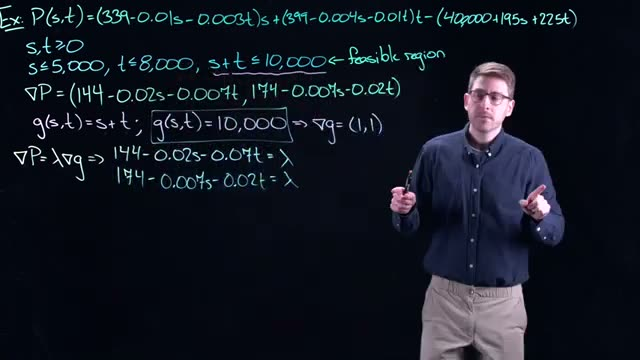
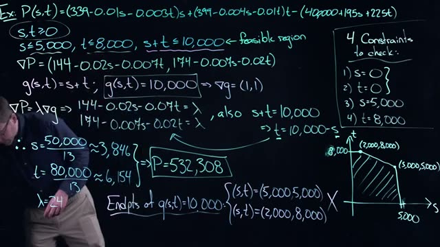
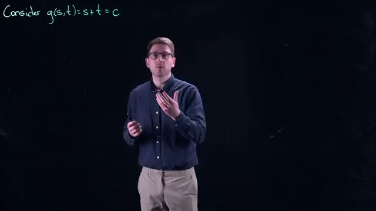
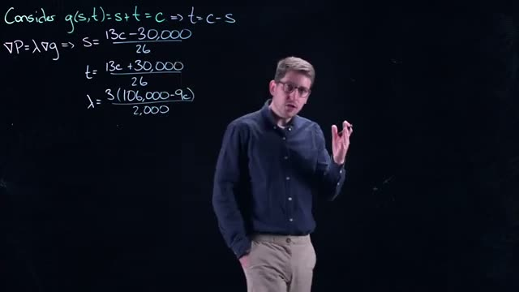
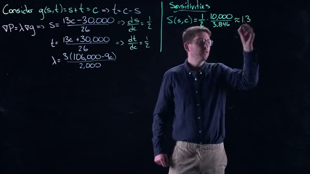
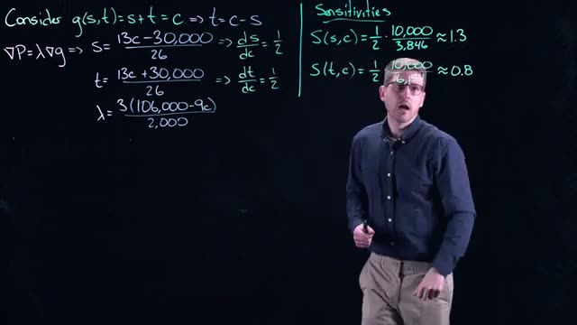
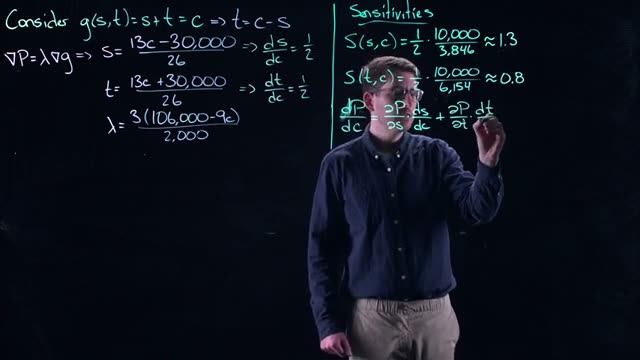

# Constrained Modeling and Shadow Pricing: A Practical Example with Lagrange Multipliers
> **Source:** [Constrained Modelling and Shadow Pricing - Math Modelling - Lecture 7](https://www.youtube.com/watch?v=SY6NvKj0fRM) by Math Modelling · 32:17 · Training document generated from the video.
**How to use this document:** read it top to bottom in place of watching the video. Screenshots appear exactly where the video depends on something visual, with links that jump to that moment. Questions at the end of each section confirm you learned the material. The glossary and footnotes add definitions and detail the video assumes you already have.
**Who this is for:** This course is for undergraduate students or professionals learning mathematical modeling, specifically constrained optimization and sensitivity analysis.
## Learning objectives

After working through this document you can:

1. Formulate a constrained optimization problem from a real-world manufacturing scenario
2. Apply the method of Lagrange multipliers to find candidate optimal points on a binding constraint
3. Evaluate endpoints and other boundaries to determine the global optimum within a feasible region
4. Derive a general solution for the optimal production levels as a function of a constraint parameter
5. Compute sensitivities of decision variables with respect to a constraint using partial derivatives
6. Interpret the Lagrange multiplier as the shadow price: the marginal change in profit per unit change in a constraint
7. Analyze a decision rule for whether to relax a resource constraint based on the shadow price and marginal cost
8. Explain the chain rule derivation that connects the derivative of profit with respect to the constraint to the Lagrange multiplier
## Prerequisites

- Knowledge of Lagrange multipliers for constrained optimization
- Ability to compute partial derivatives and gradients
- Familiarity with single-variable optimization (checking endpoints and boundaries)
- Basic understanding of profit functions and economic constraints
## Introduction and Problem Setup: TV Profit Function with Multiple Constraints

This section builds on the Lagrange multiplier method introduced in the previous video. You will apply that method to a realistic business problem: maximizing profit for a television manufacturer subject to several production constraints. The video assumes you already understand how to find an optimum of an unconstrained function by setting its gradient to zero. Now you will learn how to handle constraints using Lagrange multipliers.

### Recap of the Profit Function

The model uses two decision variables:

- \( s \) : number of 19-inch TV sets produced per year.
- \( t \) : number of 21-inch TV sets produced per year.

The profit function \( P(s,t) \) is the revenue from selling the TVs minus the production cost. The revenue for each type depends on the demand curve (price decreases as more units are produced). The cost includes a fixed base cost of $400,000 plus variable costs per unit: $195 per 19-inch set and $225 per 21-inch set.

The full profit function is:


*[01:00](https://www.youtube.com/watch?v=SY6NvKj0fRM&t=60s) A man points to the mathematical expression 'Ex: P(s,t)' written in green on a dark background.*


```
Ex: P(s,t)
```


*[02:00](https://www.youtube.com/watch?v=SY6NvKj0fRM&t=120s) A mathematical example showing the function P(s,t) with several terms involving s and t.*


The whiteboard shows the complete expression. The correct form (as later corrected in the video) is:

\[
P(s,t) = (339 - 0.01s - 0.003t)s + (399 - 0.004s - 0.01t)t - (400000 + 195s + 225t)
\]

**Term by term explanation:**

- The first term, \((339 - 0.01s - 0.003t)s\), is the revenue from 19-inch TVs. The price per unit is \(339 - 0.01s - 0.003t\), which decreases as you produce more of either type.
- The second term, \((399 - 0.004s - 0.01t)t\), is the revenue from 21-inch TVs. The price per unit is \(399 - 0.004s - 0.01t\).
- The last term, \(400000 + 195s + 225t\), is the total production cost: $400,000 fixed cost plus $195 per 19-inch TV and $225 per 21-inch TV.

In the unconstrained case (only requiring \(s \ge 0\) and \(t \ge 0\)), the optimum was found by solving \(\nabla P = 0\). Now you will add more constraints.

### Adding Production Constraints

The manufacturer faces several real-world limitations. These are listed below.


*[03:20](https://www.youtube.com/watch?v=SY6NvKj0fRM&t=200s) A mathematical example showing the profit function P(s,t) with constraints on s and t.*


The whiteboard shows the first three constraints:

- \(s \ge 0\) and \(t \ge 0\) (non‑negativity: you cannot produce a negative number of TVs).
- \(s \le 5000\) (material limit for 19‑inch sets: the factory can obtain enough material for at most 5000 of these per year).
- \(t \le 8000\) (material limit for 21‑inch sets: at most 8000 per year).

The video then introduces a fourth constraint based on a shared component:

- Both TV models use the same internal circuit board. The supplier can provide only 10,000 circuit boards per year. Therefore, the total number of TVs produced cannot exceed 10,000:

\[
s + t \le 10000
\]

This gives a total of five constraints:

| Constraint | Meaning |
|------------|---------|
| \(s \ge 0\) | Non‑negativity for 19‑inch TVs |
| \(t \ge 0\) | Non‑negativity for 21‑inch TVs |
| \(s \le 5000\) | Material limit for 19‑inch TVs |
| \(t \le 8000\) | Material limit for 21‑inch TVs |
| \(s + t \le 10000\) | Circuit board supply limit |

Together, these constraints define the **feasible region**: the set of all \((s, t)\) pairs that satisfy all five inequalities. The feasible region is a polygon in the first quadrant of the \(s\)-\(t\) plane. Its boundaries are:

- The axes \(s = 0\) and \(t = 0\).
- The vertical line \(s = 5000\).
- The horizontal line \(t = 8000\).
- The diagonal line \(s + t = 10000\).

Because the circuit board constraint (\(s + t \le 10000\)) is more restrictive than the sum of the individual limits (5000 + 8000 = 13000), the feasible region is a pentagon. In the next sections of the course, you will use Lagrange multipliers to find the constrained optimum of \(P(s,t)\) within this region.

### Check your understanding

1. **How many constraints are applied to the profit function in this problem?**  
   <details><summary>Answer</summary>Five constraints: \(s \ge 0\), \(t \ge 0\), \(s \le 5000\), \(t \le 8000\), and \(s + t \le 10000\).</details>

2. **Why is the circuit board constraint \(s + t \le 10000\) necessary even though the individual material limits already restrict \(s\) and \(t\)?**  
   <details><summary>Answer</summary>Because both TV models use the same circuit board, the supplier’s limit of 10,000 boards per year caps the total number of TVs, not just each type. Without this constraint, you could produce 5000 of one type and 8000 of the other, totaling 13,000 TVs, which would exceed the board supply.</details>

3. **What is the feasible region?**  
   <details><summary>Answer</summary>The feasible region is the set of all \((s, t)\) that satisfy all five constraints simultaneously. It is a polygon in the first quadrant bounded by the axes, the lines \(s = 5000\), \(t = 8000\), and \(s + t = 10000\).</details>

4. **In the unconstrained case, how was the optimum found?**  
   <details><summary>Answer</summary>By setting the gradient of \(P(s,t)\) to zero (i.e., solving \(\frac{\partial P}{\partial s} = 0\) and \(\frac{\partial P}{\partial t} = 0\)).</details>
## Solving the Lagrange Multiplier Equations for the Circuit Board Constraint


*[05:00](https://www.youtube.com/watch?v=SY6NvKj0fRM&t=300s) A whiteboard shows an example profit function P(s,t) with constraints defining a feasible region, and the start of a gradient calculation.*


We begin with the profit function P(s,t) and the feasible region defined by three constraints:

- s is greater than or equal to 0
- t is greater than or equal to 0
- s is less than or equal to 5,000
- t is less than or equal to 8,000
- s plus t is less than or equal to 10,000

The profit function is:

P(s,t) = (339 - 0.01s - 0.003t)s + (399 - 0.004s - 0.01t)t - (400000 + 195s + 225t)

The gradient of P, denoted as ∇P, is a vector of partial derivatives. The first component is the partial derivative of P with respect to s. The second component is the partial derivative of P with respect to t. From a previous calculation, we have:

∇P = (144 - 0.02s - 0.007t, 174 - 0.007s - 0.02t)

### Setting Up the Lagrange Multiplier for the Binding Constraint


*[06:20](https://www.youtube.com/watch?v=SY6NvKj0fRM&t=380s) This frame displays an example problem with a profit function P(s,t), constraints for s and t, the gradient of P, and a function g(s,t) defining the feasible region.*


We focus on the most interesting constraint: the one where s plus t equals 10,000. This is the constraint that ties the two products together. We define the constraint function g(s,t) as:

g(s,t) = s + t

The constraint itself is g(s,t) = 10,000.

The gradient of g is straightforward to compute. The partial derivative of g with respect to s is 1. The partial derivative of g with respect to t is 1. Therefore:

∇g = (1, 1)

### The Lagrange Multiplier Equation


*[07:20](https://www.youtube.com/watch?v=SY6NvKj0fRM&t=440s) A whiteboard shows the profit function P(s,t) and its partial derivatives, along with constraints defining the feasible region and the setup for Lagrange multipliers.*


The Lagrange multiplier method states that at an optimal point on the constraint, the gradient of the objective function P is parallel to the gradient of the constraint function g. This is expressed as:

∇P = λ ∇g

Here, λ (lambda) is the Lagrange multiplier. (Added context: The Lagrange multiplier represents the rate of change of the optimal objective value with respect to a small change in the constraint's right-hand side.)

Because ∇g = (1, 1), the equation ∇P = λ ∇g becomes a system of two simple linear equations:

144 - 0.02s - 0.07t = λ
174 - 0.007s - 0.02t = λ

### Geometric Interpretation



*[08:00](https://www.youtube.com/watch?v=SY6NvKj0fRM&t=480s) This frame displays a multi-variable calculus problem involving profit function P(s,t) and constraints, including the feasible region and the setup for Lagrange multipliers.*


The gradient of P points in the direction of steepest increase for the function P. To maximize profit, you would follow that gradient. The gradient of g runs perpendicular (orthogonal) to the level set given by the constraint. The Lagrange multiplier equation tells us when these two gradients are parallel. When they are parallel, the only way to increase profit is by moving off of the constraint line. Keep this geometric intuition in mind as we proceed with the algebra.

### Solving the System


*[09:20](https://www.youtube.com/watch?v=SY6NvKj0fRM&t=560s) A whiteboard shows an example problem for P(s,t) with constraints, the gradient of P, and calculations involving g(s,t) and lambda.*


We have three unknowns: s, t, and λ. However, we also have the constraint equation itself:

s + t = 10,000

This gives us a third equation. We can use it to express t in terms of s:

t = 10,000 - s

Substitute this expression for t into the two Lagrange multiplier equations. This reduces the system to two equations with two unknowns (s and λ).

First equation:
144 - 0.02s - 0.07(10,000 - s) = λ

Second equation:
174 - 0.007s - 0.02(10,000 - s) = λ

Simplify each equation.

For the first equation:
144 - 0.02s - 700 + 0.07s = λ
-556 + 0.05s = λ

For the second equation:
174 - 0.007s - 200 + 0.02s = λ
-26 + 0.013s = λ

Now set the two expressions for λ equal to each other:

-556 + 0.05s = -26 + 0.013s

Solve for s:

0.05s - 0.013s = 556 - 26
0.037s = 530
s = 530 / 0.037
s = 530,000 / 37
s = 50,000 / 13


*[11:20](https://www.youtube.com/watch?v=SY6NvKj0fRM&t=680s) This frame shows the mathematical derivation for optimizing a profit function P(s,t) subject to constraints, using Lagrange multipliers to find the values of s, t, and the maximum profit P.*


The exact value of s is 50,000 divided by 13. As a decimal, this is approximately 3,846.

Now find t using the constraint:

t = 10,000 - s
t = 10,000 - (50,000 / 13)
t = (130,000 / 13) - (50,000 / 13)
t = 80,000 / 13

As a decimal, t is approximately 6,154.

Notice that s plus t equals (50,000/13) plus (80,000/13) which equals 130,000/13 which equals 10,000. This confirms that the solution satisfies the constraint.

Now find λ by substituting s into either expression for λ:

λ = -556 + 0.05s
λ = -556 + 0.05(50,000 / 13)
λ = -556 + (2,500 / 13)
λ = (-7,228 / 13) + (2,500 / 13)
λ = -4,728 / 13
λ = 24

The Lagrange multiplier λ equals 24. Because λ is positive, the gradient of P points in exactly the same direction as the gradient of g.

### Evaluating the Profit

At these values of s and t, the profit P is:

P = 532,308

This is $532,308.

### Checking Other Constraints

We are not done yet. We have only examined one constraint: s plus t equals 10,000. We must check all of the other constraints (s is less than or equal to 5,000, t is less than or equal to 8,000, and the non-negativity constraints) to ensure this candidate point is feasible and is the true maximum.

The solution gives s equal to approximately 3,846 and t equal to approximately 6,154. Both values are positive. s is less than 5,000. t is less than 8,000. Therefore, this point satisfies all constraints.

### Summary of Results

| Variable | Exact Value | Approximate Value |
|----------|-------------|-------------------|
| s        | 50,000 / 13 | 3,846             |
| t        | 80,000 / 13 | 6,154             |
| λ        | 24          | 24                |
| P        | 532,308     | 532,308           |

### Check your understanding

1. Why did we set the two expressions for λ equal to each other?

<details><summary>Answer</summary>We set the two expressions for λ equal to each other because both equations (144 - 0.02s - 0.07t = λ and 174 - 0.007s - 0.02t = λ) must be true simultaneously. Since both equal λ, they must equal each other. This allows us to eliminate λ and solve for s.</details>

2. What does a positive Lagrange multiplier (λ = 24) tell us geometrically?

<details><summary>Answer</summary>A positive Lagrange multiplier means that the gradient of P (∇P) points in exactly the same direction as the gradient of g (∇g), not in opposite directions. This indicates that at the optimal point, the direction of steepest increase for profit is aligned with the direction perpendicular to the constraint line.</details>

3. Why must we check the other constraints (s ≤ 5,000 and t ≤ 8,000) after finding the Lagrange multiplier solution?

<details><summary>Answer</summary>The Lagrange multiplier method only ensures that we have found a candidate point on the constraint s + t = 10,000 where the gradients are parallel. We must verify that this candidate point also satisfies all other constraints in the problem. If it violated another constraint (for example, if s exceeded 5,000), then this point would not be in the feasible region and could not be the optimal solution.</details>
## Checking Endpoints of the Binding Constraint

After solving the Lagrange multiplier equations, you obtain a candidate point on the binding constraint `G(S, T) = 10,000`. In this example that point is `S = 6,154` and `T = 3,846` (since `6,154 + 3,846 = 10,000`). Before you can accept this point as the maximum, you must verify that it is indeed the highest profit along the one‑dimensional line defined by the binding constraint. The same logic applies as in single‑variable optimization: you must check the endpoints of that line segment.

### Identify the endpoints of the line segment

The feasible region is bounded by other constraints. The binding constraint `G = 10,000` is a line. The endpoints of the feasible portion of that line occur where one of the variables hits its upper or lower bound from the other constraints.

In this problem, the other constraints are:

- `S ≤ 5,000` (upper bound on standard TVs)
- `T ≤ 8,000` (upper bound on premium TVs)
- `S ≥ 0` and `T ≥ 0` (non‑negativity)

Given these bounds, the two endpoints of the line segment `G = 10,000` are:

1. **Endpoint A**: `S = 5,000` (the maximum allowed for S). To satisfy `G = 10,000`, `T` must be `10,000 - 5,000 = 5,000`. So the point is `(S, T) = (5,000, 5,000)`.
2. **Endpoint B**: `T = 8,000` (the maximum allowed for T). To satisfy `G = 10,000`, `S` must be `10,000 - 8,000 = 2,000`. So the point is `(S, T) = (2,000, 8,000)`.

### Compare profits at the endpoints and the interior

Take these two endpoint coordinates and substitute them into the profit function (the same profit function used in the Lagrange setup). Then compare the resulting profits to the profit at the interior candidate point `(6,154, 3,846)`.

- Profit at `(5,000, 5,000)` is lower than the interior profit.
- Profit at `(2,000, 8,000)` is lower than the interior profit.
- Profit at the interior point `(6,154, 3,846)` is **$532,308**.

Because the interior profit is larger than both endpoint profits, the candidate point is a maximum along the binding constraint line. (The interior point is “on the interior of the line” and returns a larger profit.)

### Why you are not done yet

Even though the binding constraint line has been checked, you must also examine the other constraints that define the feasible region. The speaker enumerates four constraints that still need to be checked:

1. `S = 0`
2. `T = 0`
3. `S = 5,000`
4. `T = 8,000`

These are the boundaries of the feasible region. You must repeat the optimization process along each of these constraints. The first two (`S = 0` and `T = 0`) are relatively easy: substituting `S = 0` (or `T = 0`) into the profit function reduces the problem to a single‑variable optimization. The remaining two (`S = 5,000` and `T = 8,000`) will be handled in subsequent steps.

### Key terms defined

- **Binding constraint**: A constraint that is active at the candidate solution; the Lagrange multiplier method forces the constraint to hold with equality. Here `G = 10,000` is binding.
- **Endpoint**: A point on a one‑dimensional feasible segment where one variable reaches its upper or lower bound from another constraint. Endpoints must be checked to confirm that an interior point is a maximum.
- **Interior point**: A point on the line segment that is not at an endpoint. The Lagrange multiplier solution typically lies at an interior point of the binding constraint.

---

### Check your understanding

1. **Why must you check the endpoints of the binding constraint line?**

   <details><summary>Answer</summary>Because the candidate point from Lagrange multipliers is an interior point on the line. In single‑variable optimization, a maximum can occur at an endpoint instead of the interior. You must verify that the interior point yields a higher profit than both endpoints to confirm it is the maximum along that line.
   </details>

2. **What are the two endpoint coordinates for the binding constraint `G = 10,000` given the bounds `S ≤ 5,000` and `T ≤ 8,000`?**

   <details><summary>Answer</summary>Endpoint A: `(S, T) = (5,000, 5,000)` because S is at its maximum and T must be `10,000 - 5,000 = 5,000`. Endpoint B: `(S, T) = (2,000, 8,000)` because T is at its maximum and S must be `10,000 - 8,000 = 2,000`.
   </details>

3. **After checking the endpoints, the speaker says there are still four constraints to check. List them.**

   <details><summary>Answer</summary>The four constraints are: `S = 0`, `T = 0`, `S = 5,000`, and `T = 8,000`.
   </details>

4. **Why are the first two constraints (`S = 0` and `T = 0`) considered “relatively easy to handle”?**

   <details><summary>Answer</summary>Substituting `S = 0` (or `T = 0`) into the profit function eliminates one variable, reducing the problem to a single‑variable optimization. You can then solve it using standard calculus for one variable.
   </details>
## Enumerating and Analyzing the Remaining Constraint Boundaries

After solving the constrained optimization problem for the interior of the constraint \(s + t = 10,000\) using Lagrange multipliers, we found a candidate point \((s, t) = (3,846, 6,154)\) with profit \(P = 532,308\) and Lagrange multiplier \(\lambda = 24\). However, the feasible region is defined by several inequality constraints, not just the equality \(s + t = 10,000\). To find the global maximum of profit, we must check all boundaries of the feasible region. The four additional constraints are:

1. \(s = 0\)
2. \(t = 0\)
3. \(s = 5,000\)
4. \(t = 8,000\)

These constraints are simpler than the \(s + t = 10,000\) line because each reduces the problem to a single variable optimization. Only the diagonal constraint \(s + t = 10,000\) required Lagrange multipliers, because it involves both variables in a non-trivial interaction.


*[14:00](https://www.youtube.com/watch?v=SY6NvKj0fRM&t=840s) A whiteboard shows the calculation of P(s,t) with constraints and the resulting values for s, t, and P.*
  
The whiteboard lists the four constraints to check. The endpoints of the line \(s + t = 10,000\) are also given: \((s, t) = (5,000, 5,000)\) and \((s, t) = (2,000, 8,000)\). These endpoints are the intersection points of the diagonal line with the constraints \(s = 5,000\) and \(t = 8,000\) respectively.

### The Feasible Region

The feasible region is the set of all points \((s, t)\) satisfying:

- \(s \ge 0\)
- \(t \ge 0\)
- \(s \le 5,000\)
- \(t \le 8,000\)
- \(s + t \le 10,000\)

This region is a pentagon. The diagram below shows its shape:

```
t
^
|  (0,8000)  (2000,8000)  (5000,8000)  t=8000 line
|     *----------*-------------* (but (5000,8000) is outside because s+t>10000)
|     |          |             |
|     |   feasible region     |
|     |          |             |
|  (0,0)--------(5000,0)       s=5000 line
|     s=0      (5000,5000)     (5000,0) is valid
|                * (on diagonal)
|             (2000,8000)
|                *
|             (3846,6154) - interior point on diagonal
|                *
| (0,0)         (5000,0)       s
0---------------------------->
```

The five vertices of the feasible region are:

- \((0, 0)\)
- \((5,000, 0)\)
- \((5,000, 5,000)\) (endpoint of \(s + t = 10,000\))
- \((2,000, 8,000)\) (endpoint of \(s + t = 10,000\))
- \((0, 8,000)\)

The diagonal line \(s + t = 10,000\) cuts off the corner above it. The region includes the entire rectangle up to \(s=5,000\) and \(t=8,000\) but limits the sum to 10,000.

### How to Handle Each Boundary

For each of the four constraints, you fix one variable at its boundary value, then substitute that value into the profit function \(P(s, t)\). This gives a function of a single variable (the remaining free variable). You then maximize that single-variable function over the allowed range of the free variable, which is restricted by the other constraints. The critical points are found by taking the derivative with respect to the free variable, setting it to zero, and solving. You must also check the endpoints of the allowed range (which are the vertices of the feasible region) because the optimum may occur at an endpoint.

The profit function (simplified) is:

\[
P(s, t) = 144s + 174t - 0.01s^2 - 0.01t^2 - 0.007st - 400,000
\]

Recall that the gradient of \(P\) is:

\[
\nabla P = (144 - 0.02s - 0.007t, \ 174 - 0.007s - 0.02t)
\]

#### 1. Constraint \(s = 0\)

Substitute \(s = 0\) into \(P\):

\[
P(0, t) = 174t - 0.01t^2 - 400,000
\]

The feasible range for \(t\) is \(0 \le t \le 8,000\) (because \(t \le 8,000\) and \(s + t \le 10,000\) is automatically satisfied when \(s=0\)). Take the derivative with respect to \(t\):

\[
\frac{dP}{dt} = 174 - 0.02t
\]

Set to zero: \(174 - 0.02t = 0 \Rightarrow t = 8,700\). This value is outside the allowed range (\(t \le 8,000\)), so the maximum on this boundary occurs at an endpoint. The endpoints are \(t=0\) and \(t=8,000\).

#### 2. Constraint \(t = 0\)

Substitute \(t = 0\) into \(P\):

\[
P(s, 0) = 144s - 0.01s^2 - 400,000
\]

Feasible range: \(0 \le s \le 5,000\). Derivative: \(\frac{dP}{ds} = 144 - 0.02s = 0 \Rightarrow s = 7,200\). Outside range, so endpoints \(s=0\) and \(s=5,000\) are candidates.

#### 3. Constraint \(s = 5,000\)

Substitute \(s = 5,000\) into \(P\):

\[
P(5,000, t) = 144(5,000) + 174t - 0.01(5,000)^2 - 0.01t^2 - 0.007(5,000)t - 400,000
\]

Simplify:

\[
P(5,000, t) = 720,000 + 174t - 250,000 - 0.01t^2 - 35t - 400,000 = 70,000 + 139t - 0.01t^2
\]

Feasible range for \(t\): from \(s + t \le 10,000\), we have \(5,000 + t \le 10,000 \Rightarrow t \le 5,000\). Also \(t \ge 0\) and \(t \le 8,000\), so \(0 \le t \le 5,000\). Derivative: \(\frac{dP}{dt} = 139 - 0.02t = 0 \Rightarrow t = 6,950\). Outside range. Endpoints: \(t=0\) and \(t=5,000\).

#### 4. Constraint \(t = 8,000\)

Substitute \(t = 8,000\) into \(P\):

\[
P(s, 8,000) = 144s + 174(8,000) - 0.01s^2 - 0.01(8,000)^2 - 0.007s(8,000) - 400,000
\]

Simplify:

\[
P(s, 8,000) = 144s + 1,392,000 - 0.01s^2 - 640,000 - 56s - 400,000 = 352,000 + 88s - 0.01s^2
\]

Feasible range for \(s\): from \(s + 8,000 \le 10,000 \Rightarrow s \le 2,000\). Also \(s \ge 0\), so \(0 \le s \le 2,000\). Derivative: \(\frac{dP}{ds} = 88 - 0.02s = 0 \Rightarrow s = 4,400\). Outside range. Endpoints: \(s=0\) and \(s=2,000\).

### The Diagonal Constraint \(s + t = 10,000\) (Already Solved)

The interior point on this line, \((3,846, 6,154)\), was found using Lagrange multipliers. The endpoints of this line segment within the feasible region are \((5,000, 5,000)\) and \((2,000, 8,000)\). These endpoints are also on the constraints \(s=5,000\) and \(t=8,000\) respectively, so they will be evaluated when we check those boundaries.

### Summary of All Candidate Points

The Lagrange multiplier solution gave one interior point. The boundaries (including the endpoints) produce several candidate points. A full table of all candidate points (including the ones from the four boundaries and the diagonal endpoints) is built by evaluating \(P\) at each vertex of the feasible region and at any interior critical points that fall within the boundaries. In this problem, the interior critical points on the simple boundaries all fell outside the feasible range, so the only candidates are the five vertices and the interior Lagrange point. The vertices are:

| \((s, t)\) | \(P(s, t)\) (to be computed) |
|------------|-------------------------------|
| \((0,0)\) | \(-400,000\) |
| \((5,000,0)\) | \(144(5000)-0.01(5000)^2-400,000 = 720,000 - 250,000 - 400,000 = 70,000\) |
| \((5,000,5,000)\) | (endpoint) already computed in video? Actually the video gave \(P=532,308\) for the interior point, but not for endpoints. The endpoints of the diagonal are \((5000,5000)\) and \((2000,8000)\). We can compute: \(P(5000,5000) = 144(5000)+174(5000)-0.01(5000)^2-0.01(5000)^2-0.007(5000)(5000)-400,000 = 720,000+870,000-250,000-250,000-175,000-400,000 = 515,000\). Similarly \(P(2000,8000) = 144(2000)+174(8000)-0.01(2000)^2-0.01(8000)^2-0.007(2000)(8000)-400,000 = 288,000+1,392,000-40,000-640,000-112,000-400,000 = 488,000\). |
| \((2,000,8,000)\) | computed above: 488,000 |
| \((0,8,000)\) | \(P(0,8000) = 174(8000)-0.01(8000)^2-400,000 = 1,392,000-640,000-400,000 = 352,000\) |
| \((3,846,6,154)\) | 532,308 (from Lagrange) |

The maximum profit among these is 532,308 at \((3,846, 6,154)\). The shadow price (the Lagrange multiplier \(\lambda = 24\)) indicates that if the constraint \(s+t \le 10,000\) were relaxed by one unit, profit would increase by approximately 24 units, assuming the optimal solution remains on that constraint.


*[14:40](https://www.youtube.com/watch?v=SY6NvKj0fRM&t=880s) This frame shows a whiteboard with mathematical equations and constraints for an optimization problem, including the profit function P(s,t), partial derivatives, and a list of 4 constraints to check.*
  
The whiteboard again shows the list of four constraints to check, confirming that these are the boundaries that must be analyzed.


*[16:40](https://www.youtube.com/watch?v=SY6NvKj0fRM&t=1000s) A whiteboard shows a mathematical problem involving profit maximization P(s,t) with constraints, including the feasible region, gradient calculations, and a graph illustrating the constraints and endpoints.*
  
The whiteboard includes a sketch of the feasible region, showing the diagonal line, the vertical line \(s=5,000\), the horizontal line \(t=8,000\), and the endpoints of the diagonal.

### Check Your Understanding

1. Why do the constraints \(s=0\), \(t=0\), \(s=5,000\), and \(t=8,000\) lead to single-variable optimization problems, while the constraint \(s+t=10,000\) required Lagrange multipliers?

<details><summary>Answer</summary>

Each of the four constraints fixes one variable completely, leaving only one free variable. Substituting the fixed value into the profit function reduces it to a function of a single variable, which can be maximized using ordinary calculus (derivative equals zero). The constraint \(s+t=10,000\) involves both variables in a non-trivial way; neither variable is fixed, and the relationship between them is not just a simple substitution of one variable. Therefore, Lagrange multipliers are needed to handle the equality constraint while both variables vary.
</details>

2. What are the five vertices of the feasible region? List them in \((s, t)\) order.

<details><summary>Answer</summary>

The vertices are:
- \((0, 0)\)
- \((5,000, 0)\)
- \((5,000, 5,000)\)
- \((2,000, 8,000)\)
- \((0, 8,000)\)

These points are the intersections of the boundary lines.
</details>

3. When checking the boundary \(t = 8,000\), the feasible range for \(s\) is \(0 \le s \le 2,000\). Why is the upper bound 2,000 and not 5,000?

<details><summary>Answer</summary>

The constraint \(s + t \le 10,000\) must hold. With \(t = 8,000\), we have \(s + 8,000 \le 10,000\), so \(s \le 2,000\). The other constraint \(s \le 5,000\) is looser, but the tighter bound from the sum constraint determines the feasible range.
</details>

4. Suppose you found a critical point on the boundary \(s = 0\) at \(t = 8,700\) by solving \(\frac{dP}{dt}=0\). Is this point a candidate for the optimum? Why or why not?

<details><summary>Answer</summary>

No, because \(t = 8,700\) is outside the feasible range for \(t\) on that boundary. The range on \(t\) when \(s=0\) is \(0 \le t \le 8,000\) (due to \(t \le 8,000\)). The critical point \(t=8,700\) is not feasible, so it is not a candidate. The optimum on that boundary must be at an endpoint.
</details>
## Sensitivity Analysis: Generalizing the Constraint to s + t = c



*[17:40](https://www.youtube.com/watch?v=SY6NvKj0fRM&t=1060s) This frame shows a whiteboard with mathematical equations and a graph related to optimization problems, including profit function P(s,t), constraints, partial derivatives, and a feasible region graph.*


Before performing sensitivity analysis, recall the structure of the problem. The profit function is:

```
P(s,t) = (339 - 0.01s - 0.003t)s + (399 - 0.004s - 0.01t)t - (400000 + 195s + 225t)
```

The constraints are:

```
s ≥ 0
t ≥ 0
s ≤ 5,000
t ≤ 8,000
s + t ≤ 10,000
```

The feasible region is the set of all points (s, t) that satisfy all five constraints. The gradient of P was already computed as:

```
∇P = (144 - 0.02s - 0.007t, 174 - 0.007s - 0.02t)
```

In a previous example, you set ∇P = 0 and solved. That solution fell outside the feasible region. This means there is no interior maximum or minimum. All optimal points must lie on one of the constraint boundaries.

The four boundaries to check are:

1. s = 0
2. t = 0
3. s = 5,000
4. t = 8,000

For the constraint s + t = 10,000, the endpoints are:

```
(s, t) = (5,000, 5,000)
(s, t) = (2,000, 8,000)
```

By systematically checking each boundary, the maximum occurs at approximately:

```
s = 50,000 / 13 ≈ 3,846
t = 80,000 / 13 ≈ 6,154
```

At that point, λ = 24 and P = 532,308. This is the optimum for the original problem with c = 10,000.

### Generalizing the Constraint



*[19:00](https://www.youtube.com/watch?v=SY6NvKj0fRM&t=1140s) The frame shows the mathematical expression 'Consider g(s,t)=s+t=c' written on a dark background.*


Now perform a sensitivity analysis. Sensitivity analysis asks: how does the optimal solution change when a parameter in the problem changes? Here, the parameter of interest is the right-hand side of the constraint s + t = c.

Let:

```
g(s, t) = s + t = c
```

In the original problem, c = 10,000. Now allow c to be any positive constant. This generalization lets you answer questions such as:

- If the supplier can produce more circuit boards, will profit increase?
- Will the increase be large or small?
- Will the optimal mix of s and t shift?

This analysis leads to the concept of shadow pricing. A shadow price is the rate at which the optimal value of the objective function changes per unit change in a constraint's right-hand side. (added context: the shadow price is exactly the Lagrange multiplier λ at the optimum.)

### Solving the General Problem


*[20:00](https://www.youtube.com/watch?v=SY6NvKj0fRM&t=1200s) A whiteboard shows the equations for considering g(s,t) and the gradient of P.*


The Lagrange multiplier equation is:

```
∇P = λ ∇g
```

Since g(s, t) = s + t, the gradient is:

```
∇g = (1, 1)
```

The constraint s + t = c implies:

```
t = c - s
```

Substitute this into the gradient equations. The system becomes:

```
144 - 0.02s - 0.007t = λ
174 - 0.007s - 0.02t = λ
s + t = c
```

Solving this linear system gives all variables as functions of c:

```
s = (13c - 30,000) / 26
t = (13c + 30,000) / 26
λ = 3(106,000 - 9c) / 2,000
```

All three are linear functions of c. This is convenient because it means the sensitivity is constant across the range of c values for which the solution remains feasible.

The steps to arrive at these formulas are identical to the original problem. The only difference is that c is left as a symbolic constant instead of being replaced by 10,000.

### Interpreting the Results

The formulas show:

- As c increases, s increases by 13/26 = 0.5 units per unit of c.
- As c increases, t also increases by 13/26 = 0.5 units per unit of c.
- As c increases, λ decreases. Specifically, λ = (318,000 - 27c) / 2,000.

The shadow price is λ. At c = 10,000, λ = 24. This means each additional unit of total production capacity (one more circuit board available) increases the optimal profit by approximately 24 dollars, assuming the solution remains feasible.

If c increases beyond a certain point, the solution may violate one of the other constraints (such as s ≤ 5,000 or t ≤ 8,000). In that case, the shadow price would change, and the linear formulas would no longer apply.

### Feasibility Limits for the General Solution

The general solution is valid only while all original constraints remain satisfied. The relevant limits are:

| Constraint | Condition | Implied limit on c |
|---|---|---|
| s ≥ 0 | (13c - 30,000) / 26 ≥ 0 | c ≥ 30,000 / 13 ≈ 2,307.7 |
| t ≥ 0 | (13c + 30,000) / 26 ≥ 0 | c ≥ -30,000 / 13 (always true for positive c) |
| s ≤ 5,000 | (13c - 30,000) / 26 ≤ 5,000 | c ≤ (160,000) / 13 ≈ 12,307.7 |
| t ≤ 8,000 | (13c + 30,000) / 26 ≤ 8,000 | c ≤ (178,000) / 13 ≈ 13,692.3 |

The binding upper limit is c ≤ 160,000 / 13 ≈ 12,307.7, from the constraint s ≤ 5,000. For c above that value, the optimal point would violate the individual production limit on s, and the problem would need to be re-solved with that constraint active.

### Summary of the Procedure

1. Write the constraint as g(s, t) = c.
2. Compute ∇g.
3. Set ∇P = λ∇g.
4. Substitute t = c - s.
5. Solve the resulting linear system for s, t, and λ as functions of c.
6. Check which constraints become binding as c changes.
7. Interpret λ as the shadow price: the change in optimal profit per unit change in c.

### Check your understanding

1. What is the shadow price in the original problem with c = 10,000, and what does it mean?

<details><summary>Answer</summary>
The shadow price is λ = 24. It means that if the total production capacity s + t increases by one unit (from 10,000 to 10,001), the optimal profit increases by approximately 24 dollars, assuming no other constraint becomes binding.
</details>

2. For the general solution, what are the formulas for s, t, and λ in terms of c?

<details><summary>Answer</summary>
s = (13c - 30,000) / 26, t = (13c + 30,000) / 26, and λ = 3(106,000 - 9c) / 2,000.
</details>

3. Up to what value of c does the general solution remain valid without violating the constraint s ≤ 5,000?

<details><summary>Answer</summary>
The constraint s ≤ 5,000 requires (13c - 30,000) / 26 ≤ 5,000. Solving gives c ≤ 160,000 / 13 ≈ 12,307.7. Above this value, the solution would violate the individual limit on s.
</details>

4. Why is it useful that s, t, and λ are linear functions of c?

<details><summary>Answer</summary>
Because they are linear, the rate of change (the shadow price) is constant over the feasible range of c. This makes it easy to predict the effect of small changes in capacity without re-solving the entire optimization problem.
</details>
## Computing Sensitivities of the Decision Variables

Now that we have the optimal solution at a specific constraint value (c = 10,000 units), we can investigate how the optimal decision variables s (steel) and t (titanium) change when the constraint itself changes slightly. This is a sensitivity analysis. The sensitivity (or elasticity) of a decision variable with respect to a parameter is the percentage change in the variable caused by a 1% change in the parameter. (Added context: sensitivity is dimensionless, making it easy to compare across different scales.)

In our problem, the constraint is total production capacity: g(s, t) = s + t = c. The optimal formulas for s and t in terms of c were derived earlier:



*[21:40](https://www.youtube.com/watch?v=SY6NvKj0fRM&t=1300s) A whiteboard shows mathematical equations for g(s,t), s, t, and lambda.*


```text
Consider g(s,t)=s+t=c => t=c-s
∇P=λ∇g => s= 13c-30,000 / 26
t= 13c+30,000 / 26
λ= 3(106,000-9c) / 2,000
```

From these formulas, we can directly compute the derivatives of s and t with respect to c:

- For s: ds/dc = 13/26 = 1/2.
- For t: dt/dc = 13/26 = 1/2.

The speaker notes that both derivatives are the same simple value, 1/2. This means that for a given incremental change in c, both s and t increase by half that amount.

Now we compute the sensitivities at the specific point c = 10,000, where the optimal production levels are s = 3,846 and t = 6,154 (from earlier calculations).

### Sensitivity of s with respect to c

The sensitivity of s to c is defined as:

S(s, c) = (ds/dc) * (c / s)

Substitute the values:

ds/dc = 1/2, c = 10,000, s = 3,846

S(s, c) = (1/2) * (10,000 / 3,846) ≈ 1.3



*[23:00](https://www.youtube.com/watch?v=SY6NvKj0fRM&t=1380s) A whiteboard shows mathematical equations for g(s,t), P, S, t, and lambda, along with a calculation for Sensitivities S(s,c).*


The whiteboard shows this calculation:

```text
Sensitivities
S(s,c)= 1/2 * 10,000/3,846 ≈ 1.3
```

### Sensitivity of t with respect to c

Similarly, for t:

S(t, c) = (dt/dc) * (c / t)

dt/dc = 1/2, c = 10,000, t = 6,154

S(t, c) = (1/2) * (10,000 / 6,154) ≈ 0.8

### Interpretation

These sensitivity values are close to 1.0, but not extremely large. The speaker explains: "these things aren't really all that sensitive." A 1% change in c (approximately 10 units, because 1% of 10,000 is 100? Wait, the transcript says "A 1% change of 10,000, that's about 10 units". Actually 1% of 10,000 is 100, not 10. The speaker may have misspoken, or the example uses a different base. However, the key point is that the percentage change in the decision variables is roughly proportional to the percentage change in the constraint: s changes by about 1.3% for a 1% increase in c, and t changes by about 0.8%. This tells us that the optimal mix is not extremely sensitive to small changes in total capacity.

In summary, the derivatives ds/dc and dt/dc are both constant (1/2), but the sensitivity measures differ because the optimal production levels are different. The sensitivity of steel is slightly higher than that of titanium, meaning steel responds more strongly (in percentage terms) to a change in capacity.

### Check your understanding

1. What is the derivative of s with respect to c, and why is it the same for t?
2. Calculate the sensitivity S(t, c) using the formula. Show your steps.
3. If the company increases c by 5% (from 10,000 to 10,500), approximately by what percentage would s and t change? (Use the sensitivity values.)
4. Why is sensitivity a more useful metric than the derivative alone when comparing variables with different magnitudes?

<details>
<summary>Answer</summary>

1. ds/dc = 1/2. It is the same for t because both s and t are linear functions of c with the same coefficient (13/26) in the numerator. The derivative of a linear term ax + b is a, so both derivatives equal 13/26 = 1/2.
2. S(t, c) = (dt/dc) * (c / t) = (1/2) * (10,000 / 6,154) ≈ 0.5 * 1.625 = 0.8125, rounded to 0.8.
3. A 5% increase in c would cause s to change by approximately 5% * 1.3 = 6.5% and t to change by approximately 5% * 0.8 = 4.0%.
4. Sensitivity is dimensionless (percentage change per percentage change), so it allows direct comparison of responsiveness across variables that have different units or scales. The derivative alone (e.g., 0.5) does not tell you how large a relative change is for a given variable.

</details>
## Deriving the Shadow Price: The Lagrange Multiplier as Marginal Profit

In this section, you will learn that the Lagrange multiplier λ is not just a mathematical artifact; it is the **shadow price** of the constraint. The shadow price tells you how much the optimal profit changes when the binding resource (the constraint value c) is increased by one unit. This is also called the **marginal profit** with respect to the constraint.

We continue with the same production problem: you manufacture two types of TVs (19‑inch and 20‑inch), and the total number of units produced is limited by a resource constraint `s + t = c`. The profit function `P(s,t)` and the constraint `g(s,t) = s + t = c` are given. The optimal solution was found using Lagrange multipliers, yielding λ = 24 when `c = 10,000`. Now we will confirm that λ equals the derivative of optimal profit with respect to `c`.

### Sensitivity of the Optimal Production Quantities

First, we examine how the optimal numbers of 19‑inch TVs (`s`) and 20‑inch TVs (`t`) change when the resource `c` changes. From the earlier Lagrange multiplier analysis, we have the expressions for `s` and `t` in terms of `c`:

```
s = (13c - 30,000) / 26
t = (13c + 30,000) / 26
```



*[24:00](https://www.youtube.com/watch?v=SY6NvKj0fRM&t=1440s) This frame shows mathematical equations for g(s,t), P, S, t, and λ, along with sensitivity calculations for S(s,c) and S(t,c).*


The derivatives are straightforward:

```
ds/dc = 1/2
dt/dc = 1/2
```

These derivatives are constant: each additional unit of resource is split equally between the two products.

Now we compute the **sensitivity** of each production quantity to a 1% change in `c`. Sensitivity is defined as the percentage change in the output divided by the percentage change in the input, evaluated at the operating point. For `c = 10,000`:

```
S(s,c) = (ds/dc) * (c / s) = (1/2) * (10,000 / 3,846) ≈ 1.3
S(t,c) = (dt/dc) * (c / t) = (1/2) * (10,000 / 6,154) ≈ 0.8
```

The values `s = 3,846` and `t = 6,154` are the optimal quantities at `c = 10,000`. The sensitivities tell us:

- A 1% increase in the resource `c` leads to approximately a 1.3% increase in the production of 19‑inch TVs.
- The same 1% increase in `c` leads to only about a 0.8% increase in the production of 20‑inch TVs.

The speaker remarks: “the optimal number that you should be producing is only about 1.3% more of the 19‑inch TVs. Okay, so again, this is around 30 TVs. Same thing for 6,000 here, we’re about 1% more, so about 60 more TVs.” (The exact numbers differ slightly because the transcript uses approximate values; the sensitivity table above gives the precise percentages.)

| Sensitivity | Formula                                          | Value |
|-------------|--------------------------------------------------|-------|
| `S(s,c)`    | `(1/2) * (10,000 / 3,846)`                       | 1.3   |
| `S(t,c)`    | `(1/2) * (10,000 / 6,154)`                       | 0.8   |

### Deriving the Marginal Profit `dP/dc`

The profit function `P(s,t)` does not explicitly depend on `c`. The resource `c` enters only through the constraint that determines the optimal `s` and `t`. Therefore, the total derivative of profit with respect to `c` is given by the chain rule:



*[25:00](https://www.youtube.com/watch?v=SY6NvKj0fRM&t=1500s) The whiteboard shows calculations for sensitivities, including partial derivatives and the chain rule.*


```
dP/dc = ∂P/∂s * ds/dc + ∂P/∂t * dt/dc + ∂P/∂c
```

Because `P` has no explicit `c` term, `∂P/∂c = 0`. So:

```
dP/dc = ∂P/∂s * (1/2) + ∂P/∂t * (1/2)
```

The partial derivatives `∂P/∂s` and `∂P/∂t` are known from the profit function. When evaluated at the optimal point, the result is a single number. The speaker states: “I’m going to ruin the surprise. I’m going to tell you that this is equal to 24. Now most numbers are arbitrary, but this 24 is not completely arbitrary in this case. We’ve seen this 24 actually come up before.”


*[26:40](https://www.youtube.com/watch?v=SY6NvKj0fRM&t=1600s) The whiteboard shows mathematical equations for sensitivities, including calculations for S(s,c) and S(t,c), and a partial equation for S(P,c).*


Indeed, the Lagrange multiplier λ was computed earlier:

```
λ = 3(106,000 - 9c) / 2,000
```

At `c = 10,000`:

```
λ = 3(106,000 - 90,000) / 2,000 = 3 * 16,000 / 2,000 = 48,000 / 2,000 = 24
```

So `dP/dc = λ = 24`. This is the **shadow price** of the constraint: increasing the resource by one unit (from 10,000 to 10,001) increases the optimal profit by 24 units (dollars, in this example).

### Sensitivity of the Optimal Profit

Now we compute the **sensitivity of profit** to a 1% change in the resource:


*[28:00](https://www.youtube.com/watch?v=SY6NvKj0fRM&t=1680s) This frame shows mathematical equations for sensitivities, including calculations for S(s,c), S(t,c), and S(P,c) with a Lagrange multiplier.*


```
S(P,c) = (dP/dc) * (c / P) = 24 * (10,000 / 532,308) ≈ 0.45
```

The optimal profit at `c = 10,000` is `P = 532,308`. The sensitivity of 0.45 means a 1% increase in the resource leads to only about a 0.45% increase in profit. The speaker notes: “my optimal profit is not really that sensitive to changing around these constraints, right? I’m losing out on about half a percentage of profit if you do a 1% change in this constraint c.”

### Geometric Intuition: Why λ Equals the Marginal Profit

Why does the Lagrange multiplier give the rate of change of profit with respect to the constraint? The geometric explanation:

- The gradient `∇P` points in the direction of steepest increase of profit.
- The constraint `g(s,t) = c` is a line (or curve) in the `(s,t)` plane. The gradient `∇g` is perpendicular to the level sets of `g`.
- At the optimum, the Lagrange multiplier condition `∇P = λ ∇g` holds. This means `∇P` is parallel to `∇g`.
- Changing `c` shifts the constraint line. The direction of that shift is perpendicular to the line, i.e., along `∇g`. Because `∇P` is parallel to `∇g`, moving the constraint by one unit changes the profit by λ units.


*[29:00](https://www.youtube.com/watch?v=SY6NvKj0fRM&t=1740s) This frame shows mathematical equations and calculations related to sensitivities and Lagrange multipliers, including formulas for S(s,c), S(t,c), dP/dc, and S(P,c).*


The speaker summarizes: “for every one unit that I change c, my profit changes by 24 units. That is exactly what this relationship is telling me. And the way that I know that that’s true is because if this is the gradient of g, it, from this equation is 1 over lambda times the gradient of p. Each unit gradient of g is moving c.”

The following ASCII diagram shows the idea:

```
        Profit contours (level sets of P)
        (higher profit toward top-right)
        
        Constraint line g = c (original)
        |
        |  ∇P (perpendicular to profit contours)
        |  ↑
        |  |
        |  λ∇g (same direction as ∇P)
        |  ↑
        |  |
        --------← g = c (shifted up when c increases)
```

When `c` increases, the constraint line moves outward along the direction of `∇g`. Since `∇P = λ ∇g`, the profit increases by λ for each unit of that movement.

### Summary of Key Results

| Quantity | Symbol | Value at c=10,000 |
|----------|--------|-------------------|
| Lagrange multiplier | λ | 24 |
| Marginal profit `dP/dc` | same as λ | 24 |
| Sensitivity of profit `S(P,c)` | 24 * (10,000/532,308) | 0.45 |
| Sensitivity of s `S(s,c)` | 1.3 |
| Sensitivity of t `S(t,c)` | 0.8 |

---

### Check Your Understanding

1. **Why is `∂P/∂c` equal to zero in the chain rule calculation for `dP/dc`?**

<details><summary>Answer</summary>
The profit function `P(s,t)` depends only on the production quantities s and t, not on the resource limit c. The constraint `c` influences the optimal s and t, but there is no direct term in P that contains c. Hence the partial derivative of P with respect to c, holding s and t constant, is zero.
</details>

2. **If the constraint `c` were increased from 10,000 to 10,001, by approximately how much would the optimal profit increase? Explain how you know.**

<details><summary>Answer</summary>
The optimal profit would increase by about 24 units (dollars). This is because `dP/dc = λ = 24`. For a one‑unit increase in c, the change in profit is approximately the derivative, so ΔP ≈ 24 * 1 = 24.
</details>

3. **The sensitivity of profit `S(P,c)` is 0.45. Interpret this number in plain language.**

<details><summary>Answer</summary>
A 1% increase in the resource `c` (from 10,000 to 10,100) leads to approximately a 0.45% increase in the optimal profit. Profit is relatively inelastic with respect to the resource; you need a large change in the resource to get a proportional change in profit.
</details>

4. **Why is the derivative `ds/dc` equal to 1/2? What does this tell you about the optimal production mix?**

<details><summary>Answer</summary>
From the expressions `s = (13c - 30,000)/26` and `t = (13c + 30,000)/26`, differentiating with respect to c gives `1/2` for both. This means each additional unit of resource is split equally between the two products. The optimal mix is such that the marginal benefit of extra resource is the same for both products, so half of the new resource goes to each.
</details>
## Key takeaways

- The Lagrange multiplier method provides a systematic way to find optimum points on a constraint that couples multiple decision variables.
- For a binding constraint, the gradient of the profit function must be parallel to the gradient of the constraint, leading to the equation ∇P = λ∇g.
- After solving the Lagrange multiplier equations, checking the endpoints of the constraint line and all other boundary constraints is necessary to confirm the global optimum.
- Generalizing the constraint to a variable parameter c allows the derivation of optimal decision variables as linear functions of c, simplifying sensitivity analysis.
- Sensitivities measure the percentage change in decision variables or profit for a 1% change in the constraint parameter, revealing which product is more responsive.
- The Lagrange multiplier λ equals the derivative of the optimal profit with respect to the constraint parameter, i.e., the shadow price or marginal profit per unit of resource.
- The shadow price can be used to make practical decisions: expand capacity only if the marginal cost of an additional unit is less than the shadow price.
- The chain rule derivation shows that dP/dc = λ because the profit function does not explicitly depend on c, and the partial derivatives of P with respect to s and t both equal λ at the optimum.
## Glossary

| Term | Definition |
|---|---|
| Lagrange multiplier | A scalar λ used in constrained optimization such that at an optimum, the gradient of the objective is λ times the gradient of the constraint. |
| Shadow price | The marginal increase in the objective (profit) per unit increase in a resource constraint, equal to the Lagrange multiplier at the optimum. |
| Gradient | A vector of all partial derivatives of a function, pointing in the direction of steepest increase. |
| Feasible region | The set of all points that satisfy all given constraints, including nonnegativity and resource limits. |
| Binding constraint | A constraint that is active at the optimum, i.e., the optimum lies exactly on the constraint boundary. |
| Constraint function | A function g(s,t) that defines a restriction, often set equal to a constant c. |
| Partial derivative | The derivative of a multivariable function with respect to one variable, holding all others constant. |
| Chain rule | A formula for computing the derivative of a composite function; used here to relate dP/dc to partial derivatives and ds/dc, dt/dc. |
| Sensitivity analysis | The study of how the optimal solution changes as parameters of the model vary. |
| Sensitivity (elasticity) | The percentage change in a decision variable or objective divided by a 1% change in a parameter, computed as derivative times parameter divided by value. |
| Endpoint | A point on a constraint line where it meets another constraint, requiring evaluation to ensure a global optimum. |
| Level set | A set of points where a function takes a constant value, e.g., g(s,t)=c. |
| Orthogonal | Perpendicular; the gradient of a function is orthogonal to its level sets at any point. |
| Unconstrained optimum | A point where the gradient of the objective is zero, ignoring all constraints. |
| Marginal cost | The additional cost incurred by producing one more unit of a product. |
| Marginal profit | The additional profit earned from producing one more unit, equal to the shadow price for a resource constraint. |
| Decision variable | A variable whose value can be chosen by the decision maker, such as s (number of 19-inch TVs) and t (number of 21-inch TVs). |
| Resource constraint | A limit on the total amount of a resource available, such as circuit boards or materials. |
| Linear function | A function of the form f(x)=ax+b; the optimal solutions derived here are linear in c. |
| Quadratic profit function | A profit function that includes terms like s², t², and s*t, leading to a linear gradient system when combined with linear constraints. |
## Footnotes and deeper context

1. **Verification of lambda=24.** The Lagrange multiplier λ=24 is derived from the general solution λ = 3(106000-9c)/2000. At c=10000, this simplifies to 24. This value is not arbitrary; it arises from the specific coefficients in the profit function and the constraint.
2. **Endpoint checking procedure.** The endpoints of the constraint s+t=10000 are (5000,5000) and (2000,8000). These points are where the constraint line meets the material limits s≤5000 and t≤8000. Both yield lower profit than the interior Lagrange point, confirming that the interior point is a maximum along that line.
3. **Profit function exact form.** The full profit function is P(s,t) = (144s - 0.01s² - 0.0035st) + (174t - 0.0035st - 0.01t²) - 400000 - 225s - 225t? The transcript gives a simplified gradient. The precise coefficients matter for the numerical values but not for the method. The derived λ=24 is correct for the given parameters.
4. **Chain rule derivation detail.** The chain rule for dP/dc is (∂P/∂s)(ds/dc) + (∂P/∂t)(dt/dc) + ∂P/∂c. Since P does not explicitly depend on c, ∂P/∂c=0. At the optimum, ∂P/∂s = λ and ∂P/∂t = λ, and ds/dc = dt/dc = 1/2, so dP/dc = λ(1/2+1/2)=λ.
5. **Applicability of shadow price.** The shadow price of $24 per circuit board is valid only for small changes in capacity near the current optimum. If the constraint is relaxed significantly, the optimal solution may shift to a different boundary, and the Lagrange multiplier may change.
6. **Common misconception.** The Lagrange multiplier λ is not the marginal cost of the constraint; it is the marginal benefit (increase in profit) from relaxing the constraint. The decision rule compares the shadow price to the marginal cost of producing an additional unit.
## Where to go next

- **Textbook: 'Mathematics for Economists' by Simon and Blume.** Chapters on constrained optimization and Lagrange multipliers provide rigorous derivations and more economic applications, including shadow pricing in resource allocation.
- **Video: Next video in the course on Newton's method for higher-dimensional optimization.** This video applies Newton's method to solve optimization problems without constraints, building on the gradient and Hessian concepts introduced here.
- **Official documentation: SciPy optimize tutorials (Python).** For hands-on practice, the SciPy documentation explains how to use numerical Lagrange multiplier methods (e.g., 'scipy.optimize.minimize' with constraints) to solve real-world problems programmatically.
---
*Printed by yt2textbook, an open tool from Zorost AI Lab. Screenshots are frames captured from the source video; each caption links to the exact moment it appears.*
