# Constrained Modelling and Shadow Pricing: Applying Lagrange Multipliers to a Production Optimization Problem
> **Source:** [Constrained Modelling and Shadow Pricing - Math Modelling - Lecture 7](https://www.youtube.com/watch?v=SY6NvKj0fRM) by Math Modelling · 32:17 · Training document generated from the video.
**How to use this document:** read it top to bottom in place of watching the video. Screenshots appear exactly where the video depends on something visual, with links that jump to that moment. Questions at the end of each section confirm you learned the material. The glossary and footnotes add definitions and detail the video assumes you already have.
**Who this is for:** This course is for students of mathematical modelling who have learned the theory of Lagrange multipliers and want to see a complete, worked example with sensitivity analysis and shadow pricing.
## Learning objectives

After working through this document you can:

1. Formulate a constrained optimization problem from a realistic production scenario with multiple constraints.
2. Apply the Lagrange multiplier method to optimize a profit function subject to a linear constraint.
3. Solve the Lagrange multiplier equations to find candidate optimal production levels and the Lagrange multiplier value.
4. Check all boundary constraints, including endpoints and other constraint lines, to verify the global optimum.
5. Perform a sensitivity analysis by treating a constraint bound as a variable parameter.
6. Compute the derivative of the optimal profit with respect to the constraint parameter and relate it to the Lagrange multiplier.
7. Interpret the Lagrange multiplier as a shadow price that quantifies the marginal value of relaxing a constraint.
8. Use the shadow price to make a practical business decision about whether to increase production capacity.
## Prerequisites

- Familiarity with partial derivatives and gradient vectors.
- Understanding of the Lagrange multiplier method for constrained optimization (as covered in a previous lecture).
- Basic single-variable optimization (checking endpoints).
- Comfort with solving systems of linear equations.
## Introduction and Problem Setup

This section establishes the constrained optimization problem we will solve using Lagrange multipliers. You will define the profit function, identify the constraints, and compute the gradient of the profit function.

### Review of Lagrange Multipliers

In the previous video, you learned that Lagrange multipliers provide a method for finding optimal solutions to constrained optimization problems. The method works by solving a system of equations called the Lagrange multiplier equations. These equations allow you to handle constraints that may be complicated or even nonlinear.

### The Profit Function

We return to the television production example from two videos ago. The goal is to optimize a profit function, which we denote as $P(s,t)$. The variables in this function are:

- $s$: the number of 19-inch television sets produced
- $t$: the number of 21-inch television sets produced


*[01:00](https://www.youtube.com/watch?v=SY6NvKj0fRM&t=60s) A man points to the mathematical expression 'Ex: P(s,t)' written on a dark background.*


The profit function is written on the whiteboard as:

$$P(s,t) = (339 - 0.01s - 0.003t)s + (399 - 0.004s - 0.01t)t - (400000 + 195s + 225t)$$


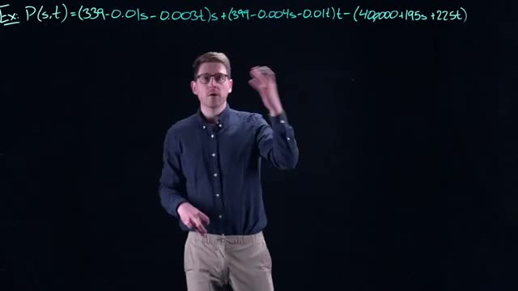
*[02:00](https://www.youtube.com/watch?v=SY6NvKj0fRM&t=120s) A mathematical example showing the function P(s,t) with several terms.*


This function is quadratic in $s$ and $t$. The first term $(339 - 0.01s - 0.003t)s$ represents the revenue from 19-inch televisions. The second term $(399 - 0.004s - 0.01t)t$ represents the revenue from 21-inch televisions. The subtracted term $(400000 + 195s + 225t)$ represents the production costs, where $400,000$ is a base cost, $195s$ is the per-unit production cost for 19-inch sets, and $225t$ is the per-unit production cost for 21-inch sets.

In the earlier unconstrained optimization, you found the optimum by computing the gradient of $P$ and setting it equal to zero. Now we add constraints to make the problem more realistic.

### The Constraints

We have five constraints that define the feasible region, which is the set of all production quantities $(s,t)$ that are physically possible.


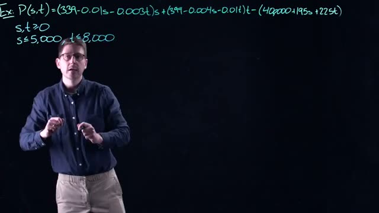
*[03:20](https://www.youtube.com/watch?v=SY6NvKj0fRM&t=200s) A mathematical example showing the profit function P(s,t) with constraints on s and t.*


**Constraint 1: Non-negativity.** You cannot produce a negative number of televisions. This gives:

$$s \geq 0, \quad t \geq 0$$

**Constraint 2: Production capacity for 19-inch sets.** The factory has enough material to produce at most 5,000 of the 19-inch sets. This depends on the amount of material the company can obtain from suppliers:

$$s \leq 5,000$$

**Constraint 3: Production capacity for 21-inch sets.** The factory has enough material to produce at most 8,000 of the 21-inch sets:

$$t \leq 8,000$$

**Constraint 4: Circuit board capacity.** Both television models use the same internal circuit board, which comes from a single supplier. The supplier can provide only 10,000 circuit boards per year. Since each television requires one circuit board, the total number of televisions produced cannot exceed 10,000:

$$s + t \leq 10,000$$


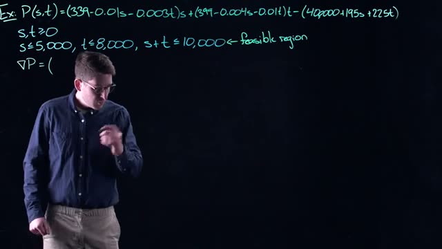
*[05:00](https://www.youtube.com/watch?v=SY6NvKj0fRM&t=300s) A whiteboard shows an example problem with a profit function P(s,t) and constraints defining a feasible region.*


These five constraints together define the feasible region. The feasible region is the set of all $(s,t)$ pairs that satisfy all constraints simultaneously.

### The Gradient of the Profit Function

To apply the method of Lagrange multipliers, you first need the gradient of the profit function $P(s,t)$. The gradient, denoted $\nabla P$, is a vector containing the partial derivatives of $P$ with respect to each variable.

We computed this gradient in the earlier video. The partial derivative with respect to $s$ is:

$$\frac{\partial P}{\partial s} = 144 - 0.02s - 0.007t$$

The partial derivative with respect to $t$ is:

$$\frac{\partial P}{\partial t} = 174 - 0.007s - 0.02t$$

Therefore, the gradient vector is:

$$\nabla P(s,t) = \begin{pmatrix} 144 - 0.02s - 0.007t \\ 174 - 0.007s - 0.02t \end{pmatrix}$$

This gradient will be used in the Lagrange multiplier equations to find the optimal production quantities subject to the constraints.

### Summary of the Problem Setup

| Component | Expression |
|-----------|------------|
| Profit function $P(s,t)$ | $(339 - 0.01s - 0.003t)s + (399 - 0.004s - 0.01t)t - (400000 + 195s + 225t)$ |
| Variables | $s$ = number of 19-inch TVs, $t$ = number of 21-inch TVs |
| Constraints | $s \geq 0$, $t \geq 0$, $s \leq 5,000$, $t \leq 8,000$, $s + t \leq 10,000$ |
| Gradient $\nabla P$ | $\begin{pmatrix} 144 - 0.02s - 0.007t \\ 174 - 0.007s - 0.02t \end{pmatrix}$ |

### Check Your Understanding

1. What does the constraint $s + t \leq 10,000$ represent in this problem?

<details><summary>Answer</summary>
This constraint represents the circuit board capacity. Both television models use the same internal circuit board, and the supplier can provide only 10,000 circuit boards per year. Therefore, the total number of televisions produced (both 19-inch and 21-inch combined) cannot exceed 10,000.
</details>

2. Why is the gradient of the profit function needed for the Lagrange multiplier method?

<details><summary>Answer</summary>
The gradient of the profit function is needed because the Lagrange multiplier method works by setting the gradient of the objective function equal to a linear combination of the gradients of the constraint functions. The gradient provides the direction of steepest ascent for the profit function, and the method finds points where this direction is balanced against the constraints.
</details>

3. How many constraints define the feasible region, and what are they?

<details><summary>Answer</summary>
Five constraints define the feasible region:
1. $s \geq 0$ (non-negativity for 19-inch sets)
2. $t \geq 0$ (non-negativity for 21-inch sets)
3. $s \leq 5,000$ (production capacity for 19-inch sets)
4. $t \leq 8,000$ (production capacity for 21-inch sets)
5. $s + t \leq 10,000$ (circuit board capacity)
</details>
## Gradient of the Profit Function and the Lagrange Multiplier Setup

This section covers the mathematical foundation for solving constrained optimization problems using Lagrange multipliers. You will learn how to compute gradients, set up the Lagrange multiplier equation, and reduce the system of equations using the constraint.

### Computing the Gradient of the Profit Function

The profit function $P(s,t)$ is given by:

$$
P(s,t) = (339 - 0.01s - 0.003t)s + (399 - 0.004s - 0.01t)t - (400000 + 195s + 225t)
$$

The gradient of $P$, denoted $\nabla P$, is a vector containing the partial derivatives of $P$ with respect to each variable. The first component is the partial derivative with respect to $s$, and the second component is the partial derivative with respect to $t$.


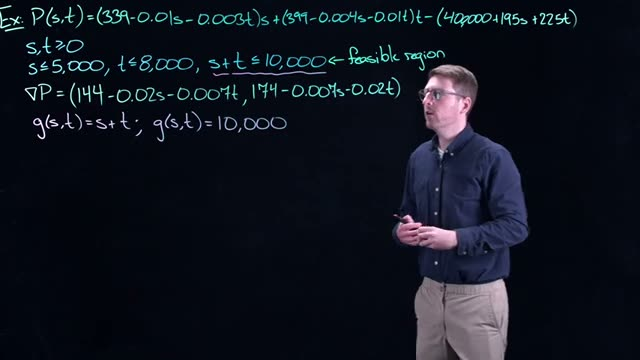
*[06:20](https://www.youtube.com/watch?v=SY6NvKj0fRM&t=380s) This frame displays mathematical equations for P(s,t), constraints for s and t, the gradient of P, and the function g(s,t) with a feasible region indicated.*


From the whiteboard at 06:20, the gradient of the profit function is:

$$
\nabla P = \left(144 - 0.02s - 0.007t, \; 174 - 0.007s - 0.02t\right)
$$

The gradient $\nabla P$ points in the direction of steepest increase for the function $P$. If you want to maximize profit, you must follow the direction of the gradient.

### Defining the Constraint Function

The most interesting constraint is the one that ties the two variables together. Define the constraint function $g(s,t)$ as:

$$
g(s,t) = s + t
$$

The constraint is that $g(s,t) = 10,000$, which represents the production capacity limit. This constraint forms a line in the feasible region.

The gradient of $g$ is straightforward to compute:

$$
\nabla g = \left( \frac{\partial g}{\partial s}, \frac{\partial g}{\partial t} \right) = (1, 1)
$$


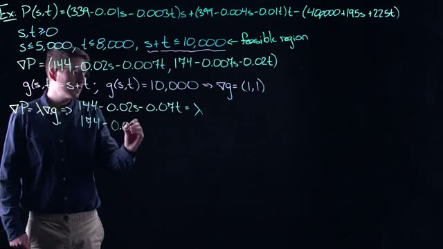
*[07:20](https://www.youtube.com/watch?v=SY6NvKj0fRM&t=440s) A whiteboard shows the profit function P(s,t) and its gradient, along with constraints defining the feasible region and the setup for Lagrange multipliers.*


The gradient $\nabla g$ runs perpendicular (orthogonal) to the level set given by the constraint $g(s,t) = 10,000$. This geometric relationship is essential for understanding the Lagrange multiplier method.

### Setting Up the Lagrange Multiplier Equation

The Lagrange multiplier equation states that at the optimal point, the gradient of the profit function is parallel to the gradient of the constraint function:

$$
\nabla P = \lambda \nabla g
$$

where $\lambda$ (lambda) is the Lagrange multiplier. This equation captures the condition that the only way to increase profit is by moving off the constraint line, because the gradient of $P$ must be orthogonal to the level curve of the constraint.

Substituting the gradients into the equation gives:

$$
\left(144 - 0.02s - 0.007t, \; 174 - 0.007s - 0.02t\right) = \lambda (1, 1)
$$

This vector equation yields two scalar equations:

$$
144 - 0.02s - 0.007t = \lambda \tag{1}
$$

$$
174 - 0.007s - 0.02t = \lambda \tag{2}
$$

### Reducing the System Using the Constraint

The system currently has three unknowns: $s$, $t$, and $\lambda$. However, the constraint $g(s,t) = 10,000$ provides an additional equation:

$$
s + t = 10,000
$$


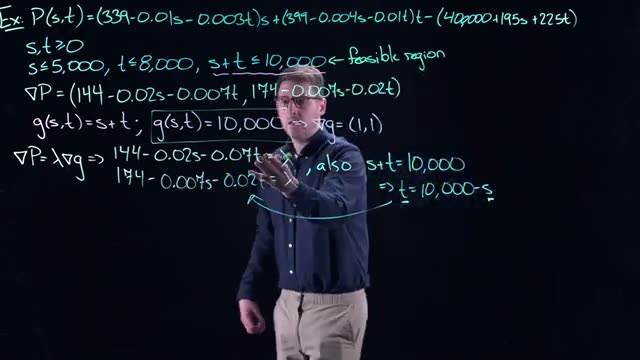
*[09:20](https://www.youtube.com/watch?v=SY6NvKj0fRM&t=560s) A whiteboard displays a complex mathematical problem involving profit function P(s,t), constraints, and the gradient of P and g, with a step showing the substitution of t=10,000-s.*


From this constraint, you can express $t$ in terms of $s$:

$$
t = 10,000 - s
$$

Substituting this relationship into equations (1) and (2) reduces the system to two equations with two unknowns ($s$ and $\lambda$). This substitution eliminates $t$ from the Lagrange multiplier equations.

The reduced system becomes:

$$
144 - 0.02s - 0.007(10,000 - s) = \lambda
$$

$$
174 - 0.007s - 0.02(10,000 - s) = \lambda
$$

### Solving the System

To solve for $s$ and $\lambda$, follow these steps:

1. Simplify each equation by distributing the coefficients.
2. Set the two expressions for $\lambda$ equal to each other.
3. Solve for $s$.
4. Substitute the value of $s$ back into either equation to find $\lambda$.
5. Use $t = 10,000 - s$ to find $t$.

The geometric interpretation to keep in mind: the Lagrange multiplier equation ensures that the gradient of $P$ is parallel to the gradient of $g$. When these gradients are parallel, moving along the constraint line does not increase profit. The only way to increase profit would be to move off the constraint line, which is not allowed because you must satisfy the constraint.

### Check Your Understanding

1. What does the gradient $\nabla P$ represent geometrically, and why is it important for optimization?

<details><summary>Answer</summary>
The gradient $\nabla P$ points in the direction of steepest increase of the profit function $P$. To maximize profit, you must move in the direction of the gradient. However, when constrained, you can only move along the constraint line, so the optimal point occurs where the gradient of $P$ is parallel to the gradient of the constraint $g$.
</details>

2. Why does the Lagrange multiplier equation $\nabla P = \lambda \nabla g$ use the gradient of the constraint function $g$?

<details><summary>Answer</summary>
The gradient $\nabla g$ is perpendicular (orthogonal) to the level set of the constraint $g(s,t) = 10,000$. At the optimal point, the gradient of $P$ must also be perpendicular to the constraint line, meaning it is parallel to $\nabla g$. This ensures that moving along the constraint does not increase profit, which is the condition for a constrained optimum.
</details>

3. How does substituting $t = 10,000 - s$ help solve the system of equations?

<details><summary>Answer</summary>
The substitution reduces the number of unknowns from three ($s$, $t$, $\lambda$) to two ($s$, $\lambda$). By expressing $t$ in terms of $s$, you can eliminate $t$ from the Lagrange multiplier equations, leaving a system of two equations in two unknowns that can be solved directly.
</details>

4. What is the geometric interpretation of the condition $\nabla P = \lambda \nabla g$?

<details><summary>Answer</summary>
The condition means that the gradient of $P$ is parallel to the gradient of $g$. Since $\nabla g$ is perpendicular to the constraint line, $\nabla P$ must also be perpendicular to the constraint line. This implies that moving along the constraint does not change the profit, which is the necessary condition for a maximum or minimum on the constraint.
</details>
## Solving the Lagrange Multiplier Equations

The Lagrange multiplier method transforms a constrained optimization problem into a system of equations. For the production problem, we have the profit function $P(s,t)$ and the constraint $g(s,t)=s+t=10,000$. The gradient of $P$ is

$$
\nabla P = \left(144 - 0.02s - 0.007t,\; 174 - 0.007s - 0.02t\right).
$$

The gradient of the constraint function $g(s,t)=s+t$ is $\nabla g = (1,1)$. The Lagrange multiplier condition states that at an optimum, $\nabla P$ must be parallel to $\nabla g$, i.e., there exists a scalar $\lambda$ such that

$$
\nabla P = \lambda \nabla g.
$$

This gives two equations:

$$
144 - 0.02s - 0.007t = \lambda \tag{1}
$$
$$
174 - 0.007s - 0.02t = \lambda \tag{2}
$$

together with the constraint

$$
s + t = 10,000. \tag{3}
$$

Because both (1) and (2) equal $\lambda$, we can set their left-hand sides equal to each other:

$$
144 - 0.02s - 0.007t = 174 - 0.007s - 0.02t.
$$

Simplify by moving terms:

$$
144 - 174 = -0.007s + 0.02s -0.02t + 0.007t
$$
$$
-30 = 0.013s - 0.013t.
$$

Divide both sides by $0.013$:

$$
-30 / 0.013 = s - t.
$$

Since $30 / 0.013 = 30 \times (1000/13) = 30000/13 \approx 2307.69$, we have

$$
s - t = -\frac{30000}{13}.
$$

Now use the constraint $t = 10,000 - s$ from (3). Substitute:

$$
s - (10,000 - s) = -\frac{30000}{13}
$$
$$
2s - 10,000 = -\frac{30000}{13}.
$$

Add $10,000$ to both sides (note $10,000 = 130000/13$):

$$
2s = 10,000 - \frac{30000}{13} = \frac{130000}{13} - \frac{30000}{13} = \frac{100000}{13}.
$$

Thus

$$
s = \frac{50000}{13} \approx 3,846.
$$

Then $t = 10,000 - s = 10,000 - \frac{50000}{13} = \frac{130000}{13} - \frac{50000}{13} = \frac{80000}{13} \approx 6,154$.

These values satisfy the constraint: $3,846 + 6,154 = 10,000$.

Now compute $\lambda$ using equation (1):

$$
\lambda = 144 - 0.02\left(\frac{50000}{13}\right) - 0.007\left(\frac{80000}{13}\right).
$$

Calculate each term:

$$
0.02 \times \frac{50000}{13} = \frac{1000}{13}, \quad 0.007 \times \frac{80000}{13} = \frac{560}{13}.
$$

So

$$
\lambda = 144 - \frac{1000}{13} - \frac{560}{13} = 144 - \frac{1560}{13}.
$$

Since $144 = \frac{1872}{13}$, we have

$$
\lambda = \frac{1872 - 1560}{13} = \frac{312}{13} = 24.
$$

The positive value $\lambda = 24$ indicates that $\nabla P$ points in the same direction as $\nabla g$ at this point. Geometrically, the level curve of $P$ is tangent to the constraint line, and the gradient of $P$ is aligned with the gradient of $g$.


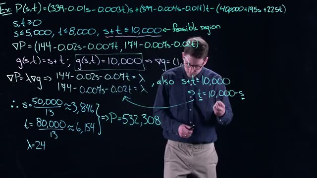
*[11:20](https://www.youtube.com/watch?v=SY6NvKj0fRM&t=680s) This frame shows the mathematical derivation of optimal values for s and t, and the resulting profit P, using Lagrange multipliers.*


The profit at this candidate point is

$$
P(3,846, 6,154) = \$532,308.
$$

This is the maximum along the constraint $s+t=10,000$ only if it is not dominated by the endpoints of that line segment. The feasible region also imposes $s \leq 5,000$ and $t \leq 8,000$, so the line segment $s+t=10,000$ is bounded by the intersection with those upper bounds. The two endpoints are:

* When $s = 5,000$, then $t = 5,000$ (because $5,000 + 5,000 = 10,000$).
* When $t = 8,000$, then $s = 2,000$ (because $2,000 + 8,000 = 10,000$).


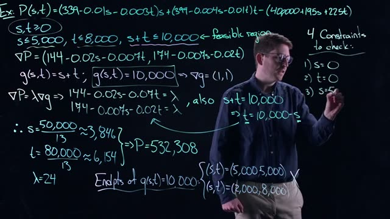
*[14:00](https://www.youtube.com/watch?v=SY6NvKj0fRM&t=840s) A whiteboard shows the calculation of P(s,t) with several constraints and the final values for s, t, and P.*


Evaluating $P$ at these endpoints gives lower profits than $\$532,308$. Therefore the interior point $(3,846, 6,154)$ is the maximum along the constraint $s+t=10,000$.

However, this is not the final answer. The feasible region is defined by four inequality constraints:

1. $s \geq 0$
2. $t \geq 0$
3. $s \leq 5,000$
4. $t \leq 8,000$

We have only considered the constraint $s+t \leq 10,000$ as an equality. The candidate $(3,846, 6,154)$ satisfies all four inequalities, but we must also check whether the maximum of $P$ over the entire feasible region occurs on one of the other boundaries. That means we must solve four additional single-variable optimization problems, each obtained by fixing one of the inequality constraints to its boundary value:

* Set $s = 0$ and optimize $P(0,t)$ for $t$ between $0$ and $8,000$.
* Set $t = 0$ and optimize $P(s,0)$ for $s$ between $0$ and $5,000$.
* Set $s = 5,000$ and optimize $P(5,000,t)$ for $t$ between $0$ and $5,000$ (since $s+t \leq 10,000$ forces $t \leq 5,000$ when $s=5,000$).
* Set $t = 8,000$ and optimize $P(s,8,000)$ for $s$ between $0$ and $2,000$ (since $s+t \leq 10,000$ forces $s \leq 2,000$ when $t=8,000$).


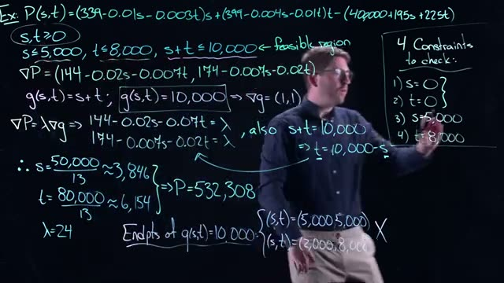
*[14:40](https://www.youtube.com/watch?v=SY6NvKj0fRM&t=880s) A whiteboard shows a complex mathematical problem involving profit maximization with constraints, including the profit function P(s,t), partial derivatives, and a list of four constraints to check.*


These are all standard single-variable optimization problems. The only case that required Lagrange multipliers was the non-trivial constraint $s+t=10,000$, because it involves both variables in a coupled way. The other constraints reduce to optimizing a function of one variable over a closed interval, which can be done by checking critical points and endpoints.

### Check your understanding

1. Why is the Lagrange multiplier $\lambda$ positive in this solution? What does the sign tell you about the relationship between $\nabla P$ and $\nabla g$?

<details><summary>Answer</summary>
$\lambda = 24 > 0$ means $\nabla P$ is parallel to $\nabla g$ and points in the same direction. Geometrically, the level curve of $P$ is tangent to the constraint line, and increasing $P$ moves in the same direction as increasing $g$ (i.e., outward from the origin along the constraint).
</details>

2. The endpoints of the constraint $s+t=10,000$ are $(5,000,5,000)$ and $(2,000,8,000)$. Why are these the only endpoints, and not $(10,000,0)$ or $(0,10,000)$?

<details><summary>Answer</summary>
The feasible region also includes the upper bounds $s \leq 5,000$ and $t \leq 8,000$. The line $s+t=10,000$ intersects these bounds at $s=5,000$ (giving $t=5,000$) and $t=8,000$ (giving $s=2,000$). Points like $(10,000,0)$ violate $s \leq 5,000$, so they are not in the feasible region.
</details>

3. After finding the candidate on $s+t=10,000$, why must we check the other four constraints? Could the maximum occur on one of them instead?

<details><summary>Answer</summary>
Yes. The candidate is only a maximum along the single constraint $s+t=10,000$. The overall maximum over the entire feasible region could lie on a different boundary (e.g., $s=5,000$ or $t=8,000$) or at a corner. Each boundary must be examined separately to confirm the global optimum.
</details>
## Checking All Boundary Constraints and Finding the Global Optimum

The feasible region for the production problem is the set of all points $(s,t)$ satisfying the following constraints (from the whiteboard 
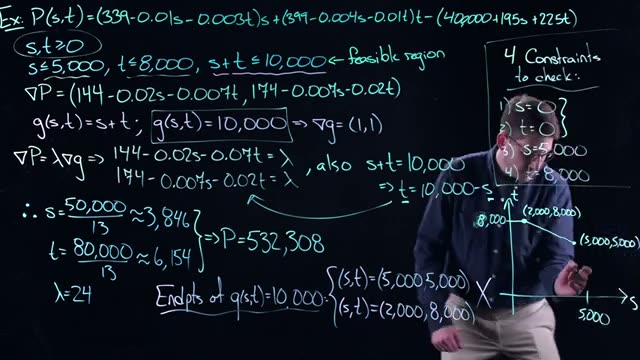
*[16:40](https://www.youtube.com/watch?v=SY6NvKj0fRM&t=1000s) A whiteboard shows the profit function P(s,t) and constraints for s and t, along with calculations for the gradient, lambda, and endpoints of g(s,t)=10,000, and a graph plotting the feasible region.*
):

```
s,t >= 0
s <= 5,000
t <= 8,000
s + t <= 10,000
```

The profit function is

$$
P(s,t) = (339 - 0.01s - 0.003t)s + (399 - 0.004s - 0.01t)t - (40,000 + 195s + 225t).
$$

The gradient of $P$ is

$$
\nabla P = (144 - 0.02s - 0.007t,\; 174 - 0.007s - 0.02t).
$$

Setting $\nabla P = \mathbf{0}$ (the unconstrained critical point) gives a solution that lies outside the feasible region. Therefore, no interior point of the feasible region can be a maximum or minimum. All optima must lie on the boundary of the feasible region.

The boundary consists of four line segments (the constraints) plus the edges of the region where two constraints meet. To find the global optimum, we systematically check each boundary segment.

### 1. Checking the constraint $s = 0$

Substitute $s = 0$ into $P$ to obtain a function of $t$ only. Find the maximum of this one-dimensional function on the interval $0 \leq t \leq 8,000$ (since $s=0$ and $t \leq 8,000$ and $s+t \leq 10,000$ becomes $t \leq 10,000$). Include the endpoints $t=0$ and $t=8,000$ as candidates.

### 2. Checking the constraint $t = 0$

Substitute $t = 0$ into $P$ and maximize over $s$ on $0 \leq s \leq 5,000$ (since $s \leq 5,000$ and $s+0 \leq 10,000$). Include endpoints $s=0$ and $s=5,000$.

### 3. Checking the constraint $s = 5,000$

Substitute $s = 5,000$ into $P$. The remaining variable $t$ is bounded by $0 \leq t \leq 8,000$ and also $5,000 + t \leq 10,000$ i.e. $t \leq 5,000$. So the feasible interval for $t$ is $0 \leq t \leq 5,000$. Include the endpoints $t=0$ and $t=5,000$.

### 4. Checking the constraint $t = 8,000$

Substitute $t = 8,000$ into $P$. The variable $s$ is bounded by $0 \leq s \leq 5,000$ and $s + 8,000 \leq 10,000$ i.e. $s \leq 2,000$. So the feasible interval is $0 \leq s \leq 2,000$. Include endpoints $s=0$ and $s=2,000$.

### 5. Checking the interior of the constraint $s + t = 10,000$

The line $s + t = 10,000$ is a boundary of the feasible region. Along this line, we can use the method of Lagrange multipliers because the constraint is an equality. The constraint function is $g(s,t) = s + t$, with $\nabla g = (1,1)$. The Lagrange multiplier condition $\nabla P = \lambda \nabla g$ gives the system:

$$
144 - 0.02s - 0.007t = \lambda, \quad 174 - 0.007s - 0.02t = \lambda, \quad s + t = 10,000.
$$

Solving yields (as shown on the whiteboard 

*[17:40](https://www.youtube.com/watch?v=SY6NvKj0fRM&t=1060s) This frame shows a whiteboard with mathematical equations and a graph related to optimization problems, including a profit function P(s,t), constraints, partial derivatives, and a feasible region.*
):

$$
s = \frac{50,000}{13} \approx 3,846,\qquad t = \frac{80,000}{13} \approx 6,154,\qquad \lambda = 24.
$$

The profit at this candidate point is $P = 532,308$.

The endpoints of the line segment $s+t=10,000$ within the feasible region are also candidates:

- $(s,t) = (5,000, 5,000)$ where $s=5,000$ and $t=5,000$ (satisfies $s \leq 5,000$, $t \leq 8,000$).
- $(s,t) = (2,000, 8,000)$ where $s=2,000$ and $t=8,000$ (satisfies $s \leq 5,000$, $t \leq 8,000$).

### Finding the Global Optimum

After evaluating $P$ at all candidate points obtained from the five boundary checks (including the endpoints of each segment), the highest profit is found at the Lagrange multiplier point $(3,846, 6,154)$ with $P = 532,308$. The video notes that this is the maximum, as shown approximately on the graph .

### Sensitivity Analysis (Introduction)

Once an optimum is found, the next step in mathematical modeling is to perform sensitivity analysis. This examines how the optimum changes if a constraint parameter is varied. For example, consider the constraint $g(s,t) = s + t = c$, where $c$ is a constant. The Lagrange multiplier $\lambda = 24$ provides a measure of how much the optimal profit would change if the total production capacity $c$ were increased by one unit. (This is the shadow price of the constraint.)

---

  
*Whiteboard: profit function, constraints, gradient, Lagrange multiplier setup, and graph of feasible region.*

```
Ex: P(s,t)=(339-0.01s-0.003t)s+(399-0.004s-0.01t)t-(40,000+195s+225t)
s,t>=0
s<=5,000, t<=8,000, s+t<=10,000 <- feasible region
VP=(144-0.02s-0.007t, 174-0.007s-0.02t)
g(s,t)=s+t; g(s,t)=10,000 => Vg=(1,1)
VP=lambdaVg => 144-0.02s-0.07t=lambda, also s+t=10,000
174-0.007s-0.02t=lambda => t=10,000-s
.: s=50,000/13 ~=3,846
t=80,000/13 ~=6,154 } =>P=532,308
lambda=24
Endpoints of g(s,t)=10,000: {(s,t)=(5,000,5,000)
(s,t)=(2,000,8,000)}
4 Constraints to check:
1) s=0
2) t=0
3) s=5,000
4) t=8,000
```

  
*Whiteboard: same equations with graph indicating the optimum.*

---

### Check your understanding

1. Why is it necessary to check all boundary constraints instead of only the Lagrange multiplier candidate on the line $s+t=10,000$?

   <details><summary>Answer</summary>
   The Lagrange multiplier method finds candidates only on the equality constraint $s+t=10,000$. The global optimum could also lie on other boundaries (e.g., $s=0$, $t=0$, $s=5,000$, $t=8,000$) or at the intersection points of boundaries. All such candidates must be evaluated to determine the true maximum or minimum.
   </details>

2. The Lagrange multiplier solution gave $\lambda = 24$. What does this value tell you about the constraint $s+t \leq 10,000$?

   <details><summary>Answer</summary>
   $\lambda = 24$ is the shadow price of the constraint. It indicates that if the total production capacity $c$ (the right-hand side of $s+t=10,000$) were increased by one unit, the optimal profit would increase by approximately $24$ (assuming the change is small and the same constraints remain binding).
   </details>

3. List all the candidate points that must be checked when optimizing over the feasible region defined by $s,t \geq 0$, $s \leq 5,000$, $t \leq 8,000$, $s+t \leq 10,000$.

   <details><summary>Answer</summary>
   The candidate points come from:
   - Unconstrained critical point (if inside region): here it is outside.
   - Lagrange multiplier candidate on $s+t=10,000$: $(3846,6154)$.
   - Endpoints of the line $s+t=10,000$: $(5000,5000)$ and $(2000,8000)$.
   - Boundaries $s=0$: maximize $P(0,t)$ for $0 \leq t \leq 8000$; include endpoints $t=0$ and $t=8000$.
   - Boundaries $t=0$: maximize $P(s,0)$ for $0 \leq s \leq 5000$; include endpoints $s=0$ and $s=5000$.
   - Boundaries $s=5000$: maximize $P(5000,t)$ for $0 \leq t \leq 5000$; include endpoints $t=0$ and $t=5000$.
   - Boundaries $t=8000$: maximize $P(s,8000)$ for $0 \leq s \leq 2000$; include endpoints $s=0$ and $s=2000$.
   </details>

4. Why is the unconstrained critical point (where $\nabla P = \mathbf{0}$) not a candidate for the optimum in this problem?

   <details><summary>Answer</summary>
   The unconstrained critical point lies outside the feasible region (it does not satisfy all constraints). Therefore, it cannot be a feasible solution. The optimum must be inside or on the boundary of the feasible region. Since the interior has no critical point, the optimum must be on the boundary.
   </details>
## Sensitivity Analysis: Treating the Constraint as a Variable

In this section we extend the previous analysis by treating the constraint constant $c$ (the number of circuit boards available) as a variable. This allows us to measure how the optimal solution changes when the constraint changes. The result is called **sensitivity analysis**, and it leads to the concept of a **shadow price** (the rate of change of the optimal profit with respect to the constraint).

We start with the same Lagrange multiplier condition:

$$
\nabla P = \lambda \nabla g
$$

where $P(s,t)$ is the profit function and $g(s,t) = s + t = c$ is the constraint. We already computed $\nabla P$ earlier in the course. The gradient of $g$ is $\nabla g = (1,1)$.

Substitute $t = c - s$ into the constraint (since $s + t = c$). Then solve the Lagrange multiplier equations with $c$ treated as a parameter, not a fixed number.


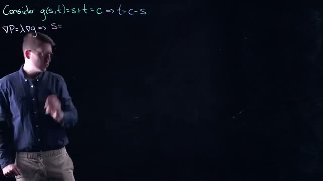
*[20:00](https://www.youtube.com/watch?v=SY6NvKj0fRM&t=1200s) A whiteboard shows the equations for g(s,t) and the start of a gradient calculation.*
  
The whiteboard shows the beginning of this calculation:

```
Consider g(s,t)=s+t=c => t=c-s
∇P=λ∇g => S=
```

The full solution (shown in the next screenshot) yields the following expressions for the optimal $s$, $t$, and $\lambda$ as linear functions of $c$:


*[21:40](https://www.youtube.com/watch?v=SY6NvKj0fRM&t=1300s) A whiteboard shows mathematical equations for g(s,t), s, t, and lambda, with the speaker gesturing.*
  
The whiteboard displays the completed formulas:

```
Consider g(s,t) = s+t = c => t = c-s
∇P = λ∇g => s = (13c - 30,000) / 26
t = (13c + 30,000) / 26
λ = 3(106,000 - 9c) / 2,000
```

In LaTeX:

$$
s(c) = \frac{13c - 30,000}{26}, \qquad
t(c) = \frac{13c + 30,000}{26}, \qquad
\lambda(c) = \frac{3(106,000 - 9c)}{2,000}.
$$

These are all **linear functions of $c$**, so their derivatives are constants. The derivative of $s$ with respect to $c$ is

$$
\frac{ds}{dc} = \frac{13}{26} = \frac{1}{2}.
$$

Similarly, $\frac{dt}{dc} = \frac{1}{2}$. The derivative of $\lambda$ with respect to $c$ is $-\frac{27}{2,000}$, but we will not need it here.

Now we evaluate the **sensitivity** of the optimal values at the original operating point $c = 10,000$. Sensitivity is a dimensionless measure that tells us the percentage change in the output ($s$ or $t$) for a given percentage change in the input ($c$). It is defined as:

$$
\text{Sensitivity of } s \text{ with respect to } c = \frac{ds}{dc} \cdot \frac{c}{s(c)}.
$$

At $c = 10,000$, the optimal $s$ is:

$$
s(10,000) = \frac{13 \cdot 10,000 - 30,000}{26} = \frac{130,000 - 30,000}{26} = \frac{100,000}{26} = \frac{50,000}{13} \approx 3846.15.
$$

Therefore the sensitivity of $s$ at $c = 10,000$ is:

$$
\frac{1}{2} \cdot \frac{10,000}{\frac{100,000}{26}} = \frac{1}{2} \cdot \frac{10,000 \cdot 26}{100,000} = \frac{1}{2} \cdot \frac{260,000}{100,000} = \frac{1}{2} \cdot 2.6 = 1.3.
$$

A sensitivity of 1.3 means that a 1% increase in the number of circuit boards $c$ leads to a 1.3% increase in the optimal number of smartphones $s$ (at least for small changes near $c = 10,000$). This tells us that the constraint is **tight** and that increasing the supply of circuit boards has a more than proportional effect on smartphone production.

The same derivative applies to $t$, but the sensitivity of $t$ is different because the baseline value $t(10,000)$ is larger:

$$
t(10,000) = \frac{13 \cdot 10,000 + 30,000}{26} = \frac{130,000 + 30,000}{26} = \frac{160,000}{26} = \frac{80,000}{13} \approx 6153.85.
$$

Sensitivity of $t$ at $c = 10,000$:

$$
\frac{1}{2} \cdot \frac{10,000}{\frac{160,000}{26}} = \frac{1}{2} \cdot \frac{10,000 \cdot 26}{160,000} = \frac{1}{2} \cdot \frac{260,000}{160,000} = \frac{1}{2} \cdot 1.625 = 0.8125.
$$

This shows that a 1% increase in $c$ causes a 0.8125% increase in tablet production $t$. The smartphone production is more sensitive because it is the smaller product at the optimum.

### Check your understanding

1. **Why do we treat $c$ as a variable in sensitivity analysis?**  
   <details><summary>Answer</summary>  
   By treating the constraint constant $c$ as a variable, we can compute how the optimal solution changes when the constraint changes. This tells us the marginal value of relaxing the constraint, which is the essence of shadow pricing.  
   </details>

2. **What is the derivative $\frac{ds}{dc}$ and what does it represent?**  
   <details><summary>Answer</summary>  
   $\frac{ds}{dc} = \frac{1}{2}$. It represents the absolute rate of change in optimal smartphone production $s$ when the number of available circuit boards $c$ increases by one unit.  
   </details>

3. **At $c=10,000$, the sensitivity of $s$ is 1.3. Interpret this number.**  
   <details><summary>Answer</summary>  
   A 1% increase in the number of circuit boards (from 10,000 to 10,100) leads to approximately a 1.3% increase in the optimal number of smartphones (from 3846.15 to about 3896). So smartphone production is more than proportionally responsive to changes in the constraint.  
   </details>

4. **Why is the sensitivity of $t$ smaller than the sensitivity of $s$ at $c=10,000$?**  
   <details><summary>Answer</summary>  
   The derivative $\frac{dt}{dc}$ is the same as $\frac{ds}{dc}$ ($1/2$), but the baseline value $t(10,000)$ is larger than $s(10,000)$. Since sensitivity is $\frac{dt}{dc} \cdot \frac{c}{t}$, a larger denominator $t$ makes the sensitivity smaller. The same absolute change in production is a smaller relative change for the larger product.  
   </details>
## The Derivative of Profit and the Shadow Price

### 1. Sensitivity of the Optimal Production Mix to the Resource Constraint

We already derived the optimal production levels as functions of the resource constraint $c$ (the total number of TVs that can be produced):

$$
s(c) = \frac{13c - 30,000}{26}, \qquad
t(c) = \frac{13c + 30,000}{26}.
$$

From these, the derivatives with respect to $c$ are:

$$
\frac{ds}{dc} = \frac{13}{26} = \frac{1}{2}, \qquad
\frac{dt}{dc} = \frac{13}{26} = \frac{1}{2}.
$$


*[23:00](https://www.youtube.com/watch?v=SY6NvKj0fRM&t=1380s) The whiteboard shows mathematical equations for g(s,t), P, S, t, and lambda, along with a calculation for Sensitivities S(s,c).*


The whiteboard shows these expressions and the first sensitivity calculation.  
A 1% change in $c$ (which is 10 units when $c = 10,000$) causes a change in $s$ of about $0.5 \times 10 = 5$ units. To express this as a **sensitivity** (a dimensionless elasticity), we use the formula:

$$
S(x,c) = \frac{dx}{dc} \cdot \frac{c}{x}.
$$

For $s$ at $c = 10,000$ and optimal $s = 3,846$:

$$
S(s,c) = \frac{1}{2} \cdot \frac{10,000}{3,846} \approx 1.3.
$$

Interpretation: a 1% increase in the resource $c$ (from 10,000 to 10,100) yields about a 1.3% increase in the optimal number of 19-inch TVs, i.e., roughly 30 more TVs.


*[24:00](https://www.youtube.com/watch?v=SY6NvKj0fRM&t=1440s) This frame shows mathematical equations for g(s,t), P, S, t, and λ, along with sensitivity calculations for S(s,c) and S(t,c).*


For $t$ at $c = 10,000$ and optimal $t = 6,154$:

$$
S(t,c) = \frac{1}{2} \cdot \frac{10,000}{6,154} \approx 0.8.
$$

A 1% increase in $c$ yields about a 0.8% increase in the optimal number of 23-inch TVs, i.e., roughly 60 more TVs. The sensitivities are small, indicating that the optimal production mix is not highly sensitive to changes in the resource constraint.

### 2. Derivative of Optimal Profit with Respect to the Constraint

We now ask: how does the maximum profit $P(s,t)$ change when we change the resource constraint $c$? Because the optimal $s$ and $t$ themselves depend on $c$, the total derivative of profit with respect to $c$ is given by the **chain rule**:

$$
\frac{dP}{dc} = \frac{\partial P}{\partial s} \cdot \frac{ds}{dc} + \frac{\partial P}{\partial t} \cdot \frac{dt}{dc} + \frac{\partial P}{\partial c}.
$$


*[25:00](https://www.youtube.com/watch?v=SY6NvKj0fRM&t=1500s) A person writes mathematical equations on a whiteboard, including calculations for sensitivities and partial derivatives.*


The whiteboard shows this chain rule expression. Notice that the profit function $P(s,t)$ does **not** explicitly depend on $c$; the resource cap enters only through the constraint. Therefore $\frac{\partial P}{\partial c} = 0$. All variation in profit is implicit, arising from the changes in the optimal production levels.

We already know $\frac{ds}{dc} = \frac{dt}{dc} = \frac{1}{2}$. The partial derivatives $\frac{\partial P}{\partial s}$ and $\frac{\partial P}{\partial t}$ can be computed from the profit function (not shown in this section, but assumed known). When we evaluate them at the optimal point and multiply by $\frac{1}{2}$, we obtain:

$$
\frac{dP}{dc} = 24.
$$


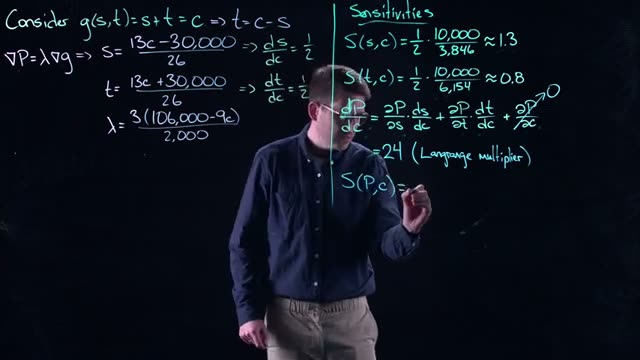
*[26:40](https://www.youtube.com/watch?v=SY6NvKj0fRM&t=1600s) The whiteboard displays mathematical equations for sensitivities and Lagrange multipliers, including calculations for S(s,c), S(t,c), and the derivative of P with respect to c.*


The whiteboard shows the result: $dP/dc = 24$. This number is not arbitrary; it is exactly the **Lagrange multiplier** $\lambda$ from the constrained optimization problem. Recall that at the optimum, $\nabla P = \lambda \nabla g$, and the Lagrange multiplier measures the rate of change of the optimal objective value with respect to a change in the constraint. Here we have derived it directly from the chain rule, confirming that $\lambda = \frac{dP}{dc}$.

### 3. Sensitivity of Optimal Profit to the Constraint

We now compute the sensitivity of profit with respect to $c$ in the same dimensionless form:

$$
S(P,c) = \frac{dP}{dc} \cdot \frac{c}{P_{\text{opt}}}.
$$

At $c = 10,000$, the optimal profit is $P_{\text{opt}} = 532,308$ (a value from earlier calculations). Using $\frac{dP}{dc} = 24$:

$$
S(P,c) = 24 \cdot \frac{10,000}{532,308} \approx 0.45.
$$


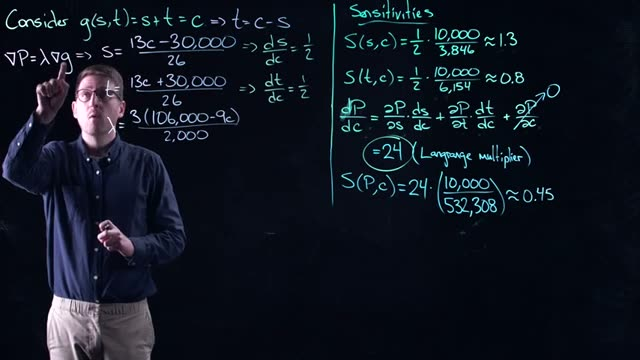
*[28:00](https://www.youtube.com/watch?v=SY6NvKj0fRM&t=1680s) This frame displays mathematical equations and calculations related to sensitivities and Lagrange multipliers, including formulas for S(s,c), S(t,c), dP/dc, and S(P,c).*


Interpretation: a 1% increase in the resource constraint (10 units) leads to only about a 0.45% increase in optimal profit. The profit is relatively insensitive to changes in the production capacity. This is a key managerial insight: small changes in the resource cap do not dramatically affect the maximum achievable profit.

### 4. Geometric Intuition: Why $\frac{dP}{dc}$ Equals $\lambda$

The gradient of the profit function, $\nabla P$, points in the direction of steepest increase of profit. The constraint $g(s,t) = s + t = c$ defines a line; its level sets are parallel lines. Changing $c$ shifts the constraint line perpendicularly (since the gradient of $g$ is constant). At the optimum, $\nabla P$ is parallel to $\nabla g$ (the Lagrange multiplier condition). Therefore, the rate at which the optimal profit changes as the constraint line moves is exactly the magnitude of $\nabla P$ along the direction of the constraint’s normal, which is $\lambda$.


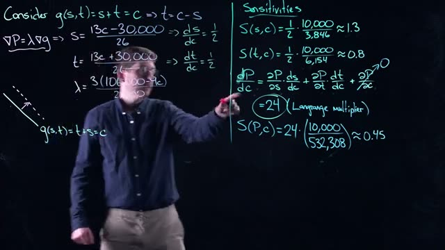
*[29:00](https://www.youtube.com/watch?v=SY6NvKj0fRM&t=1740s) This frame shows mathematical equations and calculations related to sensitivities and Lagrange multipliers, including formulas for S(s,c), S(t,c), dP/dc, and S(P,c).*
 (geometry described, not a separate screenshot)

The speaker notes: “All it does is moves upward … that’s moving in a perpendicular direction.” This geometric reasoning is why we can directly read off the shadow price $\lambda$ from the derivative of profit.

The following diagram summarizes the relationships:

```mermaid
flowchart LR
    A[Resource Constraint c] -->|change| B[Shift of constraint line]
    B --> C[New optimal point (s’,t’)]
    C --> D[New optimal profit P’]
    A -->|rate of change| E[λ = dP/dc]
    E --> F[Shadow price = Lagrange multiplier]
```

### 5. Practical Takeaway

- The Lagrange multiplier $\lambda$ is the **shadow price** of the resource: the marginal increase in maximum profit per unit increase in the resource.
- In this example, $\lambda = 24$: each additional unit of production capacity (within the relevant range) would increase profit by 24 units.
- The sensitivity measures show that the optimal production quantities and profit are not very responsive to changes in the total capacity; the company can expect only modest improvements from relaxing the constraint.

---

### Check Your Understanding

1. **Interpretation of sensitivity**  
   The sensitivity of profit with respect to the constraint is $S(P,c) \approx 0.45$. What does this tell a manager about the effect of increasing production capacity by 1%?

   <details><summary>Answer</summary>
   A 1% increase in the resource constraint (from 10,000 to 10,100 units) would increase the optimal profit by only about 0.45%. Profit is relatively inelastic with respect to capacity in this range.
   </details>

2. **Chain rule and the Lagrange multiplier**  
   Why is it possible to compute $\frac{dP}{dc}$ without explicitly knowing the profit function $P(s,t)$? What is the shortcut?

   <details><summary>Answer</summary>
   The shortcut is that $\frac{dP}{dc} = \lambda$, the Lagrange multiplier. Because the optimality condition $\nabla P = \lambda \nabla g$ implies that the only way profit changes with the constraint is through the direction of $\nabla g$; the multiplier exactly captures that rate of change.
   </details>

3. **Computing sensitivity from the derivative**  
   If the optimal profit at $c=10,000$ is 532,308 and $\frac{dP}{dc}=24$, what is the sensitivity $S(P,c)$? What does a sensitivity greater than 1 imply?

   <details><summary>Answer</summary>
   $S(P,c) = 24 \cdot \frac{10,000}{532,308} \approx 0.45$. A sensitivity greater than 1 would mean that a 1% change in the constraint leads to a more than 1% change in the output (here, profit). That would indicate high leverage.
   </details>
## Conclusion and Preview of Next Topic


*[29:00](https://www.youtube.com/watch?v=SY6NvKj0fRM&t=1740s) This frame shows mathematical equations and calculations related to sensitivities and Lagrange multipliers, including formulas for S(s,c), S(t,c), dP/dc, and S(P,c).*


The Lagrange multiplier $\lambda = 24$ that you computed in the previous section has a concrete economic interpretation. It tells you how your objective function (profit $P$) changes when you relax the constraint (the maximum number of circuit boards $c$ that can be produced). Specifically, for every one unit you change $c$, your profit changes by 24 units. This relationship comes directly from the Lagrange multiplier equation.

To understand why this is true, consider the gradient relationship. The gradient of the constraint function $g$ and the gradient of the profit function $P$ are related by:

$$\nabla g = \frac{1}{\lambda} \nabla P$$

This means that each unit you move in the direction of $\nabla g$ is equivalent to moving $\lambda$ units in the direction of $\nabla P$. Since $\nabla g$ points in the direction of changing $c$, moving one unit in that direction changes profit by $\lambda = 24$ units.

The video also demonstrates how to compute sensitivities, which measure the percentage change in one variable relative to a percentage change in another. The on-screen calculations show:

$$S(s,c) = \frac{1}{2} \cdot \frac{10,000}{3,846} \approx 1.3$$

$$S(t,c) = \frac{1}{2} \cdot \frac{10,000}{6,154} \approx 0.8$$

$$S(P,c) = 24 \cdot \frac{10,000}{532,308} \approx 0.45$$

These sensitivities tell you how responsive each variable is to changes in $c$. For example, $S(P,c) \approx 0.45$ means that a 1% increase in $c$ leads to approximately a 0.45% increase in profit.


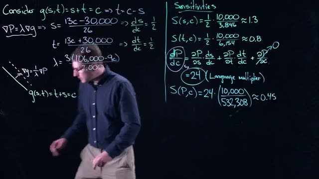
*[30:00](https://www.youtube.com/watch?v=SY6NvKj0fRM&t=1800s) A whiteboard shows mathematical equations for sensitivities and Lagrange multipliers, including calculations for S(s,c), S(t,c), and S(P,c).*


This interpretation leads directly to the concept of a **shadow price**. A shadow price is the change in the objective function (profit) per unit change in a constraint's right-hand side value. In this production problem, the shadow price of circuit boards is $\$24$ per unit.

Here is how you apply this information in practice. Suppose the circuit board company contacts you and says they can produce one more unit of circuit boards. You now know that for every one unit change in the number of circuit boards that can be produced, you gain $\$24$ in profit. You then ask yourself: will it cost me more than $\$24$ to produce another television using that additional circuit board?

- If the cost to produce another television is less than $\$24$ (for example, $\$23$), then you should accept the offer. You will make a profit of $\$1$ per television.
- If the cost to produce another television is more than $\$24$ (for example, $\$25$), then you should decline the offer. You will lose money on each television produced.

This decision rule works because the shadow price tells you the maximum amount you should be willing to pay for one additional unit of the constrained resource. The shadow price represents the marginal value of relaxing the constraint.

### Preview of Next Topic

In the next video, you will return to Newton's method and examine how it can help solve optimization problems in higher dimensions. Newton's method provides an iterative approach to finding optimal points, and extending it to multiple dimensions allows you to solve more complex constrained optimization problems efficiently.

### Check your understanding

1. What does the Lagrange multiplier $\lambda = 24$ represent in this production optimization problem?

<details>
<summary>Answer</summary>
The Lagrange multiplier $\lambda = 24$ represents the shadow price of the circuit board constraint. It means that for every one unit increase in the maximum number of circuit boards that can be produced, profit increases by $\$24$.
</details>

2. A supplier offers to provide one additional circuit board for $\$20$. Based on the shadow price, should you accept this offer? Why or why not?

<details>
<summary>Answer</summary>
Yes, you should accept the offer. The shadow price of $\$24$ means you gain $\$24$ in profit from using one additional circuit board. Since the cost of $\$20$ is less than the $\$24$ gain, you will make a profit of $\$4$ per television produced with that circuit board.
</details>

3. What does a sensitivity $S(P,c) = 0.45$ tell you about the relationship between profit and the circuit board constraint?

<details>
<summary>Answer</summary>
A sensitivity of $0.45$ means that a 1% increase in the circuit board constraint $c$ leads to approximately a 0.45% increase in profit $P$. This is a measure of the percentage responsiveness of profit to changes in the constraint.
</details>

4. If the cost to produce an additional television using a new circuit board is $\$30$, what decision should you make based on the shadow price?

<details>
<summary>Answer</summary>
You should decline the offer. The shadow price of $\$24$ represents the maximum additional profit from using one more circuit board. Since the production cost of $\$30$ exceeds the $\$24$ gain, you would lose $\$6$ on each television produced.
</details>
## Key takeaways

- The Lagrange multiplier method finds candidate optimal points by setting the gradient of the objective function parallel to the gradient of the constraint, solving the system ∇P = λ∇g.
- For the television profit problem, the Lagrange multiplier equations yield a candidate solution of s ≈ 3846, t ≈ 6154, and λ = 24 on the circuit board constraint s + t = 10000.
- A candidate point from Lagrange multipliers must be verified against all boundary constraints, including endpoints and other constraint lines, to confirm it is the global optimum.
- The global optimum occurs at the Lagrange multiplier candidate because the unconstrained maximum lies outside the feasible region, forcing the optimum onto a boundary.
- Sensitivity analysis treats the constraint bound as a variable parameter c, allowing computation of how optimal production levels change with the constraint.
- The derivative of optimal profit with respect to the constraint parameter c equals the Lagrange multiplier λ, which is 24 in this example.
- The Lagrange multiplier λ = 24 is the shadow price, meaning each additional circuit board (one unit increase in c) increases profit by $24.
- A business can use the shadow price to decide whether to increase capacity: if the cost to produce one more TV is less than $24, it is profitable to do so.
- The sensitivity of profit with respect to the constraint is low at about 0.45, meaning a 1% increase in circuit board capacity yields only a 0.45% increase in profit.
- The chain rule shows that dP/dc = λ because the profit function does not depend explicitly on c, only implicitly through s and t.
## Glossary

| Term | Definition |
|---|---|
| Lagrange multiplier | A scalar λ used in the method of Lagrange multipliers to find local maxima or minima of a function subject to equality constraints. |
| Gradient | A vector of partial derivatives of a function, denoted ∇P, that points in the direction of steepest increase of the function. |
| Constraint | A condition that limits the feasible values of decision variables in an optimization problem, such as s + t ≤ 10000. |
| Feasible region | The set of all points that satisfy all constraints of an optimization problem. |
| Shadow price | The marginal value of relaxing a constraint by one unit, equal to the Lagrange multiplier at the optimum. |
| Sensitivity analysis | The study of how the optimal solution of an optimization problem changes when a parameter of the problem is varied. |
| Partial derivative | The derivative of a multivariable function with respect to one variable while holding all other variables constant. |
| Chain rule | A formula for computing the derivative of a composite function, used here as dP/dc = (∂P/∂s)(ds/dc) + (∂P/∂t)(dt/dc). |
| Global optimum | The point in the feasible region that gives the highest (or lowest) value of the objective function among all feasible points. |
| Boundary constraint | A constraint that defines an edge or limit of the feasible region, such as s = 0 or s = 5000. |
| Endpoint | A point at the intersection of two or more boundary constraints, such as (5000, 5000) on the line s + t = 10000. |
| Profit function | A mathematical function P(s, t) that gives the total profit from producing s units of one product and t units of another. |
| Linear constraint | A constraint that can be written as a linear equation or inequality, such as s + t = 10000. |
| Optimization | The process of finding the best possible value of an objective function subject to given constraints. |
| Marginal value | The additional benefit obtained from increasing a resource by one unit, quantified by the shadow price. |
| Production capacity | The maximum amount of a product that can be produced given available resources, such as materials or labor. |
| Single-variable optimization | An optimization problem with only one decision variable, solved by finding critical points and checking endpoints. |
| Feasible point | Any point that satisfies all constraints of an optimization problem. |
| Derivative | A measure of how a function changes as its input changes, used to find rates of change and optimize functions. |
| Parameter | A variable in a model that can be adjusted, such as the constraint bound c in sensitivity analysis. |
## Footnotes and deeper context

1. **Lagrange multiplier method validity.** The Lagrange multiplier method requires that the gradient of the constraint is nonzero at the candidate point. For the constraint g(s,t) = s + t, ∇g = (1,1) is never zero, so the method is valid for all points on the line.
2. **Second-order conditions.** The video checks endpoints and other boundaries to confirm the candidate is a maximum, but a rigorous proof would also examine the bordered Hessian or second derivative test for constrained optimization to verify the nature of the critical point.
3. **Shadow price interpretation.** The shadow price of $24 per circuit board is valid only for small changes near c = 10000. For large changes, the optimal solution may shift to a different boundary, and the shadow price would change.
4. **Sensitivity formulas.** The sensitivity S(P,c) = (dP/dc) * (c/P) is a dimensionless elasticity measure. A value of 0.45 means profit is inelastic with respect to the constraint: a 1% increase in c yields only a 0.45% increase in profit.
5. **Linear functions of c.** The derived expressions for s(c), t(c), and λ(c) are linear because the profit function is quadratic and the constraint is linear. This linearity simplifies the sensitivity analysis but is not general for nonlinear constraints.
6. **Envelope theorem.** The result that dP/dc = λ is a special case of the envelope theorem, which states that the derivative of the optimal value function with respect to a parameter equals the partial derivative of the Lagrangian with respect to that parameter.
## Where to go next

- **Read about the envelope theorem in optimization.** The envelope theorem generalizes the relationship between the Lagrange multiplier and the derivative of the optimal value. See 'Mathematics for Economists' by Simon and Blume, Chapter 19, for a rigorous treatment.
- **Try solving a similar problem with nonlinear constraints.** Practice by modifying the profit function to include a nonlinear constraint, such as s^2 + t^2 = 10000. Use the same Lagrange multiplier setup and compare the shadow price interpretation.
- **Explore shadow pricing in linear programming.** Shadow prices are a core concept in linear programming. Read about duality in 'Introduction to Linear Optimization' by Bertsimas and Tsitsiklis, Chapters 4 and 5, to see how shadow prices arise from dual variables.
- **Study the bordered Hessian for second-order conditions.** To verify whether a candidate point is a maximum or minimum, compute the bordered Hessian matrix. See 'Advanced Calculus' by Kaplan, Chapter 6, for the method and examples.
---
*Printed by yt2textbook, an open tool from Zorost AI Lab. Screenshots are frames captured from the source video; each caption links to the exact moment it appears.*
