# Continuous Probability Models and the Exponential Distribution in Mathematical Modeling
> **Source:** [Continuous Probability Models - Math Modelling - Lecture 24](https://www.youtube.com/watch?v=0qi6s-injSo) by Math Modelling · 27:13 · Training document generated from the video.
**How to use this document:** read it top to bottom in place of watching the video. Screenshots appear exactly where the video depends on something visual, with links that jump to that moment. Questions at the end of each section confirm you learned the material. The glossary and footnotes add definitions and detail the video assumes you already have.
**Who this is for:** This course is for students or professionals who want to learn how to use continuous probability models, especially the exponential distribution, to analyze real-world waiting time and arrival processes.
## Learning objectives

After working through this document you can:

1. Define continuous probability distribution function and density function.
2. Compute probabilities for continuous random variables using integration of the density function.
3. Calculate the expected value of a continuous random variable.
4. Describe the exponential distribution, its density and distribution functions, and its interpretation as a waiting time model.
5. Derive and interpret the lack of memory property of the exponential distribution.
6. Model a real-world problem (radioactive decay with a locking counter) using the exponential distribution.
7. Apply the strong law of large numbers to estimate an unknown decay rate from observed data.
8. Perform sensitivity analysis on a model parameter and interpret the result in context.
## Prerequisites

- Basic calculus: integration and differentiation
- Basic probability: random variables, discrete probability models, expected value
## Introduction to Continuous Probability Models

This section shifts from discrete probability models, where a random variable takes only a finite or countable number of values (e.g., the outcome of rolling a six-sided die), to continuous probability models. In a continuous model, the random variable can take any value over an interval or the entire real line (e.g., time, length, temperature). We will define the two fundamental functions used to describe continuous random variables: the probability distribution function and the probability density function.


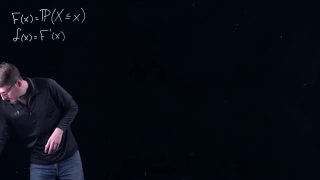
*[01:40](https://www.youtube.com/watch?v=0qi6s-injSo&t=100s) A whiteboard shows two equations for probability and functions: F(x)=TP(X<=x) and f(x)=F'(x).*


At this point, the video displays a whiteboard with the following equations:

```
F(x)=TP(X<=x)
f(x)=F'(x)
```

The equation `F(x)=TP(X<=x)` defines the **probability distribution function** (also called the cumulative distribution function, CDF). Here `X` is a continuous random variable, and `x` is a specific real number. The notation `P(X <= x)` (the video uses `TP` as a shorthand for probability) means the probability that the random variable `X` is less than or equal to `x`. Thus `F(x)` gives the probability that the random variable lies at or below the value `x`.

The second equation, `f(x)=F'(x)`, defines the **probability density function** (PDF), denoted by `f(x)`. The density function is the derivative of the distribution function. Intuitively, `f(x)` describes how probability is concentrated near each point `x`. For a continuous random variable, the probability of any single exact value is zero; instead, probability is measured over intervals.


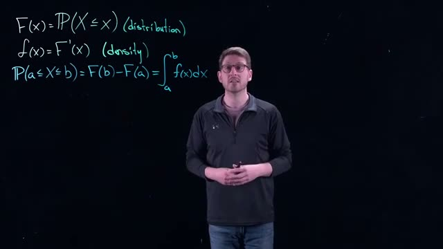
*[03:20](https://www.youtube.com/watch?v=0qi6s-injSo&t=200s) The whiteboard displays mathematical formulas for distribution, density, and probability calculations.*


The whiteboard now shows the complete set of relationships:

```
F(x)=P(X<=x)   (distribution)
f(x)=F'(x)     (density)
P(a<=X<=b)=F(b)-F(a) = ∫ f(x)dx
```

The bottom line gives the key formula for computing probabilities over an interval. For a continuous random variable `X`, the probability that `X` lies between `a` and `b` (inclusive) is:

```
P(a <= X <= b) = F(b) - F(a) = ∫_a^b f(x) dx
```

The first equality, `F(b) - F(a)`, follows from the definition of the distribution function: `F(b)` includes all probability up to `b`, and subtracting `F(a)` removes the probability below `a`. The second equality, the integral from `a` to `b` of `f(x) dx`, is a direct consequence of the Fundamental Theorem of Calculus, since `F` is the antiderivative of `f`. In practice, you are often given the density function `f(x)`, and you must integrate it over the desired interval to find probabilities. This makes continuous probability models closely tied to integration techniques.

(Added context: The density function must satisfy two properties: (1) `f(x) >= 0` for all `x`, and (2) the total area under the density curve equals 1, i.e., `∫_{-∞}^{∞} f(x) dx = 1`. These ensure that probabilities are non‑negative and sum to 1.)

### Check your understanding

1. **What is the difference between a discrete random variable and a continuous random variable?**  
   <details><summary>Answer</summary>  
   A discrete random variable can take only a finite or countable set of values (e.g., 1, 2, 3, 4, 5, 6 from a die roll). A continuous random variable can take any value within an interval or along the real line (e.g., time, distance, temperature).  
   </details>

2. **If `F(x)` is the probability distribution function of a continuous random variable, how do you obtain the density function `f(x)`?**  
   <details><summary>Answer</summary>  
   The density function is the derivative of the distribution function: `f(x) = F'(x)`.  
   </details>

3. **Write the expression for the probability that a continuous random variable `X` lies between `a` and `b` in terms of the distribution function `F` and in terms of the density function `f`.**  
   <details><summary>Answer</summary>  
   `P(a <= X <= b) = F(b) - F(a) = ∫_a^b f(x) dx`.  
   </details>
## Expected Value and the Exponential Distribution

The expected value of a continuous random variable is the long-run average of its outcomes. For a continuous random variable \(X\) with probability density function \(f(x)\), the expected value is defined as an integral that multiplies each possible value \(x\) by its density and sums over all values.

### Expected Value for Continuous Random Variables

The formula for expected value is:

\[
E(X) = \int_{-\infty}^{\infty} x \, f(x) \, dx
\]

If the random variable is restricted to positive values only (for example, waiting times), the bounds change to \(0\) to \(\infty\). The same idea applies: you integrate over the domain where the variable can exist.


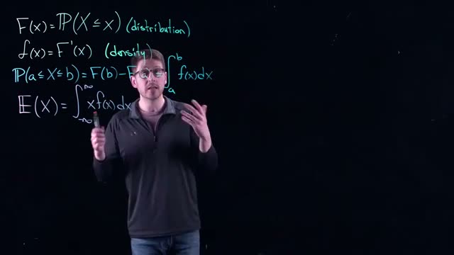
*[04:00](https://www.youtube.com/watch?v=0qi6s-injSo&t=240s) The whiteboard displays formulas for distribution, density, probability, and expected value.*


The whiteboard shows the key relationships:

```
F(x)=P(X≤x) (distribution)
f(x)=F'(x) (density)
P(a≤X≤b)=F(b)-F(a) = ∫ f(x)dx
E(X)= ∫ xf(x)dx
```

The integral representation comes from a Riemann sum. Imagine dividing the domain into many small intervals. In each interval, approximate the probability as \(f(x) \Delta x\) and multiply by the value \(x\). As the number of intervals increases, the sum converges to the integral. Think of integrals as continuous sums.

### The Exponential Distribution

The exponential distribution is a specific probability density function used to model waiting times. Let the random variable \(T\) represent time. The density function is:

\[
f(t) = \lambda e^{-\lambda t} \quad \text{for } t \geq 0
\]

Here \(\lambda\) (lambda) is a rate parameter, and \(\lambda > 0\). The larger \(\lambda\) is, the faster the density function decays to zero. The smaller \(\lambda\) is, the slower it decays.

**Interpretation:** The exponential distribution describes the time until an event occurs. For example, if customers arrive at a store at an average rate of one per hour, the probability that a customer arrives in the next minute depends on how long you have already waited. The longer you wait, the higher the probability that the event will happen soon.


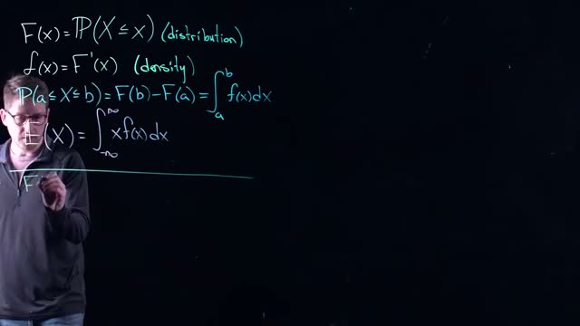
*[05:20](https://www.youtube.com/watch?v=0qi6s-injSo&t=320s) A person writes mathematical formulas on a blackboard, including definitions for distribution, density, and expected value.*


The same formulas for distribution, density, probability, and expected value are repeated on the board. The exponential density is now introduced with \(t\) as the variable.

### Computing Probabilities with the Exponential Distribution

To find the probability that the waiting time falls between two values \(a\) and \(b\) (with \(0 \leq a < b\)), use the integral:

\[
P(a \leq T \leq b) = \int_{a}^{b} \lambda e^{-\lambda t} \, dt
\]

This integral can be evaluated directly or by using the cumulative distribution function \(F(t) = 1 - e^{-\lambda t}\).

### Conditional Probability (Introduction)

The video then introduces conditional probability: the probability of an event \(A\) happening given that event \(B\) has already occurred. This concept is important for understanding the memoryless property of the exponential distribution, which will be covered later.

---

### Check your understanding

1. **What is the formula for the expected value of a continuous random variable \(X\) with density \(f(x)\)?**

<details><summary>Answer</summary>
\(E(X) = \int_{-\infty}^{\infty} x f(x) \, dx\). If the domain is restricted, change the bounds accordingly.
</details>

2. **In the exponential distribution \(f(t) = \lambda e^{-\lambda t}\), what does the parameter \(\lambda\) represent, and how does its value affect the shape of the density?**

<details><summary>Answer</summary>
\(\lambda\) is the rate parameter. A larger \(\lambda\) makes the density decay faster (shorter expected waiting time). A smaller \(\lambda\) makes the density decay slower (longer expected waiting time).
</details>

3. **Write the integral you would use to compute the probability that an exponentially distributed waiting time \(T\) (with rate \(\lambda\)) is between 1 and 3 hours.**

<details><summary>Answer</summary>
\(P(1 \leq T \leq 3) = \int_{1}^{3} \lambda e^{-\lambda t} \, dt\).
</details>

4. **How does the integral for expected value relate to a Riemann sum?**

<details><summary>Answer</summary>
The integral is the limit of a sum: divide the domain into small intervals of width \(\Delta x\), approximate the probability in each interval as \(f(x)\Delta x\), multiply by \(x\), and sum. As \(\Delta x \to 0\), the sum becomes the integral \(\int x f(x) dx\).
</details>
## Lack of Memory Property

The exponential distribution has a unique property called the **lack of memory property**. This property is unique to the exponential distribution and distributions that are similar to it. It describes a situation where the probability of waiting additional time does not depend on how long you have already waited.


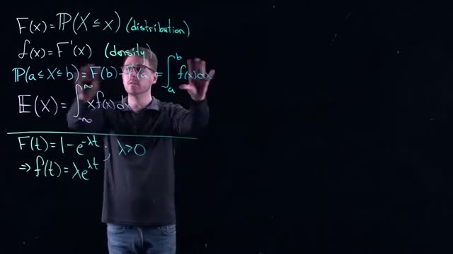
*[07:00](https://www.youtube.com/watch?v=0qi6s-injSo&t=420s) A whiteboard shows several mathematical formulas related to probability distributions, including definitions for F(x), f(x), P(a ≤ X ≤ b), E(X), and an example of F(t) and f(t) for an exponential distribution.*


Before we examine the lack of memory property, we need to recall the formula for conditional probability. The conditional probability of event A given that event B has occurred is:

P(A|B) = P(A and B) / P(B)

This formula gives an explicit likelihood. It tells you how to estimate the probability that event A will happen if you already know that event B happened.


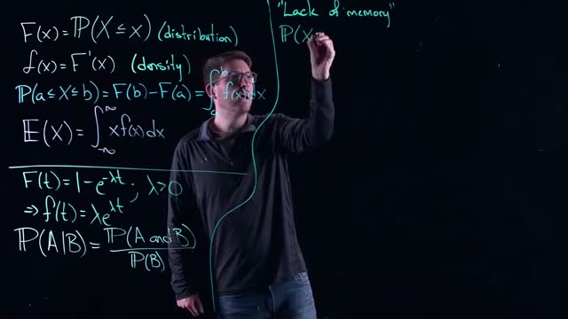
*[08:20](https://www.youtube.com/watch?v=0qi6s-injSo&t=500s) A whiteboard displays several probability and statistics formulas, including definitions for distribution, density, expected value, and conditional probability.*


Now let us apply this conditional probability formula to the exponential distribution. We want to find the probability that X is greater than s plus t, given that X is greater than s. We write this as:

P(X > s + t | X > s)

Using the conditional probability formula, this becomes:

P(X > s + t | X > s) = P(X > s + t and X > s) / P(X > s)

If s is positive, then the event "X > s + t and X > s" is the same as the event "X > s + t". This is because if X is greater than s plus t, it is automatically greater than s. So the numerator simplifies to P(X > s + t). The denominator is P(X > s). Therefore:

P(X > s + t | X > s) = P(X > s + t) / P(X > s)


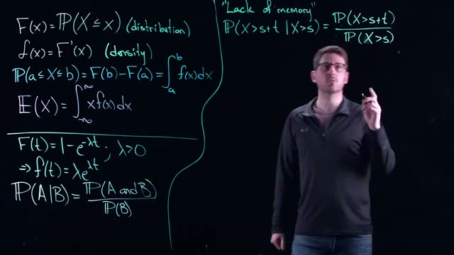
*[09:00](https://www.youtube.com/watch?v=0qi6s-injSo&t=540s) This frame shows several probability and statistics formulas written on a whiteboard, including definitions for distribution, density, expected value, and conditional probability, as well as a formula related to the "lack of memory" property.*


Now we can compute these probabilities using the exponential distribution. For an exponential random variable X with rate parameter lambda (λ), the probability that X is greater than some value a is:

P(X > a) = e^(-λa)

Applying this to our formula:

P(X > s + t | X > s) = e^(-λ(s + t)) / e^(-λs)


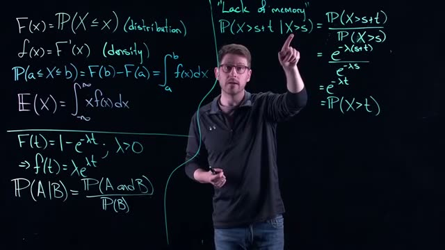
*[10:00](https://www.youtube.com/watch?v=0qi6s-injSo&t=600s) This frame displays various probability and calculus formulas, including distribution, density, expected value, and the 'lack of memory' property, written on a blackboard.*


We can simplify this expression. Dividing e^(-λ(s + t)) by e^(-λs) gives:

e^(-λ(s + t)) / e^(-λs) = e^(-λs - λt + λs) = e^(-λt)

And e^(-λt) is exactly equal to P(X > t). So we have:

P(X > s + t | X > s) = e^(-λt) = P(X > t)

What does this result actually mean? It means that if we have already waited s units of time, and we want to know the probability of something happening t more units into the future, that probability is the same as restarting and asking what happens in t units from now. The past waiting time s does not affect the future probability. The distribution "forgets" that you have already waited.

This property is called the **lack of memory property** (also known as the memoryless property). (Added context: This property is unique to the exponential distribution among continuous distributions. The geometric distribution has a similar property for discrete random variables.)

### Check your understanding

1. What is the formula for the lack of memory property of the exponential distribution?

<details><summary>Answer</summary>
P(X > s + t | X > s) = P(X > t). This means the probability of waiting additional time t does not depend on how long you have already waited s.
</details>

2. If an exponential random variable has rate parameter λ = 0.5, and you have already waited 3 units, what is the probability that you will wait at least 2 more units?

<details><summary>Answer</summary>
Using the lack of memory property, P(X > 3 + 2 | X > 3) = P(X > 2) = e^(-0.5 * 2) = e^(-1) ≈ 0.3679.
</details>

3. Why is the numerator P(X > s + t and X > s) simplified to just P(X > s + t)?

<details><summary>Answer</summary>
If X is greater than s + t, it is automatically greater than s. So the event "X > s + t and X > s" is the same as the event "X > s + t". The intersection of the two conditions is just the stricter condition.
</details>

4. True or False: The lack of memory property applies to all continuous probability distributions.

<details><summary>Answer</summary>
False. The lack of memory property is unique to the exponential distribution (and distributions that are similar to it, such as the geometric distribution for discrete random variables). Most continuous distributions do not have this property.
</details>
## Modeling Example: Radioactive Decay Setup

This section builds on the memoryless property of the exponential distribution and applies it to a real-world modeling problem: measuring radioactive decay with a counter that has a brief lockout period.

### The Memoryless Property (Recap)

The exponential distribution has a unique property called **memorylessness**. This means that the probability of an event occurring in the next interval of time does not depend on how long you have already waited. The past is irrelevant; only the future time window matters. In the speaker’s words: “It doesn’t matter how long I waited. All that matters is how far you go in the future now. The past doesn’t matter. There is no memory in this thing.” This property is essential for modeling events that occur randomly and independently over time.

### Introducing the Radioactive Decay Example

We now apply continuous probability models to a practical problem: measuring the decay rate of a radioactive material using a counter.


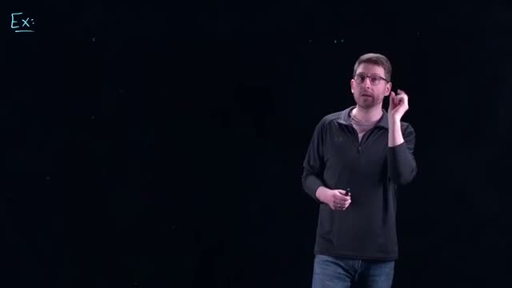
*[11:20](https://www.youtube.com/watch?v=0qi6s-injSo&t=680s) The word 'Ex:' is written on a black background, indicating an example is about to be presented.*


The whiteboard shows the word “Ex:”, indicating the start of an example.

The counter registers each radioactive decay, but after registering one decay, it **locks** for a very short period of time: \(3 \times 10^{-9}\) seconds (3 nanoseconds). During this lockout, the counter cannot record any other decay. Therefore, some decays may be missed if they occur during the lockout. The goal is to adjust the recorded data to account for these lost events.

### Defining the Variables


*[12:00](https://www.youtube.com/watch?v=0qi6s-injSo&t=720s) The whiteboard shows an example of lambda as a decay rate per second.*


The whiteboard introduces the decay rate:

```
Ex: λ = decay rate (per second)
```

- **λ** (lambda) is the true decay rate of the material, measured in decays per second. This is the unknown quantity we want to estimate.

Next, we define the times at which the counter records a decay:


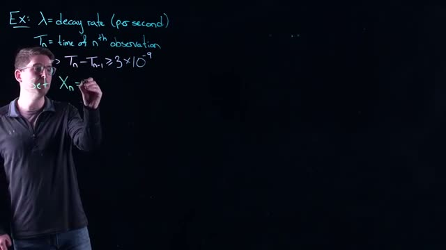
*[13:20](https://www.youtube.com/watch?v=0qi6s-injSo&t=800s) A whiteboard shows an example of decay rate, time of nth observation, and a formula for Xn.*


The whiteboard shows:

```
Ex: λ= decay rate (per second)
Tn= time of nth observation
> Tn-Tn-1 ≥ 3×10-9
Set Xn=
```

- **Tₙ** = the time (in seconds) of the n‑th recorded observation (i.e., the moment the counter registers a decay).
- Because the counter locks for \(3 \times 10^{-9}\) seconds after each recorded decay, the time between consecutive recorded decays must be at least that lockout period. This gives the inequality:

\[
T_n - T_{n-1} \ge 3 \times 10^{-9}
\]

The inequality holds with probability 1 (it is a physical constraint, not a probabilistic one).

### Introducing the Inter‑Observation Time

The speaker then defines a new variable to represent the time between recorded observations:

> “Let’s set \(x_n\) to be the time between these observations.”

This variable is the interval from one recorded decay to the next. However, the whiteboard at the next timestamp shows a different expression:


*[14:20](https://www.youtube.com/watch?v=0qi6s-injSo&t=860s) A whiteboard shows an example of decay rate, time of nth observation, and a formula for Xn.*


The whiteboard now displays:

```
Ex: λ= decay rate (per second)
T_n = time of n^th observation
=> T_n - T_{n-1} ≥ 3 × 10^{-9}
Set X_n = T_n
```

**Note:** The on‑screen text says “Set \(X_n = T_n\)”, but the speaker’s verbal definition describes \(X_n\) as the time *between* observations. The intended definition is likely \(X_n = T_n - T_{n-1}\) (the inter‑observation time). The whiteboard may have been incomplete or the video cut off before the subtraction was written. In this course, we will follow the speaker’s verbal definition: \(X_n\) is the time between recorded decays.

### Why This Is Not an Exponential Distribution

If the counter had no lockout, the times between decays (the true inter‑arrival times) would follow an exponential distribution with rate λ. The exponential distribution has the property that the longer you wait, the higher the probability that an event will occur. However, because of the lockout, the recorded inter‑observation times \(X_n\) have a **lower bound** of \(3 \times 10^{-9}\) seconds. They are always at least that value, with probability 1. This violates the exponential distribution’s support (which starts at 0) and its memoryless property. Therefore, \(X_n\) is **not** exponentially distributed. We must adjust the model to account for the lockout.

### Summary of Key Concepts

| Concept | Definition |
|---------|------------|
| Memoryless property | The future probability of an event does not depend on past waiting time. |
| Decay rate λ | True number of decays per second in the material. |
| Tₙ | Time of the n‑th recorded observation. |
| Lockout period | \(3 \times 10^{-9}\) seconds; the counter cannot record during this interval. |
| Xₙ | Time between recorded observations (speaker’s definition). |
| Lower bound | \(X_n \ge 3 \times 10^{-9}\) with probability 1, so Xₙ is not exponential. |

### Check Your Understanding

1. **What is the memoryless property of the exponential distribution?**  
   <details><summary>Answer</summary> The probability that an event occurs in the next time interval does not depend on how long you have already waited. The past is forgotten.</details>

2. **Why is the inequality \(T_n - T_{n-1} \ge 3 \times 10^{-9}\) always true?**  
   <details><summary>Answer</summary> Because the counter locks for exactly \(3 \times 10^{-9}\) seconds after each recorded decay, so no decay can be recorded during that interval. Therefore, the time between recorded observations must be at least that lockout period.</details>

3. **Why does the lockout prevent the recorded inter‑observation times from following an exponential distribution?**  
   <details><summary>Answer</summary> An exponential distribution has support from 0 to infinity and is memoryless. The lockout forces a minimum positive waiting time (\(3 \times 10^{-9}\) seconds) with probability 1, which violates the exponential’s support and its memoryless property.</details>

4. **What is the purpose of defining \(X_n\) in this example?**  
   <details><summary>Answer</summary> \(X_n\) represents the time between recorded observations. By studying its distribution, we can later adjust the recorded data to estimate the true decay rate λ, accounting for decays missed during the lockout.</details>
## Modeling the Waiting Time and Expected Value

In this section you will model the waiting time between successive observations of a radioactive decay event. You will compute the expected (average) waiting time and then use the strong law of large numbers to connect that theoretical average to the sample average you can compute from real data.

### Setting up the variables

Recall the physical setup: you observe the time of each decay event. Let:

- λ = decay rate (per second). A larger λ means decays happen more frequently.
- Tₙ = time of the n‑th observation (in seconds).
- Xₙ = Tₙ: Tₙ₋₁, the waiting time between the (n-1)-th and n‑th observations.

Because of a hardware locking time, the waiting time can never be shorter than a fixed constant a = 3 × 10⁻⁹ seconds. Therefore:

Xₙ = a + Yₙ

where Yₙ is the additional time you must wait beyond the locking time. Yₙ is modeled by an exponential distribution with parameter λ > 0.


*[16:00](https://www.youtube.com/watch?v=0qi6s-injSo&t=960s) A whiteboard shows mathematical equations defining lambda as decay rate, Tn as time of nth observation, and Xn and Yn as related variables, with Yn modeled by an exponential distribution.*


The whiteboard at this frame shows the definitions:

```
Ex: λ= decay rate (per second)
Tn= time of nth observation
=> Tn-Tn-1 ≥ 3×10-9
Set Xn=Tn-Tn-1
a=3×10-9
=> Xn= a + Yn
Yn is modelled by an exp. dist. w λ>0
E(Xn)=
```

The exponential distribution is a continuous probability model often used for waiting times. Its probability density function (PDF) is:

f(t) = λ e^{-λ t}   for t ≥ 0

The expected value (mean) of an exponential random variable is 1/λ. You will verify this below.

### Computing the expected waiting time

The expected value of Xₙ is:

E(Xₙ) = E(a + Yₙ) = a + E(Yₙ)

because the expectation of a constant is the constant itself.

Now compute E(Yₙ). For an exponential distribution with rate λ, the mean is given by the integral:

E(Yₙ) = ∫₀^∞ t · λ e^{-λ t} dt


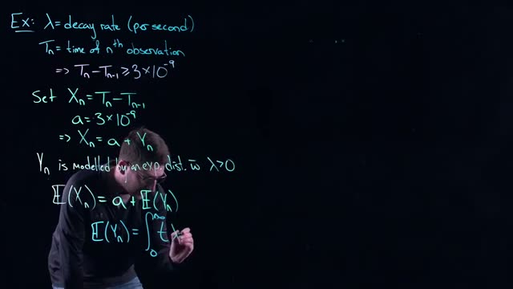
*[17:00](https://www.youtube.com/watch?v=0qi6s-injSo&t=1020s) A whiteboard shows mathematical equations defining variables like decay rate, time of observation, and an exponential distribution, with a person writing on it.*


The whiteboard shows this integral:

```
E(Yn) = ∫_0^∞ t λ e^{-λt} dt
```

Evaluating this integral (using integration by parts or recalling the known result) gives:

E(Yₙ) = 1/λ

Therefore:

E(Xₙ) = a + 1/λ


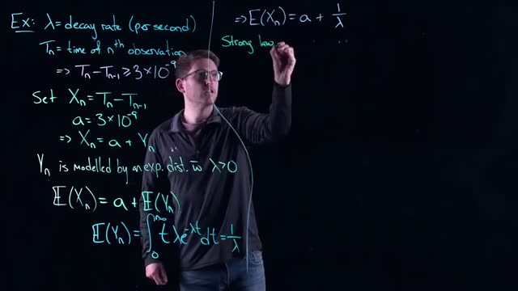
*[18:00](https://www.youtube.com/watch?v=0qi6s-injSo&t=1080s) A whiteboard shows an example problem calculating the expected value of Xn, which is a + 1/λ.*


The whiteboard now shows the completed calculation:

```
E(Yn)= ∫_0^∞ tλe^(-λt)dt = 1/λ
=>E(Xn)=a+ 1/λ
Strong law
```

### Interpreting the result

If the decay rate λ is very high, then 1/λ is very small, so the expected waiting time is only slightly larger than the locking time a. If λ is low, the expected waiting time is much larger than a.

### Using the strong law of large numbers

In practice you do not know λ. You only have a sequence of observed waiting times X₁, X₂, …, Xₙ. The strong law of large numbers tells you that as the number of observations grows, the sample average converges to the true expected value.


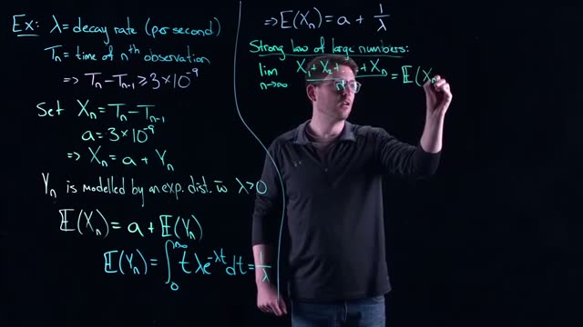
*[19:00](https://www.youtube.com/watch?v=0qi6s-injSo&t=1140s) A whiteboard shows mathematical equations for decay rate, time of observation, and the strong law of large numbers.*


The whiteboard states:

```
Strong law of large numbers:
lim_{n→∞} (X_1 + X_2 + ... + X_n)/n = E(X_n)
```

In this context:

lim_{n→∞} (X₁ + X₂ + … + Xₙ) / n = a + 1/λ

This gives you a way to estimate λ. If you compute the sample average of many waiting times, you can set that average equal to a + 1/λ and solve for λ.

### Summary of key concepts

| Concept | Definition | Formula |
|---------|------------|---------|
| Locking time a | Minimum possible waiting time between observations | a = 3 × 10⁻⁹ s |
| Exponential distribution | Continuous probability model for Yₙ | Yₙ ~ Exp(λ) |
| Expected value of exponential | Mean of Exp(λ) | E(Yₙ) = 1/λ |
| Expected waiting time | Mean of Xₙ = a + Yₙ | E(Xₙ) = a + 1/λ |
| Strong law of large numbers | Sample average converges to expected value | (∑ Xᵢ)/n → E(Xₙ) as n→∞ |

### Check your understanding

1. **Why is the waiting time Xₙ always at least a?**  
   <details><summary>Answer</summary>  
   Because the hardware has a locking time of a = 3 × 10⁻⁹ seconds. No two observations can be closer together than this fixed minimum.  
   </details>

2. **If the decay rate λ is 10⁶ per second, what is the expected waiting time E(Xₙ)?**  
   <details><summary>Answer</summary>  
   E(Xₙ) = a + 1/λ = 3 × 10⁻⁹ + 1/10⁶ = 3 × 10⁻⁹ + 10⁻⁶ = 1.003 × 10⁻⁶ seconds (approximately 1.003 μs).  
   </details>

3. **How can you estimate λ from a set of observed waiting times?**  
   <details><summary>Answer</summary>  
   Compute the sample average of the waiting times. By the strong law of large numbers, this average is approximately a + 1/λ. Solve for λ: λ ≈ 1 / (sample average: a).  
   </details>

4. **What does the integral ∫₀^∞ t λ e^{-λ t} dt represent?**  
   <details><summary>Answer</summary>  
   It is the definition of the expected value (mean) of the exponential random variable Yₙ. Evaluating it gives 1/λ.  
   </details>
## Estimating the Decay Rate

In this section, we derive a practical formula for estimating the decay rate lambda (λ) of a radioactive material, even when we cannot record observations during a "locking time" after each detection.

### The Problem: Locking Time

When a Geiger counter detects a radioactive decay, it becomes temporarily unable to record new events. This period is called the locking time. In our model, the locking time is a constant value `a = 3 × 10⁻⁹` seconds (3 nanoseconds).


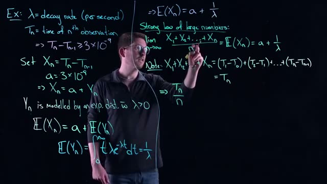
*[20:20](https://www.youtube.com/watch?v=0qi6s-injSo&t=1220s) This frame shows a whiteboard with mathematical equations and definitions related to decay rate, observations, and the strong law of large numbers.*


### Defining the Variables

Let us define the key variables:

- **λ (lambda)**: The decay rate of the radioactive material, measured in decays per second. This is the unknown parameter we want to estimate.
- **Tn**: The time of the nth observation (the nth detected decay).
- **Tn - Tn-1**: The time between the (n-1)th and nth observations. This interval is always at least `a` seconds long because of the locking time.
- **Xn**: The time interval between consecutive observations. We set `Xn = Tn - Tn-1`.
- **a**: The locking time, `a = 3 × 10⁻⁹` seconds.
- **Yn**: The actual time the detector was "live" and waiting for the next decay. This is the time beyond the locking time.

Because the detector is locked for `a` seconds after each detection, the total time between observations is the locking time plus the waiting time for the next decay. Therefore:

`Xn = a + Yn`

The waiting time `Yn` is modeled by an exponential distribution with rate parameter λ > 0. This is a standard assumption for the time between independent random events occurring at a constant average rate.

### Expected Value of the Interval

The expected value (mean) of an exponentially distributed random variable with rate λ is `1/λ`. (Added context: This is a known property of the exponential distribution.)

The expected value of `Xn` is:

`E(Xn) = a + E(Yn)`

`E(Yn) = ∫₀^∞ t λ e^(-λt) dt = 1/λ`

Therefore:

`E(Xn) = a + 1/λ`

### Applying the Strong Law of Large Numbers

The Strong Law of Large Numbers states that as the sample size `n` approaches infinity, the average of the observed values converges to the expected value. (Added context: This is a fundamental theorem in probability.)

For our sequence of intervals `X₁, X₂, ..., Xn`, the law gives us:

`lim (X₁ + X₂ + ... + Xn) / n = E(Xn) = a + 1/λ`
`n→∞`

### The Telescoping Sum

Now we simplify the sum of the intervals. Notice that:

`X₁ + X₂ + ... + Xn = (T₁ - T₀) + (T₂ - T₁) + ... + (Tn - Tn-1)`

This is a telescoping sum. All intermediate terms cancel out. We set `T₀ = 0` (the time we start the clock). The sum simplifies to:

`X₁ + X₂ + ... + Xn = Tn`

Therefore, the Strong Law of Large Numbers tells us:

`lim Tn / n = a + 1/λ`
`n→∞`

### Estimating the Decay Rate

For a large but finite `n`, we can use the approximation:

`Tn / n ≈ a + 1/λ`


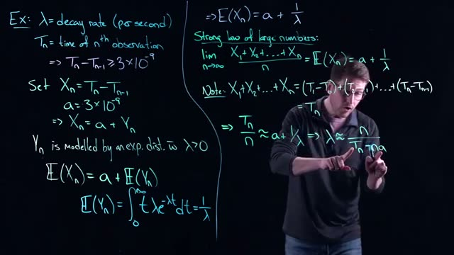
*[21:20](https://www.youtube.com/watch?v=0qi6s-injSo&t=1280s) A whiteboard shows mathematical equations and definitions related to decay rate, time of observation, and the strong law of large numbers.*


We can rearrange this equation to solve for λ. First, isolate `1/λ`:

`1/λ ≈ Tn / n - a`

`1/λ ≈ (Tn - na) / n`

Now, take the reciprocal to solve for λ:

`λ ≈ n / (Tn - na)`

This is our estimator for the decay rate. The squiggly lines (≈) remind us that this is an approximation that becomes exact only as `n` approaches infinity.

### What This Means

This formula is powerful because it accounts for the locking time `a`. Even if the material decays extremely fast and many decays occur during the locking period (which we cannot observe), our model still allows us to estimate the true decay rate. We only need to know:

1. The total time `Tn` of the nth observation.
2. The number of observations `n`.
3. The locking time `a`.

The formula `λ ≈ n / (Tn - na)` gives us a way to compute the decay rate from observable data, despite the limitations of the measurement equipment.

### Check Your Understanding

1. What does the variable `Yn` represent in the model `Xn = a + Yn`?

<details><summary>Answer</summary>
`Yn` represents the actual time the detector was "live" and waiting for the next decay, beyond the locking time. It is modeled by an exponential distribution with rate λ.
</details>

2. Why does the sum `X₁ + X₂ + ... + Xn` simplify to just `Tn`?

<details><summary>Answer</summary>
Because the sum is a telescoping sum: `(T₁ - T₀) + (T₂ - T₁) + ... + (Tn - Tn-1)`. All intermediate terms cancel, leaving only `Tn - T₀`. Since we set `T₀ = 0`, the sum equals `Tn`.
</details>

3. If you observe 1000 decays and the 1000th decay occurs at time `Tn = 0.005` seconds, with a locking time `a = 3 × 10⁻⁹` seconds, what is your estimate of λ?

<details><summary>Answer</summary>
Using the formula `λ ≈ n / (Tn - na)`:
`λ ≈ 1000 / (0.005 - (1000 × 3 × 10⁻⁹))`
`λ ≈ 1000 / (0.005 - 0.000003)`
`λ ≈ 1000 / 0.004997`
`λ ≈ 200,120` decays per second (approximately).
</details>

4. What does the Strong Law of Large Numbers guarantee in this context?

<details><summary>Answer</summary>
It guarantees that as the number of observations `n` goes to infinity, the average of the observed intervals `(X₁ + X₂ + ... + Xn)/n` converges to the expected value `E(Xn) = a + 1/λ`. This is why our approximation `Tn/n ≈ a + 1/λ` becomes exact in the limit.
</details>
## Sensitivity Analysis and Conclusion

### Recap of the Model

In the previous section, you modeled the time between successive observations of radioactive decay. The detector has a dead time (lock time) of `a = 3 × 10⁻⁹` seconds after each detection. The observed interval `X_n = T_n - T_{n-1}` is therefore the sum of the fixed lock time `a` and a random waiting time `Y_n` that follows an exponential distribution with decay rate `λ` (the expected number of decays per second). The expected value of `X_n` is `a + 1/λ`. By the strong law of large numbers, the average of many observed intervals converges to this expectation. Because the sum of the intervals equals the total observation time `T_n`, you derived the approximation:

```
λ ≈ n / (T_n - n a)
```

where `n` is the number of observed decays and `T_n` is the time of the `n`-th observation.


*[22:00](https://www.youtube.com/watch?v=0qi6s-injSo&t=1320s) The whiteboard shows mathematical equations and definitions related to decay rate, time of observation, and the strong law of large numbers.*


The whiteboard at this point shows the full derivation:

```
Ex: λ= decay rate (per second)
T_n = time of nᵗʰ observation
=> T_n - T_{n-1} ≥ 3×10⁻⁹
Set X_n = T_n - T_{n-1}
a = 3×10⁻⁹
=> X_n = a + Y_n
Y_n is modelled by an exp. dist. w λ > 0
E(X_n) = a + E(Y_n)
E(Y_n) = ∫₀^∞ tλe⁻ᵗ dt = 1/λ
=> E(X_n) = a + 1/λ
Strong law of large numbers:
lim_{n→∞} (X₁ + X₂ + ... + X_n)/n = E(X_n) = a + 1/λ
Note: X₁ + X₂ + ... + X_n = (T₁ - T₀) + (T₂ - T₁) + ... + (T_n - T_{n-1}) = T_n
=> T_n/n ≈ a + 1/λ => λ ≈ n/(T_n - na)
```

This approximation is powerful: it lets you estimate the decay rate even though the detector is blind for a short time after each event.

### Sensitivity to Finite Sample Size

The strong law of large numbers holds only in the limit as `n → ∞`. In practice, you have a finite number of observations. The approximation `λ ≈ n/(T_n - na)` therefore incurs error because the sample average has not yet converged to the true expectation. You must collect many observations before the estimate becomes reliable. This is the first source of “wiggle room” or error in the model. Be careful: the limit is an idealization; real data always has some residual uncertainty.

### Sensitivity to the Locking Time

The lock time `a` is a very small number (`3 × 10⁻⁹` seconds), but it may be slightly inaccurate. How sensitive is the estimated decay rate `λ` to a small change in `a`? To answer this, treat `λ` as a function of `a` using the approximation:

```
λ(a) ≈ n / (T_n - n a)
```

Differentiate with respect to `a` (assuming `n` and `T_n` are fixed by the data):

```
dλ/da = n² / (T_n - n a)² = λ²
```


*[24:00](https://www.youtube.com/watch?v=0qi6s-injSo&t=1440s) This frame shows a whiteboard with mathematical equations and definitions related to decay rate, time of observation, and the strong law of large numbers.*


The whiteboard now shows the derivative:

```
dλ/da = λ² => S(λ)
```

The sensitivity `S(λ, a)` is defined as the product of the derivative and the ratio of the parameter to the function (a common dimensionless sensitivity measure):

```
S(λ, a) = (dλ/da) * (a/λ) = λ² * (a/λ) = λ a
```


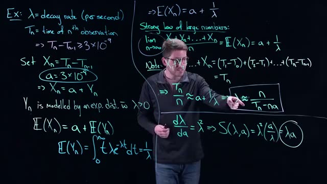
*[24:40](https://www.youtube.com/watch?v=0qi6s-injSo&t=1480s) This whiteboard shows mathematical equations related to decay rate, time of observation, and the strong law of large numbers, with a speaker pointing to an equation.*


The whiteboard confirms:

```
dλ/da = λ² => S(λ,a) = λ²(a/λ) = λa
```

### Interpretation of the Sensitivity `λ a`

The product `λ a` has a concrete meaning: it is the expected number of decays that occur during a single lock period. Because `λ` is the decay rate (decays per second) and `a` is the lock time in seconds, `λ a` gives the average number of decays that would happen while the detector is blind.

| Value of `λ a` | Implication for sensitivity |
|----------------|----------------------------|
| Very small (e.g., `λ` small or `a` small) | Few decays are missed during the lock. The estimate is relatively insensitive to errors in `a`. |
| Very large (e.g., `λ` large or `a` large) | Many decays are missed during each lock. The estimate becomes highly sensitive to the exact value of `a`. |

In other words, the sensitivity is a measure of how much information you lose every time the system locks. If you can make the lock time `a` very short, you lose very little information and the estimate is robust. If the lock time is longer, you potentially miss many decays, and the estimate depends more strongly on the precise value of `a`.

### Conclusion

Despite the dead time, you can still estimate the decay rate `λ` using the exponential distribution and the strong law of large numbers. The sensitivity analysis reveals that the quality of the estimate depends on the product `λ a`. When `λ a` is small, the estimate is reliable; when it is large, you must be cautious because missing many decays introduces uncertainty. This example illustrates how continuous probability models, combined with careful sensitivity analysis, allow you to extract meaningful information from real-world measurement systems.

In the next video, the course will move to statistics and the normal distribution (the bell curve), building on the intuition and techniques developed here.

### Check your understanding

1. **Why is the strong law of large numbers important for the decay rate estimate?**  
   <details><summary>Answer</summary>  
   The strong law of large numbers guarantees that the sample average of the observed intervals converges to the true expected value `a + 1/λ` as the number of observations goes to infinity. This justifies the approximation `λ ≈ n/(T_n - na)` and tells you that with enough data the estimate becomes accurate. However, because the law only holds in the limit, you need a large number of observations to reduce the error.
   </details>

2. **Derive the sensitivity `S(λ, a) = λ a` starting from the approximation `λ ≈ n/(T_n - na)`.**  
   <details><summary>Answer</summary>  
   Differentiate `λ = n (T_n - n a)^{-1}` with respect to `a`:  
   `dλ/da = n * (-1) * (T_n - n a)^{-2} * (-n) = n² / (T_n - n a)² = λ²`.  
   The dimensionless sensitivity is `S = (dλ/da) * (a/λ) = λ² * (a/λ) = λ a`.
   </details>

3. **What does a large value of `λ a` tell you about the reliability of the decay rate estimate?**  
   <details><summary>Answer</summary>  
   A large `λ a` means that many decays are expected to occur during each lock period. The detector misses a significant fraction of events, so the estimate of `λ` becomes very sensitive to the exact value of the lock time `a`. Small errors in `a` can lead to large errors in the estimated decay rate. The estimate is less reliable in this regime.
   </details>

4. **In the radioactive decay example, what is the numerical value of the lock time `a`?**  
   <details><summary>Answer</summary>  
   The lock time is `a = 3 × 10⁻⁹` seconds (3 nanoseconds).
   </details>
## Key takeaways

- Continuous random variables take values on a continuum and are described by a probability distribution function F(x) and a density function f(x) = dF/dx.
- Probabilities for intervals are computed by integrating the density function over that interval.
- The expected value of a continuous random variable is the integral of x times its density over the entire sample space.
- The exponential distribution with rate λ has density f(t) = λ e^{-λt} and distribution F(t) = 1 - e^{-λt}, and it models waiting times for events that occur at a constant average rate.
- The exponential distribution is the only continuous distribution with the lack of memory property: P(X > s+t | X > s) = P(X > t).
- In the radioactive decay example, the observed waiting time between detections is the sum of a fixed lock time a and an exponentially distributed random variable Y.
- The strong law of large numbers allows the average of observed waiting times to approximate the expected value, leading to an estimator for the decay rate λ ≈ n / (T_n - n a).
- Sensitivity analysis shows that the estimated decay rate is most sensitive when the product λ a (expected number of missed decays during a lock) is large.
- The exponential distribution is widely applicable to waiting time and arrival processes, including queueing and reliability theory.
## Glossary

| Term | Definition |
|---|---|
| continuous random variable | A random variable that can take any value within a continuous range, such as time or distance. |
| probability distribution function | For a continuous random variable X, the function F(x) = P(X ≤ x), which gives the cumulative probability up to x. |
| density function | The derivative of the probability distribution function, denoted f(x), such that the probability of an interval [a,b] is the integral of f(x) from a to b. |
| expected value (mean) | The long-run average of a random variable, computed as the integral of x times the density function over the sample space. |
| exponential distribution | A continuous probability distribution with rate parameter λ > 0, density f(t) = λ e^{-λt} for t ≥ 0, used to model the time until an event occurs at a constant average rate. |
| rate parameter (λ) | A positive constant that determines the average number of events per unit time; the mean waiting time is 1/λ. |
| lack of memory property | The property that the remaining waiting time for an event does not depend on how long one has already waited; formally, P(X > s+t | X > s) = P(X > t), unique to the exponential distribution among continuous distributions. |
| conditional probability | The probability of an event A occurring given that another event B has already occurred, written P(A|B) = P(A ∩ B) / P(B). |
| strong law of large numbers | A theorem stating that the sample average of independent and identically distributed random variables converges almost surely to the expected value as the number of observations goes to infinity. |
| telescoping sum | A sum where intermediate terms cancel, leaving only the first and last term; here, the sum of the observed waiting times X_1 + ... + X_n equals T_n because T_0 = 0. |
| estimator | A formula or rule for estimating an unknown population parameter from sample data, such as λ̂ = n / (T_n - n a). |
| sensitivity analysis | The study of how the output of a model (e.g., an estimated parameter) changes in response to changes in input parameters. |
| locking time (a) | The fixed period during which a counter is unable to record new events after detecting one, here 3×10^{-9} seconds. |
| decay rate | The average number of radioactive decays per second, denoted λ. |
| Poisson process | A stochastic process that models the occurrence of random events at a constant average rate, where the interarrival times are exponentially distributed. |
| Riemann sum | A method of approximating an integral by summing the areas of rectangles, used to motivate the transition from discrete sums to integrals. |
| measure theory | A branch of mathematics that provides a rigorous foundation for probability and integration, mentioned in the transcript as a deeper topic. |
| sample space | The set of all possible outcomes of a random experiment; for a continuous random variable it is often the real line or an interval. |
| convergence (in probability or almost surely) | The idea that a sequence of random variables approaches a limit as the number of trials increases; the strong law uses almost sure convergence. |
| sensitivity measure (S) | A dimensionless quantity defined as λ a, representing the expected number of decays that occur during a single lock period. |
## Footnotes and deeper context

1. **Lack of memory property uniqueness.** Among continuous distributions, the exponential distribution is the only one with the lack of memory property. Among discrete distributions, the geometric distribution shares this property. This is a fundamental result in probability theory and is often used to characterize the exponential distribution.
2. **Strong law of large numbers convergence.** The strong law of large numbers (SLLN) states that the sample average converges almost surely to the expected value. This is stronger than the weak law, which gives convergence in probability. In practice, for a finite sample the approximation is only approximate, and the rate of convergence is governed by the variance.
3. **Derivative of λ with respect to a.** From the estimator λ ≈ n / (T_n - n a), treating T_n as fixed, differentiating gives dλ/da = n * n / (T_n - n a)^2 = λ^2. The sensitivity measure S = (dλ/da)*(a/λ) = λ a, which the video correctly interprets as the expected number of decays during a lock period.
4. **Exponential distribution and Poisson process.** The exponential distribution is the interarrival time distribution of a Poisson process. This connection is standard: if events occur according to a Poisson process with rate λ, then the waiting times between events are i.i.d. exponential(λ). The video’s radioactive decay example implicitly assumes such a process.
5. **Telescoping sum assumption T0 = 0.** The telescoping sum argument relies on defining T_0 = 0, which is the start of the experiment. This is a natural choice and is standard in such models. The sum of X_i from i=1 to n equals T_n exactly under this definition.
6. **Common misconception about exponential rate.** A higher λ means events occur more frequently, so the average waiting time 1/λ is smaller. The density decays faster as λ increases, which is consistent with shorter waiting times.
## Where to go next

- **Introduction to Probability Models by Sheldon M. Ross.** This classic textbook covers the exponential distribution, Poisson processes, and the lack of memory property in depth. It is a standard reference for mathematical modeling with probability.
- **Khan Academy videos on exponential distribution and Poisson processes.** Free online resources that provide step-by-step explanations and practice problems, suitable for building intuition before diving into theory.
- **MIT OpenCourseWare: 6.041 Probabilistic Systems Analysis and Applied Probability.** Lecture notes and problem sets that include continuous probability, exponential distribution, and applications like queueing and reliability. A rigorous yet accessible resource.
- **Official documentation for statistical software (R, Python SciPy) on exponential distribution.** For hands-on practice, the documentation for R’s dexp, pexp, rexp functions or Python’s scipy.stats.expon provides exact definitions and usage examples for simulation and estimation.
---
*Printed by yt2textbook, an open tool from Zorost AI Lab. Screenshots are frames captured from the source video; each caption links to the exact moment it appears.*
