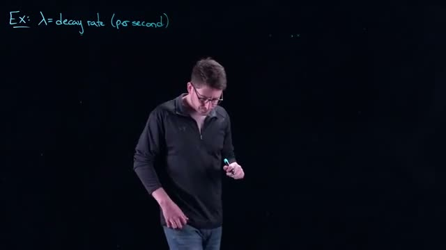
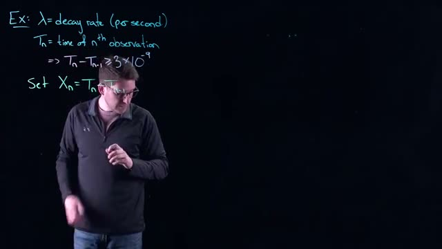
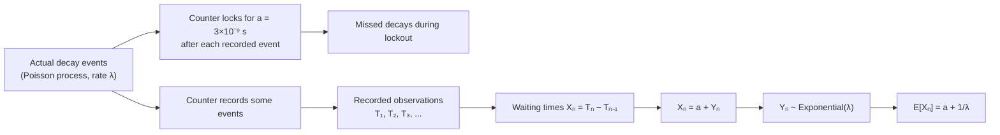
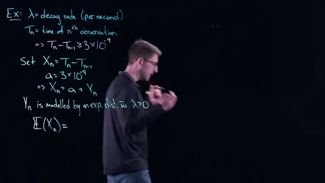
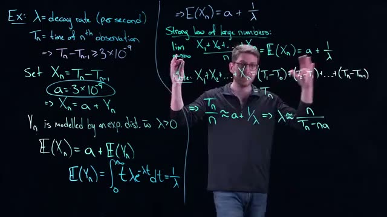
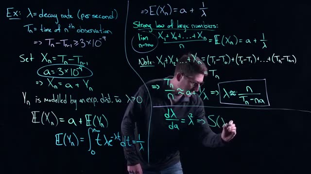
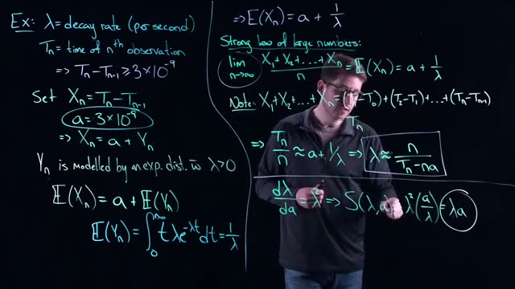

# Continuous Probability Models and the Exponential Distribution in Mathematical Modeling
> **Source:** [Continuous Probability Models - Math Modelling - Lecture 24](https://www.youtube.com/watch?v=0qi6s-injSo) by Math Modelling · 27:13 · Training document generated from the video.
**How to use this document:** read it top to bottom in place of watching the video. Screenshots appear exactly where the video depends on something visual, with links that jump to that moment. Questions at the end of each section confirm you learned the material. The glossary and footnotes add definitions and detail the video assumes you already have.
**Who this is for:** Students of mathematical modeling who have completed a course in calculus and are familiar with discrete probability.
## Learning objectives

After working through this document you can:

1. Define the probability distribution function $F(x) = P(X \leq x)$ and the probability density function $f(x) = F'(x)$ for a continuous random variable $X$.
2. Compute the probability that a continuous random variable lies in an interval $[a, b]$ using the integral $P(a \leq X \leq b) = \int_{a}^{b} f(x) \, dx$.
3. Calculate the expected value of a continuous random variable using $E[X] = \int_{-\infty}^{\infty} x f(x) \, dx$.
4. Identify the exponential distribution by its distribution function $F(t) = 1 - e^{-\lambda t}$ and its density function $f(t) = \lambda e^{-\lambda t}$ for $\lambda > 0$.
5. Derive and interpret the lack of memory property of the exponential distribution: $P(X > s + t \mid X > s) = P(X > t)$.
6. Apply the exponential distribution to model waiting times in a radioactive decay problem with a known lockout time $a$.
7. Use the Strong Law of Large Numbers to derive an estimator for the decay rate $\lambda$ from observed data: $\lambda \approx \frac{n}{T_n - n a}$.
8. Analyze the sensitivity of the estimated decay rate to the lockout time using the derivative $\frac{d\lambda}{da} = \lambda^2$ and interpret the product $\lambda a$.
## Prerequisites

- Calculus I and II, including integration and the Fundamental Theorem of Calculus
- Basic discrete probability, including random variables, probability mass functions, and expected value
- Familiarity with the concept of a limit and the Riemann sum
## Introduction to Continuous Probability Models

In the previous lecture, we introduced probability models and stochastic processes as tools for building mathematical models of real-world phenomena. We focused on **discrete probability models**, where a random variable can take on only a countable set of values. For example, rolling a standard six-sided die yields exactly six possible outcomes: 1, 2, 3, 4, 5, or 6. The sample space is finite, and each outcome has a probability assigned to it.

Now we shift to **continuous probability models**, where the random variable can take on any value within an interval or continuum of real numbers. Examples include the time until a radioactive particle decays, the exact height of a randomly selected adult, or the time between arrivals at a service counter. In these cases, the set of possible outcomes is uncountably infinite.

### The Probability Distribution Function

The central concept for continuous models is the **probability distribution function**. For a continuous random variable $X$, the probability distribution function is typically described by one of two related functions:

1. **Probability density function (PDF)**, denoted $f(x)$: This function describes the relative likelihood of $X$ taking a value near $x$. The probability that $X$ falls in an interval $[a, b]$ is given by the integral:

$$
P(a \leq X \leq b) = \int_{a}^{b} f(x) \, dx \tag{1}
$$

2. **Cumulative distribution function (CDF)**, denoted $F(x)$: This gives the probability that $X$ is less than or equal to a specific value $x$:

$$
F(x) = P(X \leq x) = \int_{-\infty}^{x} f(t) \, dt \tag{2}
$$

The PDF must satisfy two properties for any valid continuous probability model:

- $f(x) \geq 0$ for all $x \in \mathbb{R}$
- $\int_{-\infty}^{\infty} f(x) \, dx = 1$

(added context: The second property ensures that the total probability over all possible outcomes equals 1, which is a fundamental requirement of any probability model.)

### Key Difference from Discrete Models

In discrete models, we assign probabilities directly to individual outcomes (e.g., $P(X = 3) = \frac{1}{6}$). In continuous models, the probability of any single exact value is zero because the integral over a single point is zero:

$$
P(X = c) = \int_{c}^{c} f(x) \, dx = 0
$$

Instead, we always work with intervals. This is why we use the density function: it tells us how probability is spread across the continuum, not concentrated at points.

### Relationship Between PDF and CDF

The two functions are linked by differentiation and integration:

$$
f(x) = \frac{d}{dx} F(x) \tag{3}
$$

This relationship is fundamental: if you know the CDF, you can recover the PDF by taking the derivative, and if you know the PDF, you can find the CDF by integrating.

### Why Continuous Models Matter

Continuous probability models are essential in mathematical modeling because many real-world quantities are naturally continuous. For example:

- Waiting times (time until a bus arrives)
- Physical measurements (length, weight, temperature)
- Financial returns (percentage changes in stock prices)
- Biological processes (time until a cell divides)

The exponential distribution, which we will study in the next sections, is one of the most important continuous models because it describes the time between events in a Poisson process.

### Summary of Key Concepts

| Concept | Discrete Model | Continuous Model |
|---------|----------------|------------------|
| Random variable values | Countable set (e.g., integers) | Uncountable continuum (e.g., real numbers) |
| Probability of a single value | Can be positive | Always zero |
| Probability of an interval | Sum of individual probabilities | Integral of the PDF |
| Primary function | Probability mass function (PMF) | Probability density function (PDF) |
| Example | Rolling a die | Time until decay |

### Check your understanding

1. **Question**: Why is the probability of a continuous random variable taking any single exact value equal to zero?

<details>
<summary>Answer</summary>
Because the probability is computed as an integral of the PDF over a single point, which is $\int_{c}^{c} f(x) \, dx = 0$. The area under a curve at a single point has zero width, hence zero area.

</details>

2. **Question**: If the CDF of a continuous random variable is $F(x) = 1 - e^{-2x}$ for $x \geq 0$, what is the PDF $f(x)$?

<details>
<summary>Answer</summary>
Using the relationship $f(x) = \frac{d}{dx} F(x)$, we compute:

$$
f(x) = \frac{d}{dx} \left( 1 - e^{-2x} \right) = 2e^{-2x}
$$

for $x \geq 0$, and $f(x) = 0$ for $x < 0$.

</details>

3. **Question**: What are the two essential properties that any valid probability density function must satisfy?

<details>
<summary>Answer</summary>
(1) $f(x) \geq 0$ for all $x \in \mathbb{R}$, meaning the density is never negative.

(2) $\int_{-\infty}^{\infty} f(x) \, dx = 1$, meaning the total probability over the entire sample space equals 1.

</details>

4. **Question**: In a discrete model, we might say $P(X = 2) = 0.3$. Why can we never make such a statement in a continuous model?

<details>
<summary>Answer</summary>
In a continuous model, the probability of any single point is always zero because the PDF integrates to zero over a zero-width interval. Instead, we must express probabilities over intervals, such as $P(1.5 \leq X \leq 2.5)$, which would be computed as $\int_{1.5}^{2.5} f(x) \, dx$.

</details>
## Probability Distribution and Density Functions

In this section you will learn how probabilities are assigned to continuous random variables using two fundamental functions: the **probability distribution function** (also called the cumulative distribution function, or CDF) and the **probability density function** (PDF). You will also see how to compute probabilities over intervals and the expected value of a continuous random variable.

---

### Continuous Random Variables and the Distribution Function

A **continuous random variable** $X$ can take any value within a continuum (e.g., any real number). For example, $X$ could equal $\pi$, $e$, $10$, or any other point on the real line. Unlike discrete random variables, the probability that $X$ equals a single exact value is zero; instead, we work with probabilities over intervals.

We define the **probability distribution function** $F(x)$ as the probability that $X$ is less than or equal to a specific number $x$:

$$
F(x) = P(X \leq x)
$$

This function is also called the cumulative distribution function (CDF). It gives the total probability accumulated up to the value $x$.


*[01:40](https://www.youtube.com/watch?v=0qi6s-injSo&t=100s) Mathematical equations for F(x) and f(x) are written on a whiteboard.*
  
At timestamp 01:40 the whiteboard shows:

$$
F(x) = P(X \leq x)
$$

---

### The Density Function

The **density function** $f(x)$ is defined as the derivative of the distribution function:

$$
f(x) = F'(x)
$$

The density function describes how probability is distributed across the values of $X$. It is not a probability itself (it can be greater than 1), but the area under $f(x)$ over an interval gives the probability for that interval.

  
The whiteboard also shows:

$$
f(x) = F'(x)
$$

---

### Relating Distribution and Density: Probability Over an Interval

The fundamental theorem of calculus connects the distribution function and the density function. For any interval $[a, b]$, the probability that $X$ lies between $a$ and $b$ is:

$$
P(a \leq X \leq b) = F(b) - F(a) = \int_{a}^{b} f(x) \, dx
$$

This is because $F(b)$ gives the probability that $X \leq b$, and subtracting $F(a)$ removes the probability that $X \leq a$, leaving only the probability for the interval.


*[03:20](https://www.youtube.com/watch?v=0qi6s-injSo&t=200s) The whiteboard displays mathematical formulas for distribution, density, and probability, including an integral.*
  
At timestamp 03:20 the whiteboard displays:

$$
F(x) = P(X \leq x) \quad \text{(distribution)}
$$
$$
f(x) = F'(x) \quad \text{(density)}
$$
$$
P(a \leq X \leq b) = F(b) - F(a) = \int f(x) \, dx
$$

In practice, you are often given the density function $f(x)$. To compute any probability, you perform an integration. This is why probability with continuous random variables is deeply connected to integration (and later to measure theory).

---

### Expected Value of a Continuous Random Variable

The **expected value** (or mean) of a continuous random variable $X$ with density $f(x)$ is defined as an integral over the entire range of possible values:

$$
E[X] = \int_{-\infty}^{\infty} x \, f(x) \, dx
$$

If $X$ is restricted to positive values only (e.g., for an exponential distribution), the integral runs from $0$ to $\infty$:

$$
E[X] = \int_{0}^{\infty} x \, f(x) \, dx
$$

The expected value can be thought of as an infinite sum of the product $x \cdot f(x)$ over all possible $x$, weighted by the density.

---

### Summary of Key Relationships

| Concept | Notation | Definition |
|---------|----------|------------|
| Distribution function (CDF) | $F(x)$ | $F(x) = P(X \leq x)$ |
| Density function (PDF) | $f(x)$ | $f(x) = F'(x)$ |
| Probability over interval | $P(a \leq X \leq b)$ | $F(b) - F(a) = \int_a^b f(x) \, dx$ |
| Expected value | $E[X]$ | $\int_{-\infty}^{\infty} x f(x) \, dx$ |

---

### Check Your Understanding

1. **Question:** If $F(x)$ is the distribution function of a continuous random variable $X$, what is the relationship between $F(x)$ and the density function $f(x)$?  
   <details><summary>Answer</summary>  
   The density function is the derivative of the distribution function: $f(x) = F'(x)$. Conversely, $F(x) = \int_{-\infty}^{x} f(t) \, dt$.
   </details>

2. **Question:** A continuous random variable $X$ has density $f(x) = 2x$ for $0 \leq x \leq 1$, and $0$ elsewhere. Use the fundamental theorem of calculus to find $P(0.2 \leq X \leq 0.5)$.  
   <details><summary>Answer</summary>  
   $P(0.2 \leq X \leq 0.5) = \int_{0.2}^{0.5} 2x \, dx = \left[ x^2 \right]_{0.2}^{0.5} = (0.5)^2 - (0.2)^2 = 0.25 - 0.04 = 0.21$.
   </details>

3. **Question:** Why is the probability that a continuous random variable equals a specific value (e.g., $P(X = 3)$) always zero?  
   <details><summary>Answer</summary>  
   For a continuous random variable, the probability is given by the area under the density curve. The area under a single point (a line of zero width) is zero. Therefore $P(X = a) = \int_a^a f(x) \, dx = 0$ for any $a$.
   </details>

4. **Question:** Write the integral expression for the expected value of a continuous random variable $X$ whose density is $f(x)$ and whose support is all real numbers.  
   <details><summary>Answer</summary>  
   $E[X] = \int_{-\infty}^{\infty} x \, f(x) \, dx$.
   </details>
## Expected Value for Continuous Random Variables

In this section, you will learn how to compute the expected value for a continuous random variable and understand why the formula takes the form of an integral.

### The Expected Value Formula

For a continuous random variable $X$ with probability density function $f(x)$, the expected value (also called the mean) is defined as:

$$E(X) = \int_{-\infty}^{\infty} x f(x) \, dx \tag{1}$$

This formula appears on the whiteboard at timestamp 04:00, alongside the other fundamental relationships for continuous random variables:

- Distribution function: $F(x) = P(X \leq x)$
- Density function: $f(x) = F'(x)$
- Probability: $P(a \leq X \leq b) = F(b) - F(a) = \int_{a}^{b} f(x) \, dx$


*[04:00](https://www.youtube.com/watch?v=0qi6s-injSo&t=240s) The whiteboard displays formulas for distribution, density, probability, and expected value.*


### Why the Integral Has Flexible Bounds

The formula in equation (1) uses integration bounds from $-\infty$ to $\infty$ because these represent the entire possible range of values for a continuous random variable. However, nothing in the derivation requires these specific bounds. You can replace them with any appropriate bounds for your specific problem.

For example, if you are working with a random variable that only takes values between 0 and 10, you would write:

$$E(X) = \int_{0}^{10} x f(x) \, dx$$

The choice of bounds makes no difference to the underlying concept. The key point remains: you multiply the density function $f(x)$ by $x$ and integrate over the domain of the random variable.

### Where the Integral Formula Comes From

The integral representation for expected value arises from a fundamental connection between discrete and continuous probability. You can understand this by considering the limit of discrete probability events as the number of events approaches infinity.

Think about dividing the domain of the random variable into many small pieces. In discrete probability, the expected value is a sum:

$$E(X) = \sum_{i} x_i P(X = x_i)$$

As you divide the domain into more and more pieces, this sum converges to an integral through a Riemann sum. This is the same basic idea you learned in calculus: a sum of many small pieces becomes an integral in the limit.

The progression works as follows:

```mermaid
flowchart LR
    A[Discrete Random Variable] --> B[Sum of x_i * P(X = x_i)]
    B --> C[Divide domain into more pieces]
    C --> D[Riemann sum approximation]
    D --> E[Take limit as pieces go to infinity]
    E --> F[Integral: ∫ x f(x) dx]
```

This convergence is why you should always think of the expected value formula as an integral. The integral representation is not arbitrary; it emerges naturally from the discrete case through the limiting process of calculus.

### Key Concepts Summary

| Concept | Definition | Formula |
|---------|------------|---------|
| Expected value | The long-run average value of a random variable | $E(X) = \int_{-\infty}^{\infty} x f(x) \, dx$ |
| Bounds | Can be adjusted to match the domain of the random variable | Replace $-\infty$ to $\infty$ with specific values |
| Origin | Comes from the limit of discrete sums through Riemann sums | Sum $\rightarrow$ Integral as pieces $\rightarrow \infty$ |

### Check Your Understanding

1. What is the general formula for the expected value of a continuous random variable $X$ with density function $f(x)$?

<details><summary>Answer</summary>
$E(X) = \int_{-\infty}^{\infty} x f(x) \, dx$
</details>

2. If a random variable only takes values between 0 and 5, how would you modify the expected value formula?

<details><summary>Answer</summary>
$E(X) = \int_{0}^{5} x f(x) \, dx$
</details>

3. How does the expected value formula for continuous random variables relate to the discrete case?

<details><summary>Answer</summary>
The continuous formula comes from taking the limit of discrete sums as the number of probability events approaches infinity. The sum $\sum x_i P(X = x_i)$ becomes the integral $\int x f(x) \, dx$ through a Riemann sum convergence.
</details>

4. What two components are multiplied together inside the expected value integral?

<details><summary>Answer</summary>
The value $x$ (the random variable's value) is multiplied by the density function $f(x)$.
</details>
## The Exponential Distribution and Its Lack of Memory Property

This section introduces the **exponential distribution**, a continuous probability distribution used to model waiting times. We will define its probability density function (PDF) and cumulative distribution function (CDF), then derive its unique **lack of memory** property.

### General probability definitions (review)

Before focusing on the exponential distribution, recall the fundamental definitions of a continuous random variable. These are shown on the whiteboard at the start of this section.


*[05:20](https://www.youtube.com/watch?v=0qi6s-injSo&t=320s) A person writes mathematical formulas on a blackboard, including definitions for distribution, density, and expected value.*


- **Cumulative distribution function (CDF)**: $F(x) = P(X \le x)$ gives the probability that the random variable $X$ is less than or equal to $x$.
- **Probability density function (PDF)**: $f(x) = F'(x)$ is the derivative of the CDF. The PDF itself is not a probability; probabilities are obtained by integrating the PDF over an interval.
- **Probability over an interval**: $P(a \le X \le b) = F(b) - F(a) = \int_a^b f(x)\,dx$.
- **Expected value** (mean): $E(X) = \int_{-\infty}^{\infty} x f(x)\,dx$.

These formulas are the foundation for all continuous probability models.

### The exponential distribution

The exponential distribution is defined by a single parameter $\lambda > 0$, called the **rate parameter**. Its CDF and PDF, as shown on the board at timestamp 07:00, are:


*[07:00](https://www.youtube.com/watch?v=0qi6s-injSo&t=420s) A whiteboard shows several mathematical formulas related to probability distributions, including definitions for F(x), f(x), P(a ≤ X ≤ b), E(X), and an example of F(t) and f(t).*


$$
F(t) = 1 - e^{-\lambda t}, \quad \lambda > 0
$$
$$
\Rightarrow f(t) = \lambda e^{-\lambda t}
$$

Here $t$ typically represents time. The PDF $f(t)$ is positive for $t \ge 0$ and zero for $t < 0$.

**Interpretation of $\lambda$**: The rate parameter controls how quickly the probability of the event decays. A larger $\lambda$ makes the PDF decline faster, meaning the event is more likely to occur soon. A smaller $\lambda$ makes the decline slower, meaning the waiting time tends to be longer. For example, if customers arrive at a store with an average rate of one per hour, then $\lambda = 1$ (per hour). After 55 minutes without a customer, the probability that a customer will arrive in the next few minutes is higher than if a customer had just arrived.

**Computing probabilities**: Using the CDF, any interval probability can be computed easily. For example, the probability that a customer arrives between 1 hour and 2 hours is:

$$
P(1 < X < 2) = F(2) - F(1) = (1 - e^{-2\lambda}) - (1 - e^{-\lambda}) = e^{-\lambda} - e^{-2\lambda}.
$$

The same result can be obtained by integrating the PDF: $\int_1^2 \lambda e^{-\lambda t}\,dt$.

### Conditional probability and the lack of memory property

The exponential distribution has a remarkable property: it is **memoryless**. This means that the probability of waiting an additional $t$ time units, given that you have already waited $s$ units, is exactly the same as the probability of waiting $t$ units from the start. The past waiting time is irrelevant.

To understand this, we need the definition of conditional probability:

$$
P(A \mid B) = \frac{P(A \text{ and } B)}{P(B)}.
$$


*[08:20](https://www.youtube.com/watch?v=0qi6s-injSo&t=500s) A whiteboard displays several probability and statistics formulas, including distribution, density, expected value, and conditional probability, with a title "Lack of memory" at the top right.*


The whiteboard introduces the **lack of memory** property. For a random variable $X$ following an exponential distribution, we consider the event $A = \{X > s+t\}$ and $B = \{X > s\}$, with $s, t \ge 0$. The conditional probability is:

$$
P(X > s+t \mid X > s) = \frac{P(X > s+t \text{ and } X > s)}{P(X > s)}.
$$

Because $s+t > s$, the event $\{X > s+t\}$ is a subset of $\{X > s\}$, so the intersection is simply $\{X > s+t\}$. Thus:

$$
P(X > s+t \mid X > s) = \frac{P(X > s+t)}{P(X > s)}.
$$

Now, the survival function (the probability of exceeding a given time) for the exponential distribution is:

$$
P(X > t) = 1 - F(t) = e^{-\lambda t}.
$$

Substituting:

$$
P(X > s+t \mid X > s) = \frac{e^{-\lambda (s+t)}}{e^{-\lambda s}} = e^{-\lambda t} = P(X > t).
$$


*[09:00](https://www.youtube.com/watch?v=0qi6s-injSo&t=540s) This frame shows several probability and statistics formulas written on a whiteboard, including definitions for distribution, density, expected value, and conditional probability, as well as the "lack of memory" property.*


*[10:00](https://www.youtube.com/watch?v=0qi6s-injSo&t=600s) A whiteboard shows probability formulas including distribution, density, expected value, and the lack of memory property.*


The derivation shows that the conditional probability reduces to $e^{-\lambda t}$, which is exactly the unconditional probability of waiting more than $t$ time units. No matter how long you have already waited ($s$), the probability of waiting another $t$ units is the same as if you had just started.

**Meaning**: The exponential distribution has no memory of the past. This is unique among continuous distributions (the geometric distribution is its discrete analog). It implies that the remaining waiting time is always identically distributed, regardless of the elapsed time. For example, if you have been waiting for a bus for 10 minutes, the probability that the bus will arrive in the next 5 minutes is the same as the probability that it would arrive in 5 minutes when you first arrived at the stop. The speaker compares this to a dog that forgets it just went for a walk: it is always ready for the next one.

This property makes the exponential distribution a natural choice for modeling processes where events occur independently and at a constant average rate, such as radioactive decay, customer arrivals, or failure times of components without wear.

### Check your understanding

1. **Question**: For an exponential distribution with $\lambda = 0.5$, what is $P(X > 3)$?  
   <details><summary>Answer</summary>
   $P(X > 3) = e^{-0.5 \cdot 3} = e^{-1.5} \approx 0.2231$.
   </details>

2. **Question**: Verify the lack of memory property for $s = 2$ and $t = 1$ with $\lambda = 0.5$. Compute $P(X > 3 \mid X > 2)$ and $P(X > 1)$ directly.  
   <details><summary>Answer</summary>
   $P(X > 3) = e^{-0.5 \cdot 3} = e^{-1.5} \approx 0.2231$; $P(X > 2) = e^{-1} \approx 0.3679$; the conditional probability is $0.2231 / 0.3679 \approx 0.6065$. $P(X > 1) = e^{-0.5} \approx 0.6065$. They match.
   </details>

3. **Question**: Why is the memoryless property important for modeling radioactive decay?  
   <details><summary>Answer</summary>
   Radioactive decay is a process where the probability of a nucleus decaying in a given time interval is constant, independent of how long it has existed. The exponential distribution models this because the remaining lifetime of a nucleus does not depend on its age: it has no memory.
   </details>
## Modeling Radioactive Decay with a Lockout Time

### The Problem: Real Counters Need Adjustment

A Geiger counter does not record every radioactive decay instantly. When a decay event occurs, the counter enters a "lockout" period during which it cannot detect any additional decays. For the counter in this example, the lockout time is $3 \times 10^{-9}$ seconds (3 nanoseconds). This is a very small time interval, but during it, many decays could be missed depending on the material's decay rate.

The core question is: How should the data from the counter be adjusted to account for decays that were lost during the lockout time?

### Defining the Variables



*[12:00](https://www.youtube.com/watch?v=0qi6s-injSo&t=720s) The whiteboard displays an example of lambda as a decay rate per second.*


Begin by defining the fundamental quantities:

- $\lambda$ = the decay rate of the radioactive material, measured in decays per second.
- $T_n$ = the time of the $n^{th}$ observation (the time when the counter records a decay).

The lockout time (let us call it $a$) creates a constraint on the observations.


*[13:20](https://www.youtube.com/watch?v=0qi6s-injSo&t=800s) A whiteboard shows an example of decay rate, time of nth observation, and an inequality involving T_n and T_{n-1}.*


Because the counter locks for $3 \times 10^{-9}$ seconds after each recorded decay, the time between consecutive recorded observations must be at least this long:

$$T_n - T_{n-1} \geq 3 \times 10^{-9} \quad \text{with probability 1}$$

This inequality holds with certainty (probability 1) because it is a physical property of the counter's operation, not a probabilistic statement.

### Introducing the Waiting Time Variable

To work with a known probability distribution, define a new variable for the time between observations:

$$X_n = T_n - T_{n-1}$$

$X_n$ represents the total elapsed time between consecutive recorded decays.

### Why $X_n$ Is Not Exponentially Distributed

The exponential distribution has the property that the longer you wait, the higher the probability that an event occurs. However, $X_n$ has a minimum value of $3 \times 10^{-9}$ seconds with certainty. This violates the exponential distribution's assumption that the waiting time can be arbitrarily close to zero.

Therefore, $X_n$ cannot be modeled directly with an exponential distribution.

### Decomposing the Waiting Time



*[14:20](https://www.youtube.com/watch?v=0qi6s-injSo&t=860s) The whiteboard shows an example of a decay rate problem, defining lambda, T_n, and X_n.*


To model the process correctly, decompose $X_n$ into two parts:

$$X_n = a + Y_n$$

Where:

- $a = 3 \times 10^{-9}$ seconds (the lockout time, a constant)
- $Y_n$ = the additional waiting time beyond the lockout period, measured in seconds

$Y_n$ represents how many extra seconds you must wait after the lockout ends before another decay is recorded.

### Modeling $Y_n$ with an Exponential Distribution

The additional waiting time $Y_n$ **can** be modeled with an exponential distribution. This is because $Y_n$ has no minimum positive value and satisfies the properties of a memoryless waiting time.

The exponential distribution for $Y_n$ uses the same decay parameter $\lambda$:

$$Y_n \sim \text{Exponential}(\lambda)$$

The probability density function is:

$$f_{Y_n}(y) = \lambda e^{-\lambda y}, \quad y \geq 0$$

**Important intuition**: When the decay rate $\lambda$ is very high, the time between decays is very short. This means $Y_n$ will tend to be very small, because after the lockout ends, another decay arrives quickly.

### Computing the Expected Waiting Time

To understand the average behavior of the counter, compute the expected value of $X_n$.

The expectation operator distributes over sums:

$$E[X_n] = E[a + Y_n]$$

The expected value of a constant is the constant itself:

$$E[a] = a$$

The expected value of an exponentially distributed random variable with rate $\lambda$ is:

$$E[Y_n] = \frac{1}{\lambda}$$

Therefore:

$$E[X_n] = a + \frac{1}{\lambda}$$

Or, substituting the lockout time:

$$E[X_n] = 3 \times 10^{-9} + \frac{1}{\lambda}$$

This means the average time between recorded decays is the lockout time plus the average additional waiting time for a decay to occur.

### Summary of the Model Structure



### Key Takeaways

| Concept | Statement |
|---|---|
| Lockout time $a$ | Constant $3 \times 10^{-9}$ seconds |
| Constraint on $X_n$ | $X_n \geq a$ with probability 1 |
| Direct exponential model | Not possible for $X_n$ due to minimum value |
| Decomposition approach | $X_n = a + Y_n$ separates constant from random part |
| Distribution of $Y_n$ | Exponential with rate $\lambda$ |
| Expected waiting time | $E[X_n] = a + \frac{1}{\lambda}$ |

This decomposition allows you to use the well-understood properties of the exponential distribution while still accounting for the physical constraints of the measurement device.

### Check Your Understanding

1. Why can $X_n$ not be modeled directly with an exponential distribution?

<details><summary>Answer</summary>
The exponential distribution allows waiting times arbitrarily close to zero, but $X_n$ has a strict lower bound of $3 \times 10^{-9}$ seconds. This constraint violates the assumptions of the exponential distribution.</details>

2. What does $Y_n$ represent in the decomposition $X_n = a + Y_n$?

<details><summary>Answer</summary>
$Y_n$ represents the additional waiting time beyond the lockout period. It is the number of seconds you must wait after the lockout ends until another decay is recorded by the counter.</details>

3. If $\lambda = 10^9$ decays per second, what is the expected waiting time between recorded observations?

<details><summary>Answer</summary>
$E[X_n] = a + \frac{1}{\lambda} = 3 \times 10^{-9} + \frac{1}{10^9} = 3 \times 10^{-9} + 1 \times 10^{-9} = 4 \times 10^{-9}$ seconds.</details>

4. How does the lockout time affect the estimate of $\lambda$ from observed data?

<details><summary>Answer</summary>
If you naively used the observed waiting times $X_n$ to estimate $\lambda$ without removing the lockout time $a$, you would underestimate the true decay rate. The observed times are systematically longer than the actual waiting times between real decays, so the adjustment $X_n - a$ is necessary before applying standard exponential distribution estimators.</details>
## Estimating the Decay Rate Using the Strong Law of Large Numbers



*[16:00](https://www.youtube.com/watch?v=0qi6s-injSo&t=960s) A whiteboard shows mathematical equations defining decay rate, time of observation, and a variable Xn modeled by an exponential distribution.*


In this section, we use the expected value of the waiting time to estimate the unknown decay rate $\lambda$. Recall the setup from the previous section:

- $\lambda$ is the decay rate, measured in per second.
- $T_n$ is the time of the $n$-th observation.
- The gap between observations satisfies $T_n - T_{n-1} \geq 3 \times 10^{-9}$ seconds.
- We define $X_n = T_n - T_{n-1}$ as the waiting time between the $(n-1)$-th and $n$-th observations.
- We set $a = 3 \times 10^{-9}$ seconds, the minimum possible gap.
- We model $X_n = a + Y_n$, where $Y_n$ follows an exponential distribution with rate $\lambda > 0$.

The exponential distribution models the random extra time beyond the minimum gap. Its probability density function is:

$$
f_{Y_n}(t) = \lambda e^{-\lambda t}, \quad t \geq 0
$$

### Computing the Expected Value of $Y_n$

The expected value of $Y_n$ is:

$$
E(Y_n) = \int_{0}^{\infty} t \lambda e^{-\lambda t} \, dt
$$

The lower bound is $0$ because time starts when the clock starts, and the upper bound is $\infty$ because the waiting time can be arbitrarily long. This is a valid subdomain of the real numbers. The integral evaluates to:

$$
E(Y_n) = \frac{1}{\lambda}
$$

This is a standard result for the exponential distribution. (Added context: the mean of an exponential distribution with rate $\lambda$ is always $1/\lambda$.)

### Expected Value of $X_n$

Since $X_n = a + Y_n$, linearity of expectation gives:

$$
E(X_n) = a + E(Y_n) = a + \frac{1}{\lambda}
$$

Substituting $a = 3 \times 10^{-9}$:

$$
E(X_n) = 3 \times 10^{-9} + \frac{1}{\lambda}
$$

This tells us the average waiting time between observations, but we still do not know $\lambda$. The only data we have are the observed times $T_1, T_2, \ldots, T_n$.

### The Strong Law of Large Numbers


*[18:00](https://www.youtube.com/watch?v=0qi6s-injSo&t=1080s) A whiteboard shows an example problem calculating the expected value of Xn, which is a + 1/λ, with a note about the strong law.*


The strong law of large numbers states that if we have a sequence of independent random variables that all share the same mean, then the sample average converges to that common mean as the number of observations goes to infinity.

In our context, all $X_n$ have the same mean $E(X_n)$. Therefore:

$$
\lim_{n \to \infty} \frac{X_1 + X_2 + \cdots + X_n}{n} = E(X_n)
$$

This is a powerful result because it connects what we can observe (the average of the waiting times) to the theoretical mean.

### The Telescoping Sum Trick


*[19:00](https://www.youtube.com/watch?v=0qi6s-injSo&t=1140s) A whiteboard shows mathematical equations for decay rate, time of observation, and the strong law of large numbers.*


Now we apply a key simplification to the numerator $X_1 + X_2 + \cdots + X_n$. Recall that $X_n = T_n - T_{n-1}$. Therefore:

$$
X_1 + X_2 + \cdots + X_n = (T_1 - T_0) + (T_2 - T_1) + \cdots + (T_n - T_{n-1})
$$

We set $T_0 = 0$, which is the moment we start the clock. Expanding the sum:

$$
(T_1 - 0) + (T_2 - T_1) + (T_3 - T_2) + \cdots + (T_n - T_{n-1})
$$

Every intermediate term cancels: $T_1$ appears once as positive and once as negative, $T_2$ appears once as positive and once as negative, and so on. The only terms that survive are $T_0$ (which is $0$) and $T_n$. Thus:

$$
X_1 + X_2 + \cdots + X_n = T_n
$$

This is called a telescoping sum because the terms collapse like a telescope.

### Estimating $\lambda$

Substituting the telescoping result into the strong law:

$$
\lim_{n \to \infty} \frac{T_n}{n} = E(X_n) = a + \frac{1}{\lambda}
$$

For large but finite $n$, we have the approximation:

$$
\frac{T_n}{n} \approx a + \frac{1}{\lambda}
$$

The squiggly line $\approx$ means this holds only in the limit; for finite $n$ it is an approximation that improves as $n$ grows.

Now solve for $\lambda$. Subtract $a$ from both sides:

$$
\frac{T_n}{n} - a \approx \frac{1}{\lambda}
$$

Take the reciprocal:

$$
\lambda \approx \frac{1}{\frac{T_n}{n} - a}
$$

Simplify the denominator:

$$
\lambda \approx \frac{n}{T_n - n a}
$$

This is the estimator for the decay rate. It uses only the time of the $n$-th observation $T_n$, the number of observations $n$, and the known minimum gap $a = 3 \times 10^{-9}$ seconds.

### Summary of the Estimation Procedure

| Quantity | Symbol | Value or Formula |
|----------|--------|------------------|
| Minimum gap | $a$ | $3 \times 10^{-9}$ seconds |
| Waiting time | $X_n$ | $T_n - T_{n-1}$ |
| Random extra time | $Y_n$ | $X_n - a$, exponential with rate $\lambda$ |
| Expected extra time | $E(Y_n)$ | $1/\lambda$ |
| Expected waiting time | $E(X_n)$ | $a + 1/\lambda$ |
| Telescoping sum | $\sum_{i=1}^{n} X_i$ | $T_n$ |
| Strong law result | $\lim_{n \to \infty} T_n / n$ | $a + 1/\lambda$ |
| Decay rate estimator | $\hat{\lambda}$ | $n / (T_n - n a)$ |

### Why This Works

The strong law guarantees convergence in the limit. For finite $n$, the estimate is approximate. The larger $n$ is, the closer $\frac{T_n}{n}$ gets to $a + \frac{1}{\lambda}$, and therefore the more accurate our estimate of $\lambda$ becomes. This method requires no prior knowledge of $\lambda$; it uses only observable quantities: the observation times and the count.

### Check Your Understanding

1. Why is the lower bound of the integral for $E(Y_n)$ equal to $0$ rather than $-\infty$?

<details><summary>Answer</summary>
The lower bound is $0$ because time starts when the clock starts. The waiting time $Y_n$ cannot be negative, so the domain of the exponential distribution is restricted to $[0, \infty)$. This is a valid subdomain of the real numbers; the integral still represents the full expected value because the probability density is zero for $t < 0$.
</details>

2. Show that $X_1 + X_2 + \cdots + X_n = T_n$ using the definition $X_n = T_n - T_{n-1}$.

<details><summary>Answer</summary>
Write out the sum: $(T_1 - T_0) + (T_2 - T_1) + \cdots + (T_n - T_{n-1})$. With $T_0 = 0$, every $T_i$ for $1 \leq i \leq n-1$ appears once with a positive sign and once with a negative sign, so they cancel. The remaining terms are $T_0 = 0$ and $T_n$, giving $T_n$.
</details>

3. If $T_{1000} = 0.05$ seconds and $a = 3 \times 10^{-9}$ seconds, estimate $\lambda$.

<details><summary>Answer</summary>
Using $\hat{\lambda} = n / (T_n - n a)$, we have $n = 1000$, $T_n = 0.05$, and $n a = 1000 \times 3 \times 10^{-9} = 3 \times 10^{-6}$. So $\hat{\lambda} = 1000 / (0.05 - 0.000003) \approx 1000 / 0.049997 \approx 20001.2$ per second.
</details>

4. Why does the estimate improve as $n$ increases?

<details><summary>Answer</summary>
The strong law of large numbers guarantees that $\frac{T_n}{n}$ converges to $a + \frac{1}{\lambda}$ as $n \to \infty$. For finite $n$, the sample average deviates from the true mean due to random fluctuation. As $n$ grows, this fluctuation diminishes, so the approximation $\frac{T_n}{n} \approx a + \frac{1}{\lambda}$ becomes more accurate, and therefore the estimate of $\lambda$ becomes more reliable.
</details>
## Sensitivity Analysis of the Estimated Decay Rate

This section examines how sensitive our estimate of the decay rate $\lambda$ is to the locking time $a$, the minimum time between observations imposed by the measurement equipment.

### Review of the Estimation Framework

Before performing sensitivity analysis, recall the estimation framework developed earlier. We model the time between observations as:

$$X_n = T_n - T_{n-1}$$

where $T_n$ is the time of the $n$th observation. The locking time $a = 3 \times 10^{-9}$ seconds imposes a minimum gap between observations, so:

$$X_n = a + Y_n$$

where $Y_n$ follows an exponential distribution with rate $\lambda > 0$ (the decay rate we want to estimate).

The expected value of $X_n$ is:

$$E(X_n) = a + E(Y_n) = a + \frac{1}{\lambda}$$

By the Strong Law of Large Numbers, as $n \to \infty$:

$$\lim_{n \to \infty} \frac{X_1 + X_2 + \cdots + X_n}{n} = E(X_n) = a + \frac{1}{\lambda}$$

The telescoping sum $X_1 + X_2 + \cdots + X_n = T_n$ gives us the approximation:

$$\frac{T_n}{n} \approx a + \frac{1}{\lambda}$$

Solving for $\lambda$:

$$\lambda \approx \frac{n}{T_n - na}$$

This is our estimator for the decay rate.


*[21:20](https://www.youtube.com/watch?v=0qi6s-injSo&t=1280s) A whiteboard shows mathematical equations for calculating decay rate and expected values, including the Strong Law of Large Numbers.*


### Sources of Sensitivity

The speaker identifies two important sources of sensitivity in this estimation:

**1. Finite Sample Size.** The Strong Law of Large Numbers only holds in the limit as $n \to \infty$. In practice, we must work with a finite number of observations $n$. The approximation $\frac{T_n}{n} \approx a + \frac{1}{\lambda}$ becomes more accurate as $n$ increases, but for small $n$, the estimate may be unreliable. You must be careful when applying this approximation with limited data.

**2. Locking Time Sensitivity.** The locking time $a$ is a very small number ($3 \times 10^{-9}$ seconds), but even small inaccuracies in $a$ can affect the estimate. We need to understand how sensitive $\lambda$ is to changes in $a$.



*[22:00](https://www.youtube.com/watch?v=0qi6s-injSo&t=1320s) A whiteboard shows an example problem defining lambda as decay rate, Tn as time of nth observation, and setting Xn = Tn - Tn-1, with a = 3x10^-9, leading to Xn = a + Yn, where Yn is modeled by an exponential distribution.*


### Computing Sensitivity to Locking Time

To quantify the sensitivity of $\lambda$ with respect to $a$, we compute the derivative $\frac{d\lambda}{da}$. Starting from the estimation equation:

$$\lambda \approx \frac{n}{T_n - na}$$

We can derive the sensitivity. The speaker presents the result:

$$\frac{d\lambda}{da} = \lambda^2$$

This derivative tells us how much $\lambda$ changes for a small change in $a$.



*[24:00](https://www.youtube.com/watch?v=0qi6s-injSo&t=1440s) This frame shows a whiteboard with mathematical equations and definitions related to decay rate, time observation, and the strong law of large numbers.*


### The Sensitivity Metric $S(\lambda, a)$

The sensitivity metric $S(\lambda, a)$ is defined as:

$$S(\lambda, a) = \frac{d\lambda}{da} \cdot \frac{a}{\lambda} = \lambda^2 \cdot \frac{a}{\lambda} = \lambda a$$

This dimensionless quantity represents the proportional change in $\lambda$ for a proportional change in $a$.


*[24:40](https://www.youtube.com/watch?v=0qi6s-injSo&t=1480s) A whiteboard shows equations for decay rate, time of observation, and the strong law of large numbers, with a speaker pointing to a specific equation.*


### Interpreting the Sensitivity

The product $\lambda a$ has a concrete physical interpretation: it represents the expected number of decays that occur during the locking period $a$.

**Why this interpretation matters:**

- If $\lambda$ is very large (rapid decay), then $\lambda a$ is large. Many decays happen while the system is locked, and you miss substantial information. The estimate becomes more sensitive to the exact value of $a$ because you are losing more data.

- If $\lambda$ is very small (slow decay), then $\lambda a$ is small. Few decays happen during the locking period, so you lose little information. The estimate is relatively insensitive to $a$.

- If $a$ is very small (short locking time), then $\lambda a$ is small. You lose very little information, and the sensitivity is low.



*[25:20](https://www.youtube.com/watch?v=0qi6s-injSo&t=1520s) This frame shows a whiteboard with mathematical equations and definitions related to decay rate, time observations, and the strong law of large numbers.*


### Practical Implications

The sensitivity analysis reveals that your ability to estimate $\lambda$ depends on how much information you lose during each locking period. The key insights are:

1. **Drive down $a$ when possible.** If you can reduce the locking time, you lose less information and obtain a more reliable estimate.

2. **Account for $\lambda$ itself.** If the decay rate is high, you are more sensitive to the locking time because more decays occur during the lockout period.

3. **The symbolic result is more important than the numeric value.** The expression $S(\lambda, a) = \lambda a$ provides a clear conceptual understanding: sensitivity equals the expected number of missed decays per observation.

### Summary

Despite the locking time that prevents continuous observation, we can still estimate the decay rate $\lambda$ using the exponential distribution model. The sensitivity analysis shows that the quality of this estimate depends on the product $\lambda a$, which quantifies how much information is lost during each lockout period. This demonstrates the power of continuous probability models: they allow us to account for measurement limitations and still extract meaningful parameter estimates.

---

### Check Your Understanding

1. **What does the sensitivity metric $S(\lambda, a) = \lambda a$ represent physically?**

<details>
<summary>Answer</summary>
It represents the expected number of decays that occur during the locking period $a$. If $\lambda$ is the decay rate (decays per second) and $a$ is the lockout time (seconds), then $\lambda a$ gives the expected count of decays that happen while the system cannot record observations.
</details>

2. **Why is the Strong Law of Large Numbers a source of sensitivity in this estimation?**

<details>
<summary>Answer</summary>
The Strong Law of Large Numbers only guarantees convergence in the limit as $n \to \infty$. In practice, we use a finite number of observations $n$, so the approximation $\frac{T_n}{n} \approx a + \frac{1}{\lambda}$ may not be accurate. The estimate becomes more reliable as $n$ increases, but with small sample sizes, there is significant uncertainty.
</details>

3. **If $\lambda = 10^6$ decays per second and $a = 3 \times 10^{-9}$ seconds, what is the sensitivity $S(\lambda, a)$? What does this tell you about the reliability of the estimate?**

<details>
<summary>Answer</summary>
$S(\lambda, a) = \lambda a = (10^6)(3 \times 10^{-9}) = 0.003$. This is a small value, meaning the estimate is relatively insensitive to the locking time. Only about 0.3% of a decay is expected during the lockout period, so very little information is lost. The estimate should be reliable with respect to uncertainty in $a$.
</details>

4. **How would the sensitivity change if the decay rate were $\lambda = 10^9$ decays per second with the same locking time $a = 3 \times 10^{-9}$?**

<details>
<summary>Answer</summary>
$S(\lambda, a) = (10^9)(3 \times 10^{-9}) = 3$. This means approximately 3 decays are expected during each lockout period. The estimate is much more sensitive to $a$ because substantial information is being lost. Small errors in the assumed locking time would significantly affect the estimated decay rate.
</details>
## Key takeaways

- Continuous random variables take values on a continuum, and their probabilities are described by a probability distribution function $F(x) = P(X \leq x)$ and a probability density function $f(x) = F'(x)$.
- The probability that a continuous random variable lies in an interval $[a, b]$ is computed by integrating its density: $P(a \leq X \leq b) = \int_{a}^{b} f(x) \, dx$.
- The expected value of a continuous random variable is $E[X] = \int_{-\infty}^{\infty} x f(x) \, dx$, which generalizes the discrete sum to an integral.
- The exponential distribution models waiting times and has distribution function $F(t) = 1 - e^{-\lambda t}$ and density $f(t) = \lambda e^{-\lambda t}$ for rate $\lambda > 0$.
- The exponential distribution is the only continuous distribution with the lack of memory property: $P(X > s + t \mid X > s) = P(X > t)$.
- In the radioactive decay model, the observed waiting time $X_n$ equals the lockout time $a$ plus an exponential waiting time $Y_n$, so $E[X_n] = a + 1/\lambda$.
- The Strong Law of Large Numbers allows estimation of the decay rate as $\lambda \approx n / (T_n - n a)$, where $T_n$ is the time of the $n$th observation.
- The sensitivity of the estimated decay rate to the lockout time is $d\lambda/da = \lambda^2$, and the product $\lambda a$ represents the expected number of decays missed during a single lockout period.
- A large value of $\lambda a$ means many decays are missed, making the estimate more sensitive to the lockout time.
- The exponential distribution is widely used to model arrival and waiting processes in fields ranging from queueing theory to radioactive decay.
## Glossary

| Term | Definition |
|---|---|
| Continuous random variable | A random variable that can take any value in a continuous range, such as all real numbers or all positive real numbers. |
| Probability distribution function | A function $F(x) = P(X \leq x)$ that gives the probability that a random variable $X$ is less than or equal to a value $x$. |
| Probability density function | A function $f(x) = F'(x)$ whose integral over an interval gives the probability that the random variable falls in that interval. |
| Expected value | The long-run average value of a random variable, computed as $E[X] = \int_{-\infty}^{\infty} x f(x) \, dx$ for continuous variables. |
| Exponential distribution | A continuous probability distribution with density $f(t) = \lambda e^{-\lambda t}$ for $t \geq 0$, used to model waiting times between events in a Poisson process. |
| Rate parameter $\lambda$ | A positive constant that controls the speed of decay in the exponential distribution; larger $\lambda$ means events occur more frequently. |
| Lack of memory property | The property that $P(X > s + t \mid X > s) = P(X > t)$, meaning the remaining waiting time does not depend on how long you have already waited. |
| Lockout time | A fixed period during which a measurement device cannot record new events, such as the $a = 3 \times 10^{-9}$ seconds in the radioactive decay counter. |
| Strong Law of Large Numbers | A theorem stating that the sample average of independent, identically distributed random variables converges to their expected value as the sample size goes to infinity. |
| Telescoping sum | A sum where intermediate terms cancel, leaving only the first and last terms; here $X_1 + \cdots + X_n = T_n$ because $T_0 = 0$. |
| Sensitivity analysis | The study of how changes in an input parameter affect the output of a model, often quantified by a derivative. |
| Derivative $d\lambda/da$ | The rate of change of the estimated decay rate $\lambda$ with respect to the lockout time $a$, equal to $\lambda^2$ in this model. |
| Product $\lambda a$ | The expected number of decays that occur during a single lockout period, used as a sensitivity measure. |
| Riemann sum | A method for approximating an integral by summing the areas of rectangles; the limit of Riemann sums gives the exact integral. |
| Fundamental Theorem of Calculus | A theorem linking differentiation and integration, stating that $\int_{a}^{b} f(x) \, dx = F(b) - F(a)$ where $F'(x) = f(x)$. |
| Conditional probability | The probability of an event $A$ given that event $B$ has occurred, written $P(A \mid B) = P(A \cap B) / P(B)$. |
| Poisson process | A stochastic process where events occur independently at a constant average rate; the times between events follow an exponential distribution. |
| Decay rate | The average number of radioactive decays per unit time, denoted by $\lambda$ in the exponential model. |
| Convergence in the limit | A sequence approaches a fixed value as the number of terms goes to infinity; the Strong Law of Large Numbers guarantees this for sample means. |
| Measure theory | A branch of mathematics that generalizes the concepts of length, area, and volume, providing a rigorous foundation for probability and integration. |
## Footnotes and deeper context

1. **Exponential distribution uniqueness.** The exponential distribution is the only continuous distribution with the lack of memory property. The geometric distribution is its discrete analog and also has this property.
2. **Strong Law of Large Numbers conditions.** The Strong Law of Large Numbers requires that the random variables be independent and identically distributed with a finite expected value. In practice, convergence is asymptotic, so estimates improve with more observations.
3. **Lockout time model assumption.** The model assumes that the additional waiting time $Y_n$ after the lockout is exactly exponential. This is valid if the underlying decay process is a Poisson process, which is a standard model for radioactive decay.
4. **Derivative sensitivity interpretation.** The derivative $d\lambda/da = \lambda^2$ implies that the sensitivity grows quadratically with the decay rate. A small error in $a$ has a larger effect on the estimated $\lambda$ when $\lambda$ is large.
5. **Telescoping sum detail.** The telescoping sum works because $X_n = T_n - T_{n-1}$ and $T_0 = 0$, so $\sum_{i=1}^{n} X_i = T_n - T_0 = T_n$. This holds exactly, not just approximately.
6. **Expected value of exponential.** The expected value of an exponential random variable with rate $\lambda$ is $1/\lambda$. This can be derived by integration by parts: $E[Y] = \int_{0}^{\infty} t \lambda e^{-\lambda t} dt = 1/\lambda$.
7. **Common misconception about density.** The probability density function $f(x)$ is not a probability; it can be greater than 1. Only the integral of $f(x)$ over an interval gives a probability. For example, $f(x) = 2$ on $[0, 0.5]$ is a valid density.
8. **Practical estimation caveat.** The estimator $\lambda \approx n / (T_n - n a)$ is valid only when $T_n > n a$, which holds because each waiting time is at least $a$. If $T_n$ is close to $n a$, the estimate becomes unstable.
## Where to go next

- **Read about the Poisson process and exponential distribution.** For a deeper understanding of the connection between the exponential distribution and event arrivals, study the Poisson process in any standard probability textbook such as 'Introduction to Probability' by Bertsekas and Tsitsiklis.
- **Explore the Strong Law of Large Numbers.** The Strong Law of Large Numbers is a fundamental theorem in probability. See 'Probability and Statistics for Engineers and Scientists' by Walpole et al. for applications and proofs.
- **Try a radioactive decay simulation.** Use Python or R to simulate a Poisson process with a lockout time. Compare the estimated $\lambda$ from the formula $n / (T_n - n a)$ to the true value to see convergence as $n$ increases.
- **Study sensitivity analysis in mathematical models.** For more on sensitivity analysis, including derivative-based methods, see 'Mathematical Modeling' by Mark M. Meerschaert, which covers modeling with differential equations and probability.
---
*Printed by yt2textbook, an open tool from Zorost AI Lab. Screenshots are frames captured from the source video; each caption links to the exact moment it appears.*
