# Discrete Probability Models in Mathematical Modeling: Optimizing Batch Testing for Diode Quality Control
> **Source:** [Discrete Probability Models - Math Modelling - Lecture 23](https://www.youtube.com/watch?v=7c43WFHCRac) by Math Modelling · 29:50 · Training document generated from the video.
**How to use this document:** read it top to bottom in place of watching the video. Screenshots appear exactly where the video depends on something visual, with links that jump to that moment. Questions at the end of each section confirm you learned the material. The glossary and footnotes add definitions and detail the video assumes you already have.
**Who this is for:** This course is for students or professionals who have a basic understanding of probability and calculus and want to learn how to apply discrete probability models to real-world optimization problems.
## Learning objectives

After working through this document you can:

1. Define a discrete random variable and its probability distribution.
2. Compute the expected value of a discrete random variable as a weighted sum.
3. Model a quality control problem using a discrete probability distribution and cost functions.
4. Derive an expression for the average testing cost per diode as a function of batch size $n$.
5. Find the optimal batch size $n$ that minimizes the average cost using calculus.
6. Perform a sensitivity analysis on the fault probability $q$ and interpret the relative sensitivity $S(A,q)$.
7. Explain why the average cost function is relatively flat near the minimum, allowing flexibility in batch size.
8. Connect the modeling process to the broader framework of mathematical modeling (optimization, dynamics, and probability).
## Prerequisites

- Basic familiarity with probability theory: random variables, probability distributions, expected value, independence.
- Single-variable calculus: derivatives, finding minima of functions.
- Comfort with algebraic manipulation and interpreting mathematical notation.
## Introduction and Transition to Probability Models

This section marks the beginning of the third major unit of the course: **discrete probability models**. Up to this point the course has covered dynamic systems and optimization. Although the discussion of dynamic systems was not exhaustive (it remains an open area of investigation), the focus now shifts to models that incorporate randomness. The concepts from optimization and dynamic systems will be carried forward into these stochastic (random) models.

The transition follows a pattern already seen in the previous lecture on data fitting. In that lecture, every idea developed for optimization was reused. The same cascading of ideas occurs here: optimization provides the foundation for data fitting, and now both optimization and dynamic systems ideas will inform probability models. This is a unifying principle of applied mathematics: use whatever tool is necessary for the job.

Any student is assumed to have a basic familiarity with probability from a mathematical perspective. This does **not** mean that the underlying probability concepts will be skipped; every piece needed for the modeling will be explained. However, a full treatment of probability theory is not provided. The emphasis remains on **modeling**; probability is the tool, not the subject.

### Discrete Random Variables

The first building block is the **random variable**, denoted $X$. A **discrete probability distribution** means that $X$ can take on only a finite number of possible values. This is a fundamental restriction for the models that will be built.


*[02:20](https://www.youtube.com/watch?v=7c43WFHCRac&t=140s) A mathematical expression X ∈ {x1, ..., xn}, n ≥ 1 is written on a dark background.*


The whiteboard shows the mathematical expression that defines the set of possible values of $X$:

```
X ∈ {x1, ..., xn}, n ≥ 1
```

In LaTeX, this is written as

$$
X \in \{x_1, x_2, \dots, x_n\}, \quad n \ge 1.
$$

The notation means:

- $X$ is a random variable.
- It can take any one of the values $x_1, x_2, \dots, x_n$.
- $n$ is the number of states, and $n \ge 1$ (there is at least one possible value).
- The set $\{x_1, \dots, x_n\}$ is finite, which makes the distribution **discrete**.

This is the starting point for all discrete probability models. The actual values $x_i$ (for example, the number of defective diodes in a batch) and their associated probabilities will be defined later in the lecture.

### The Cascading of Ideas in Mathematical Modeling

The following diagram shows how the course units build on each other, carrying forward the core ideas of optimization.

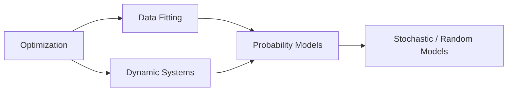

Optimization is the root. Data fitting and dynamic systems each reuse optimization concepts. Finally, probability models inherit techniques from both optimization and dynamic systems, leading to stochastic models.

### Check your understanding

1. **What is the key assumption about the reader’s background in probability?**  
   <details><summary>Answer</summary> The reader is assumed to have a basic familiarity with probability from a mathematical perspective. Full probability theory will not be covered, but every needed concept will be explained.</details>

2. **What does the notation $X \in \{x_1, \dots, x_n\}$ with $n \ge 1$ mean?**  
   <details><summary>Answer</summary> $X$ is a random variable that can take on one of $n$ possible values, where $n$ is at least 1. The set of possible values is finite, making $X$ a discrete random variable.</details>

3. **How does the course’s transition to probability models relate to the previous units on optimization and data fitting?**  
   <details><summary>Answer</summary> The course uses a cascading approach: ideas developed in optimization were carried over to data fitting, and now both optimization and dynamic systems ideas will be carried forward into probability models. This is a unifying principle of applied mathematics.</details>
## Review of Discrete Probability Basics

This section covers the fundamental concepts of discrete probability that you will need for batch testing optimization. We define a discrete random variable, its probability distribution, the expected value, and the condition for independence between random variables.

### Random Variables and Probability Distributions

A **discrete random variable** is a variable that can take on a finite number of distinct values. Let $X$ be a discrete random variable. The set of all possible values that $X$ can take is written as

$$
X \in \{x_1, x_2, \dots, x_n\}, \quad n \ge 1.
$$


*[03:20](https://www.youtube.com/watch?v=7c43WFHCRac&t=200s) The frame shows a whiteboard with mathematical notation defining a set X and a probability P(X=xi) = pi.*


For each possible value $x_i$, we assign a probability that $X$ equals that value:

$$
P(X = x_i) = p_i.
$$

Each probability $p_i$ is a number between 0 and 1 inclusive. A probability of 1 means the event is certain; a probability of 0 means it is impossible. Values like 0.5 or 0.75 represent intermediate likelihoods (equivalent to percentages 50% and 75%).


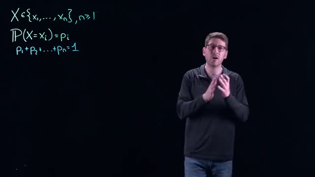
*[04:00](https://www.youtube.com/watch?v=7c43WFHCRac&t=240s) Mathematical notation for a set X, probability P(X=xi)=pi, and the sum of probabilities p1+p2+...+pn=1.*


The list of probabilities $p_1, p_2, \dots, p_n$ is called the **probability distribution** of $X$. Because we assume we know all possible states that $X$ can take, the probabilities must sum to 1:

$$
p_1 + p_2 + \dots + p_n = 1.
$$

This completeness condition ensures that 100% of the outcomes are accounted for. For example, a fair six‑sided die has $n=6$, $x_i = i$ for $i=1,\dots,6$, and $p_i = \frac{1}{6}$ for each face. The sum is $6 \times \frac{1}{6} = 1$. A value like 7 is not in the set $\{1,\dots,6\}$, so $P(X=7)=0$ and is not included in the distribution.


*[05:20](https://www.youtube.com/watch?v=7c43WFHCRac&t=320s) Mathematical formulas for probability and expected value are written on a dark background.*


### Expected Value

The **expected value** (or mean) of a discrete random variable $X$ is a weighted average of its possible values, where the weights are the probabilities. It is denoted $E(X)$ and defined as

$$
E(X) = \sum_{i=1}^{n} p_i \, x_i.
$$

For the fair die example:

$$
E(X) = \frac{1}{6} \cdot 1 + \frac{1}{6} \cdot 2 + \frac{1}{6} \cdot 3 + \frac{1}{6} \cdot 4 + \frac{1}{6} \cdot 5 + \frac{1}{6} \cdot 6 = 3.5.
$$

Because all probabilities are equal, the expected value is simply the midpoint between 1 and 6.


*[06:20](https://www.youtube.com/watch?v=7c43WFHCRac&t=380s) A whiteboard displays mathematical formulas for probability and expected value, including X belonging to a set of values, the probability of X being x_i, the sum of probabilities equaling 1, and the expected value of X.*


The notation $p_1, p_2, \dots, p_n$ is explicitly called the **probability distribution** of $X$.

### Independence

Two discrete random variables $Y$ and $Z$ are **independent** if the probability that $Y$ takes a particular value and $Z$ takes another particular value equals the product of their individual probabilities. Formally, for any $y_i$ in the set of possible values of $Y$ and any $z_j$ in the set of possible values of $Z$,

$$
P(Y = y_i \text{ and } Z = z_j) = P(Y = y_i) \, P(Z = z_j).
$$


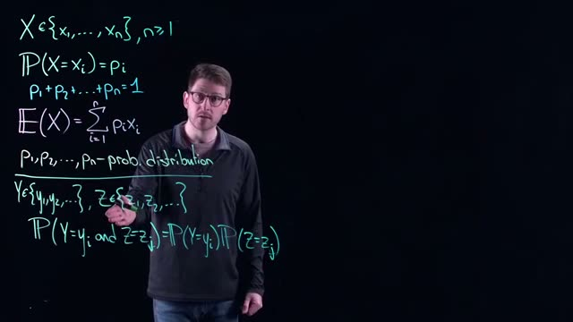
*[08:00](https://www.youtube.com/watch?v=7c43WFHCRac&t=480s) A whiteboard shows mathematical equations for probability distributions, including the expected value and the probability of independent events.*


The sets of possible values for $Y$ and $Z$ can be different (e.g., one six‑sided die and one 12‑sided die). The only requirement is that each set is finite.

**Example with two fair six‑sided dice.** Let $Y$ be the outcome of the first die and $Z$ the outcome of the second die. Then $P(Y=2) = \frac{1}{6}$, $P(Z=1) = \frac{1}{6}$, and because the dice rolls are independent,

$$
P(Y=2 \text{ and } Z=1) = \frac{1}{6} \times \frac{1}{6} = \frac{1}{36}.
$$

The outcome of one die does not affect the outcome of the other.

The following diagram illustrates the concept of independence for two random variables $Y$ and $Z$:

```mermaid
flowchart LR
    subgraph Y
        y1[Y = y_i]
    end
    subgraph Z
        z1[Z = z_j]
    end
    joint[P(Y=y_i and Z=z_j) = P(Y=y_i) * P(Z=z_j)]
    Y --> joint
    Z --> joint
```

No relationship exists between the values taken by $Y$ and $Z$; the joint probability factorizes.

### Check your understanding

1. A discrete random variable $X$ has possible values $\{2, 4, 6\}$ with probabilities $P(X=2)=0.3$, $P(X=4)=0.5$, $P(X=6)=0.2$. Is this a valid probability distribution? Why or why not?

<details><summary>Answer</summary>
Yes, it is valid because all probabilities are between 0 and 1 and they sum to $0.3+0.5+0.2=1$.
</details>

2. Compute the expected value $E(X)$ for the random variable in question 1.

<details><summary>Answer</summary>
$E(X) = 0.3 \times 2 + 0.5 \times 4 + 0.2 \times 6 = 0.6 + 2.0 + 1.2 = 3.8$.
</details>

3. Two fair dice are rolled: one six‑sided die (random variable $Y$) and one four‑sided die (random variable $Z$, with faces 1,2,3,4). Are $Y$ and $Z$ independent? What is $P(Y=3 \text{ and } Z=2)$?

<details><summary>Answer</summary>
Yes, they are independent because the outcome of one die does not influence the other. $P(Y=3) = \frac{1}{6}$, $P(Z=2) = \frac{1}{4}$, so $P(Y=3 \text{ and } Z=2) = \frac{1}{6} \times \frac{1}{4} = \frac{1}{24}$.
</details>

4. Why must the sum of all probabilities in a discrete probability distribution equal 1?

<details><summary>Answer</summary>
The sum equals 1 because the set of possible values is assumed to be complete: every outcome of the random variable is accounted for, and the total probability of all possible outcomes must be 100%.
</details>
## Problem Setup: Diode Testing Scenario

This section introduces a real-world problem that will be modeled using a discrete probability distribution. The goal is to decide how many diodes to test together in a batch to minimize the average cost of quality control, while accounting for the random occurrence of faulty diodes.

We begin with a short review of the probability concepts needed. The whiteboard at 
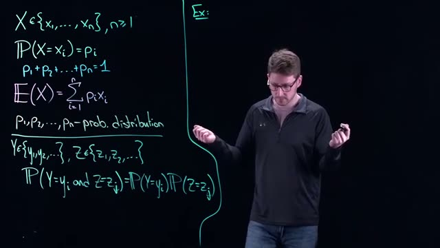
*[09:40](https://www.youtube.com/watch?v=7c43WFHCRac&t=580s) The whiteboard shows mathematical equations for probability distribution, expected value, and joint probability.*
 shows the foundation of any discrete probability model:

- A random variable $X$ can take values from a finite set $\{x_1, x_2, \dots, x_n\}$.
- For each value $x_i$, the probability $\mathbb{P}(X = x_i) = p_i$ is assigned.
- The probabilities must sum to $1$: $p_1 + p_2 + \dots + p_n = 1$.
- The expected value (mean) of $X$ is
  $$ \mathbb{E}(X) = \sum_{i=1}^{n} p_i x_i. $$
- The set $\{p_1, p_2, \dots, p_n\}$ is called the **probability distribution** of $X$.
- For two random variables $Y$ and $Z$, the joint probability of $Y=y_i$ and $Z=z_j$ is the product of the individual probabilities when the events are **independent**:
  $$ \mathbb{P}(Y = y_i \text{ and } Z = z_j) = \mathbb{P}(Y = y_i) \cdot \mathbb{P}(Z = z_j). $$

Independence of diodes (each diode’s quality does not affect another’s) is a key assumption in the batch testing model.

The same equations appear again at 
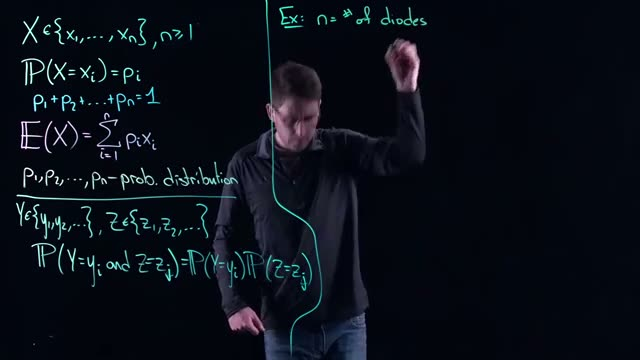
*[11:20](https://www.youtube.com/watch?v=7c43WFHCRac&t=680s) A whiteboard shows mathematical formulas for probability distributions and expected value, with an example of 'n = # of diodes'.*, where the whiteboard now includes the annotation “Ex: $n = \# \text{ of diodes}$”. This example will be our focus.

### The Diode Testing Scenario

An electronics manufacturer produces diodes. Quality control engineers want to detect faulty diodes before they are shipped. It is estimated that about **0.3%** of all diodes produced are faulty. The defects appear completely at random across the production line.

Two testing strategies are compared:

1. **Individual testing**: Every diode is tested one by one. The cost is **5 cents per diode**.
2. **Batch testing**: A random sample of $n$ diodes is taken and tested together as a single batch.  
   - The cost to test one batch is **4 cents + 1 cent per diode** in the batch, i.e., $4 + n$ cents (where $n$ is the number of diodes in the batch).  
   - If the batch test passes (all diodes are good), the entire batch is shipped.  
   - If the batch test fails (at least one diode is faulty), each diode in the batch must then be tested individually at the individual cost of **5 cents per diode**. In that case the total cost for the batch becomes the batch test cost plus the individual test costs: $(4 + n) + 5n = 4 + 6n$ cents.

The following table summarizes the costs:

| Testing strategy | Cost per tested unit | Additional cost if batch fails |
|------------------|----------------------|--------------------------------|
| Individual test  | 5 cents per diode    | Not applicable                 |
| Batch test       | $4 + n$ cents per batch of $n$ diodes | $5n$ cents (individual tests) |

The batch test is cheaper per diode when the batch is good, but can be more expensive if many batches fail. The goal is to **choose the batch size $n$ (the number of diodes per test group) that minimizes the expected cost per diode**, while also ensuring that few faulty diodes slip through (the batch test will catch any batch that contains a fault, because all diodes are tested individually upon failure).

### Formal Definition of Variables

Let

- $n$ = number of diodes in each test group (batch size).
- $p$ = probability that a single diode is faulty = $0.3\% = 0.003$.
- The probability that a given diode is good is $1 - p = 0.997$.
- Since diodes are independent, the probability that all $n$ diodes in a batch are good is $(1-p)^n$.
- The probability that the batch fails (at least one faulty diode) is $1 - (1-p)^n$.

The cost of testing one batch depends on the outcome:

- If the batch passes (all good): cost = $4 + n$ cents.
- If the batch fails: cost = $4 + 6n$ cents.

The expected cost for one batch of $n$ diodes is therefore
$$ \mathbb{E}[\text{cost per batch}] = (4+n) \cdot (1-p)^n + (4+6n) \cdot \bigl(1 - (1-p)^n\bigr). $$

Simplify:
$$ \mathbb{E}[\text{cost per batch}] = 4 + n + 5n \bigl(1 - (1-p)^n\bigr). $$

The **average testing cost per diode** is obtained by dividing the expected batch cost by $n$:
$$ \text{Average cost per diode} = \frac{4 + n + 5n(1 - (1-p)^n)}{n}. $$

We seek the integer $n \ge 1$ that minimizes this expression.

### Decision Flow for Batch Testing

The following Mermaid flowchart illustrates the decision process for a single batch.

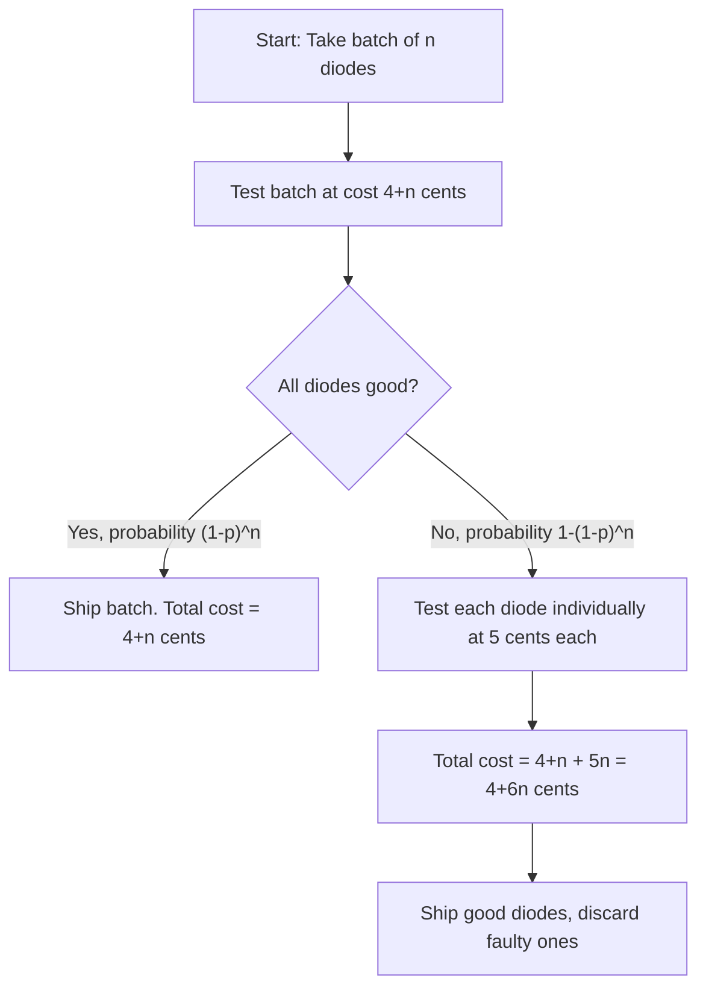

The randomness of defects means we cannot know in advance which batches will fail. The probability model lets us compute the long-run average cost per diode for any batch size $n$.

### Summary

The problem is to find the optimal batch size $n$ that minimizes the expected testing cost per diode, given a known defect rate of 0.3% and the cost structure for batch and individual testing. This is a discrete optimization problem that will be solved by modeling the outcome of a batch test as a Bernoulli trial (pass/fail) and using the expected value formula.

---

### Check your understanding

1. **Why is batch testing potentially cheaper than individual testing even though it can involve extra costs when a batch fails?**  
   <details><summary>Answer</summary>  
   Because the batch test is very cheap when the batch is good (only $4+n$ cents for $n$ diodes). Most batches are good (since the defect rate is low), so the savings on good batches outweigh the extra cost of testing faulty batches individually.  
   </details>

2. **What is the probability that a batch of size $n=10$ contains at least one faulty diode?**  
   <details><summary>Answer</summary>  
   $p = 0.003$. The probability of at least one faulty diode is $1 - (1-p)^{10} = 1 - 0.997^{10} \approx 1 - 0.9704 = 0.0296$, or about 2.96%.  
   </details>

3. **Write the expression for the expected cost per diode when $n=5$ (without simplifying).**  
   <details><summary>Answer</summary>  
   $\displaystyle \frac{4 + 5 + 5 \cdot 5 \cdot \bigl(1 - (1-0.003)^5\bigr)}{5}$  
   Or more explicitly: $\displaystyle \frac{9 + 25\bigl(1 - 0.997^5\bigr)}{5}$.  
   </details>

4. **Why is the assumption of independence important for this model?**  
   <details><summary>Answer</summary>  
   Independence allows us to multiply individual probabilities to get the probability that all diodes in a batch are good. If defects were clustered (dependent), the batch test would be less effective because the chance of multiple defects in a batch would be higher than predicted by independence, making batch testing more costly.  
   </details>
## Model Formulation: Cost Definitions and Expected Value

In this section, we define the cost structure for batch testing diodes and set up the expected value calculation that will drive our optimization. The goal is to find the optimal batch size $n$ that minimizes the average testing cost per diode.

### Problem Setup and Variables

We are modeling a quality control process where diodes arrive in batches. The key decision variable is the batch size $n$, which represents the number of diodes tested together as a group. The testing process has two possible outcomes:

1. **All diodes in the batch are good**: Only the group test is needed
2. **At least one diode is faulty**: Individual testing is required after the group test


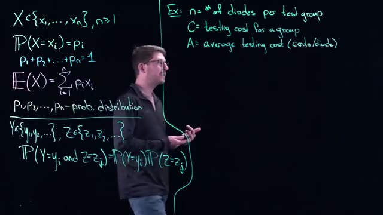
*[12:20](https://www.youtube.com/watch?v=7c43WFHCRac&t=740s) The whiteboard shows mathematical formulas for probability distribution, expected value, and an example problem defining variables for diodes, testing cost, and average testing cost.*


The whiteboard establishes the mathematical framework for discrete probability models. We define three random variables:

- $n$ = number of diodes per test group (decision variable)
- $C$ = testing cost for a group (random variable)
- $A$ = average testing cost in cents per diode (expected value)

The fundamental probability concepts shown are:

For a discrete random variable $X$ taking values $\{x_1, x_2, ..., x_n\}$ with $n > 1$:
- $P(X = x_i) = p_i$ where each $p_i$ is a probability
- $p_1 + p_2 + ... + p_n = 1$ (probabilities sum to 1)
- $E(X) = \sum_{i=1}^{n} p_i x_i$ (expected value formula)

For independent random variables $Y$ and $Z$:
- $P(Y = y_i \text{ and } Z = z_j) = P(Y = y_i) \cdot P(Z = z_j)$

### Cost Structure for Individual Testing


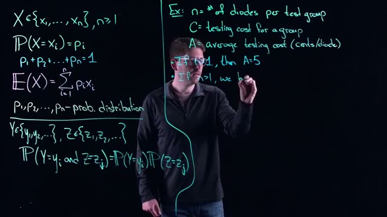
*[14:00](https://www.youtube.com/watch?v=7c43WFHCRac&t=840s) A whiteboard shows mathematical equations for probability distribution and expected value, along with an example problem involving diodes and testing costs.*


When $n = 1$, we test each diode individually. The cost is straightforward:

$$A = 5 \text{ cents per diode}$$

This serves as our baseline case. Every diode costs exactly 5 cents to test individually, with no batch testing involved.

### Cost Structure for Batch Testing


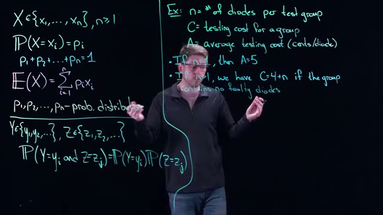
*[14:40](https://www.youtube.com/watch?v=7c43WFHCRac&t=880s) This frame shows mathematical equations for probability distributions and expected value, along with an example problem involving diodes and testing costs.*


When $n > 1$, the cost depends on whether the batch contains any faulty diodes. The testing process has two components:

1. **Group test cost**: A base price of 4 cents plus 1 cent per diode in the group
2. **Individual test cost**: Only incurred if the group test fails

**Case 1: No faulty diodes in the group**

If all diodes in the batch are good, we only pay for the group test:

$$C = 4 + n \text{ cents}$$

This covers the machine setup cost (4 cents) plus the per-diode testing cost (1 cent each).

**Case 2: At least one faulty diode in the group**


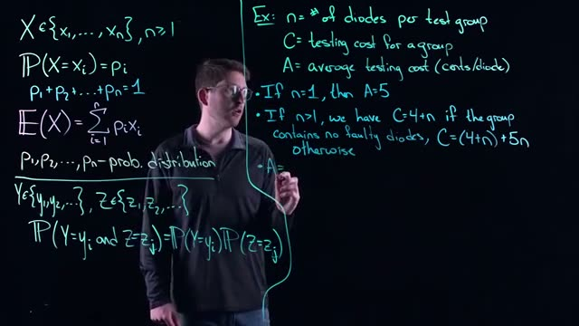
*[15:40](https://www.youtube.com/watch?v=7c43WFHCRac&t=940s) The whiteboard shows mathematical formulas for probability distribution and an example problem about testing costs for diodes.*


If any diode in the batch fails, we must test each diode individually after the group test. The total cost becomes:

$$C = (4 + n) + 5n \text{ cents}$$

The first term $(4 + n)$ is the group test cost. The second term $5n$ is the individual testing cost at 5 cents per diode for all $n$ diodes in the group.

### Expected Value Calculation

The average testing cost per diode $A$ is defined as:

$$A = \frac{E(C)}{n}$$

where $E(C)$ is the expected value (average) of the group testing cost $C$.

To compute $E(C)$, we need the probability distribution of $C$. Let $p$ be the probability that a single diode is faulty (this will be defined in a later section). The probability that a batch of $n$ diodes contains no faulty diodes is $(1-p)^n$, assuming diodes are independent.

The expected value of $C$ is:

$$E(C) = (4 + n) \cdot P(\text{no faulty diodes}) + ((4 + n) + 5n) \cdot P(\text{at least one faulty diode})$$

$$E(C) = (4 + n)(1-p)^n + (4 + n + 5n)(1 - (1-p)^n)$$

Simplifying:

$$E(C) = (4 + n)(1-p)^n + (4 + 6n)(1 - (1-p)^n)$$

### Model Summary

The complete model for average testing cost per diode is:

$$A(n) = \begin{cases} 
5 & \text{if } n = 1 \\
\frac{(4 + n)(1-p)^n + (4 + 6n)(1 - (1-p)^n)}{n} & \text{if } n > 1
\end{cases}$$

This is a discrete probability optimization problem where we choose $n$ to minimize $A(n)$. The randomness comes from the unknown quality of diodes in each batch, modeled by the probability $p$ of a faulty diode.

### Check your understanding

1. **Why does the cost structure differ between $n=1$ and $n>1$?**

<details><summary>Answer</summary>
When $n=1$, we test each diode individually at 5 cents each, with no batch testing involved. When $n>1$, we use a two-stage process: first test the entire batch (cost: $4+n$ cents), then only test individually (additional $5n$ cents) if the batch test fails. This creates a cost tradeoff that depends on batch quality.
</details>

2. **What is the expected value $E(C)$ when $n=10$ and $p=0.01$?**

<details><summary>Answer</summary>
First, $(1-p)^n = (0.99)^{10} \approx 0.9044$. Then:
$E(C) = (4+10)(0.9044) + (4+60)(1-0.9044)$
$E(C) = 14(0.9044) + 64(0.0956)$
$E(C) = 12.6616 + 6.1184 = 18.78$ cents
</details>

3. **Why is $A$ called an "expected value" rather than a fixed cost?**

<details><summary>Answer</summary>
$A$ is the average testing cost per diode over many batches. Because the actual cost $C$ for any single batch depends on the random outcome of whether diodes are faulty, we cannot know the exact cost in advance. The expected value gives us the long-run average cost we can expect per diode.
</details>

4. **What happens to $A$ as $n$ becomes very large, assuming $p>0$?**

<details><summary>Answer</summary>
As $n$ increases, $(1-p)^n$ approaches 0, meaning the probability of a perfect batch becomes negligible. Then $E(C) \approx 4+6n$, and $A \approx (4+6n)/n = 6 + 4/n$, which approaches 6 cents per diode. This is worse than the 5 cents per diode for individual testing, showing that very large batches are inefficient when faulty diodes exist.
</details>
## Computing Expected Cost and the Average Cost Function

### Setting Up the Expected Value Calculation

The expected value of the testing cost $C$ for a group of $n$ diodes combines two possible outcomes with their respective probabilities. For a group of $n$ diodes, the cost depends on whether the group contains any faulty diodes.


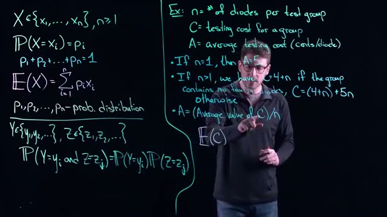
*[17:00](https://www.youtube.com/watch?v=7c43WFHCRac&t=1020s) This frame displays mathematical formulas for probability distribution, expected value, and an example problem involving diode testing costs.*


The two possible cost scenarios are:

1. **No faulty diodes in the group**: The cost is $C = 4 + n$ cents (the fixed group test cost plus the individual retest cost for each diode).
2. **At least one faulty diode in the group**: The cost is $C = (4 + n) + 5n$ cents (the fixed group test cost, plus individual retest for all $n$ diodes, plus the cost of replacing each diode with a known good one).

Let $p$ represent the probability that the group contains no faulty diodes. Then $1 - p$ is the probability that the group contains at least one faulty diode. These two probabilities sum to 1 because they cover all possible outcomes.

The expected value of $C$ is:

$$E(C) = (4 + n)p + ((4 + n) + 5n)(1 - p) \tag{1}$$

### Computing the Probability $p$


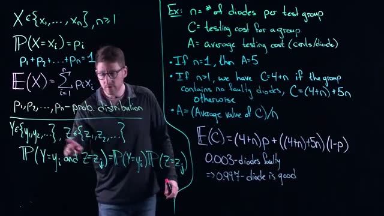
*[19:00](https://www.youtube.com/watch?v=7c43WFHCRac&t=1140s) The whiteboard shows probability distributions, expected value formulas, and an example problem involving diode testing costs.*


The probability that a single diode is good is $0.997$ (since $0.3\%$ or $0.003$ of diodes are faulty). Because each diode's condition is independent of every other diode, the probability that all $n$ diodes in a group are good is the product of their individual probabilities.

For independent events, the joint probability equals the product of the individual probabilities. Therefore:

$$p = (0.997)^n \tag{2}$$

This means:
- For $n = 2$: $p = 0.997 \times 0.997 = 0.997^2$
- For $n = 3$: $p = 0.997 \times 0.997 \times 0.997 = 0.997^3$
- For any $n$: $p = 0.997^n$

### Substituting $p$ into the Expected Value


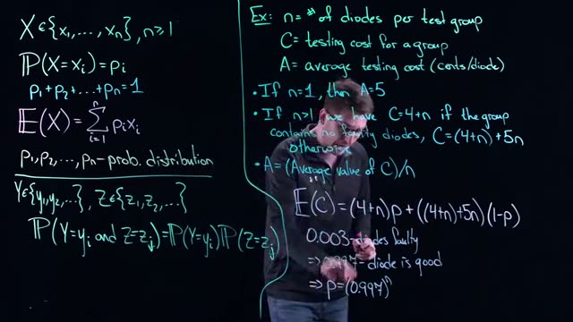
*[20:00](https://www.youtube.com/watch?v=7c43WFHCRac&t=1200s) The whiteboard displays mathematical formulas for probability distributions, expected values, and an example problem involving the cost of testing diodes.*


Replace $p$ with $(0.997)^n$ and $1-p$ with $1 - (0.997)^n$ in equation (1):

$$E(C) = (4 + n)(0.997)^n + ((4 + n) + 5n)(1 - (0.997)^n)$$

Expand the second term:

$$E(C) = (4 + n)(0.997)^n + (4 + n + 5n)(1 - (0.997)^n)$$

$$E(C) = (4 + n)(0.997)^n + (4 + 6n)(1 - (0.997)^n)$$

Distribute the $(4 + 6n)$ term:

$$E(C) = (4 + n)(0.997)^n + (4 + 6n) - (4 + 6n)(0.997)^n$$

Combine the terms containing $(0.997)^n$:

$$E(C) = (4 + 6n) + [(4 + n) - (4 + 6n)](0.997)^n$$

$$E(C) = (4 + 6n) + [4 + n - 4 - 6n](0.997)^n$$

$$E(C) = (4 + 6n) + (-5n)(0.997)^n$$


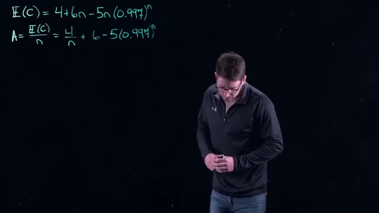
*[21:40](https://www.youtube.com/watch?v=7c43WFHCRac&t=1300s) A whiteboard shows the equations for E(C) and A, where A is E(C) divided by n.*


The simplified expected cost for a group of $n$ diodes is:

$$E(C) = 4 + 6n - 5n(0.997)^n \tag{3}$$

### Computing the Average Cost Per Diode

The average cost per diode $A$ is the expected cost per group divided by the number of diodes in the group:

$$A = \frac{E(C)}{n} = \frac{4 + 6n - 5n(0.997)^n}{n}$$

Simplify by dividing each term in the numerator by $n$:

$$A = \frac{4}{n} + 6 - 5(0.997)^n \tag{4}$$

This average cost function $A$ depends on the batch size $n$. The goal is to find the value of $n$ that minimizes $A$, which represents the most cost-effective number of diodes to test together in a single batch.

### Summary of Key Formulas

| Quantity | Formula | Description |
|----------|---------|-------------|
| Probability of no faulty diodes | $p = (0.997)^n$ | All $n$ diodes are good |
| Expected cost per group | $E(C) = 4 + 6n - 5n(0.997)^n$ | Average testing cost for one batch |
| Average cost per diode | $A = \frac{4}{n} + 6 - 5(0.997)^n$ | Cost per diode in cents |

### Check Your Understanding

1. Why is the probability that all $n$ diodes are good equal to $(0.997)^n$ rather than $0.997 \times n$?

<details><summary>Answer</summary>
Because the diodes are independent, the probability that all are good is the product of their individual probabilities, not the sum. For independent events, $P(\text{all good}) = P(\text{diode 1 good}) \times P(\text{diode 2 good}) \times \dots \times P(\text{diode n good}) = 0.997 \times 0.997 \times \dots \times 0.997 = 0.997^n$.
</details>

2. In the simplified formula $E(C) = 4 + 6n - 5n(0.997)^n$, what does the term $6n$ represent?

<details><summary>Answer</summary>
The term $6n$ comes from combining the base cost components. When there is at least one faulty diode, the cost includes $4 + n$ for the group test and individual retests, plus $5n$ for replacements, totaling $4 + 6n$. The $6n$ represents the per-diode costs ($n$ for retesting plus $5n$ for replacements) that would apply if every group had a fault, before accounting for the probability that some groups have no faults.
</details>

3. If $n = 1$, what does the average cost formula $A = \frac{4}{n} + 6 - 5(0.997)^n$ give, and does it match the stated cost for testing single diodes?

<details><summary>Answer</summary>
For $n = 1$: $A = \frac{4}{1} + 6 - 5(0.997)^1 = 4 + 6 - 5(0.997) = 10 - 4.985 = 5.015$ cents. This is approximately 5 cents, matching the stated cost of 5 cents per diode when testing individually. The slight difference (0.015 cents) comes from rounding the probability.
</details>

4. Why does the average cost formula include a subtraction term $-5n(0.997)^n$?

<details><summary>Answer</summary>
The subtraction term accounts for the cost savings when a group contains no faulty diodes. When all diodes are good, the group avoids the $5n$ replacement cost. The term $-5n(0.997)^n$ subtracts this avoided cost, weighted by the probability $(0.997)^n$ that the group is fault-free.
</details>
## Optimization: Finding the Optimal Batch Size

The goal is to find the batch size $n$ (number of diodes per batch) that minimizes the average cost per diode, $A(n)$. From the previous section, the expected cost per batch is

$$
E(C) = 4 + 6n - 5n(0.997)^n .
$$

Dividing by $n$ gives the average cost per diode:

$$
A(n) = \frac{E(C)}{n} = \frac{4}{n} + 6 - 5(0.997)^n .
$$

This function is completely deterministic (no remaining randomness after taking the expectation). To find its minimum, treat $n$ as a continuous variable and use calculus.


*[22:40](https://www.youtube.com/watch?v=7c43WFHCRac&t=1360s) A whiteboard shows the equations for E(C) and A, and the minimum value of A at n=17.*

*The whiteboard shows the equations for $E(C)$ and $A$, and the minimum value of $A$ at $n=17$.*

### Step 1: Differentiate $A(n)$

Compute the derivative with respect to $n$:

$$
\frac{dA}{dn} = \frac{d}{dn}\left(\frac{4}{n}\right) + \frac{d}{dn}(6) - \frac{d}{dn}\left(5(0.997)^n\right).
$$

- $\frac{d}{dn}\left(\frac{4}{n}\right) = -\frac{4}{n^2}$.
- $\frac{d}{dn}(6) = 0$.
- $\frac{d}{dn}\left(5(0.997)^n\right) = 5 (0.997)^n \ln(0.997)$.

Thus

$$
\frac{dA}{dn} = -\frac{4}{n^2} - 5 (0.997)^n \ln(0.997).
$$

### Step 2: Set the derivative to zero

$$
-\frac{4}{n^2} - 5 (0.997)^n \ln(0.997) = 0.
$$

Multiply both sides by $-1$:

$$
\frac{4}{n^2} + 5 (0.997)^n \ln(0.997) = 0.
$$

Since $\ln(0.997) < 0$ (because $0.997 < 1$), the term $5 (0.997)^n \ln(0.997)$ is negative. Rearranging:

$$
\frac{4}{n^2} = -5 (0.997)^n \ln(0.997).
$$

Let $k = -\ln(0.997) = \ln\left(\frac{1}{0.997}\right) \approx 0.003009$. Then the equation becomes

$$
\frac{4}{n^2} = 5 (0.997)^n k.
$$

### Step 3: Solve numerically

This equation cannot be solved algebraically. Solve it numerically (e.g., by iteration or using a solver). The solution is $n \approx 17$. Because $n$ must be a positive integer (batch size), the optimal batch size is $n = 17$.

### Step 4: Compute the minimum average cost

Evaluate $A(17)$:

$$
A(17) = \frac{4}{17} + 6 - 5(0.997)^{17}.
$$

First compute $(0.997)^{17}$:

$$
(0.997)^{17} = e^{17 \ln(0.997)} \approx e^{17 \times (-0.003009)} = e^{-0.051153} \approx 0.9501.
$$

Then

$$
A(17) = \frac{4}{17} + 6 - 5 \times 0.9501 \approx 0.2353 + 6 - 4.7505 = 1.4848.
$$

Rounding to two decimal places gives **1.48 cents per diode**.


*[23:20](https://www.youtube.com/watch?v=7c43WFHCRac&t=1400s) A whiteboard shows the equations for E(C) and A, and the minimum value of A.*

*The whiteboard repeats the equations and confirms the minimum: $A = 1.48$ cents/diode at $n=17$.*

### Interpretation

As the factory manager (or the person responsible for the testing process), you should organize the diodes into batches of **17**. When you test a batch of 17 diodes, the average cost per diode is **1.48 cents**. This is the lowest possible average cost achievable with the given cost structure and defect probability.

---

### Check your understanding

1. **Why is the derivative method appropriate for finding the optimal batch size even though $n$ must be an integer?**  
   <details><summary>Answer</summary>  
   The derivative method treats $n$ as a continuous variable and finds the real-valued minimum. Because the function $A(n)$ is convex (for positive $n$), the integer nearest to the continuous optimum gives the true integer minimum. In this case, the continuous optimum is approximately 17, and the integer 17 is the optimal batch size.  
   </details>

2. **What would happen to the optimal batch size if the defect probability increased (i.e., $p$ became larger than 0.003)?**  
   <details><summary>Answer</summary>  
   If the defect probability increases, the term $(1-p)^n$ decays faster. The derivative equation would shift, likely leading to a smaller optimal batch size because testing larger batches becomes riskier (more faulty diodes expected). The exact value would need to be recomputed numerically.  
   </details>

3. **Explain why the average cost per diode $A(n)$ is not simply the cost of testing one diode individually.**  
   <details><summary>Answer</summary>  
   Testing individually would cost 6 cents per diode (the per-diode test cost) plus the 4 cent base cost spread over one diode, totaling 10 cents per diode. Batch testing reduces the per-diode cost by sharing the base cost across many diodes and by avoiding testing good diodes individually. However, if a batch fails, all diodes in that batch must be retested individually, which adds cost. The optimal batch size balances these trade-offs.  
   </details>

4. **If the factory manager decided to use batches of 20 instead of 17, would the average cost per diode be higher or lower?**  
   <details><summary>Answer</summary>  
   Higher. The function $A(n)$ has a unique minimum at $n=17$. For $n=20$, $A(20) = \frac{4}{20} + 6 - 5(0.997)^{20}$. Compute $(0.997)^{20} \approx 0.9418$, so $A(20) \approx 0.2 + 6 - 4.709 = 1.491$ cents, which is greater than 1.48 cents.  
   </details>
## Sensitivity Analysis on the Fault Probability

Sensitivity analysis asks how a model’s output changes when you vary one of its inputs. It is a standard part of mathematical modeling, just as we have seen for optimization and for dynamic systems. In this section we explore two kinds of sensitivity for the batch testing example: (1) sensitivity to the choice of batch size when it cannot be exactly the optimal value, and (2) sensitivity to the estimate of the fault probability $q$.

### Sensitivity to Batch Size Constraints

The optimal batch size that minimizes the average cost per diode is $n = 17$ (cost per diode = 1.48 cents). In practice, a factory may only be able to test diodes in batches that are multiples of 5, such as 15 or 20. The question is: how much does the cost increase if you use 15 or 20 instead of 17?


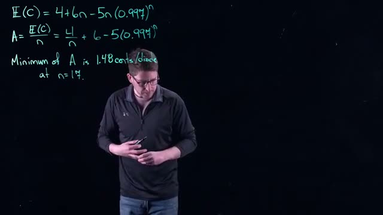
*[25:20](https://www.youtube.com/watch?v=7c43WFHCRac&t=1520s) A whiteboard shows the equations for E(C) and A, and the minimum value of A is 1.48 cents/diode at n=17.*

The whiteboard shows the expression for the average cost per diode:

$$
A(n) = \frac{E(C)}{n} = \frac{4}{n} + 6 - 5(0.997)^n
$$

The function $A(n)$ is flat near its minimum. This means that moving to a nearby integer (e.g., 15 or 20) does not raise the cost significantly. For example, if you use $n=15$ instead of $n=17$, the average cost per diode increases by only a small fraction of a cent. This is a direct sensitivity result: the optimal batch size is robust to small changes in $n$.

**Takeaway:** Even if you cannot hit exactly $n=17$, you have “wiggle room.” The flatness of $A(n)$ around the optimum means the model outputs are insensitive to small deviations in $n$.

### Sensitivity to the Fault Probability $q$

The more important sensitivity analysis concerns the estimate of the fault probability $q$. In the original model we used $q = 0.003$ (0.3% fault rate). This value is almost certainly not exact; it is an estimate based on historical data. How does the average cost per diode $A$ change if the true fault rate is slightly different?

We rewrite the average cost expression in terms of $q$. From the original equation $E(C) = 4 + 6n - 5n(0.997)^n$ and noting $0.997 = 1 - q$, we have:

$$
A(n, q) = \frac{4}{n} + 6 - 5(1 - q)^n
$$


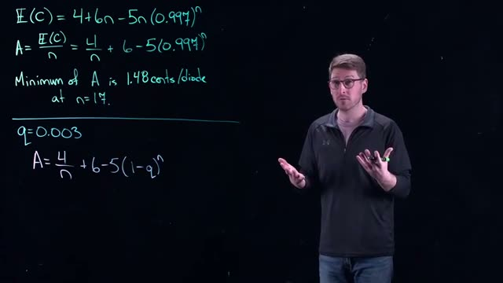
*[26:20](https://www.youtube.com/watch?v=7c43WFHCRac&t=1580s) The whiteboard shows the equations for E(C) and A, the minimum value of A, and a new equation for A with q=0.003.*

The whiteboard shows this general form:

$$
A = \frac{4}{n} + 6 - 5(1 - q)^n
$$

Now we compute the sensitivity of $A$ with respect to $q$ at the optimal batch size $n=17$. The standard measure of sensitivity is the **elasticity** (relative change):

$$
S(A, q) = \frac{dA}{dq} \cdot \frac{q}{A}
$$

First, compute the derivative:

$$
\frac{dA}{dq} = \frac{d}{dq} \left( -5(1 - q)^n \right) = -5 \cdot n (1 - q)^{n-1} \cdot (-1) = 5 n (1 - q)^{n-1}
$$

At $n=17$ and $q=0.003$,

$$
\frac{dA}{dq} = 5 \cdot 17 \cdot (0.997)^{16}
$$

We also need the value of $A$ at the optimum. From the screenshot, minimum $A = 1.48$ cents per diode.


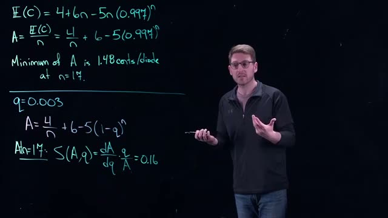
*[27:20](https://www.youtube.com/watch?v=7c43WFHCRac&t=1640s) A whiteboard shows mathematical equations for E(C), A, and S(A,q) with specific values for q and n.*

The whiteboard gives the final elasticity:

$$
S(A, q) = \frac{dA}{dq} \cdot \frac{q}{A} = 0.16
$$

**Interpretation:** The elasticity $S(A,q) = 0.16$ means that for every 1% change in $q$, the average cost $A$ changes by only about 0.16%. This is a very small value, indicating that the model is highly robust to errors in the estimate of the fault probability. If the true fault rate is 0.4% (a 33% relative increase from 0.3%), the cost per diode would increase by only about $33\% \times 0.16\% \approx 5.3\%$ of the original cost, still a very small absolute amount.

### Why Sensitivity Matters for Estimates

The fault probability $q$ is never known exactly. It is derived from historical data, for instance the fraction of diodes that failed in the previous year. That data could be influenced by temporary conditions such as humidity in the factory. Sensitivity analysis tells us that even if the historical estimate is off by a moderate amount, the economic consequence is negligible. The model is robust.

### Summary Table of Sensitivity Results

| Input parameter | Perturbation | Effect on average cost $A$ | Elasticity value |
|-----------------|--------------|-----------------------------|------------------|
| Batch size $n$ | Change from 17 to 15 or 20 | Very small increase (fraction of a cent) | Not explicitly computed, but function is flat |
| Fault probability $q$ | 1% relative increase in $q$ | 0.16% relative increase in $A$ | $S(A,q)=0.16$ |

### Process Overview

The following diagram ties together the steps from modeling to sensitivity analysis.

```mermaid
flowchart LR
    A[Historical data: estimate fault probability q] --> B[Expected cost E(C)=4+6n-5n(1-q)^n]
    B --> C[Average cost A = E(C)/n]
    C --> D[Optimization: find n that minimizes A]
    D --> E[Optimal n=17, A=1.48 cents/diode]
    E --> F[Sensitivity analysis: vary n and q]
    F --> G[Flatness near optimum: n robust]
    F --> H[Elasticity S(A,q)=0.16: q robust]
```

### Check Your Understanding

1. Explain why the average cost function $A(n)$ being flat around the minimum is a form of sensitivity analysis.

<details><summary>Answer</summary>
A flat function means that small changes in the input $n$ cause very small changes in the output $A$. This indicates that the optimal batch size is not critical; you can use nearby batch sizes without a large cost penalty.
</details>

2. Compute the elasticity $S(A,q)$ if the derivative $\frac{dA}{dq}$ at $n=17, q=0.003$ were 10 (instead of the actual value) and $A=1.48$. What would the elasticity be? Would the model still be robust?

<details><summary>Answer</summary>
$S = 10 \times \frac{0.003}{1.48} \approx 0.0203$. This is even smaller, so the model would be even more robust. (But note the actual derivative is $\approx 5n(1-q)^{n-1}$, which gives a different value.)
</details>

3. Why is sensitivity analysis especially important when a model parameter (like $q$) is estimated from historical data?

<details><summary>Answer</summary>
Estimated parameters always have uncertainty. Sensitivity analysis quantifies how much the model output changes if the estimate is wrong. If the sensitivity is low, we can trust the model’s recommendations despite the uncertainty.
</details>
## Conclusion and Preview of Next Lecture

In this lecture, you built and analyzed a discrete probability model for batch testing diodes. The key insight you discovered is that the model exhibits **insensitivity** to the parameter $q$, the probability that a single diode is faulty.

### Model Insensitivity to $q$

The term **insensitivity** means that small changes in the input parameter $q$ produce very small changes in the model's output (the expected number of tests per diode). You observed this behavior directly in your calculations.

Recall the expected number of tests per diode for a batch of size $n$:

$$E[T_n] = \frac{1}{n} + 1 - \left(1 - \frac{1}{n}\right)(1-q)^n \tag{1}$$

When you varied $q$ across a reasonable range (for example, from 0.01 to 0.05), the value of $E[T_n]$ changed only slightly. This is exactly where sensitivity is extremely important. A model that is insensitive to a parameter means that even if your estimate of that parameter is somewhat inaccurate, your model's predictions remain reliable. In quality control contexts, this is valuable because you often have only rough estimates of defect rates.

### Why This Was a Discrete Probability Model

This model was **discrete** for two reasons:

1. **Discrete decision variable**: The batch size $n$ could only take integer values (1, 2, 3, ...). You could not choose a batch size of 2.7 diodes.
2. **Discrete outcomes**: There were only two probabilities at play in each batch:
   - Either everybody is working (all diodes are good), which occurs with probability $(1-q)^n$.
   - Or at least one diode is faulty, which occurs with probability $1 - (1-q)^n$.

These two discrete possibilities drove the entire analysis.

### Preview of Next Lecture: Continuous Probability Models

In the next lecture, you will shift from discrete to **continuous probability models**. A continuous model applies when a variable can take on a continuum of values, meaning any value within an interval, not just whole numbers.

For example, instead of asking "is the diode working or faulty?" (a discrete outcome), you might ask "what is the exact voltage output of this diode?" The voltage could be any real number less than a certain threshold, or anything less than a specified value. It could be 4.7 volts, 4.71 volts, 4.712 volts, and so on, with infinitely many possibilities between any two values.

This shift from discrete to continuous requires new mathematical tools, particularly probability density functions and integrals, which you will learn in the next lecture.


### Summary of Key Concepts

| Concept | Definition | Role in This Lecture |
|---------|------------|---------------------|
| Discrete probability model | A model where outcomes come from a countable set (e.g., integers) | Used to model batch testing with integer batch sizes and two possible batch outcomes |
| Sensitivity | The degree to which a model's output changes when an input parameter changes | The model showed insensitivity to $q$, meaning output changed little with changes in defect probability |
| Continuum | An uncountable set of values, such as all real numbers in an interval | Will be the domain of the next lecture's continuous probability models |

### Check Your Understanding

1. Why is insensitivity to $q$ considered a desirable property in this batch testing model?

<details><summary>Answer</summary>
Insensitivity is desirable because in practice, you often do not know the exact defect probability $q$. If the model's predictions barely change when $q$ varies, then even a rough estimate of $q$ still gives you reliable results for choosing the optimal batch size.
</details>

2. List the two specific reasons this lecture's model was classified as a discrete probability model.

<details><summary>Answer</summary>
(1) The batch size $n$ could only take integer values (discrete decision variable). (2) There were only two possible outcomes for each batch: either all diodes work or at least one is faulty (discrete outcomes).
</details>

3. What mathematical tool will you need to learn for continuous probability models that was not needed for discrete models?

<details><summary>Answer</summary>
You will need probability density functions and integrals (instead of sums) to handle the infinitely many possible values in a continuous range.
</details>

4. If a diode's voltage output can be any value between 0 and 5 volts, is this a discrete or continuous variable? Explain.

<details><summary>Answer</summary>
This is a continuous variable because the voltage can take any real number in the interval [0, 5], not just specific discrete values. There are infinitely many possible values between any two voltage readings.
</details>
## Key takeaways

- Discrete probability models are used to model random outcomes from a finite set of possibilities, such as the success or failure of diodes in a batch.
- The expected value of a discrete random variable is computed as a weighted sum of outcomes multiplied by their probabilities.
- In the diode testing problem, the average cost per diode $A(n)$ is derived from the expected cost of testing a batch of size $n$, yielding $A(n) = \frac{4}{n} + 6 - 5(0.997)^n$.
- The optimal batch size $n = 17$ minimizes the average cost to $1.48$ cents per diode, found by setting the derivative of $A(n)$ to zero.
- The cost function is relatively flat near the minimum, so batch sizes of $15$ or $20$ incur only slightly higher costs, providing flexibility in implementation.
- Sensitivity analysis on the fault probability $q$ shows a relative sensitivity $S(A,q) = 0.16$, meaning a $1\%$ change in $q$ leads to only a $0.16\%$ change in $A$, indicating the model is robust to estimation errors.
- The independence assumption for diode faults simplifies the probability that a batch of $n$ diodes contains no faults to $(1-q)^n$.
- The modeling process integrates probability, expected value, and calculus optimization, demonstrating the broader framework of mathematical modeling.
## Glossary

| Term | Definition |
|---|---|
| Random variable | A variable whose possible values are numerical outcomes of a random phenomenon. |
| Discrete random variable | A random variable that can take on only a finite (or countably infinite) number of distinct values. |
| Probability distribution | A list of all possible values of a discrete random variable together with their associated probabilities, summing to 1. |
| Probability | A number between 0 and 1 that measures the likelihood that a specific event will occur. |
| Expected value | The weighted average of a random variable, computed as $E(X) = \sum_{i} p_i x_i$, where $p_i$ is the probability of outcome $x_i$. |
| Independence | Two random variables are independent if the probability that both take specific values equals the product of their individual probabilities: $P(Y=y \text{ and } Z=z) = P(Y=y) P(Z=z)$. |
| Fault probability | The probability $q$ that a single diode is defective; in the example $q = 0.003$. |
| Batch testing | A quality control method where a group of items is tested together; if the group passes, all items are accepted; if it fails, each item is tested individually. |
| Average cost | The expected testing cost per diode, given by $A = E(C)/n$, where $C$ is the cost for a batch of size $n$. |
| Optimization | The process of finding the value of a decision variable (here, batch size $n$) that minimizes (or maximizes) an objective function (here, average cost $A$). |
| Decision variable | A variable under the modeler's control that can be adjusted to achieve an objective; in this problem, $n$ is the decision variable. |
| Derivative | A measure of how a function changes as its input changes; used in calculus to find local minima or maxima by setting the derivative to zero. |
| Sensitivity analysis | The study of how the output of a model (here, average cost $A$) changes in response to changes in its input parameters (here, fault probability $q$). |
| Relative sensitivity | A dimensionless measure defined as $S(A,q) = \frac{dA}{dq} \cdot \frac{q}{A}$, indicating the percentage change in $A$ per percentage change in $q$. |
| Expected value of a function | For a random variable $X$, the expected value of $g(X)$ is $E[g(X)] = \sum_{i} g(x_i) p_i$. |
| Cost function | A mathematical expression that relates the cost of testing to the batch size $n$; here $A(n) = \frac{4}{n} + 6 - 5(0.997)^n$. |
| Flat minimum | A region of the cost function near the optimal point where the function value changes very little, allowing flexibility in choosing nearby batch sizes. |
| Robustness | The property of a model that its output is not highly sensitive to small changes in input parameters; indicated here by a low relative sensitivity value. |
| Calculus optimization | Using derivatives to find the input that minimizes or maximizes a differentiable function. |
| Modeling process | The iterative cycle of formulating a problem, making assumptions, building a mathematical model, solving it, and analyzing sensitivity. |
## Footnotes and deeper context

1. **Expected value formula.** The expected value of a discrete random variable is defined as $E(X) = \sum_{i} x_i p_i$, where $p_i = P(X = x_i)$. This is a fundamental definition in probability theory, not an approximation.
2. **Independence assumption.** The model assumes that the fault status of each diode is independent of others. In real manufacturing, defects may be clustered due to machine malfunctions or raw material batches, which could violate this assumption and affect the probability calculation.
3. **Relative sensitivity formula.** The relative sensitivity $S(A,q) = \frac{dA}{dq} \cdot \frac{q}{A}$ is a standard elasticity measure, also called the 'sensitivity index' or 'normalized sensitivity'. A value of 0.16 indicates low sensitivity.
4. **Optimal batch size rounding.** The derivative of $A(n)$ with respect to $n$ is set to zero treating $n$ as continuous. The actual optimal integer batch size is found by comparing $A(16)$, $A(17)$, and $A(18)$; the lecture states $n=17$ is optimal.
5. **Flatness of cost function.** The average cost function $A(n)$ is relatively flat near the minimum, a common feature in batch testing models. This gives managers flexibility to choose batch sizes that align with production constraints without significant cost increase.
6. **Fault probability estimation.** The value $q=0.003$ (0.3%) is typical for high-quality electronic components. In practice, $q$ is estimated from historical data and may vary over time, making sensitivity analysis crucial.
7. **Derivative calculation.** The derivative of $A(n) = 4/n + 6 - 5(1-q)^n$ with respect to $n$ is $A'(n) = -4/n^2 - 5(1-q)^n \ln(1-q)$. Setting $A'(n)=0$ yields the equation $4 = -5n^2(1-q)^n \ln(1-q)$, which is solved numerically to obtain $n=17$ for $q=0.003$.
## Where to go next

- **Mathematical Modeling by Mark M. Meerschaert.** This textbook covers the five-step method for modeling, optimization, and probability models, including batch testing examples. It is a canonical resource for the modeling approach used in the lecture.
- **Introduction to Probability Models by Sheldon M. Ross.** A comprehensive introduction to probability theory with many applications, including expected value, independence, and discrete random variables. Useful for deepening understanding of the probabilistic tools used in the diode testing model.
---
*Printed by yt2textbook, an open tool from Zorost AI Lab. Screenshots are frames captured from the source video; each caption links to the exact moment it appears.*
