# Discrete-Time Dynamical Systems - Math Modelling - Lecture 13
> **Source:** [Discrete-Time Dynamical Systems - Math Modelling - Lecture 13](https://www.youtube.com/watch?v=wnYe8KK4qJg) by Math Modelling · 26:38 · Training document generated from the video.
**How to use this document:** read it top to bottom in place of watching the video. Screenshots appear exactly where the video depends on something visual, with links that jump to that moment. Questions at the end of each section confirm you learned the material. The glossary and footnotes add definitions and detail the video assumes you already have.
## Discrete-Time Dynamical Systems - Math Modelling - Lecture 13

This section introduces discrete-time dynamical systems (also called difference equations). In discrete time, the system "hops" from one time step to the next, instead of flowing continuously. This is useful when data are observed at discrete intervals: day to day, week to week, month to month, season to season, or year to year.

### State Space and the General Form

We define a **state space** \(S\), which can be an \(n\)-dimensional space. An element of \(S\) is a vector \(x = (x_1, x_2, \dots, x_n)\). Often all components are positive (e.g., populations). The change in each variable from one time step to the next is given by a function of all current variables.

*[02:20](https://www.youtube.com/watch?v=wnYe8KK4qJg&t=140s) A whiteboard shows the definition of S-state space and equations for ΔX1, ΔX2, and ΔXn.*

The whiteboard shows:

\[
\begin{aligned}
\Delta x_1 &= f_1(x_1, \dots, x_n) \\
\Delta x_2 &= f_2(x_1, \dots, x_n) \\
&\ \vdots \\
\Delta x_n &= f_n(x_1, \dots, x_n)
\end{aligned}
\]

Here \(\Delta x_i\) is the **discrete change** in the \(i\)-th variable. Compare this to continuous-time systems where we let the time interval shrink to zero (the derivative). Here the interval is fixed.

*[03:40](https://www.youtube.com/watch?v=wnYe8KK4qJg&t=220s) The whiteboard displays equations for S-state space, including definitions for ΔX_i, ΔX, and ΔX = X(n+1) - X(n).*

We write the system in vector form:

\[
\Delta X = F(X)
\]

where \(F(X) = (f_1(X), f_2(X), \dots, f_n(X))\) and \(\Delta X\) is the change from one time step to the next. Time is measured in natural numbers (0, 1, 2, ...). So

\[
\Delta X = X(n+1) - X(n)
\]

with \(n\) indexing the current time step. This tells us: if you know the current state, you can compute the next state:

\[
X(n+1) = X(n) + F(X(n))
\]

This is exactly like Newton iteration (Newton's method): you have a current value, then an update to get the next value. Newton iteration is itself an example of a discrete dynamical system.

### Initial Conditions

Just like for differential equations, you need an **initial condition** \(X(0)\) (the state at time \(n=0\)). This tells you where the system starts.

*[06:00](https://www.youtube.com/watch?v=wnYe8KK4qJg&t=360s) This frame shows mathematical equations defining state space, delta X, and initial conditions, along with the term 'Steady-states'.*

The whiteboard now includes:

\[
\text{Initial Condition: } X(0)
\]

### Steady States

**Steady states** (or equilibrium points) are states where there is no change from one time step to the next. That means \(\Delta X = 0\). Since \(\Delta X = F(X)\), the steady states satisfy

\[
F(X) = 0
\]

*[06:40](https://www.youtube.com/watch?v=wnYe8KK4qJg&t=400s) Mathematical equations defining state space, initial conditions, and steady-states are written on a blackboard.*
 and 

*[07:20](https://www.youtube.com/watch?v=wnYe8KK4qJg&t=440s) This frame displays mathematical equations defining state space, initial conditions, and steady states.*

The whiteboard shows:

\[
\text{Steady-states: } \Delta X = 0 \Rightarrow F(X) = 0
\]

If you are at a steady state, then \(X(n+1) = X(n)\) for all future steps.

### Stability

Let \(x_0 \in S\) be a steady state (so \(F(x_0)=0\)). We say \(x_0\) is **stable** if for all initial conditions \(X(0)\) that are close enough to \(x_0\), the sequence \(X(n)\) generated by the update rule converges to \(x_0\) as \(n \to \infty\).

*[09:00](https://www.youtube.com/watch?v=wnYe8KK4qJg&t=540s) The whiteboard displays mathematical equations and definitions related to state space, initial conditions, steady-states, and stability.*

The whiteboard writes:

\[
\text{Stable: Let } x_0 \in S \text{ be a steady-state} \Rightarrow F(x_0)=0.
\]
\[
\text{Then } x_0 \text{ is stable if } \forall X(0) \text{ close to } x_0, X(n) \to x_0.
\]

The definition does not specify exactly how close; it depends on the system. Think of Newton's method: you need a good initial guess. The stability criterion says there exists *some* neighborhood such that if you start inside it, you converge.

### Example 1: Fibonacci Numbers

The Fibonacci sequence is a classic discrete dynamical system. Let \(F(n)\) be the \(n\)th Fibonacci number, with \(F(0)=0\) and \(F(1)=1\). The recurrence is:

\[
F(n+1) = F(n) + F(n-1)
\]

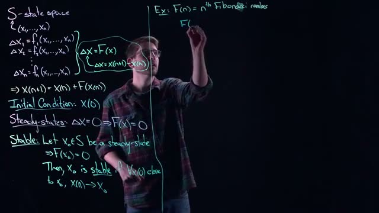
*[10:40](https://www.youtube.com/watch?v=wnYe8KK4qJg&t=640s) This frame shows mathematical definitions for state space, initial conditions, steady-states, and stability, along with an example of Fibonacci numbers.*
 and 
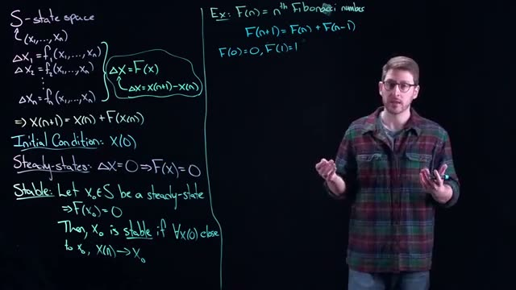
*[11:20](https://www.youtube.com/watch?v=wnYe8KK4qJg&t=680s) This frame displays mathematical equations and definitions related to state space, initial conditions, steady-states, and stability, along with an example of Fibonacci numbers.*

The whiteboard shows the recurrence and initial conditions.

We can rewrite this as a two-dimensional system using the state space form. Define:

\[
x_1(n) = F(n-1), \quad x_2(n) = F(n)
\]

Then the update becomes:

\[
\begin{aligned}
x_1(n+1) &= x_2(n) \\
x_2(n+1) &= x_2(n) + x_1(n)
\end{aligned}
\]

*[12:00](https://www.youtube.com/watch?v=wnYe8KK4qJg&t=720s) This frame shows mathematical equations and definitions related to state space, initial conditions, steady-states, and stability, along with an example of Fibonacci numbers.*
 shows the definition of \(x_1(n)\) and \(x_2(n)\). 

*[13:40](https://www.youtube.com/watch?v=wnYe8KK4qJg&t=820s) The whiteboard shows definitions for state space, initial conditions, steady-states, and stability, along with an example of Fibonacci numbers.*
 and 

*[14:40](https://www.youtube.com/watch?v=wnYe8KK4qJg&t=880s) The whiteboard shows definitions for state space, initial conditions, steady-states, and stability, along with an example of Fibonacci numbers.*
 show the equations for \(x_1(n+1)\) and \(x_2(n+1)\), and then the \(\Delta\) form:

\[
\begin{aligned}
\Delta x_1(n) &= x_2(n) - x_1(n) \\
\Delta x_2(n) &= x_1(n)
\end{aligned}
\]

*[15:40](https://www.youtube.com/watch?v=wnYe8KK4qJg&t=940s) This frame shows a whiteboard with mathematical equations defining state space, initial conditions, steady-states, and stability, along with an example of Fibonacci numbers.*
 and 

*[16:20](https://www.youtube.com/watch?v=wnYe8KK4qJg&t=980s) A whiteboard shows mathematical equations for state space, Fibonacci numbers, and stability conditions.*
 repeat these equations.

The initial conditions become:

\[
x_1(0) = F(0-1) = F(-1)? \text{ Wait, careful: } F(n-1) \text{ with } n=0 \text{ gives } F(-1). \text{ But the video uses } F(0)=0, F(1)=1, \text{ so } x_1(0)=F(0-1)=F(-1)?? \text{ Actually the speaker sets } x_1(n)=F(n-1) \text{ and } x_2(n)=F(n). \text{ Then } x_1(0)=F(-1) \text{ is not defined. But the video's whiteboard shows } X_1(0)=0 \text{ and } X_2(0)=1 \text{ (see frame 17:20). So the mapping is } x_1(n)=F(n-1) \text{ gives } x_1(0)=F(-1) \text{ which is problematic. However the video likely intends } x_1(n)=F(n-1) \text{ as a shift: } x_1(1)=F(0)=0, \text{ but with initial condition } X(0)=(0,1). \text{ We follow the board:}
\]
\[
X_1(0)=0, \quad X_2(0)=1
\]
and the update equations as written.

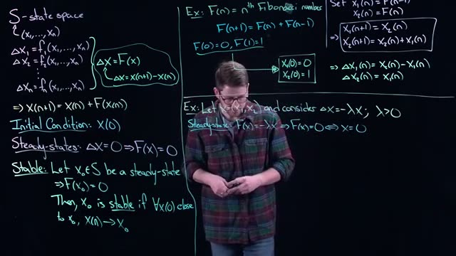
*[17:20](https://www.youtube.com/watch?v=wnYe8KK4qJg&t=1040s) This frame displays mathematical definitions and examples related to state space, steady-states, and stability, including equations for Fibonacci numbers and a system with a decay term.*
 shows the full Fibonacci example with initial conditions.

You can also start with any other initial values (e.g., (5,10) or (-2,3)) and the same update rule will generate a different sequence (a "generalized Fibonacci" sequence).

### Example 2: A Simple Linear 2D System

Consider a two-dimensional system with \(x = (x_1, x_2)\) and

\[
\Delta x = -\lambda x, \quad \lambda > 0
\]

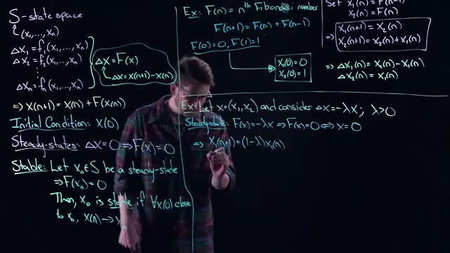
*[18:00](https://www.youtube.com/watch?v=wnYe8KK4qJg&t=1080s) This frame shows mathematical equations and definitions related to state space, initial conditions, steady-states, and stability, including examples for Fibonacci numbers and a system with a parameter lambda.*
 has this example.

The function \(F(x) = -\lambda x\). The steady state occurs when \(F(x)=0\), which gives \(x=0\) (the origin). Is the origin stable?

Write the update form:

\[
\begin{aligned}
x_1(n+1) &= (1-\lambda) x_1(n) \\
x_2(n+1) &= (1-\lambda) x_2(n)
\end{aligned}
\]

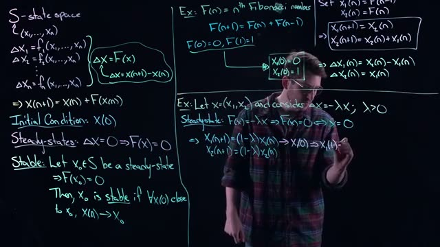
*[18:40](https://www.youtube.com/watch?v=wnYe8KK4qJg&t=1120s) The whiteboard shows definitions for state space, initial conditions, steady-states, and stability, along with examples for Fibonacci numbers and a system with a negative feedback loop.*
 and 
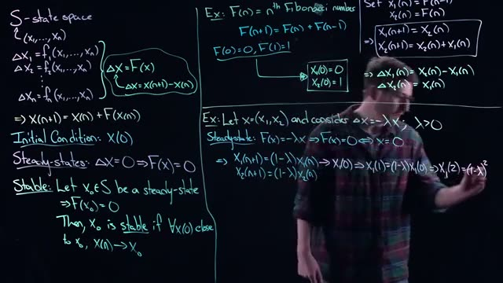
*[19:20](https://www.youtube.com/watch?v=wnYe8KK4qJg&t=1160s) This frame shows a whiteboard with mathematical equations and definitions related to state space, Fibonacci numbers, steady-states, and stability.*
 show these decoupled equations.

Since the equations are independent, we can analyze one variable. For \(x_1\):

\[
x_1(1) = (1-\lambda)x_1(0), \quad x_1(2) = (1-\lambda)^2 x_1(0), \dots, \quad x_1(n) = (1-\lambda)^n x_1(0)
\]

Similarly for \(x_2\).

*[20:00](https://www.youtube.com/watch?v=wnYe8KK4qJg&t=1200s) This frame shows a whiteboard with mathematical equations and definitions related to state space, steady-states, and stability, including examples for Fibonacci numbers and a linear system.*
 and 
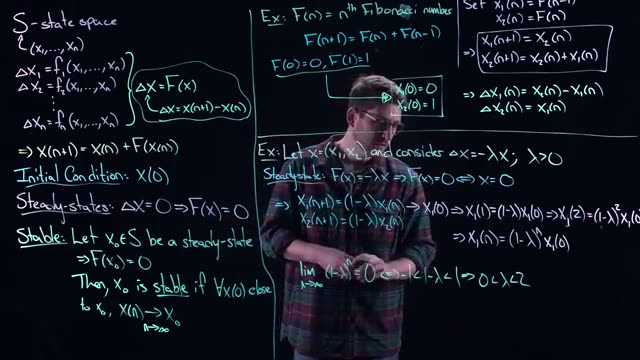
*[20:40](https://www.youtube.com/watch?v=wnYe8KK4qJg&t=1240s) The whiteboard shows definitions for state space, initial conditions, steady-states, and stability, along with examples for Fibonacci numbers and a system with a decay term.*
 show the pattern leading to \(x_1(n) = (1-\lambda)^n x_1(0)\).

The limit as \(n\to\infty\) is:

\[
\lim_{n\to\infty} (1-\lambda)^n = 0 \quad \text{if and only if} \quad |1-\lambda| < 1
\]

This inequality is equivalent to:

\[
-1 < 1-\lambda < 1 \quad \Rightarrow \quad 0 < \lambda < 2
\]

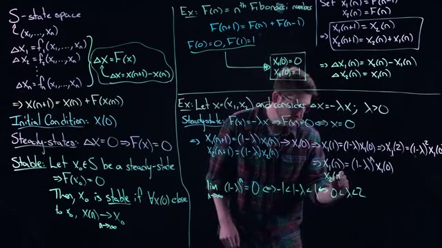
*[21:20](https://www.youtube.com/watch?v=wnYe8KK4qJg&t=1280s) This frame shows a whiteboard with mathematical equations and definitions related to state space, Fibonacci numbers, steady-states, and stability.*
 and 
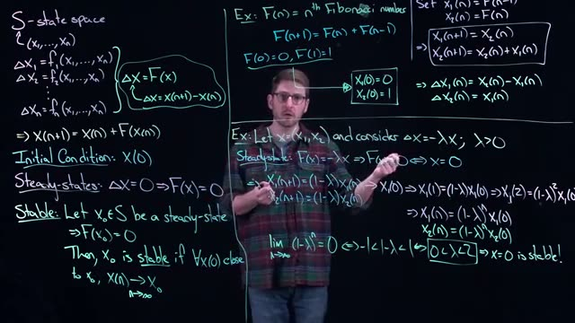
*[22:20](https://www.youtube.com/watch?v=wnYe8KK4qJg&t=1340s) This frame shows a whiteboard with mathematical equations and definitions related to state space, Fibonacci numbers, and stability analysis, including examples.*
 show the condition.

Therefore:

- **If \(0 < \lambda < 2\)**: Then \((1-\lambda)^n \to 0\) for any initial condition. The origin is stable. In fact, it is globally stable (any initial condition converges to zero).

- **If \(\lambda > 2\)**: Then \(|1-\lambda| > 1\), so \((1-\lambda)^n\) grows in magnitude (blows up). Even if you start extremely close to zero (but not exactly zero), the iterates will diverge away. The origin is unstable.

- **If \(\lambda = 2\)**: Then \(1-\lambda = -1\), so \(x_1(n) = (-1)^n x_1(0)\). The sequence oscillates between \(x_1(0)\) and \(-x_1(0)\); it never converges to zero (unless \(x_1(0)=0\)). This is neither stable nor unstable in the sense of convergence.

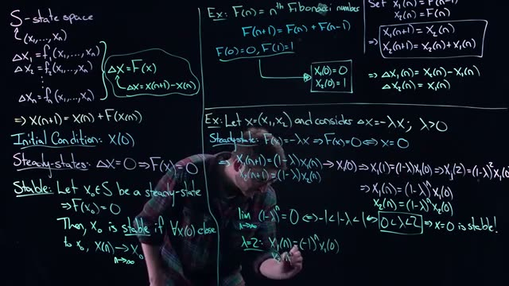
*[23:20](https://www.youtube.com/watch?v=wnYe8KK4qJg&t=1400s) This frame shows mathematical equations and definitions related to state space, Fibonacci numbers, steady-states, and stability, written on a whiteboard.*
 and 
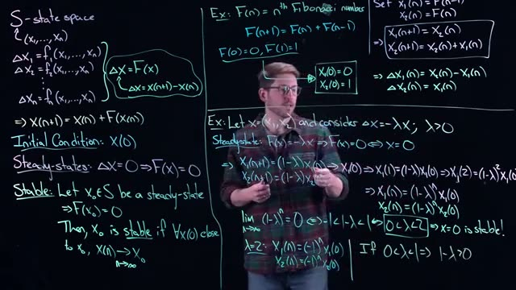
*[24:20](https://www.youtube.com/watch?v=wnYe8KK4qJg&t=1460s) A whiteboard showing mathematical equations for state space, Fibonacci numbers, and stability analysis, with a person standing in front of it.*
 show the classification and the \(\lambda = 2\) case.

#### Additional behavior within the stable region

- **\(0 < \lambda < 1\)**: Then \(1-\lambda\) is positive. The iterates remain the same sign as the initial condition and decay monotonically to zero.
- **\(1 < \lambda < 2\)**: Then \(1-\lambda\) is negative. The iterates alternate sign (flip back and forth) but the absolute value decays to zero. The convergence is oscillatory.
- **\(\lambda = 1\)**: Then \(1-\lambda = 0\), so after one step you land exactly at zero. This is the fastest possible convergence.

 shows the condition \(|1-\lambda| < 1\) and the oscillatory behavior.

### Summary

This lecture introduced the basics of discrete-time dynamical systems: state space, the \(\Delta\) formulation, the update form \(X(n+1) = X(n) + F(X(n))\), steady states (where \(F(X)=0\)), and stability (convergence to the steady state for nearby initial conditions). Two examples were given: Fibonacci numbers (recast as a 2D system) and a linear system \(\Delta x = -\lambda x\) whose stability depends on the parameter \(\lambda\).

### Check Your Understanding

1.  **Question:** For the system \(\Delta x = -\lambda x\) with \(\lambda > 0\), what is the steady state, and for what range of \(\lambda\) is it stable?

    

    
Answer

    The steady state is \(x = 0\). It is stable when \(0 < \lambda < 2\). (If \(\lambda = 2\) the iterates oscillate without converging; if \(\lambda > 2\) they diverge.)
    

2.  **Question:** Write the Fibonacci recurrence \(F(n+1) = F(n) + F(n-1)\) as a two-dimensional discrete dynamical system in the form \(\Delta X = F(X)\).

    

    
Answer

    Let \(x_1(n) = F(n-1)\) and \(x_2(n) = F(n)\). Then:
    \[
    \begin{aligned}
    \Delta x_1(n) &= x_2(n) - x_1(n) \\
    \Delta x_2(n) &= x_1(n)
    \end{aligned}
    \]
    (Equivalently, \(x_1(n+1) = x_2(n)\), \(x_2(n+1) = x_2(n) + x_1(n)\).)
    

3.  **Question:** Explain in your own words why the definition of stability for a discrete dynamical system is "for all initial conditions close to \(x_0\), the sequence converges to \(x_0\)". Why is "close" left vague?

    

    
Answer

    The definition says that there exists *some* neighborhood around the steady state such that any starting point inside that neighborhood will eventually converge. The size of the neighborhood depends on the system (e.g., how complicated the function \(F\) is). The definition does not specify the exact size because it varies; it only guarantees existence. This is analogous to needing a "good enough" initial guess in Newton's method.
    

4.  **Question:** For the system \(\Delta x = -\lambda x\) with \(\lambda = 1.5\), if you start at \(x(0) = (1, -2)\), what will happen to the iterates?

    

    
Answer

    \(\lambda = 1.5\) is in the stable range \(0<\lambda<2\). Moreover, \(1.5\) is between 1 and 2, so \(1-\lambda = -0.5\). The iterates will oscillate in sign (flip back and forth) while the magnitude decays by a factor of 0.5 each step. They will converge to zero. For example, \(x_1(1) = -0.5\), \(x_1(2) = 0.25\), \(x_1(3) = -0.125\), etc.
    

## Key takeaways

- Discrete time dynamical systems, also called difference equations, model scenarios where data is observed at separate time intervals such as days, weeks, or years.
- The state space in a discrete time system is an n dimensional set that contains all possible values of the variables at any time step.
- The change in each variable from one time step to the next is given by a function of all current variables, written as delta x equals f of x.
- A discrete time system can be rearranged into an update form where the next state equals the current state plus the change, making it similar to Newton iteration.
- Steady states in discrete time systems occur when the change delta x is zero, meaning the state does not change from one time step to the next.
- A steady state x0 is stable if all sequences that start sufficiently close to x0 eventually converge to x0 under the system's update rule.
- The Fibonacci numbers can be rewritten as a two dimensional discrete dynamical system by defining x1 as the previous Fibonacci number and x2 as the current Fibonacci number.
- For a simple two dimensional system with delta x equal to negative lambda times x, the origin is the only steady state and its stability depends on the value of lambda.
- If lambda is between 0 and 2, the origin is stable and all initial conditions converge to zero regardless of starting point.
- If lambda is greater than 2, the origin is unstable because any nonzero initial condition leads to a sequence that blows up to infinity.
## Glossary

| Term | Definition |
|---|---|
| discrete time dynamical system | A system where the state of the system is updated at separate, equally spaced time steps rather than continuously. |
| difference equation | Another name for a discrete time dynamical system that expresses the change in a variable as a function of its current value. |
| state space | The set of all possible values that the variables of the system can take, often an n dimensional space. |
| time step | A fixed interval of time between two successive observations or updates in a discrete system, indexed by natural numbers. |
| delta x | The change in the state vector from one time step to the next, computed as the next state minus the current state. |
| update rule | A function that gives the next state of the system as a function of the current state, often written as x of n plus 1 equals g of x of n. |
| initial condition | The value of the state vector at the starting time step, which is needed to begin iterating the system forward in time. |
| steady state | A point in the state space where the system does not change from one time step to the next, meaning delta x equals zero. |
| stability | A property of a steady state where all sequences that start close enough to it will converge to it over time. |
| convergence | The behavior of a sequence that gets arbitrarily close to a fixed point as the number of time steps increases. |
| decoupled system | A system where each variable can be analyzed independently because the update rule for one variable does not depend on the others. |
| Lambda | A positive constant parameter used in the example system to control the rate and type of change from one time step to the next. |
| Fibonacci numbers | A sequence where each number is the sum of the two preceding numbers, often starting with zero and one. |
| Fibonacci recurrence relation | The rule that defines the Fibonacci numbers: F of n plus 1 equals F of n plus F of n minus 1. |
| Newton iteration | A numerical method for finding roots of a function that can be interpreted as a discrete dynamical system where the current guess is updated to get a better guess. |
| vector notation | A compact way to write multiple equations as a single vector equation, where the vector of functions f contains all the individual update functions. |
| exponentiate | To raise a number to a power, as done when repeatedly applying a multiplicative update rule over multiple time steps. |
| absolute value | The nonnegative magnitude of a number, used in stability analysis to determine whether a sequence shrinks or grows over time. |
| blow up | A behavior where the values in a sequence become arbitrarily large in magnitude as time increases. |
| flip back and forth | A behavior where the sequence alternates between positive and negative values at each time step without converging or diverging. |
## Footnotes and deeper context

1. **Discrete versus continuous time.** In continuous time systems, the change is described by a derivative which represents an instantaneous rate of change as the time interval goes to zero. In discrete time systems, the time interval is fixed and nonzero, so the change is a difference rather than a derivative.
2. **Stability definition precision.** Mathematically, a steady state x0 is stable if for every epsilon greater than zero, there exists a delta such that if the initial condition is within delta of x0, then all future iterates stay within epsilon of x0. The lecture gives a simplified version of this concept.
3. **Fibonacci as a linear system.** The two dimensional formulation of the Fibonacci sequence is a linear discrete dynamical system, meaning the update rule can be written as x of n plus 1 equals A times x of n for a constant matrix A. This allows analysis using eigenvalues and eigenvectors.
4. **Lambda equals 2 edge case.** When lambda equals 2, the sequence does not converge but remains bounded, oscillating between the initial value and its negative. This is an example of a periodic orbit of period 2, which is neither stable nor unstable in the usual sense.
5. **Global stability in the example.** For lambda between 0 and 2, the origin is globally stable for the example system because every initial condition, not just those close to zero, converges to the origin. This is a special property of this simple linear system and does not hold for most nonlinear systems.
6. **Newton iteration context.** Newton's method for finding roots is a discrete dynamical system where the update rule is x of n plus 1 equals x of n minus f of x of n divided by f prime of x of n. Its steady states are the roots of f, and stability depends on the derivative of f at the root.
## Where to go next

- **Read the official textbook on discrete dynamical systems.** Consult 'Dynamical Systems and Differential Equations' by Paul Blanchard, Robert Devaney, and Glen Hall for rigorous definitions and examples of stability, bifurcations, and chaos in discrete systems.
- **Practice with the Fibonacci system.** Implement the two dimensional Fibonacci system in a programming language like Python or MATLAB. Vary the initial conditions and observe how the sequence changes. This will build intuition for linear discrete systems.
- **Explore the logistic map.** The logistic map x of n plus 1 equals r times x of n times 1 minus x of n is a classic one dimensional discrete dynamical system that shows period doubling and chaos. Start with r between 0 and 4 and compare the behavior to the simple linear example in the lecture.
---
*Printed by yt2textbook, an open tool from Zorost AI Lab. Screenshots are frames captured from the source video; each caption links to the exact moment it appears.*
