# Introduction to Discrete-Time Dynamical Systems
> **Source:** [Discrete-Time Dynamical Systems - Math Modelling - Lecture 13](https://www.youtube.com/watch?v=wnYe8KK4qJg) by Math Modelling · 26:38 · Training document generated from the video.
**How to use this document:** read it top to bottom in place of watching the video. Screenshots appear exactly where the video depends on something visual, with links that jump to that moment. Questions at the end of each section confirm you learned the material. The glossary and footnotes add definitions and detail the video assumes you already have.
**Who this is for:** Undergraduate students in mathematics, engineering, or sciences who have completed a course in differential equations or continuous dynamical systems.
## Learning objectives

After working through this document you can:

1. Define a discrete-time dynamical system and contrast it with a continuous-time system.
2. Write a discrete dynamical system in both delta form $\Delta \mathbf{x} = \mathbf{F}(\mathbf{x})$ and update form $\mathbf{x}_{n+1} = \mathbf{x}_n + \mathbf{F}(\mathbf{x}_n)$.
3. Identify steady states of a discrete system by solving $\mathbf{F}(\mathbf{x}) = 0$.
4. Determine stability of a steady state by analyzing the behavior of iterates starting nearby.
5. Reformulate the Fibonacci sequence as a two-dimensional discrete dynamical system.
6. Analyze the linear system $\Delta \mathbf{x} = -\lambda \mathbf{x}$ and classify stability based on the parameter $\lambda$.
7. Interpret the effect of the parameter $\lambda$ on the sign and magnitude of iterates, including oscillatory convergence and divergence.
## Prerequisites

- Familiarity with continuous-time dynamical systems and differential equations.
- Basic understanding of vector notation and state spaces.
- Knowledge of Newton's method for root-finding.
- Comfort with sequences, limits, and exponential functions.
## From Continuous to Discrete Time

In this section, you will learn the fundamental difference between continuous-time and discrete-time dynamical systems. You will understand why discrete-time models are useful and when they apply.

### Continuous vs. Discrete Time

A dynamical system describes how a quantity changes over time. In previous lectures, you studied **continuous-time dynamical systems**, where time flows smoothly from one moment to the next. These systems are modeled using differential equations.

Now you will transition to **discrete-time dynamical systems**, sometimes called **difference equations**. In a discrete-time system, time does not flow continuously. Instead, the system "hops" from one time instant to the next. You can think of this as taking snapshots at specific moments rather than watching a smooth movie.

### The Key Distinction

The core difference between these two approaches is how they treat time:

| Aspect | Continuous-Time | Discrete-Time |
|--------|-----------------|---------------|
| Time flow | Smooth and continuous | Hopping between instances |
| Mathematical model | Differential equations | Difference equations |
| Typical notation | $\frac{dx}{dt} = f(x)$ | $x_{n+1} = f(x_n)$ |
| Analogy | Flowing from moment to moment | Jumping from one instant to the next |

### When to Use Discrete-Time Models

Discrete-time models are particularly appropriate for scenarios where you only observe data at discrete time intervals. Common examples include:

- **Economic data**: Quarterly GDP reports, monthly unemployment figures
- **Digital signals**: Audio samples taken every millisecond
- **Population surveys**: Annual wildlife counts
- **Stock market**: Daily closing prices

In each case, you do not have continuous information about what happens between observations. You only know the state at each measurement point.

### Mathematical Formulation

In a discrete-time dynamical system, you typically write the evolution rule as:

$$x_{n+1} = f(x_n) \tag{1}$$

where:
- $x_n$ is the state at time step $n$
- $x_{n+1}$ is the state at the next time step
- $f$ is a function that maps the current state to the next state

This is called a **first-order difference equation** because the next state depends only on the current state (one step back). The subscript notation $x_n$ and $x_{n+1}$ indicates the time index, not function evaluation.

### Relationship to Continuous-Time Systems

If you have a continuous-time system described by:

$$\frac{dx}{dt} = g(x) \tag{2}$$

you can sometimes approximate it as a discrete-time system by sampling at regular intervals $\Delta t$:

$$x_{n+1} \approx x_n + \Delta t \cdot g(x_n) \tag{3}$$

This approximation is called **Euler's method**. However, discrete-time systems can also exhibit behaviors that have no continuous-time analog, which you will explore later in this course.

### Check Your Understanding

1. What is the fundamental difference between how time progresses in continuous-time versus discrete-time dynamical systems?

<details><summary>Answer</summary>
In continuous-time systems, time flows smoothly from one moment to the next (like a flowing river). In discrete-time systems, time "hops" from one instant to the next (like stepping stones). Continuous-time uses differential equations; discrete-time uses difference equations.
</details>

2. Give two real-world examples where discrete-time models are more appropriate than continuous-time models.

<details><summary>Answer</summary>
(1) Monthly economic indicators like unemployment rates, where data is collected at regular intervals. (2) Digital audio recording, where sound pressure is measured thousands of times per second rather than continuously. In both cases, you only have data at discrete time points, not continuous information.
</details>

3. Write the general form of a first-order discrete-time dynamical system using proper subscript notation.

<details><summary>Answer</summary>
$x_{n+1} = f(x_n)$ where $x_n$ is the state at time step $n$, $x_{n+1}$ is the state at the next time step, and $f$ is the update function.
</details>

4. True or False: Every continuous-time dynamical system can be perfectly converted to an equivalent discrete-time system.

<details><summary>Answer</summary>
False. While you can approximate a continuous-time system by sampling (e.g., Euler's method), the approximation introduces error. Furthermore, discrete-time systems can exhibit behaviors (like period-doubling bifurcations) that have no exact continuous-time counterpart.
</details>
## State Space and the Delta Formulation

A discrete-time dynamical system models a process that is observed or updated at distinct, separated moments in time. These moments could be days, weeks, months, seasons, or years. The key property is that there is a gap between each measurement or update of the system.

### The State Space

Just as with continuous-time dynamical systems, we begin by defining a **state space**. The state space, denoted $S$, is the set of all possible configurations of the system. If the system has $n$ variables, then $S$ is an $n$-dimensional space. A single point in this space is a vector of the form:

$$
\mathbf{x} = (x_1, x_2, \dots, x_n)
$$

Each component $x_i$ represents one variable of the system. For example, in a population model, $x_1$ might be the number of prey and $x_2$ the number of predators.

A common choice for the state space in population modeling is the set of vectors where every component is positive (greater than zero). This is because negative populations have no physical meaning.


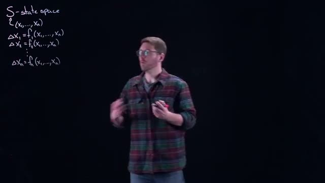
*[02:20](https://www.youtube.com/watch?v=wnYe8KK4qJg&t=140s) A whiteboard shows the definition of S-state space and equations for ΔX₁ through ΔXn.*


### The Delta Formulation

In continuous-time systems, we describe change using a derivative, which is the limit of a change over an infinitely small time interval. In discrete-time systems, we do not take this limit. Instead, we keep the time interval fixed and finite. This fixed change from one time step to the next is represented by the **delta** operator, $\Delta$.

For each variable $x_i$, we define its change from the current time to the next time as:

$$
\Delta x_i = x_i(\text{next time}) - x_i(\text{current time})
$$

The system is then described by a set of **difference equations**. For an $n$-dimensional system, these equations take the form:

$$
\begin{aligned}
\Delta x_1 &= f_1(x_1, x_2, \dots, x_n) \\
\Delta x_2 &= f_2(x_1, x_2, \dots, x_n) \\
&\ \vdots \\
\Delta x_n &= f_n(x_1, x_2, \dots, x_n)
\end{aligned}
$$

Each function $f_i$ determines how the $i$-th variable changes, and it can depend on all of the current variables. This is the discrete-time analogue of a system of differential equations.

### Vector Notation

Writing out all $n$ equations individually is cumbersome. We can write the entire system compactly using vector notation. Define the vector of changes:

$$
\Delta \mathbf{x} = (\Delta x_1, \Delta x_2, \dots, \Delta x_n)
$$

And define the vector-valued function:

$$
\mathbf{F}(\mathbf{x}) = (f_1(\mathbf{x}), f_2(\mathbf{x}), \dots, f_n(\mathbf{x}))
$$

Then the entire system is written as a single equation:

$$
\Delta \mathbf{x} = \mathbf{F}(\mathbf{x}) \tag{1}
$$

### Time Indexing

In discrete-time systems, time is measured in natural numbers (positive integers). We denote the current time step as $n$ (where $n \in \mathbb{N}$) and the next time step as $n+1$. The state at time $n$ is $\mathbf{x}_n$, and the state at time $n+1$ is $\mathbf{x}_{n+1}$.

The delta operator is then explicitly defined as:

$$
\Delta \mathbf{x}_n = \mathbf{x}_{n+1} - \mathbf{x}_n
$$

Substituting this into equation (1) gives an equivalent formulation:

$$
\mathbf{x}_{n+1} - \mathbf{x}_n = \mathbf{F}(\mathbf{x}_n)
$$

Or, rearranged:

$$
\mathbf{x}_{n+1} = \mathbf{x}_n + \mathbf{F}(\mathbf{x}_n) \tag{2}
$$

Equation (2) is the **update rule**: given the current state $\mathbf{x}_n$, we compute the next state $\mathbf{x}_{n+1}$ by adding the change $\mathbf{F}(\mathbf{x}_n)$ to the current state.

### Comparison to Continuous-Time Systems

| Feature | Continuous-Time | Discrete-Time |
|---------|-----------------|---------------|
| Change operator | Derivative $\frac{d\mathbf{x}}{dt}$ | Difference $\Delta \mathbf{x}$ |
| Time interval | Shrinks to zero (limit) | Fixed and finite |
| Basic equation | $\frac{d\mathbf{x}}{dt} = \mathbf{F}(\mathbf{x})$ | $\Delta \mathbf{x} = \mathbf{F}(\mathbf{x})$ |
| Update rule | Requires integration | $\mathbf{x}_{n+1} = \mathbf{x}_n + \mathbf{F}(\mathbf{x}_n)$ |

The fundamental difference is that in continuous time, we let the time interval approach zero to define instantaneous rates of change. In discrete time, we keep the interval fixed and work directly with the change from one step to the next.

### Check your understanding

1. What does the symbol $\Delta x_i$ represent in a discrete-time dynamical system?

<details><summary>Answer</summary>
$\Delta x_i$ represents the change in the $i$-th variable from the current time step to the next time step. It is defined as $\Delta x_i = x_i(\text{next time}) - x_i(\text{current time})$.
</details>

2. How does the vector equation $\Delta \mathbf{x} = \mathbf{F}(\mathbf{x})$ relate to the update rule $\mathbf{x}_{n+1} = \mathbf{x}_n + \mathbf{F}(\mathbf{x}_n)$?

<details><summary>Answer</summary>
The vector equation defines the change in the state. Since $\Delta \mathbf{x}_n = \mathbf{x}_{n+1} - \mathbf{x}_n$, substituting this into $\Delta \mathbf{x} = \mathbf{F}(\mathbf{x})$ gives $\mathbf{x}_{n+1} - \mathbf{x}_n = \mathbf{F}(\mathbf{x}_n)$. Adding $\mathbf{x}_n$ to both sides yields the update rule $\mathbf{x}_{n+1} = \mathbf{x}_n + \mathbf{F}(\mathbf{x}_n)$.
</details>

3. What is the key difference between how continuous-time and discrete-time systems handle the time interval between observations?

<details><summary>Answer</summary>
In continuous-time systems, the time interval is allowed to shrink to zero (through a limit process) to define instantaneous rates of change via derivatives. In discrete-time systems, the time interval is kept fixed and finite, and we work directly with the change from one discrete time step to the next.
</details>

4. If a system has 3 variables and is described by $\Delta \mathbf{x} = \mathbf{F}(\mathbf{x})$, how many component functions $f_i$ does $\mathbf{F}$ contain, and what are their inputs?

<details><summary>Answer</summary>
$\mathbf{F}$ contains 3 component functions: $f_1$, $f_2$, and $f_3$. Each function takes all three variables $(x_1, x_2, x_3)$ as inputs, so $f_1 = f_1(x_1, x_2, x_3)$, $f_2 = f_2(x_1, x_2, x_3)$, and $f_3 = f_3(x_1, x_2, x_3)$.
</details>
## Steady States and Stability

### Discrete-Time Dynamical Systems: Definition

A discrete-time dynamical system describes how a state variable evolves in distinct steps. Unlike continuous-time systems where time flows smoothly, discrete systems advance by fixed intervals: seconds, days, weeks, or any other unit. The key idea is that time is indexed by natural numbers $\mathbb{N} = \{0, 1, 2, 3, \dots\}$.


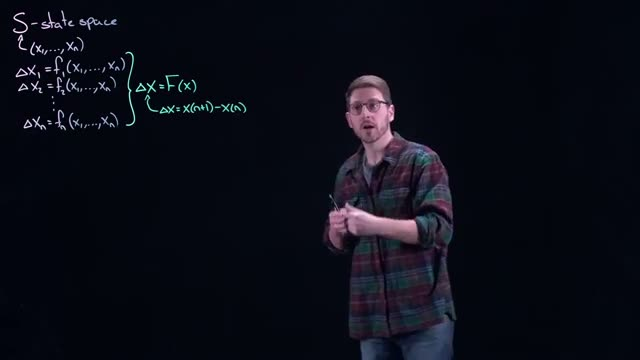
*[03:40](https://www.youtube.com/watch?v=wnYe8KK4qJg&t=220s) The whiteboard displays equations for S-state space, including definitions for ΔX_1 through ΔX_n, and the overall function ΔX = F(x) and ΔX = X(n+1) - X(n).*


The whiteboard shows the general form of a discrete-time dynamical system in state space. For a system with $n$ state variables $X_1, X_2, \dots, X_n$, we write:

$$\mathbf{X} = (X_1, X_2, \dots, X_n)$$

The change in each variable from one time step to the next is given by:

$$
\begin{align*}
\Delta X_1 &= f_1(X_1, X_2, \dots, X_n) \\
\Delta X_2 &= f_2(X_1, X_2, \dots, X_n) \\
&\vdots \\
\Delta X_n &= f_n(X_1, X_2, \dots, X_n)
\end{align*}
$$

We can write this compactly as a vector equation:

$$\Delta \mathbf{X} = \mathbf{F}(\mathbf{X})$$

The change $\Delta \mathbf{X}$ is specifically defined as the difference between the next state and the current state:

$$\Delta \mathbf{X} = \mathbf{X}_{n+1} - \mathbf{X}_n \tag{1}$$

From this definition, you can rearrange to find the next state. If you know the current state $\mathbf{X}_n$ and you compute the change $\Delta \mathbf{X}$ using $\mathbf{F}(\mathbf{X}_n)$, then:

$$\mathbf{X}_{n+1} = \mathbf{X}_n + \Delta \mathbf{X} = \mathbf{X}_n + \mathbf{F}(\mathbf{X}_n) \tag{2}$$

This means that everything on the right-hand side of equation (2) depends only on the current state $\mathbf{X}_n$. You can always predict what happens next using only knowledge of the present.

### Connection to Newton's Method

This structure is identical to Newton's method for finding roots of equations. In Newton's method, you have a current guess $x_n$ and an update rule:

$$x_{n+1} = x_n - \frac{f(x_n)}{f'(x_n)}$$

The term $-\frac{f(x_n)}{f'(x_n)}$ plays the role of $\Delta x$ in equation (1). Every Newton iteration is therefore an example of a discrete-time dynamical system.

### Initial Conditions

Just as with differential equations, a discrete dynamical system requires an initial condition. You must specify the state at time zero:

$$\mathbf{X}_0 = \text{(given value)}$$

This tells the system where to start. In Newton's method, for example, this is your initial guess at the root. The system then updates this guess according to the rule in equation (2), producing a sequence of states $\mathbf{X}_0, \mathbf{X}_1, \mathbf{X}_2, \dots$ that describes how the system evolves over time.

### Steady States

A steady state (also called a fixed point or equilibrium) is a value of the state variables $\mathbf{X}$ for which no change takes place in the system. In continuous-time differential equations, a steady state satisfies $\frac{d\mathbf{X}}{dt} = 0$, meaning the derivative is zero and the state does not change. The same concept exists in discrete-time systems.

From equation (1), the change from one step to the next is $\Delta \mathbf{X} = \mathbf{X}_{n+1} - \mathbf{X}_n$. A steady state $\mathbf{X}^*$ occurs when this change is zero:

$$\Delta \mathbf{X}^* = \mathbf{X}^*_{n+1} - \mathbf{X}^*_n = 0$$

Equivalently, using equation (2):

$$\mathbf{X}^* = \mathbf{X}^* + \mathbf{F}(\mathbf{X}^*)$$

which simplifies to:

$$\mathbf{F}(\mathbf{X}^*) = 0 \tag{3}$$

So a steady state $\mathbf{X}^*$ is a solution to the equation $\mathbf{F}(\mathbf{X}) = 0$. At a steady state, the system stays at that state forever once it reaches it. If the system is at a steady state, it does not move.

### Stability of Steady States

(Added context) Stability describes what happens when a system is slightly perturbed away from a steady state. There are three main possibilities:

| Type | Behavior | Mathematical condition |
|------|----------|----------------------|
| Stable (attracting) | System returns to steady state after small perturbations | All eigenvalues of the Jacobian matrix $\frac{\partial \mathbf{F}}{\partial \mathbf{X}}$ evaluated at $\mathbf{X}^*$ have magnitude less than 1 |
| Unstable (repelling) | System moves away from steady state after small perturbations | At least one eigenvalue has magnitude greater than 1 |
| Center | System neither returns nor diverges; it may orbit or stay near the steady state | At least one eigenvalue has magnitude exactly 1 and all others have magnitude less than or equal to 1 |

The Jacobian matrix for a system with $n$ state variables is an $n \times n$ matrix where the entry in row $i$, column $j$ is:

$$J_{ij} = \frac{\partial f_i}{\partial X_j}$$

where $f_i$ is the $i$-th component function from the definition of $\Delta \mathbf{X}$.

To check stability of a steady state $\mathbf{X}^*$:

1. Compute the Jacobian matrix $\mathbf{J}(\mathbf{X}^*)$ at the steady state.
2. Find all eigenvalues $\lambda$ of $\mathbf{J}(\mathbf{X}^*)$.
3. Check the magnitudes $|\lambda|$:
   - If $|\lambda| < 1$ for all eigenvalues, the steady state is stable.
   - If $|\lambda| > 1$ for any eigenvalue, the steady state is unstable.
   - If $|\lambda| = 1$ for any eigenvalue, further analysis is needed.

```mermaid
flowchart TD
    A[Start with current state X_n] --> B[Compute change: ΔX = F(X_n)]
    B --> C[Compute next state: X_{n+1} = X_n + ΔX]
    C --> D{Is ΔX = 0?}
    D -->|Yes| E[System is at steady state X*]
    D -->|No| A
    E --> F[Perturb system slightly]
    F --> G[Compute eigenvalues of Jacobian at X*]
    G --> H{All |λ| < 1?}
    H -->|Yes| I[Steady state is stable]
    H -->|No| J{Any |λ| > 1?}
    J -->|Yes| K[Steady state is unstable]
    J -->|No| L[Further analysis needed]
```

### Check your understanding

1. **Question**: For a discrete-time dynamical system $\Delta X = X_{n+1} - X_n = F(X_n)$, what equation must a steady state $X^*$ satisfy?

<details><summary>Answer</summary>
$F(X^*) = 0$. At a steady state, the change from one step to the next is zero, so $X_{n+1} = X_n$, which means $\Delta X = 0$ and therefore $F(X^*) = 0$.
</details>

2. **Question**: A one-dimensional discrete system has $F(x) = 2x - 4$. Find the steady state and determine its stability.

<details><summary>Answer</summary>
Set $F(x) = 0$: $2x - 4 = 0$, so $x^* = 2$.
The Jacobian is $\frac{dF}{dx} = 2$. The eigenvalue has magnitude $|2| = 2 > 1$, so the steady state is unstable. If you start near $x=2$, the system moves away.
</details>

3. **Question**: How does Newton's method for finding roots relate to discrete-time dynamical systems?

<details><summary>Answer</summary>
Newton's method $x_{n+1} = x_n - f(x_n)/f'(x_n)$ has the same structure as a discrete dynamical system. The "change" $\Delta x = -f(x_n)/f'(x_n)$ depends only on the current state $x_n$, just like $\Delta X = F(X_n)$. The iteration produces a sequence of guesses, which is exactly how a discrete dynamical system evolves over time. The initial guess corresponds to the initial condition $X_0$.
</details>
## Example: Fibonacci Numbers as a Discrete Dynamical System

In this section, we examine how the Fibonacci sequence fits into the framework of discrete-time dynamical systems. We will define the state space, the update rule, steady states, and stability, using the Fibonacci numbers as our running example.

### State Space and the Update Rule

A discrete-time dynamical system describes how a state vector $\mathbf{x}_n$ evolves from one time step $n$ to the next. The state space $S$ is the set of all possible states. For a system with $k$ components, we write the state as:

$$
\mathbf{x}_n = (x_{1,n}, x_{2,n}, \dots, x_{k,n}) \in S
$$

The change in the system from time $n$ to time $n+1$ is defined as:

$$
\Delta \mathbf{x}_n = \mathbf{x}_{n+1} - \mathbf{x}_n
$$

This change is governed by a function $\mathbf{F}$ that maps the current state to the change:

$$
\Delta \mathbf{x}_n = \mathbf{F}(\mathbf{x}_n)
$$

Equivalently, we can write the update rule in the "next state" form:

$$
\mathbf{x}_{n+1} = \mathbf{x}_n + \mathbf{F}(\mathbf{x}_n)
$$


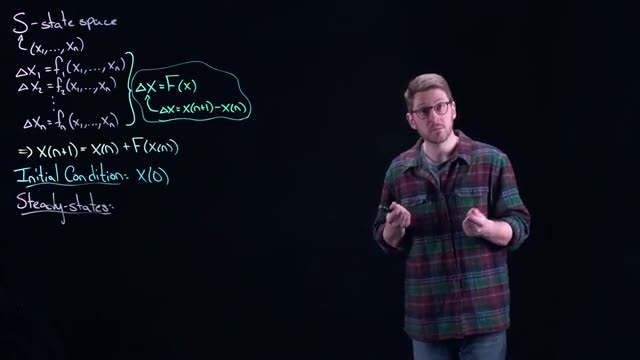
*[06:00](https://www.youtube.com/watch?v=wnYe8KK4qJg&t=360s) This frame shows mathematical equations for state space, including definitions for delta X, X(n+1), initial conditions, and steady-states.*


The whiteboard at this point shows the general form for a system with $k$ components:

$$
\begin{aligned}
\Delta x_{1,n} &= f_1(x_{1,n}, x_{2,n}, \dots, x_{k,n}) \\
\Delta x_{2,n} &= f_2(x_{1,n}, x_{2,n}, \dots, x_{k,n}) \\
&\vdots \\
\Delta x_{k,n} &= f_k(x_{1,n}, x_{2,n}, \dots, x_{k,n})
\end{aligned}
$$

In vector notation, this is simply $\Delta \mathbf{x}_n = \mathbf{F}(\mathbf{x}_n)$.

The initial condition is the state at time $n = 0$, written as $\mathbf{x}_0$. Given $\mathbf{x}_0$ and the function $\mathbf{F}$, the entire future trajectory is determined by repeated application of the update rule.

### Fibonacci Numbers as a Dynamical System

The Fibonacci sequence is defined by the recurrence:

$$
F_{n+2} = F_{n+1} + F_n, \quad F_0 = 0, \quad F_1 = 1
$$

To express this as a discrete dynamical system, we define a two-component state vector:

$$
\mathbf{x}_n = \begin{pmatrix} x_{1,n} \\ x_{2,n} \end{pmatrix} = \begin{pmatrix} F_n \\ F_{n+1} \end{pmatrix}
$$

The update rule becomes:

$$
\mathbf{x}_{n+1} = \begin{pmatrix} F_{n+1} \\ F_{n+2} \end{pmatrix} = \begin{pmatrix} F_{n+1} \\ F_n + F_{n+1} \end{pmatrix} = \begin{pmatrix} x_{2,n} \\ x_{1,n} + x_{2,n} \end{pmatrix}
$$

The change function $\mathbf{F}$ is therefore:

$$
\mathbf{F}(\mathbf{x}_n) = \mathbf{x}_{n+1} - \mathbf{x}_n = \begin{pmatrix} x_{2,n} - x_{1,n} \\ x_{1,n} \end{pmatrix}
$$

The initial condition is:

$$
\mathbf{x}_0 = \begin{pmatrix} 0 \\ 1 \end{pmatrix}
$$

### Steady States

A steady state is a state $\mathbf{x}^*$ such that the system does not change from one time step to the next. That is:

$$
\Delta \mathbf{x}_n = \mathbf{0}
$$


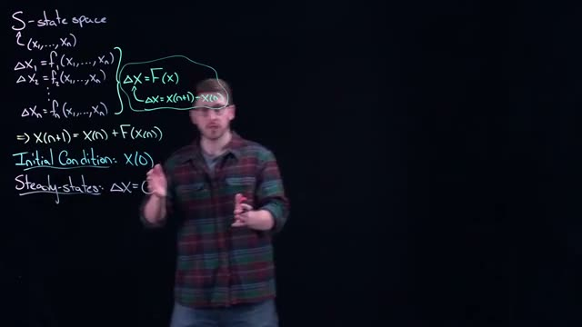
*[06:40](https://www.youtube.com/watch?v=wnYe8KK4qJg&t=400s) This frame shows equations for state space, initial conditions, and steady-states, including definitions for ΔX and X(n+1).*


At a steady state, we have:

$$
\mathbf{x}_{n+1} = \mathbf{x}_n = \mathbf{x}^*
$$

This means that the change function must be zero:

$$
\mathbf{F}(\mathbf{x}^*) = \mathbf{0}
$$


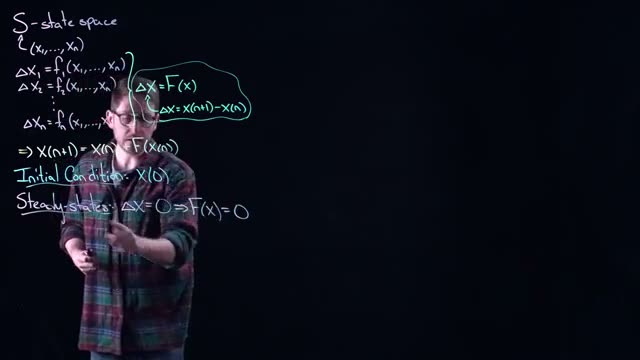
*[07:20](https://www.youtube.com/watch?v=wnYe8KK4qJg&t=440s) The whiteboard shows equations for state space, initial conditions, and steady states, including the definition of ΔX as F(X) and X(n+1) = X(n) + F(X(n)).*


For the Fibonacci system, we solve:

$$
\begin{pmatrix} x_2^* - x_1^* \\ x_1^* \end{pmatrix} = \begin{pmatrix} 0 \\ 0 \end{pmatrix}
$$

This gives two equations:

$$
x_2^* - x_1^* = 0 \quad \text{and} \quad x_1^* = 0
$$

Therefore, $x_1^* = 0$ and $x_2^* = 0$. The only steady state is the zero vector:

$$
\mathbf{x}^* = \begin{pmatrix} 0 \\ 0 \end{pmatrix}
$$

This makes intuitive sense: if the system ever reaches the state $(0, 0)$, then all future Fibonacci numbers are zero, and the sequence remains constant.

The speaker notes that writing the system in the "change" form $\Delta \mathbf{x}_n = \mathbf{F}(\mathbf{x}_n)$ makes steady states easier to identify, because you are directly solving for roots of $\mathbf{F}$. The alternative "next state" form $\mathbf{x}_{n+1} = \mathbf{G}(\mathbf{x}_n)$ would require solving $\mathbf{G}(\mathbf{x}^*) = \mathbf{x}^*$, which is a fixed point problem. Both are valid, but the change form makes the steady state condition $\mathbf{F}(\mathbf{x}^*) = \mathbf{0}$ explicit.

### Stability of Steady States

A steady state $\mathbf{x}^*$ is called stable if, for all initial conditions $\mathbf{x}_0$ sufficiently close to $\mathbf{x}^*$, the sequence $\mathbf{x}_n$ generated by the update rule converges to $\mathbf{x}^*$ as $n \to \infty$.


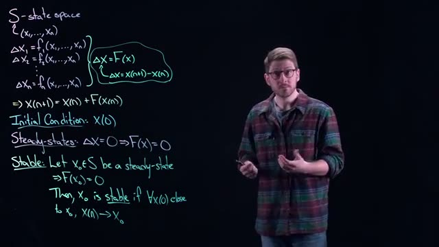
*[09:00](https://www.youtube.com/watch?v=wnYe8KK4qJg&t=540s) The whiteboard displays mathematical equations and definitions related to state space, initial conditions, steady-states, and stability.*


Formally, let $\mathbf{x}^* \in S$ be a steady state, so $\mathbf{F}(\mathbf{x}^*) = \mathbf{0}$. Then $\mathbf{x}^*$ is stable if:

$$
\forall \mathbf{x}_0 \text{ close to } \mathbf{x}^*, \quad \lim_{n \to \infty} \mathbf{x}_n = \mathbf{x}^*
$$

The speaker emphasizes that "close" is intentionally vague. The precise meaning of "close" depends on the system. For some systems, you may need the initial condition to be extremely near the steady state; for others, a broad neighborhood works. This is analogous to Newton's method for root finding, where the quality of the initial guess determines whether the iteration converges.

For the Fibonacci system, the only steady state is $\mathbf{x}^* = (0, 0)$. Is it stable? Consider an initial condition $\mathbf{x}_0 = (\epsilon, \delta)$ with small nonzero values. The sequence generated by the Fibonacci recurrence grows without bound (the Fibonacci numbers grow exponentially). Therefore, the sequence does not converge to $(0, 0)$ unless the initial condition is exactly $(0, 0)$. Hence, the zero steady state is not stable.

### Summary of Key Concepts

| Concept | Definition | Fibonacci Example |
|---|---|---|
| State space $S$ | Set of all possible states | $\mathbb{R}^2$ |
| State vector $\mathbf{x}_n$ | Value of the system at time $n$ | $\begin{pmatrix} F_n \\ F_{n+1} \end{pmatrix}$ |
| Change function $\mathbf{F}$ | Maps state to change: $\Delta \mathbf{x}_n = \mathbf{F}(\mathbf{x}_n)$ | $\begin{pmatrix} x_{2,n} - x_{1,n} \\ x_{1,n} \end{pmatrix}$ |
| Update rule | $\mathbf{x}_{n+1} = \mathbf{x}_n + \mathbf{F}(\mathbf{x}_n)$ | $\begin{pmatrix} x_{2,n} \\ x_{1,n} + x_{2,n} \end{pmatrix}$ |
| Initial condition | $\mathbf{x}_0$ | $\begin{pmatrix} 0 \\ 1 \end{pmatrix}$ |
| Steady state | $\mathbf{F}(\mathbf{x}^*) = \mathbf{0}$ | $\begin{pmatrix} 0 \\ 0 \end{pmatrix}$ |
| Stability | Convergence to $\mathbf{x}^*$ from nearby initial conditions | Not stable |

### Why the Change Form Matters

The speaker stresses that the change form $\Delta \mathbf{x}_n = \mathbf{F}(\mathbf{x}_n)$ is pedagogically useful because steady states become roots of $\mathbf{F}$. In the next-state form $\mathbf{x}_{n+1} = \mathbf{G}(\mathbf{x}_n)$, steady states are fixed points satisfying $\mathbf{G}(\mathbf{x}^*) = \mathbf{x}^*$. Both formulations describe the same dynamics, but the change form makes the steady state condition more transparent.

### Check Your Understanding

1. **Question:** Write the Fibonacci recurrence as a discrete dynamical system in the change form. What is the state vector, and what is the change function $\mathbf{F}$?

<details><summary>Answer</summary>
The state vector is $\mathbf{x}_n = \begin{pmatrix} F_n \\ F_{n+1} \end{pmatrix}$. The change function is:

$$
\mathbf{F}(\mathbf{x}_n) = \begin{pmatrix} x_{2,n} - x_{1,n} \\ x_{1,n} \end{pmatrix}
$$

So the system is $\Delta \mathbf{x}_n = \mathbf{F}(\mathbf{x}_n)$.
</details>

2. **Question:** Find all steady states of the Fibonacci dynamical system.

<details><summary>Answer</summary>
Set $\mathbf{F}(\mathbf{x}^*) = \mathbf{0}$:

$$
\begin{pmatrix} x_2^* - x_1^* \\ x_1^* \end{pmatrix} = \begin{pmatrix} 0 \\ 0 \end{pmatrix}
$$

This gives $x_1^* = 0$ and $x_2^* = 0$. The only steady state is $\mathbf{x}^* = (0, 0)$.
</details>

3. **Question:** Is the zero steady state of the Fibonacci system stable? Explain why or why not.

<details><summary>Answer</summary>
No. If you start from any initial condition other than exactly $(0, 0)$, the Fibonacci sequence grows without bound. For example, starting from $(1, 1)$ produces the sequence $1, 1, 2, 3, 5, 8, \dots$, which diverges. Therefore, the sequence does not converge to $(0, 0)$ for nearby initial conditions, so the steady state is not stable.
</details>

4. **Question:** Why does the speaker prefer writing the system as $\Delta \mathbf{x}_n = \mathbf{F}(\mathbf{x}_n)$ rather than $\mathbf{x}_{n+1} = \mathbf{G}(\mathbf{x}_n)$?

<details><summary>Answer</summary>
Because steady states are easier to identify in the change form. A steady state satisfies $\Delta \mathbf{x}_n = \mathbf{0}$, which means $\mathbf{F}(\mathbf{x}^*) = \mathbf{0}$. This is a root-finding problem. In the next-state form, you would need to solve $\mathbf{G}(\mathbf{x}^*) = \mathbf{x}^*$, which is a fixed point problem. Both are equivalent, but the change form makes the steady state condition more direct.
</details>
## Example: A Linear Two-Dimensional System

In this section we convert the Fibonacci sequence, a familiar recurrence, into a **two-dimensional discrete dynamical system** in the state-space form introduced earlier. This example illustrates how to represent a higher-order recurrence as a first-order system of difference equations, a technique that will be used repeatedly throughout the course.

### 1. The Fibonacci Recurrence as a Discrete Dynamical System

The Fibonacci numbers are defined by the recurrence

$$
F_{n+1} = F_n + F_{n-1}, \qquad F_0 = 0,\; F_1 = 1.
$$

This is already a discrete dynamical system: it has a state (the current and previous Fibonacci numbers) and an update rule that maps the current state to the next state. However, the recurrence is **second-order**: it depends on two previous values. To fit the standard form

$$
\mathbf{X}_{n+1} = \mathbf{X}_n + \mathbf{F}(\mathbf{X}_n),
$$

we need to rewrite the recurrence as a first-order system of two equations. We do this by introducing two state variables.


*[11:20](https://www.youtube.com/watch?v=wnYe8KK4qJg&t=680s) The whiteboard shows mathematical definitions for state space, initial conditions, steady-states, and stability, along with an example of Fibonacci numbers.*


The whiteboard shows the general definitions of state space, initial conditions, steady-states, and stability. The Fibonacci example is written at the bottom:

| Concept | Definition |
|---------|------------|
| State space | $S \subseteq \mathbb{R}^n$ (here $n=2$) |
| Discrete update | $\Delta \mathbf{X} = \mathbf{F}(\mathbf{X})$ with $\Delta \mathbf{X} = \mathbf{X}_{n+1} - \mathbf{X}_n$ |
| Initial condition | $\mathbf{X}(0)$ (we will use $\mathbf{X}_0$) |
| Steady-state | $\Delta \mathbf{X} = \mathbf{0} \;\Rightarrow\; \mathbf{F}(\mathbf{X}) = \mathbf{0}$ |
| Stability | A steady-state $\mathbf{X}_0$ is stable if for all $\mathbf{X}_0$ close to it, $\mathbf{X}_n \to \mathbf{X}_0$ as $n \to \infty$ |

### 2. Defining the State Variables

Let $F_n$ denote the $n$th Fibonacci number. We define two state variables (also called components of the state vector $\mathbf{X}_n$):

$$
x_1(n) = F_{n-1}, \qquad x_2(n) = F_n.
$$

Thus, the state vector at step $n$ is

$$
\mathbf{X}_n = \begin{pmatrix} x_1(n) \\ x_2(n) \end{pmatrix}.
$$

The first component stores the previous Fibonacci number, and the second component stores the current Fibonacci number. This choice is not unique, but it conveniently expresses the recurrence.


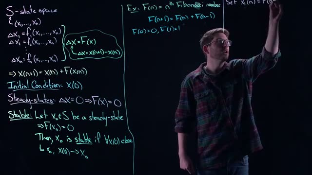
*[12:00](https://www.youtube.com/watch?v=wnYe8KK4qJg&t=720s) This frame shows mathematical equations and definitions related to state space, initial conditions, steady-states, and stability, along with an example of Fibonacci numbers.*


The whiteboard now shows the assignment $x_1(n) = F_{n-1}$, $x_2(n) = F_n$ (the screenshot shows $x_1(n) = F(n-1)$ and $x_2(n) = F(n)$ using the same notation).

### 3. Deriving the Update Rule

To find the next state $\mathbf{X}_{n+1}$, we need expressions for $x_1(n+1)$ and $x_2(n+1)$ in terms of the current state variables.

- For $x_1(n+1)$: by definition, $x_1(n+1) = F_{(n+1)-1} = F_n = x_2(n)$.  

  So
  $$
  x_1(n+1) = x_2(n).
  $$

- For $x_2(n+1)$: by definition, $x_2(n+1) = F_{n+1}$. Using the Fibonacci recurrence,
  $$
  F_{n+1} = F_n + F_{n-1} = x_2(n) + x_1(n).
  $$
  So
  $$
  x_2(n+1) = x_2(n) + x_1(n).
  $$

Therefore, the update rule in state-space form is

$$
\begin{cases}
x_1(n+1) = x_2(n), \$$4pt]
x_2(n+1) = x_2(n) + x_1(n).
\end{cases}
$$

This is a **linear** two-dimensional discrete dynamical system. It can be written in matrix form as

$$
\mathbf{X}_{n+1} = \begin{pmatrix} 0 & 1 \\ 1 & 1 \end{pmatrix} \mathbf{X}_n.
$$


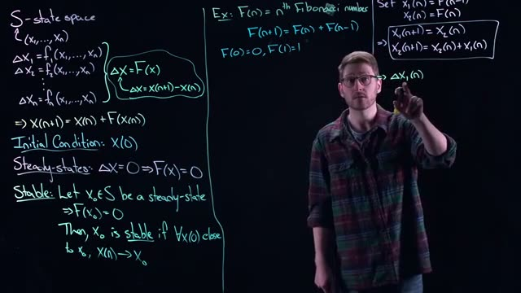
*[13:40](https://www.youtube.com/watch?v=wnYe8KK4qJg&t=820s) The whiteboard shows definitions for S-state space, initial condition, steady-states, and stability, along with an example of Fibonacci numbers.*


The whiteboard shows the equations $x_1(n+1) = x_2(n)$ and $x_2(n+1) = x_2(n) + x_1(n)$.

### 4. Delta Notation (Change Variables)

Recall that the general form $\Delta \mathbf{X} = \mathbf{F}(\mathbf{X})$ is obtained by subtracting the current state from both sides of the update rule. For each component:

- For $x_1$:
  $$
  \Delta x_1(n) = x_1(n+1) - x_1(n) = x_2(n) - x_1(n).
  $$

- For $x_2$:
  $$
  \Delta x_2(n) = x_2(n+1) - x_2(n) = \bigl(x_2(n) + x_1(n)\bigr) - x_2(n) = x_1(n).
  $$

Thus, the change vector is

$$
\Delta \mathbf{X}_n = \begin{pmatrix} x_2(n) - x_1(n) \\ x_1(n) \end{pmatrix}.
$$

In the $\Delta \mathbf{X} = \mathbf{F}(\mathbf{X})$ notation, we have

$$
\mathbf{F}(\mathbf{X}) = \begin{pmatrix} x_2 - x_1 \\ x_1 \end{pmatrix}.
$$

This is a linear function of the state.


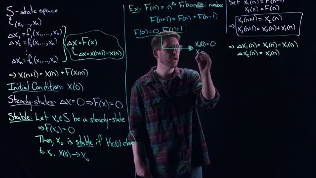
*[14:40](https://www.youtube.com/watch?v=wnYe8KK4qJg&t=880s) The whiteboard shows definitions for state space, initial conditions, steady-states, and stability, along with an example of Fibonacci numbers.*


The whiteboard displays these delta equations: $\Delta X_1(n) = X_2(n) - X_1(n)$ and $\Delta X_2(n) = X_1(n)$.

### 5. Initial Conditions

The standard Fibonacci sequence begins with $F_0 = 0$ and $F_1 = 1$. Using our state variables:

- $x_1(0) = F_{-1}$? Wait, the definition $x_1(n) = F_{n-1}$ requires $F_{-1}$ for $n=0$, which is not normally defined. The speaker instead uses the convention that $x_1(0) = F_0$ and $x_2(0) = F_1$ (as shown in the screenshots). Let's check the transcript: "x one of zero is equal to zero, and x two of zero is equal to one." That matches the initial condition shown at 15:40.

Thus, we set

$$
\mathbf{X}_0 = \begin{pmatrix} x_1(0) \\ x_2(0) \end{pmatrix} = \begin{pmatrix} 0 \\ 1 \end{pmatrix}.
$$

With this initial condition, the system generates the standard Fibonacci numbers: $F_0=0$, $F_1=1$, $F_2=1$, $F_3=2$, $F_4=3$, $F_5=5$, etc.


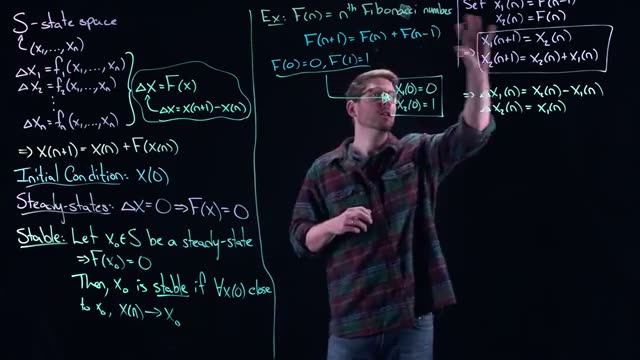
*[15:40](https://www.youtube.com/watch?v=wnYe8KK4qJg&t=940s) This frame displays mathematical definitions and examples related to state space, steady-states, stability, and Fibonacci numbers.*


The whiteboard shows $X_1(0) = 0$, $X_2(0) = 1$ as the initial condition.

### 6. Flexibility of Initial Conditions

The speaker emphasizes that the update rule is independent of the initial condition. You can choose any pair of numbers for $x_1(0)$ and $x_2(0)$ (e.g., $5$ and $10$ or $-2$ and $3$). The system will then generate a sequence that follows the same linear recurrence, but the resulting numbers will be a different linear combination of the Fibonacci basis. This is a key property of linear dynamical systems: the state space is a vector space, and the update rule is a linear transformation.

### Summary of the Fibonacci System

| Quantity | Expression |
|----------|------------|
| State vector | $\mathbf{X}_n = \begin{pmatrix} x_1(n) \\ x_2(n) \end{pmatrix}$ |
| Update (time-1 form) | $x_1(n+1) = x_2(n)$, $x_2(n+1) = x_2(n) + x_1(n)$ |
| Update (delta form) | $\Delta x_1(n) = x_2(n) - x_1(n)$, $\Delta x_2(n) = x_1(n)$ |
| Matrix form | $\mathbf{X}_{n+1} = \begin{pmatrix} 0 & 1 \\ 1 & 1 \end{pmatrix} \mathbf{X}_n$ |
| Initial condition (standard) | $\mathbf{X}_0 = \begin{pmatrix} 0 \\ 1 \end{pmatrix}$ |

This example shows how to convert a second-order linear recurrence into a first-order two-dimensional system. We will use this technique for more complex systems later in the course.

### Check your understanding

1. **Why is the Fibonacci recurrence considered a discrete dynamical system, and what is its order?**  
   <details><summary>Answer</summary>  
   It is a discrete dynamical system because it has a state (the current and previous values) and a deterministic update rule that maps the current state to the next state at discrete time steps. The recurrence is second-order because it depends on two previous values ($F_n$ and $F_{n-1}$).  
   </details>

2. **Write the update rule for the Fibonacci system in delta notation, assuming the state variables are defined as $x_1(n) = F_{n-1}$ and $x_2(n) = F_n$.**  
   <details><summary>Answer</summary>  
   $\Delta x_1(n) = x_2(n) - x_1(n)$, $\Delta x_2(n) = x_1(n)$.  
   </details>

3. **If you change the initial condition to $\mathbf{X}_0 = \begin{pmatrix} 1 \\ 0 \end{pmatrix}$, what will be the first few terms of the generated sequence?**  
   <details><summary>Answer</summary>  
   Starting from $x_1(0)=1$, $x_2(0)=0$:  
   $n=1$: $x_1(1)=x_2(0)=0$, $x_2(1)=x_2(0)+x_1(0)=0+1=1$ → $\mathbf{X}_1 = (0,1)$.  
   $n=2$: $x_1(2)=x_2(1)=1$, $x_2(2)=x_2(1)+x_1(1)=1+0=1$ → $\mathbf{X}_2 = (1,1)$.  
   $n=3$: $x_1(3)=1$, $x_2(3)=2$ → $\mathbf{X}_3 = (1,2)$.  
   This is a shifted version of the Fibonacci sequence.  
   </details>

4. **What is the steady-state condition for this system? Does it have a steady-state?**  
   <details><summary>Answer</summary>  
   Steady-state requires $\Delta \mathbf{X} = \mathbf{0}$, i.e., $x_2 - x_1 = 0$ and $x_1 = 0$. Thus $x_1 = 0$ and $x_2 = 0$. The only steady-state is the origin $\mathbf{X} = (0,0)$. However, for the Fibonacci system with non-zero initial condition, the state never reaches the origin; it grows unbounded. The steady-state is unstable because nearby points (like the standard initial condition) diverge away.  
   </details>
## Qualitative Behavior and Parameter Ranges

In this section we analyze a simple two‑dimensional discrete‑time dynamical system to understand how the parameter λ controls the long‑term behavior. We will find the steady state, derive the update equations, iterate them, and determine the condition for stability.

### System definition

Consider the state vector $\mathbf{x} = (x_1, x_2)$ in the state space $\mathbb{R}^2$. The change in the state from one time step to the next is given by

$$
\Delta \mathbf{x} = \mathbf{F}(\mathbf{x}) = -\lambda \mathbf{x}, \qquad \lambda > 0.
$$

Here $\Delta \mathbf{x} = \mathbf{x}_{n+1} - \mathbf{x}_n$, so the update rule is

$$
\mathbf{x}_{n+1} = \mathbf{x}_n + \mathbf{F}(\mathbf{x}_n) = \mathbf{x}_n - \lambda \mathbf{x}_n = (1-\lambda) \mathbf{x}_n.
$$


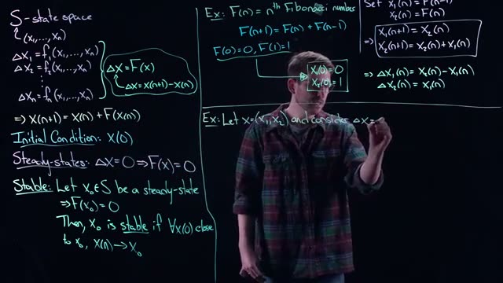
*[16:20](https://www.youtube.com/watch?v=wnYe8KK4qJg&t=980s) A whiteboard displays mathematical equations and definitions related to state space, initial conditions, steady-states, and stability, including an example of Fibonacci numbers.*
  
*The whiteboard shows the general definitions of state space, initial conditions, steady states, and stability, together with the Fibonacci example and the beginning of the current example.*

### Steady state

A steady state (or fixed point) satisfies $\Delta \mathbf{x} = \mathbf{0}$, i.e. $\mathbf{F}(\mathbf{x}) = \mathbf{0}$. For our system $\mathbf{F}(\mathbf{x}) = -\lambda \mathbf{x}$, so

$$
-\lambda \mathbf{x} = \mathbf{0} \quad \Longleftrightarrow \quad \mathbf{x} = \mathbf{0}.
$$

Thus the origin $(0,0)$ is the only steady state.


*[17:20](https://www.youtube.com/watch?v=wnYe8KK4qJg&t=1040s) This frame displays mathematical definitions and examples related to state space, steady-states, and stability, including equations for Fibonacci numbers and a system with a decay term.*
  
*The whiteboard now includes the steady‑state condition for the example: $F(x) = -\lambda x \Rightarrow F(x)=0 \Leftrightarrow x=0$.*

### Update equations for each component

Because $\mathbf{x}_{n+1} = (1-\lambda) \mathbf{x}_n$, the two components evolve independently:

$$
\begin{aligned}
x_{1,n+1} &= (1-\lambda) \, x_{1,n}, \$$4pt]
x_{2,n+1} &= (1-\lambda) \, x_{2,n}.
\end{aligned}
$$

The system is **decoupled**: the dynamics of $x_1$ and $x_2$ are identical and do not influence each other. Therefore we can analyze a single component and the results apply to both.


*[18:00](https://www.youtube.com/watch?v=wnYe8KK4qJg&t=1080s) This frame shows mathematical equations and definitions related to state space, initial conditions, steady-states, and stability, including examples for Fibonacci numbers and a linear system.*
  
*The whiteboard shows the first update equation $x_1(n+1) = (1-\lambda)x_1(n)$.*


*[18:40](https://www.youtube.com/watch?v=wnYe8KK4qJg&t=1120s) The whiteboard shows definitions for state space, initial conditions, steady-states, and stability, along with examples for Fibonacci numbers and a system with a negative feedback loop.*
  
*Both update equations are now displayed: $X_1(n+1) = (1-\lambda)X_1(n)$ and $X_2(n+1) = (1-\lambda)X_2(n)$.*

### Iterating the map

Starting from an initial condition $\mathbf{x}_0 = (x_{1,0}, x_{2,0})$, we apply the update repeatedly:

$$
\begin{aligned}
x_{1,1} &= (1-\lambda) x_{1,0}, \\
x_{1,2} &= (1-\lambda) x_{1,1} = (1-\lambda)^2 x_{1,0}, \\
x_{1,3} &= (1-\lambda) x_{1,2} = (1-\lambda)^3 x_{1,0},
\end{aligned}
$$

and in general

$$
x_{1,n} = (1-\lambda)^n \, x_{1,0}, \qquad x_{2,n} = (1-\lambda)^n \, x_{2,0}.
$$

Each iteration multiplies the previous value by the factor $(1-\lambda)$. The same factor applies to both components.


*[19:20](https://www.youtube.com/watch?v=wnYe8KK4qJg&t=1160s) This whiteboard frame shows mathematical equations and definitions related to state space, initial conditions, steady-states, and stability, including examples for Fibonacci numbers and a system with a parameter lambda.*
  
*The whiteboard shows the iteration up to the second step: $X_1(2) = (1-\lambda)^2$ (with the initial condition implied).*

### Stability analysis

We ask: is the steady state $\mathbf{x} = \mathbf{0}$ stable? A steady state is **stable** if every trajectory that starts sufficiently close to it eventually converges to it. For our system, convergence to zero occurs if and only if

$$
\lim_{n \to \infty} (1-\lambda)^n = 0.
$$

This limit depends on the magnitude of $(1-\lambda)$:

| Condition on $\lambda$ | Value of $|1-\lambda|$ | Behavior of $(1-\lambda)^n$ as $n\to\infty$ | Stability of origin |
|------------------------|--------------------------|---------------------------------------------|----------------------|
| $0 < \lambda < 2$      | $<1$                     | Tends to $0$                                | **Stable** (attracting) |
| $\lambda = 2$          | $=1$ (specifically $-1$) | Oscillates between $+1$ and $-1$; does not tend to $0$ | **Neutral** (marginally stable) |
| $\lambda > 2$          | $>1$                     | Grows without bound in magnitude            | **Unstable**         |

Because $\lambda$ is given as a positive number, the stable range is $0 < \lambda < 2$. In that range, any initial condition $\mathbf{x}_0$ will produce a trajectory that converges to the origin. If $\lambda = 2$, the trajectory oscillates between $\mathbf{x}_0$ and $-\mathbf{x}_0$ forever. If $\lambda > 2$, the magnitude of the state grows exponentially and the origin is unstable.

Thus the qualitative behavior of the system is completely determined by the parameter $\lambda$ through the factor $1-\lambda$.

### Check your understanding

1. **What is the steady state of the system $\Delta \mathbf{x} = -\lambda \mathbf{x}$ with $\lambda > 0$?**  
   <details><summary>Answer</summary>  
   The only steady state is $\mathbf{x} = \mathbf{0}$.  
   </details>

2. **Why can we analyze only one component of the system?**  
   <details><summary>Answer</summary>  
   The update equations for $x_1$ and $x_2$ are identical and do not depend on each other; the system is decoupled.  
   </details>

3. **For which values of $\lambda$ is the origin stable?**  
   <details><summary>Answer</summary>  
   The origin is stable when $0 < \lambda < 2$, because then $|1-\lambda| < 1$ and $(1-\lambda)^n \to 0$.  
   </details>

4. **What happens to the trajectory if $\lambda = 2$?**  
   <details><summary>Answer</summary>  
   The factor becomes $1-\lambda = -1$, so the state alternates between $\mathbf{x}_0$ and $-\mathbf{x}_0$; it does not converge to the origin.  
   </details>
## Preview of Upcoming Lectures

In this section we extend the analysis of the discrete-time system $\Delta \mathbf{x} = -\lambda \mathbf{x}$ (with $\lambda > 0$) to cover all possible values of $\lambda$. The system has a single steady-state at $\mathbf{x} = \mathbf{0}$. From the solution derived earlier:

$$
x_{1,n} = (1-\lambda)^n x_{1,0}, \qquad x_{2,n} = (1-\lambda)^n x_{2,0}.
$$

The behavior of the sequence $\{x_{1,n}\}$ (and similarly $\{x_{2,n}\}$) is determined entirely by the factor $(1-\lambda)^n$. The key question is: does the sequence converge to 0 as $n \to \infty$?


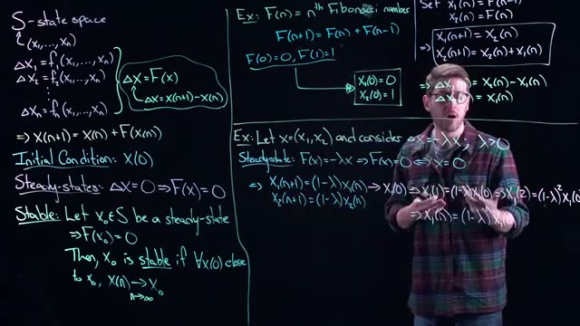
*[20:00](https://www.youtube.com/watch?v=wnYe8KK4qJg&t=1200s) This frame shows a whiteboard with mathematical equations and definitions related to state space, initial conditions, steady-states, and stability, including examples for Fibonacci numbers and a system with a decay term.*


### Convergence Condition for the Factor $(1-\lambda)^n$

The limit $\displaystyle\lim_{n \to \infty} (1-\lambda)^n = 0$ holds **if and only if** the base $1-\lambda$ lies strictly between $-1$ and $1$:

$$
-1 < 1-\lambda < 1.
$$

Solving this inequality for $\lambda$ gives the equivalent condition:

$$
0 < \lambda < 2.
$$


*[21:20](https://www.youtube.com/watch?v=wnYe8KK4qJg&t=1280s) This frame shows a whiteboard with mathematical equations and definitions related to state space, Fibonacci numbers, steady-states, and stability.*


### Stability of the Steady-State $\mathbf{x} = \mathbf{0}$

The steady-state $\mathbf{x} = \mathbf{0}$ is **stable** if every initial condition (no matter how far from the steady-state) leads to a sequence that converges to $\mathbf{0}$. From the condition above, we obtain:

- **If $0 < \lambda < 2$:** $|1-\lambda| < 1$, so $(1-\lambda)^n \to 0$. Therefore $x_{1,n} \to 0$ and $x_{2,n} \to 0$ for any initial values $x_{1,0}, x_{2,0}$. The steady-state $\mathbf{x} = \mathbf{0}$ is stable.


*[22:20](https://www.youtube.com/watch?v=wnYe8KK4qJg&t=1340s) This frame shows a whiteboard with mathematical equations and definitions related to state space, Fibonacci numbers, steady states, and stability, including an example of a stable system.*


- **If $\lambda > 2$:** $|1-\lambda| > 1$, so $(1-\lambda)^n$ grows in magnitude without bound (e.g., $(-2)^n$ alternates sign and diverges). Consequently, $x_{1,n}$ and $x_{2,n}$ blow up, no matter how close to zero the initial condition is. The steady-state $\mathbf{0}$ is **unstable**.

- **If $\lambda = 2$:** $1-\lambda = -1$, so $x_{1,n} = (-1)^n x_{1,0}$ and $x_{2,n} = (-1)^n x_{2,0}$. The sequence simply flips between positive and negative values of the same magnitude; it never converges to zero and never diverges. This is a borderline case: the system is neither stable nor unstable in the usual sense.


*[23:20](https://www.youtube.com/watch?v=wnYe8KK4qJg&t=1400s) This frame displays mathematical equations and definitions related to state space, Fibonacci numbers, steady-states, and stability.*


### Subcases Within the Stable Regime

Even when $0 < \lambda < 2$, the qualitative behavior of the convergence depends on whether $1-\lambda$ is positive or negative.

- **$0 < \lambda < 1$:** Then $1-\lambda > 0$, so $(1-\lambda)^n$ is always positive. The sequence $x_{1,n}$ never changes sign: it approaches $0$ monotonically from the same side as the initial condition. If $x_{1,0} > 0$, the values stay positive and decrease to $0$; if $x_{1,0} < 0$, they stay negative and increase to $0$.

- **$1 < \lambda < 2$:** Then $1-\lambda < 0$, so $(1-\lambda)^n$ alternates sign. The sequence $x_{1,n}$ flips back and forth across zero while its magnitude shrinks to zero. This is an **oscillatory convergence** to the steady-state.

- **$\lambda = 1$:** Then $1-\lambda = 0$, so $x_{1,1} = 0$ and $x_{2,1} = 0$ regardless of the initial condition. The system reaches equilibrium in a single step.


*[24:20](https://www.youtube.com/watch?v=wnYe8KK4qJg&t=1460s) This frame displays mathematical equations and definitions related to state space, Fibonacci numbers, and stability analysis, including examples.*


### Summary Table of $\lambda$ Values and Behavior

| $\lambda$ range | $|1-\lambda|$ | Sign of $1-\lambda$ | Behavior of $x_{1,n}$ | Steady-state $\mathbf{0}$ |
|-----------------|----------------|---------------------|------------------------|---------------------------|
| $0 < \lambda < 1$ | $<1$ | positive | monotonic convergence to 0 | stable |
| $\lambda = 1$ | $0$ | zero | $x_{1,1}=0$ (one-step) | stable |
| $1 < \lambda < 2$ | $<1$ | negative | oscillatory convergence to 0 | stable |
| $\lambda = 2$ | $=1$ | negative | $(-1)^n x_{1,0}$ (no convergence) | neither stable nor unstable |
| $\lambda > 2$ | $>1$ | negative | diverges (blows up) | unstable |

### What Lies Ahead

This example has given you a taste of discrete-time dynamical systems. In the next few lectures we will:

- Develop **graphical methods** (e.g., cobweb plots) to analyze the behavior of iterated maps without solving explicit formulas.
- Formalize the concepts of **equilibrium points** and **stability**.
- Introduce **analytical (pencil-and-paper) techniques** for determining stability and understanding how solutions behave.

We will start by building intuition through graphical tools, then move to more rigorous methods.

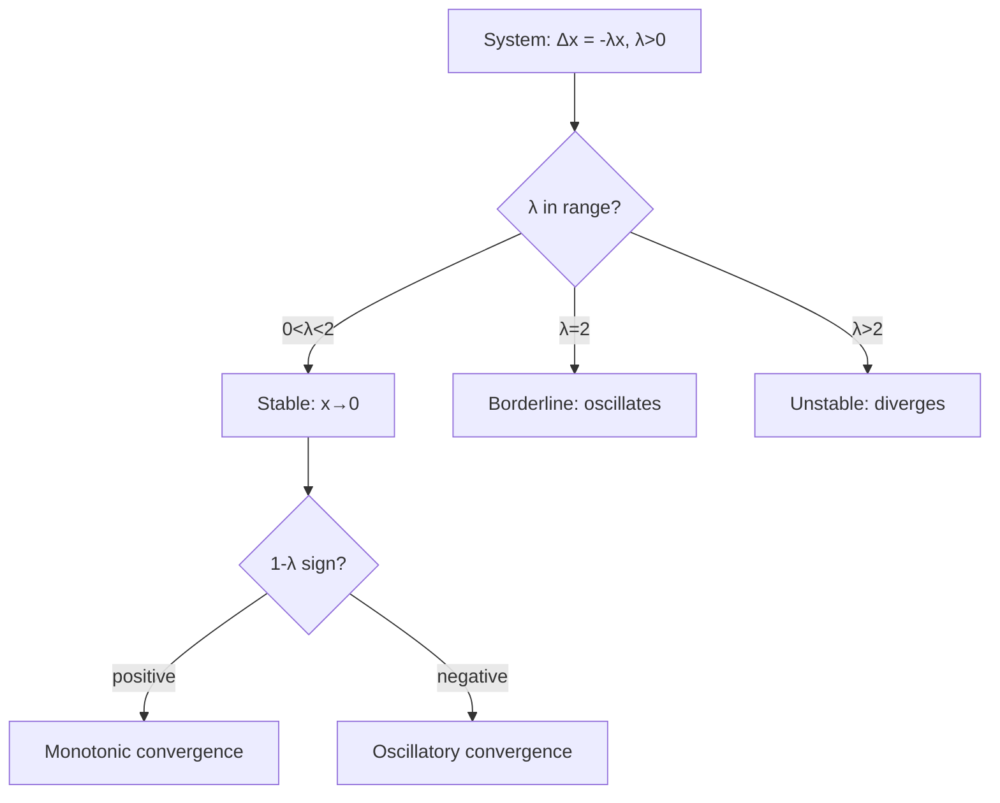

### Check Your Understanding

1. **For the system $\Delta x = -\lambda x$, what is the condition on $\lambda$ for the steady-state $x=0$ to be stable?**  
   <details><summary>Answer</summary> The steady-state is stable when $0 < \lambda < 2$. This ensures $|1-\lambda| < 1$, so $(1-\lambda)^n \to 0$ and any initial condition converges to $0$.
   </details>

2. **If $\lambda = 2$, what happens to the sequence $x_n$ for a nonzero initial condition?**  
   <details><summary>Answer</summary> The sequence becomes $x_n = (-1)^n x_0$, which alternates between positive and negative values of equal magnitude. It does not converge to $0$ and does not diverge.
   </details>

3. **How does the behavior differ for $\lambda = 0.5$ and $\lambda = 1.5$?**  
   <details><summary>Answer</summary> For $\lambda = 0.5$, $1-\lambda = 0.5 > 0$, so the sequence converges monotonically to $0$ (sign unchanged). For $\lambda = 1.5$, $1-\lambda = -0.5 < 0$, so the sequence converges to $0$ but oscillates across zero at each step.
   </details>

4. **True or False: The stability condition derived in this section depends on the initial condition being close to the steady-state.**  
   <details><summary>Answer</summary> False. For $0 < \lambda < 2$, the convergence to $0$ occurs for **any** initial condition, not just those near the steady-state. The definition of stability in the video required "close to" the steady-state, but this specific system actually exhibits global convergence.
   </details>
## Key takeaways

- Discrete-time dynamical systems model processes where time advances in distinct steps rather than continuously, making them suitable for data observed at regular intervals like days or years.
- The delta form of a discrete system is $\Delta \mathbf{x} = \mathbf{F}(\mathbf{x})$, where $\Delta \mathbf{x}$ represents the change from one time step to the next.
- The update form $\mathbf{x}_{n+1} = \mathbf{x}_n + \mathbf{F}(\mathbf{x}_n)$ shows how the next state is computed from the current state, analogous to Newton's method iteration.
- Steady states of a discrete system occur when $\Delta \mathbf{x} = 0$, which requires solving $\mathbf{F}(\mathbf{x}) = 0$ for the state vector $\mathbf{x}$.
- A steady state $\mathbf{x}_0$ is stable if all initial conditions sufficiently close to $\mathbf{x}_0$ produce sequences that converge to $\mathbf{x}_0$ as $n \to \infty$.
- The Fibonacci sequence $F_{n+1} = F_n + F_{n-1}$ can be rewritten as a two-dimensional discrete system by defining $x_1(n) = F_{n-1}$ and $x_2(n) = F_n$.
- For the linear system $\Delta \mathbf{x} = -\lambda \mathbf{x}$ with $\lambda > 0$, the only steady state is $\mathbf{x} = 0$, and its stability depends on $\lambda$.
- The origin is stable when $0 < \lambda < 2$ because $|1-\lambda| < 1$, causing iterates to converge to zero for any initial condition.
- When $\lambda > 2$, iterates diverge because $|1-\lambda| > 1$, making the origin unstable regardless of how close the initial condition is.
- The parameter $\lambda$ also determines qualitative behavior: for $0 < \lambda < 1$ iterates converge monotonically, for $1 < \lambda < 2$ they converge with sign alternation, and at $\lambda = 2$ they oscillate without converging.
## Glossary

| Term | Definition |
|---|---|
| discrete-time dynamical system | A system where time advances in distinct steps, modeled by difference equations that relate the state at one time step to the state at the next step. |
| continuous-time dynamical system | A system where time flows continuously, modeled by differential equations that describe the instantaneous rate of change of the state. |
| state space | The set $S$ of all possible states of a system, typically an $n$-dimensional space containing vectors $\mathbf{x} = (x_1, x_2, \dots, x_n)$. |
| delta form | A representation of a discrete system as $\Delta \mathbf{x} = \mathbf{F}(\mathbf{x})$, where $\Delta \mathbf{x}$ is the change from one time step to the next. |
| update form | A representation of a discrete system as $\mathbf{x}_{n+1} = \mathbf{x}_n + \mathbf{F}(\mathbf{x}_n)$, showing how the next state is computed from the current state. |
| steady state | A state $\mathbf{x}_0$ such that $\Delta \mathbf{x} = 0$, meaning the system does not change from one time step to the next, equivalent to $\mathbf{F}(\mathbf{x}_0) = 0$. |
| stability | A property of a steady state where all initial conditions sufficiently close to it produce sequences that converge to it as $n \to \infty$. |
| Fibonacci sequence | A sequence defined by $F_{n+1} = F_n + F_{n-1}$ with $F_0 = 0$ and $F_1 = 1$, which can be reformulated as a two-dimensional discrete dynamical system. |
| decoupled system | A system where the update equations for each variable do not depend on the other variables, allowing each to be analyzed independently. |
| initial condition | The state of the system at time $n = 0$, denoted $\mathbf{x}_0$, which is required to generate the sequence of iterates. |
| iterate | One step in the sequence generated by repeatedly applying the update rule, starting from an initial condition. |
| convergence | The property of a sequence where the values approach a fixed limit as the number of steps goes to infinity. |
| divergence | The property of a sequence where the values grow without bound as the number of steps goes to infinity. |
| oscillation | A pattern where the sequence alternates between values, such as flipping sign each step without changing magnitude. |
| monotonic convergence | Convergence where the sequence approaches the limit from one direction without changing sign, occurring when $0 < \lambda < 1$ in the linear example. |
| sign alternation | A pattern where the sign of the iterates flips each step, occurring when $1 < \lambda < 2$ in the linear example. |
| parameter $\lambda$ | A positive constant in the linear system $\Delta \mathbf{x} = -\lambda \mathbf{x}$ that determines both stability and qualitative behavior of the iterates. |
| Newton's method | An iterative root-finding algorithm that can be viewed as a discrete dynamical system, where the update rule depends on the function and its derivative. |
| difference equation | Another name for a discrete-time dynamical system, emphasizing that it relates differences between successive states. |
| equilibrium point | Another term for a steady state, a point where the system does not change over time. |
## Footnotes and deeper context

1. **Stability condition derivation.** The condition $0 < \lambda < 2$ for stability of the origin in $\Delta \mathbf{x} = -\lambda \mathbf{x}$ comes from requiring $|1-\lambda| < 1$. This ensures $(1-\lambda)^n \to 0$ as $n \to \infty$. The inequality $|1-\lambda| < 1$ expands to $-1 < 1-\lambda < 1$, which simplifies to $0 < \lambda < 2$.
2. **Edge case at lambda equals 2.** At $\lambda = 2$, the update factor is $1-\lambda = -1$, so $x_1(n) = (-1)^n x_1(0)$. The iterates oscillate between $x_1(0)$ and $-x_1(0)$ without converging to zero or diverging. This is called a neutral or marginal case, not stable or unstable in the usual sense.
3. **Decoupling in linear systems.** The system $\Delta \mathbf{x} = -\lambda \mathbf{x}$ decouples because the update for $x_1$ depends only on $x_1$ and the update for $x_2$ depends only on $x_2$. This is a special property of linear systems with diagonal coefficient matrices, not general for all discrete systems.
4. **Fibonacci as a linear system.** The Fibonacci system $x_1(n+1) = x_2(n)$, $x_2(n+1) = x_2(n) + x_1(n)$ is linear and can be written in matrix form as $\mathbf{x}_{n+1} = \begin{pmatrix} 0 & 1 \\ 1 & 1 \end{pmatrix} \mathbf{x}_n$. Its behavior is determined by the eigenvalues of this matrix, which are the golden ratio $\phi \approx 1.618$ and its conjugate.
5. **Initial condition generality.** The Fibonacci system can start with any initial pair $(x_1(0), x_2(0))$, not just $(0,1)$. Different initial conditions generate different sequences that still follow the same recurrence relation, illustrating how the framework accommodates arbitrary starting points.
## Where to go next

- **Explore the logistic map.** A classic one-dimensional discrete dynamical system that exhibits period-doubling and chaos. Study it in Strogatz's 'Nonlinear Dynamics and Chaos' (Chapter 10) to see how simple update rules produce complex behavior beyond the linear example.
- **Read about Newton's method as a dynamical system.** The video mentions Newton iteration as an example. Read about the Newton fractal and basins of attraction in 'Dynamics of Newton's Method' by Hubbard and Schleicher to understand how stability depends on initial conditions in nonlinear systems.
- **Study eigenvalue analysis for linear discrete systems.** For a general linear system $\mathbf{x}_{n+1} = A \mathbf{x}_n$, stability is determined by the eigenvalues of matrix $A$. Read about this in 'Linear Algebra and Its Applications' by Strang (Chapter 5) or any textbook on difference equations.
- **Try the Fibonacci matrix diagonalization.** Compute the eigenvalues and eigenvectors of the Fibonacci matrix $\begin{pmatrix} 0 & 1 \\ 1 & 1 \end{pmatrix}$ to derive Binet's formula for the $n$th Fibonacci number. This is a standard exercise in linear algebra textbooks.
---
*Printed by yt2textbook, an open tool from Zorost AI Lab. Screenshots are frames captured from the source video; each caption links to the exact moment it appears.*
