# Euler's Method for Approximating Continuous Dynamical Systems
> **Source:** [Euler's Method - Math Modelling - Lecture 20](https://www.youtube.com/watch?v=203GsVI7fpU) by Math Modelling · 19:58 · Training document generated from the video.
**How to use this document:** read it top to bottom in place of watching the video. Screenshots appear exactly where the video depends on something visual, with links that jump to that moment. Questions at the end of each section confirm you learned the material. The glossary and footnotes add definitions and detail the video assumes you already have.
**Who this is for:** This course is for students of mathematical modelling or dynamical systems who want to learn a simple numerical method to simulate continuous-time systems on a computer.
## Learning objectives

After working through this document you can:

1. Explain why continuous-time dynamical systems require approximation methods for computer implementation.
2. Derive Euler's method from the definition of a derivative by fixing a small step size h.
3. Write the iterative formula x((n+1)h) = x(nh) + h F(x(nh)) for a system x' = F(x).
4. Describe how Euler's method turns a continuous-time system into a discrete-time iterative process.
5. Analyze the trade-off between step size h and accuracy, including the cascading accumulation of error.
6. Visualize the error accumulation using a graph of the true solution versus the Euler approximation with tangent lines.
7. Apply Euler's method to a specific example, such as the RLC circuit model, to detect a limit cycle.
8. Perform sensitivity analysis by decreasing h to verify whether observed phenomena are numerical artifacts or true dynamics.
## Prerequisites

- Knowledge of calculus, including the definition of a derivative and limits.
- Familiarity with ordinary differential equations (ODEs) and their notation.
- Basic understanding of discrete-time dynamical systems and iterative updates.
- Some experience with programming loops (for loops) and implementing algorithms.
## Introduction and Motivation for Computational Methods

In previous lectures, you studied the theory of dynamical systems. You began by drawing pictures and sketches to understand the qualitative behavior of these systems. Then you performed analysis by examining linearization methods, specifically how eigenvalues and eigenvectors can inform the dynamics of a system quantitatively. Now you will shift focus to the computational aspects of analyzing dynamical systems.


### Discrete Time Systems Are Easy to Implement

Discrete time systems are relatively easy to implement on a computer. As shown in previous videos, you can always write a discrete time system as an update. An update means that if you know the state of the system now, you can compute the state at the next time step.

To implement this in a computer, you use a looping process. The process works as follows:

1.  Start with the current state of the system.
2.  Plug the current state into the update equation to compute the next state.
3.  To go another step into the future, take the newly computed state, plug it into the equation again, and compute the state after that.
4.  Repeat this process for as many steps as needed.

This is a straightforward, iterative procedure that a computer can execute quickly.

### The Challenge with Continuous Time Systems

Continuous time dynamical systems are not as simple to implement on a computer. The core issue is that continuous time systems involve derivatives. A derivative represents an instantaneous rate of change, which is not something a computer can directly compute or store. Computers work with discrete values, not continuous functions.

Because you cannot directly put a derivative into a computer, you need approximation schemes. These schemes convert the continuous problem into a discrete problem that a computer can solve. Euler's method is one such approximation scheme.

### Key Concepts Defined

- **Discrete time system**: A system where time advances in fixed, separate steps. The state is defined only at those discrete time points.
- **Continuous time system**: A system where time flows continuously. The state is defined at every instant in time.
- **Update**: A rule that takes the current state of a discrete time system and produces the next state.
- **Derivative**: A measure of how a quantity changes instantaneously with respect to time. (added context: In a continuous dynamical system, the derivative describes the system's behavior at every moment, but a computer cannot evaluate an infinite number of moments.)
- **Approximation scheme**: A method that replaces a continuous problem with a discrete problem that gives a close, but not exact, answer. (added context: Euler's method is the simplest approximation scheme for solving differential equations.)

### Check Your Understanding

1.  Why are discrete time systems easier to implement on a computer than continuous time systems?

<details><summary>Answer</summary>Discrete time systems can be written as an update rule. You can use a simple looping process where you take the current state, plug it into the equation, and get the next state. This is a straightforward, step-by-step procedure that a computer can execute. Continuous time systems involve derivatives, which are instantaneous rates of change that a computer cannot directly compute.</details>

2.  What is the fundamental problem with using a derivative in a computer program?

<details><summary>Answer</summary>A derivative represents an instantaneous rate of change. Computers work with discrete values and cannot directly compute or store an instantaneous rate of change. You need an approximation scheme to convert the continuous derivative into a discrete calculation.</details>

3.  Describe the looping process used to simulate a discrete time system on a computer.

<details><summary>Answer</summary>First, you start with the current state of the system. You plug that state into the update equation to compute the next state. To go further into the future, you take that newly computed state, plug it into the equation again, and compute the state after that. You repeat this process for as many steps as needed.</details>
## Deriving Euler's Method from the Derivative Definition


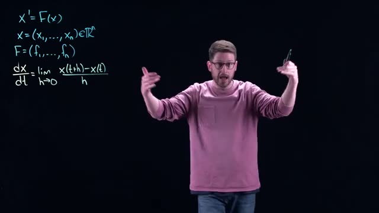
*[03:20](https://www.youtube.com/watch?v=203GsVI7fpU&t=200s) Mathematical equations for x' = F(x) and the definition of a derivative are written on a blackboard.*


We begin with a continuous time dynamical system, written as:

```
x' = F(x)
```

Here, `x` is an n-dimensional vector, `x = (x₁, ..., xₙ) ∈ Rⁿ`, and `F` is a vector-valued function, `F = (f₁, ..., fₙ)`. The notation `x'` means the derivative of `x` with respect to time, `dx/dt`. This system describes how the state `x` changes continuously over time.

To approximate this system on a computer, we recall the definition of a derivative from calculus:

```
dx/dt = lim (h→0) [x(t+h) - x(t)] / h
```

This definition says that the instantaneous rate of change of `x` at time `t` is the limit of the average rate of change over a small interval of length `h`, as `h` approaches zero.


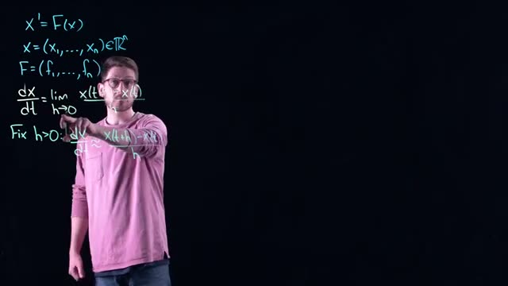
*[04:00](https://www.youtube.com/watch?v=203GsVI7fpU&t=240s) A whiteboard shows mathematical equations for a derivative and its approximation, including definitions for x and F.*


Now we apply this definition directly. If we fix a small positive value of `h`, then the derivative can be approximated by the quotient:

```
dx/dt ≈ [x(t+h) - x(t)] / h
```

This approximation becomes more accurate as `h` gets smaller. The limit definition guarantees that for sufficiently small `h`, the quotient is close to the true derivative. We do not yet specify how small `h` must be; that will be addressed later in the course.

We now substitute this approximation into the original differential equation. Since `x' = F(x)`, we replace the left side with the quotient:

```
[x(t+h) - x(t)] / h ≈ F(x(t))
```

We write `F(x(t))` to emphasize that the function `F` is evaluated at the current state `x` at time `t`. This is the same moment in time as the left side of the equation.


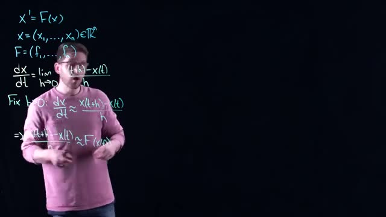
*[05:00](https://www.youtube.com/watch?v=203GsVI7fpU&t=300s) Mathematical equations for a system of differential equations and its approximation are written on a blackboard.*


Now we rearrange this equation to solve for the future state `x(t+h)`. Multiply both sides by `h`:

```
x(t+h) - x(t) ≈ h * F(x(t))
```

Then add `x(t)` to both sides:

```
x(t+h) ≈ x(t) + h * F(x(t))
```

This is the Euler method, also called the forward Euler method, because it steps forward in time by `h` units. The equation tells us: if we know the current state `x(t)`, we can compute an approximation of the state at time `t+h` by adding the product of the step size `h` and the derivative function `F` evaluated at the current state.

The method converts the continuous time dynamical system into a discrete time dynamical system. Instead of a continuous curve, we get a sequence of points: `x(0)`, `x(h)`, `x(2h)`, `x(3h)`, and so on. Each step uses only the current state to predict the next state.

The key relationship is summarized in this table:

| Continuous system | Discrete approximation (Euler method) |
|-------------------|---------------------------------------|
| `x' = F(x)`       | `x(t+h) ≈ x(t) + h * F(x(t))`         |
| Time is continuous | Time advances in steps of size `h`    |
| Exact solution    | Approximate solution                  |

The flow of the derivation is shown in this diagram:

```
Definition of derivative:
  dx/dt = lim (h→0) [x(t+h) - x(t)] / h

Fix small h > 0:
  dx/dt ≈ [x(t+h) - x(t)] / h

Substitute into differential equation:
  [x(t+h) - x(t)] / h ≈ F(x(t))

Rearrange:
  x(t+h) ≈ x(t) + h * F(x(t))
```

This final equation is the Euler method. It is a simple, direct way to approximate solutions to differential equations, and it forms the foundation for more advanced numerical methods.

### Check your understanding

1. What is the starting point for deriving Euler's method?

<details>
<summary>Answer</summary>
The starting point is the definition of the derivative: `dx/dt = lim (h→0) [x(t+h) - x(t)] / h`. We fix a small positive `h` and approximate the derivative by the quotient `[x(t+h) - x(t)] / h`.
</details>

2. How does Euler's method convert a continuous time system into a discrete time system?

<details>
<summary>Answer</summary>
Euler's method replaces the continuous derivative with a finite difference quotient. This produces the recurrence `x(t+h) ≈ x(t) + h * F(x(t))`, which computes the state at the next time step `t+h` using only the current state `x(t)`. Time then advances in discrete steps of size `h`.
</details>

3. What does the term "forward" in "forward Euler method" refer to?

<details>
<summary>Answer</summary>
The term "forward" refers to the fact that the method uses the current state `x(t)` to compute the future state `x(t+h)`, stepping forward in time by `h` units.
</details>

4. Why is the approximation `dx/dt ≈ [x(t+h) - x(t)] / h` valid?

<details>
<summary>Answer</summary>
The approximation is valid because the definition of the derivative states that as `h` approaches zero, the quotient `[x(t+h) - x(t)] / h` approaches the derivative. For a small but nonzero `h`, the quotient is close to the derivative. The smaller `h` is, the closer the approximation.
</details>
## Iterative Process and the Looping Procedure

The Euler method gives you a way to step forward in time by a fixed amount, called the **step size** \( h \). Once you know the state at one instant, you can approximate the state at the next instant. The key insight is that you can repeat this procedure over and over, using each new approximation as the starting point for the next step. This creates an iterative loop that generates an approximate solution over many time steps.

### The Euler Step Formula

Recall the core approximation derived from the definition of the derivative:

\[
x(t+h) \approx x(t) + h \, F(x(t))
\]

Here \( F(x(t)) \) is the derivative \( x' \) evaluated at time \( t \). The term \( h \, F(x(t)) \) is the estimated change in \( x \) over the interval of length \( h \). This formula is the **Euler step**.


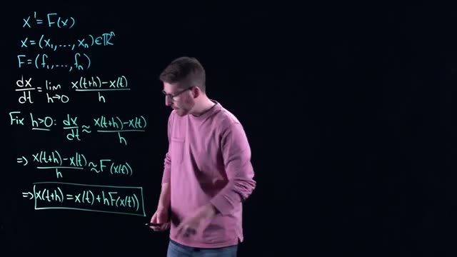
*[06:00](https://www.youtube.com/watch?v=203GsVI7fpU&t=360s) A whiteboard shows mathematical equations for x' = F(x) and the approximation of dx/dt, leading to the final equation x(t+h) = x(t) + hF(x(t)).*


The whiteboard shows the derivation:

```
x'= F(x)
x=(x...,x) ETR
F= (f..., f)
dx = lim x(t+h)-x(t)
dt h->0 h
Fix h>0: dx ~ x(t+h)-x(t)
dt h
=> x+h)-x/t)~F (xe)
=>x(t+h)=x(t)+hF(x(t))
```

(Note: The on-screen text contains minor transcription artifacts; the intended equations are \( x' = F(x) \), \( x = (x_1,\dots,x_n) \in \mathbb{R}^n \), \( F = (f_1,\dots,f_n) \), and the final Euler formula \( x(t+h) = x(t) + h F(x(t)) \).)

### Starting from an Initial Condition

You are given an **initial condition** at time \( t = 0 \): \( x(0) = x_0 \). This is the one point you know exactly. Apply the Euler step to move forward by \( h \):

\[
x(h) = x_0 + h \, F(x_0)
\]


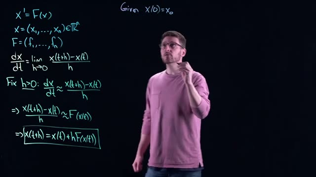
*[06:20](https://www.youtube.com/watch?v=203GsVI7fpU&t=380s) This frame displays mathematical equations on a whiteboard, including definitions for x', x, and F, the definition of a derivative, and a derivation leading to the Euler method formula.*


The whiteboard now includes the initial condition:

```
Given X(0)=Xo
```

### Repeating the Procedure: The Iterative Loop

Once you have \( x(h) \), you can treat it as the known state and apply the Euler step again to go from \( t = h \) to \( t = 2h \):

\[
x(2h) = x(h) + h \, F(x(h))
\]


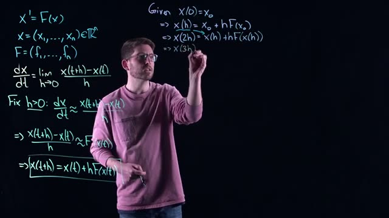
*[07:20](https://www.youtube.com/watch?v=203GsVI7fpU&t=440s) A whiteboard shows mathematical equations for X prime equals F of X, the definition of a derivative, and an approximation for X of T plus H.*


The whiteboard shows the first two iterative formulas:

```
=> x(h) = xo + h F(xo)
=> x(2h)=x(h) +hF(x(h))
=>X(3
```

(The third line is cut off in the screenshot but is completed in the next frame.)

Continue the pattern. To go from \( t = 2h \) to \( t = 3h \):

\[
x(3h) = x(2h) + h \, F(x(2h))
\]


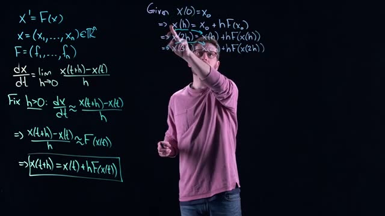
*[07:40](https://www.youtube.com/watch?v=203GsVI7fpU&t=460s) This frame shows mathematical equations for Euler's method, including the definition of a derivative, an approximation for a small h, and the iterative formula for x(t+h).*


The whiteboard now shows the full iterative sequence:

```
=> x(3h) = x(2h) + hF(x(2h))
```

In general, to move from \( t = n h \) to \( t = (n+1)h \):

\[
x((n+1)h) = x(nh) + h \, F(x(nh))
\]

Each step uses the previous approximation as input to compute the next approximation. This is a **looping procedure** (often implemented as a `for` loop in code). You start with the initial condition, compute the next value, then use that value to compute the next, and so on, for as many steps as you need.

### Visualizing the Loop

The following ASCII diagram shows the flow of the iterative process:

```
Start: x(0) = x0
         |
         v
Compute: x(h) = x(0) + h * F(x(0))
         |
         v
Compute: x(2h) = x(h) + h * F(x(h))
         |
         v
Compute: x(3h) = x(2h) + h * F(x(2h))
         |
         v
         ... (repeat for desired number of steps)
```

Each arrow represents one Euler step. The output of one step becomes the input for the next.

### Summary of the Iterative Formulas

The following table lists the first few steps and the general formula:

| Step index \( n \) | Time \( t \) | Approximation formula |
|-------------------|--------------|-----------------------|
| 0                 | 0            | \( x(0) = x_0 \) (given) |
| 1                 | \( h \)      | \( x(h) = x_0 + h F(x_0) \) |
| 2                 | \( 2h \)     | \( x(2h) = x(h) + h F(x(h)) \) |
| 3                 | \( 3h \)     | \( x(3h) = x(2h) + h F(x(2h)) \) |
| \( n \)           | \( nh \)     | \( x(nh) = x((n-1)h) + h F(x((n-1)h)) \) |
| \( n+1 \)         | \( (n+1)h \) | \( x((n+1)h) = x(nh) + h F(x(nh)) \) |

This pattern is the core of Euler’s method: a simple, repeatable rule that turns a differential equation into a sequence of algebraic calculations.

### Check your understanding

1. **What is the purpose of the step size \( h \) in the iterative procedure?**  
   <details><summary>Answer</summary>  
   The step size \( h \) determines the time interval between successive approximations. It controls how far forward in time each Euler step moves. A smaller \( h \) generally gives a more accurate approximation but requires more steps to cover the same total time.  
   </details>

2. **Starting from \( x(0) = x_0 \), write the formula for \( x(4h) \) in terms of \( x(3h) \) and \( F \).**  
   <details><summary>Answer</summary>  
   \( x(4h) = x(3h) + h \, F(x(3h)) \)  
   </details>

3. **Why is this process called a “looping procedure”?**  
   <details><summary>Answer</summary>  
   Because the same calculation (the Euler step) is repeated over and over: you take the current approximation, apply the formula to get the next approximation, then use that new value as the current approximation for the next iteration. This repetition is naturally implemented as a loop in computer code (e.g., a `for` loop).  
   </details>

4. **If you want to approximate the solution from \( t=0 \) to \( t=10 \) with a step size \( h=0.5 \), how many Euler steps will you perform?**  
   <details><summary>Answer</summary>  
   Number of steps = total time / step size = \( 10 / 0.5 = 20 \) steps.  
   </details>
## Error Accumulation and the Trade-Off with Step Size

Euler’s method replaces the exact derivative with an approximation. The exact derivative uses a limit:


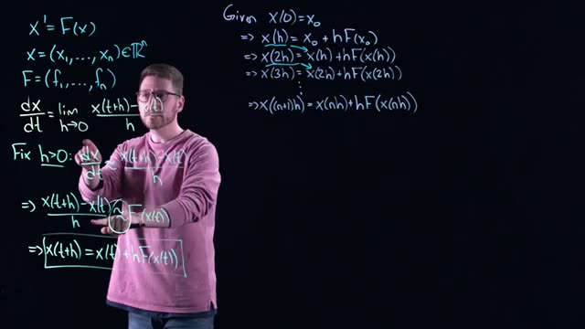
*[08:40](https://www.youtube.com/watch?v=203GsVI7fpU&t=520s) This frame displays mathematical equations related to differential equations and numerical methods, including the definition of a derivative and an iterative formula for approximating solutions.*


```
dx/dt = lim_{h→0} (x(t+h)-x(t))/h
```

In Euler’s method we fix a small positive step size \(h\) and use the approximation:

\[
\frac{dx}{dt} \approx \frac{x(t+h)-x(t)}{h}
\]

Because we drop the limit, every step introduces a small error. The approximation is not equal to the true derivative; it is only close when \(h\) is small. Each time we apply the formula

\[
x(t+h) = x(t) + h\,F(x(t))
\]

we are moving along a tangent line, not the true curve. The error at that step is the vertical distance between the true solution and the tangent line estimate.

### Error Cascades Forward

The error does not stay isolated. Suppose you start at the exact initial condition \(x(0)=x_0\). After one step you land at \(x(h)\), which is slightly off the true solution. At the next step you use this approximate \(x(h)\) to compute the slope \(F(x(h))\). That slope is also approximate, because it is evaluated at an incorrect point. You then step forward again, adding another approximation error to the already present error from the previous step. The process repeats.


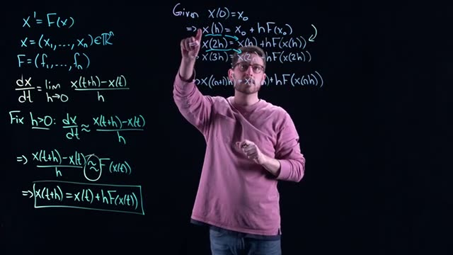
*[09:20](https://www.youtube.com/watch?v=203GsVI7fpU&t=560s) This frame shows mathematical equations for Euler's method, including the definition of a derivative, its approximation, and the iterative formula for x(t+h).*


The iterative formula

```
x(h) = x0 + hF(x0)
x(2h) = x(h) + hF(x(h))
x(3h) = x(2h) + hF(x(2h))
...
x((n+1)h) = x(nh) + hF(x(nh))
```

shows that each step depends on the result of the previous step. The error from step 1 feeds into step 2, the error from step 2 feeds into step 3, and so on. This is a cascading accumulation of error: the farther you go into the future, the more error you collect.


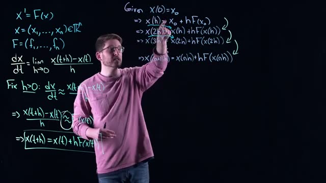
*[10:00](https://www.youtube.com/watch?v=203GsVI7fpU&t=600s) The whiteboard shows the definition of a derivative, an approximation for dx/dt, and the derivation of x(t+h) = x(t) + hF(x(t)), along with an iterative formula for x(nh).*


### The Trade-Off with Step Size

You want \(h\) to be very small so that the tangent approximation is accurate. However, a small \(h\) means you need many steps to cover a given time interval. For example, if \(h = 0.001\), you need 1000 steps to advance just one time unit. If you are simulating far into the future, the program can run for a very long time. Doing the same computation by hand would be impractical.

Conversely, you want \(h\) to be as large as possible to reduce the number of steps. But if \(h\) is too large, the per-step approximation error becomes large, and the accumulated error can grow so much that the numerical result has no relation to the true solution.


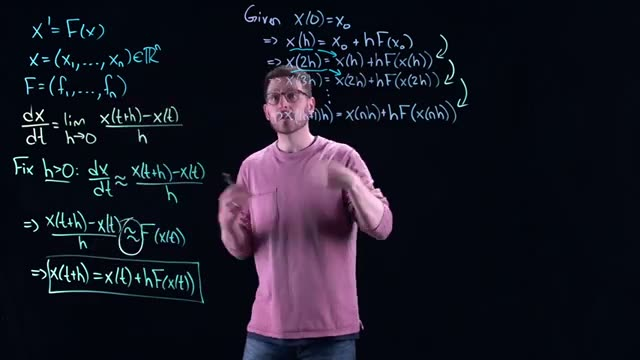
*[10:40](https://www.youtube.com/watch?v=203GsVI7fpU&t=640s) This frame shows mathematical equations for Euler's method, including the definition of a derivative, an approximation for a small step size h, and the iterative formula for x(t+h).*


The following table summarizes the trade-off:

| Step size \(h\) | Per-step accuracy | Number of steps to reach \(t = T\) | Total accumulated error |
|-----------------|-------------------|-----------------------------------|--------------------------|
| Very small      | High              | Many (\(T/h\) large)              | Smaller per step, but more steps can still cause significant error |
| Large           | Low               | Few (\(T/h\) small)               | Larger per step, fewer steps, but overall error may be huge |

The key is to balance these two extremes. You must choose \(h\) small enough that the local error is acceptable, but large enough that the computation finishes in a reasonable time.

### Visualizing Error Accumulation

A graph helps show how the error builds. Consider the true solution \(x(t)\) as a curve. At the initial point \((t_0, x_0)\), the tangent line to the true solution is given by the slope \(F(x_0)\). Euler’s method follows that tangent line for a distance \(h\) in the \(t\) direction to obtain an estimate at \(t_0 + h\).


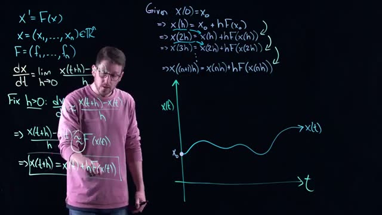
*[12:00](https://www.youtube.com/watch?v=203GsVI7fpU&t=720s) This frame shows mathematical equations for Euler's method, including the definition of a derivative, the approximation of x(t+h), and a step-by-step calculation of x(h), x(2h), and x((n+1)h), alongside a graph of x(t) versus t.*


The drawing on the whiteboard shows the true solution (a curved line) and the tangent line at the starting point. The estimated point lies on the tangent line, not on the curve. The vertical gap between the curve and the line is the local error of that step.


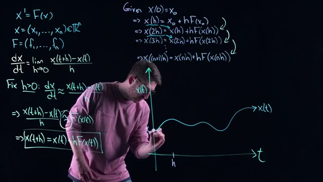
*[12:20](https://www.youtube.com/watch?v=203GsVI7fpU&t=740s) This frame shows mathematical equations for Euler's method, including the definition of a derivative, an approximation for the derivative, and the iterative formula for x(t+h), along with a graph of x(t) versus t.*


Now, from the estimated point, Euler’s method computes a new tangent line. This new tangent line is not parallel to the tangent of the true solution at that same time, because it is evaluated at the approximate location. The second step follows this new tangent line, producing another estimate that is even farther from the true curve.


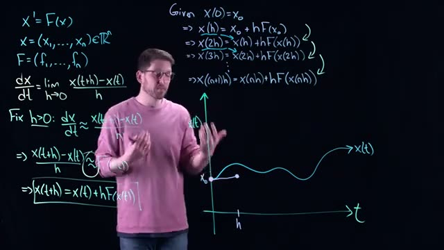
*[13:00](https://www.youtube.com/watch?v=203GsVI7fpU&t=780s) A whiteboard shows the Euler method for approximating solutions to differential equations, with the formula x(t+h) = x(t)+hF(x(t)) highlighted.*


The process repeats: each step uses a tangent line from an approximation, not from the true solution. The error at each step is a combination of the error inherited from the previous step and the new error from the current approximation. The diagram at 13:00 and 13:40 illustrates how the gap between the approximate path and the true path widens as you move forward.


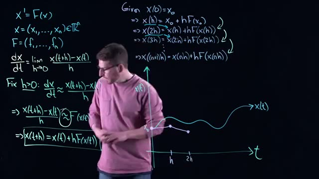
*[13:40](https://www.youtube.com/watch?v=203GsVI7fpU&t=820s) The whiteboard shows the Euler method for approximating solutions to ordinary differential equations, with the formula x(t+h) = x(t) + hF(x(t)) highlighted.*


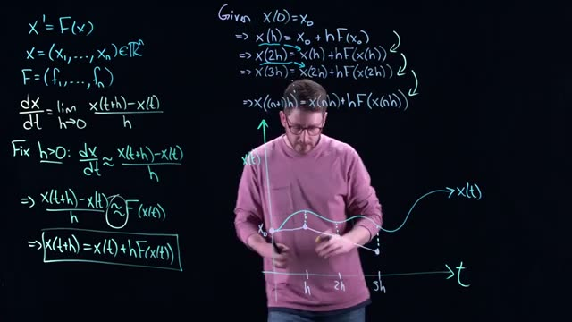
*[14:00](https://www.youtube.com/watch?v=203GsVI7fpU&t=840s) This frame shows the derivation of Euler's method for solving ordinary differential equations, including the definition of the derivative and the approximation leading to the iterative formula.*


Below is a simplified ASCII diagram of the process:

```
x(t)
|
|   true solution (curved)
|    /
|   / 
|  /
| / 
|/   * estimated point 2 (far from true)
|    / 
|   / * estimated point 1 (small error)
|  /
| / 
|/ * start (exact)
|________________ t
```

The first estimate is close to the true curve. The second estimate, based on the first estimate, is farther away. The error compounds.

### Why This Matters

The error in Euler’s method is a direct consequence of replacing the derivative limit with a finite difference. This is essentially a first-order Taylor approximation: you are linearizing the dynamics at each step. The same linearization idea appears in many other theorems (stable manifold theorem, Hartman-Grobman theorem). Understanding the trade-off between step size and accuracy is crucial for obtaining reliable numerical results without excessive computation.

### Check Your Understanding

1. Why does the error in Euler’s method grow as you simulate further into the future?

<details><summary>Answer</summary>
Each step introduces a small local error from approximating the derivative. This error is then used as the starting point for the next step, so the error from the previous step contributes to the new step’s error. This cascading effect causes the total error to accumulate and grow as you take more steps.
</details>

2. What is the trade-off when choosing the step size \(h\)?

<details><summary>Answer</summary>
A smaller \(h\) gives a more accurate approximation per step but requires many steps to cover a given time interval, increasing computation time. A larger \(h\) reduces the number of steps but makes each step less accurate, which can cause the total error to become unacceptably large.
</details>

3. In the iterative formula \(x((n+1)h) = x(nh) + hF(x(nh))\), what is the source of the approximation error?

<details><summary>Answer</summary>
The exact derivative would require the limit \(h \to 0\). By fixing \(h\) and using a finite difference, we are approximating the derivative with a secant line. Additionally, the slope \(F(x(nh))\) is evaluated at an approximate state, not the true state, introducing further error.
</details>

4. How does the visual diagram (tangent line vs. true curve) illustrate error accumulation?

<details><summary>Answer</summary>
The diagram shows that at each step the estimated point lies on the tangent line of the previous estimate, not on the true curve. The tangent line at the approximate point differs from the tangent of the true solution at that time, so the next estimate deviates further. The vertical gap between the approximation and the true solution grows with each step.
</details>
## Application to an RLC Circuit Model and Sensitivity Analysis

Euler’s method approximates the solution of an ordinary differential equation (ODE) by stepping forward in time using the tangent line at each point. However, each step introduces an error because the tangent is only an approximation. That error does not vanish; it is carried forward and combined with new errors at every step. The result is a cumulative error that can become large if the step size \(h\) is too large, or the computation can become very slow if \(h\) is too small. This trade-off is fundamental to all numerical ODE solvers.

Despite this drawback, Euler’s method is simple to implement and often works well when the step size is chosen appropriately. In this section you will apply it to a specific dynamical system: an RLC circuit model. You will then perform a sensitivity analysis to verify that the observed behavior is not a numerical artifact.

### The RLC Circuit Model

The system is described by two coupled first-order ODEs:

\[
\begin{aligned}
x_1' &= x_1 - x_1^3 - x_2 \\
x_2' &= x_1
\end{aligned}
\]

Here \(x_1\) and \(x_2\) are the state variables (e.g., voltage and current in the circuit). The only equilibrium point is at \((0,0)\), but it is unstable. The vector field pushes trajectories away from the origin and also pulls them inward from infinity. The result is a single closed orbit called a **limit cycle** (a periodic orbit in the phase plane). Unlike the Romeo and Juliet model, which has infinitely many nested cycles, this system has exactly one.


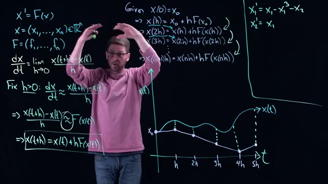
*[16:20](https://www.youtube.com/watch?v=203GsVI7fpU&t=980s) The whiteboard shows mathematical equations for differential equations and Euler's method, along with a graph illustrating the approximation of a continuous function.*
  
The on‑screen text shows the general Euler method and the specific system equations:

```
x' = F(x)
x = (x₁, ..., xₙ) ∈ ℝⁿ
F = (f₁, ..., fₙ)
dx/dt = lim (x(t+h) - x(t))/h
h→0
Fix h>0: dx/dt ≈ (x(t+h) - x(t))/h
=> (x(t+h) - x(t))/h ≈ F(x(t))
=> x(t+h) = x(t) + hF(x(t))
Given X(0) = X₀
=> x(h) = x₀ + hF(x₀)
=> x(2h) = x(h) + hF(x(h))
=> x(3h) = x(2h) + hF(x(2h))
...
=> x((n+1)h) = x(nh) + hF(x(nh))
x₁' = x₁ - x₁³ - x₂
x₂' = x₁
```

### Implementing Euler’s Method for the RLC Circuit

To approximate the solution, you will write a simple `for` loop that repeatedly applies the Euler update formula. The step size \(h\) determines the accuracy and the number of iterations.

**Step‑by‑step procedure:**

1. **Choose a step size \(h\).** In the video, the instructor used \(h = 0.1\).  
2. **Set the initial condition.** For example, start at \((x_1, x_2) = (0.5, 0.0)\) or any point that is not the equilibrium.  
3. **Define the vector function \(F(x)\).**  
   \[
   F_1(x_1, x_2) = x_1 - x_1^3 - x_2, \quad F_2(x_1, x_2) = x_1
   \]  
4. **Loop over time steps.** At each step \(n\) (starting from \(n=0\)):
   \[
   x_1^{(n+1)} = x_1^{(n)} + h \cdot (x_1^{(n)} - (x_1^{(n)})^3 - x_2^{(n)})
   \]  
   \[
   x_2^{(n+1)} = x_2^{(n)} + h \cdot x_1^{(n)}
   \]  
5. **Store or plot the trajectory** in the \((x_1, x_2)\) phase plane.


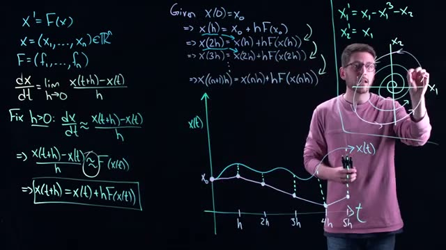
*[17:20](https://www.youtube.com/watch?v=203GsVI7fpU&t=1040s) This frame shows mathematical equations for Euler's method and a phase portrait diagram with a spiral trajectory.*
  
The screen shows the same equations with a phase portrait diagram that includes a spiral trajectory approaching a closed curve: the limit cycle.

```
x'= F(x)
x = (x1...,xn)∈TRⁿ
F = (f1...,fn)
dx/dt = lim h→0 (x(t+h)-x(t))/h
Fix h>0: dx/dt ≈ (x(t+h)-x(t))/h
=> (x(t+h)-x(t))/h ≈ F(x(t))
=> x(t+h) = x(t)+hF(x(t))
Given X(0)=Xo
=> x(h) = Xo + hF(Xo)
=> x(2h) = x(h) + hF(x(h))
=> x(3h) = x(2h) + hF(x(2h))
...
=> x((n+1)h) = x(nh) + hF(x(nh))
x₁' = x₁ - x₁³ - x₂
x₂' = x₁
```


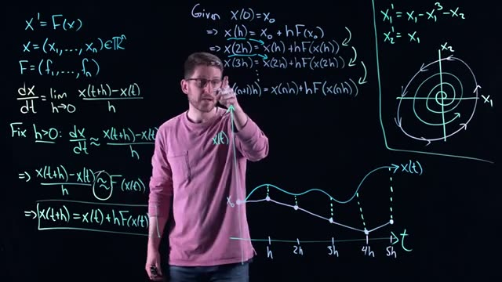
*[17:40](https://www.youtube.com/watch?v=203GsVI7fpU&t=1060s) The whiteboard shows mathematical equations for differential equations, Euler's method, and a phase portrait diagram.*
  
The same equations appear again, now with a diagram that clarifies the spiral motion and the limit cycle.

### What You Should Observe

If you run the Euler simulation with \(h = 0.1\) and a suitable initial condition, you will see a trajectory that spirals outward from the origin and then settles onto a closed curve. That curve is the **limit cycle**: a periodic orbit. Plotted in the \(x_1\)-\(x_2\) plane, the points repeat over time. If you instead plot \(x_1(t)\) or \(x_2(t)\) against time, they will look like periodic signals (similar to sine or cosine waves).

The instructor emphasizes that the limit cycle is a real feature of the system, not a numerical artifact. To confirm this, you must perform a **sensitivity analysis**.

### Sensitivity Analysis: Checking Your Own Work

The goal of sensitivity analysis here is to verify that the observed limit cycle is not an illusion created by a too‑large step size. The method is simple:

- **Decrease the step size \(h\).** Run the same simulation with a smaller \(h\), for example \(h = 0.05\) or \(h = 0.01\).
- **Compare the results.** If the limit cycle still appears and its shape does not change significantly, you can be confident it is a genuine property of the model.
- **Be aware of the cost.** Smaller \(h\) means more steps, which increases the computation time. You may have to wait longer for the simulation to finish.

This is the same kind of robustness check used throughout numerical analysis: you vary the discretization parameter to see whether the solution stabilizes. The only difference is that here you are checking your own simulation for errors.

### Summary of the Euler Method for the RLC Circuit

| Component | Description |
|-----------|-------------|
| ODE system | \(x_1' = x_1 - x_1^3 - x_2\), \(x_2' = x_1\) |
| Equilibrium | \((0,0)\) is unstable |
| Expected behavior | Trajectories spiral out and converge to a single limit cycle |
| Euler update | \(x_1^{(n+1)} = x_1^{(n)} + h (x_1^{(n)} - (x_1^{(n)})^3 - x_2^{(n)})\)<br>\(x_2^{(n+1)} = x_2^{(n)} + h x_1^{(n)}\) |
| Sensitivity check | Reduce \(h\) and re-run; if the limit cycle persists, it is genuine |
| Trade‑off | Smaller \(h\) gives more accurate results but increases runtime |

**ASCII diagram of the expected phase plane:**

```
          x2
           ^
           |
           |     . . . . . . . . . .
           |    .                   .
           |   .                     .
           |  .                       .
           | .                         .
           |.                           .
    --------*---------------------------*-------> x1
           |.                           .
           | .                         .
           |  .                       .
           |   .                     .
           |    .                   .
           |     . . . . . . . . . .
           |
```

The asterisk at the center is the unstable equilibrium. The outer curve is the limit cycle. Trajectories inside the cycle spiral out, trajectories outside spiral in.

### Check Your Understanding

1. **Why does the error in Euler’s method accumulate as the simulation progresses?**

   <details><summary>Answer</summary>
   Each step uses the approximation of the derivative from the current point, which is already approximate. The error from the previous step is carried forward, and a new error is added at every step. This cascading effect means the total error grows with the number of steps, especially if the step size \(h\) is large.
   </details>

2. **In the RLC circuit model, what is the limit cycle and why is it interesting?**

   <details><summary>Answer</summary>
   The limit cycle is a closed, periodic orbit in the phase plane. It is the only such orbit for this system. Trajectories inside the cycle spiral outward, and trajectories outside spiral inward, so the limit cycle is the “balance point” between the two opposing behaviors. The system will eventually settle into this cycle regardless of the initial condition (unless it starts exactly at the unstable equilibrium).
   </details>

3. **How does sensitivity analysis help you trust the Euler simulation result?**

   <details><summary>Answer</summary>
   By decreasing the step size \(h\) and running the simulation again, you can see whether the observed pattern (e.g., the limit cycle) remains. If it does, the pattern is likely a real feature of the ODE, not an artifact of the numerical approximation. If the pattern changes or disappears, the original result may have been caused by a step size that was too large.
   </details>

4. **What is the trade‑off between accuracy and computation time when choosing \(h\)?**

   <details><summary>Answer</summary>
   A smaller \(h\) gives a more accurate approximation (less error per step, less cumulative error) but requires many more steps to cover the same time interval, which increases the runtime. A larger \(h\) runs faster but may produce inaccurate results or even miss important dynamics.
   </details>
## Key takeaways

- Continuous-time dynamical systems cannot be directly implemented on a computer because derivatives require a limit process, so approximation methods like Euler's method are necessary.
- Euler's method is derived from the limit definition of a derivative by fixing a small positive step size h and replacing the derivative with a finite difference quotient.
- The iterative formula x((n+1)h) = x(nh) + h F(x(nh)) transforms a continuous differential equation into a discrete-time update rule that can be executed in a simple for-loop.
- Euler's method introduces a local error at each step because the finite difference is only an approximation, and these errors accumulate as the solution is marched forward in time.
- There is a trade-off between step size h and accuracy: a smaller h reduces per-step error but increases the number of steps, while a larger h speeds up computation but risks producing meaningless results.
- Visualizing Euler's method with tangent lines shows how the numerical solution diverges from the true solution over time due to the cascading accumulation of error.
- Applying Euler's method to the RLC circuit model (x1' = x1 - x1^3 - x2, x2' = x1) with h = 0.1 reveals a stable limit cycle, a periodic orbit in the phase plane.
- Sensitivity analysis by decreasing h verifies whether observed phenomena like limit cycles are true dynamics or numerical artifacts, confirming the robustness of the numerical result.
- Euler's method is a first-order approximation, meaning its global error is proportional to h, so halving h roughly halves the overall error but doubles the computational effort.
## Glossary

| Term | Definition |
|---|---|
| continuous dynamical system | A system whose state evolves continuously in time, described by ordinary differential equations (ODEs) such as x' = F(x). |
| discrete dynamical system | A system whose state is updated at discrete time steps, often written as x_{n+1} = G(x_n). |
| derivative | The instantaneous rate of change of a function, defined as the limit of (x(t+h) - x(t))/h as h approaches zero. |
| finite difference | An approximation of the derivative using a small but nonzero step size h, such as (x(t+h) - x(t))/h. |
| step size h | The fixed time increment used in Euler's method; a smaller h gives a more accurate approximation but requires more steps. |
| Euler's method (forward Euler) | A numerical technique that approximates the solution of an ODE by repeatedly applying the formula x(t+h) = x(t) + h F(x(t)). |
| local error | The error introduced in a single Euler step, assuming the starting point is exact; it is on the order of h^2. |
| global error | The total accumulated error after many Euler steps; it is typically on the order of h for a fixed final time. |
| cascading error | The effect where errors from previous steps are fed into subsequent steps, causing the numerical solution to drift further from the true solution over time. |
| tangent line approximation | Euler's method approximates the solution curve by following the tangent line at each point, which is exact only for linear functions. |
| limit cycle | A closed, isolated periodic orbit in the phase plane of a dynamical system; nearby trajectories converge to it or diverge from it. |
| phase plane | A two-dimensional space where each axis represents one state variable of a system, used to visualize trajectories over time. |
| equilibrium point | A point where the derivative of the system is zero; the system remains at rest if placed there exactly. |
| sensitivity analysis | The practice of varying a parameter (here step size h) to see how the output changes, helping to distinguish true dynamics from numerical artifacts. |
| numerical artifact | A feature in a computed solution that is not present in the true mathematical solution, caused by approximation errors or instability. |
| RLC circuit model | A nonlinear circuit model described by the ODEs x1' = x1 - x1^3 - x2, x2' = x1, which exhibits a limit cycle. |
| for-loop | A programming construct that repeats a block of code a fixed number of times, used here to iterate the Euler update for each time step. |
| approximation | A numerical value or method that is close to the exact value or solution but not exact, often due to discretization. |
| robustness | The property of a numerical method to produce reliable results under small changes in parameters or initial conditions. |
| periodic orbit | A trajectory that repeats itself exactly after a fixed time interval, appearing as a closed curve in the phase plane. |
## Footnotes and deeper context

1. **Accuracy of Euler's method.** Euler's method is a first-order numerical method. The local truncation error is O(h^2), and the global error is O(h). This means that halving h reduces the global error by roughly half, but to achieve high accuracy, very small h values are needed, which can be computationally expensive.
2. **Stability conditions.** For stiff differential equations, Euler's method can require impractically small h to remain stable. Stiffness occurs when the solution contains components with widely different time scales. In such cases, implicit methods like backward Euler or Runge-Kutta methods are often preferred.
3. **The RLC circuit model used.** The system x1' = x1 - x1^3 - x2, x2' = x1 is a variant of the Van der Pol oscillator, a classic nonlinear oscillator. It is not a standard linear RLC circuit but a model of a circuit with a nonlinear resistor. The limit cycle observed is a true dynamical feature, not a numerical artifact, as verified by sensitivity analysis.
4. **Common misconception about local error.** Some beginners think that making h extremely small eliminates error entirely. While the error does decrease, it never vanishes because Euler's method uses a one-term Taylor expansion. Floating-point round-off error also becomes significant when h is extremely small (e.g., below 1e-8 in double precision).
5. **Alternative methods.** Runge-Kutta methods, especially the fourth-order method (RK4), provide much better accuracy per step than Euler's method. Most modern software libraries (e.g., SciPy's solve_ivp, MATLAB's ode45) use adaptive step-size Runge-Kutta methods that automatically adjust h to control error.
## Where to go next

- **Implement Euler's method in Python or MATLAB.** Try coding the Euler method yourself for the given RLC circuit model. Use a for-loop and plot the phase plane. Start with h = 0.1 and then reduce h to 0.01 to see the limit cycle persist. The official documentation for Python's matplotlib and numpy will help with plotting.
- **Study higher-order methods: Runge-Kutta.** Read the chapter on Runge-Kutta methods in 'Numerical Recipes' by Press, Teukolsky, Vetterling, and Flannery (3rd edition) or 'Introduction to Numerical Analysis' by Suli and Mayers. These explain why RK4 is preferred over Euler for most applications.
- **Explore adaptive step-size methods.** Consult the SciPy documentation for 'solve_ivp' (https://docs.scipy.org/doc/scipy/reference/generated/scipy.integrate.solve_ivp.html) and compare its results with your Euler implementation. This will give you insight into how professional software handles accuracy and efficiency.
- **Learn about numerical stability.** The concept of stability region for Euler's method is covered in 'Numerical Methods for Ordinary Differential Equations' by John C. Butcher. Understanding stability helps explain why too large h can blow up the solution even if the true solution is bounded.
---
*Printed by yt2textbook, an open tool from Zorost AI Lab. Screenshots are frames captured from the source video; each caption links to the exact moment it appears.*
